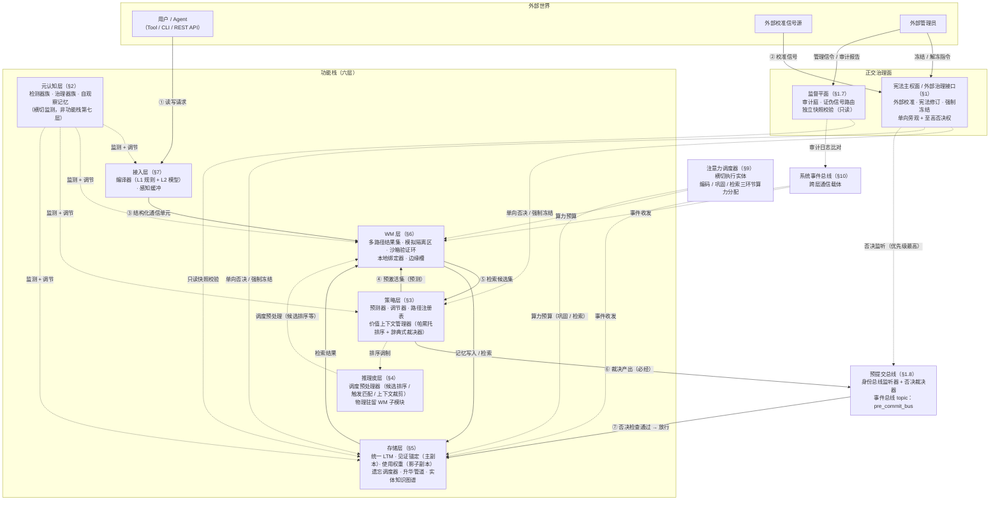

# Kairos 系统架构

> **本文档与认知基础的关系**：本文为**架构工程描述**，承载"当前版本实现了什么""与认知层模型之间的差距追踪"。认知基础 [cognitive-foundation.md](cognitive-foundation.md) 为版本无关的认知理论模型——本文的 §0.1 交付范围与 §0.9 认知基础→架构交叉声明是其与认知层之间的映射桥梁。读者不应以本文的工程妥协判断认知模型的有效性。

> **章节导航**——本文为设计权威，篇幅较长，按下表定位所需章节（章节内定位方式：搜索 `## §N` 或节内导航列出的机制名）：
>
> | 章节 | 主题 | 承载内容 |
> |:----|:----|:--------|
> | §0 | 架构总览 | 开发者速查表、交付范围对照、治理面命名对照、特征标志与命名配置集、证伪纪律、认知基础→架构交叉声明 |
> | §1 | 宪法主权面与身份面 | 外部治理接口、外部校准端口、虚拟校准、监督平面（审计庭）、预提交总线与身份否决权 |
> | §2 | 元认知层 | 检测器族、健康度与 p6_margin 探针、治理元认知与认知元记忆的职责分离 |
> | §3 | 策略层 | 激活权重与调节器、后效回授、受控例外四类与 P6 合规 |
> | §4 | 推理皮层 | 候选排序与意图匹配的轻量本地推理边界 |
> | §5 | 存储层 | 双副本（见证锚定/使用权重）、路径空间、遗忘调度器、巩固与升华管道、知识演化、版本链（节点清单见 §5.2 节内导航） |
> | §6 | WM 层 | 工作记忆槽位、整合窗与上下文装配 |
> | §7 | 接入层 | HTTP API / MCP 工具集 / CLI 的接入契约与捕获门控 |
> | §8 | 安全红线 | S-01~S-19 红线注册、遗忘生效验证、知识控制三位置边界 |
> | §9 | 注意力调度器 | 编码/巩固/检索三环节的算力预算分配（横切组件） |
> | §10 | 质量属性与补充机制 | 不变量、降级状态机、事件类型注册、P6 压缩监控、§10.24 关联设计债索引 |
> | §11 | 术语表 | 全库术语单一事实源 |
> | §12 | 版本记录 | 批次登记 |

## §0 架构总览

> **开发者速查表**——一个 Kairos 概念对应一个你已熟悉的工程模式：

| Kairos 概念 | 其实就是 | 一句话类比 |
|:------------|:---------|:-----------|
| 路径空间 `kairos://` | 文件系统树 | 像 `ls /users/{id}/core/` 一样浏览记忆 |
| 使用权重（影子副本） | 缓存热度 | 类似 LFU 的访问频率计数，最终一致 |
| 见证锚定（主副本） | 主数据库 | 事实表，强一致，写入后不可被使用频率篡改 |
| 遗忘调度器 | TTL / retention policy | 可配置的自动淘汰策略 |
| 四类契约 | 缓存策略 | 常驻=pinned，按需=LRU，环境=TTL，临时=ephemeral |
| 元认知层监测 | 健康检查 + 数据报告 | 定期扫各项指标，超阈发报告（判断由策略层做出） |
| 外部治理接口 | 外部通信层 | 接收外部校准信号、冻结/解冻指令；输出审计日志供外部读取。持有至高否决权（强制冻结等）；日常执行中多为被动响应——内部环决策前查询接口状态，冲突时行使单向否决（见 §1.1）。与宪法主权面同义（两称并存，见 §0.4 治理面命名对照；监督平面为独立正交面，见 §1.7） |
| 监督平面 | 独立正交面（见 §1.7） | **审计信道标识保留**——审计庭输出标记 `[AUDIT]` 前缀与治理决策区分 |
| P6 维度保护 | schema 约束 | 禁止不可审计的维度信息丢失 —— 任何维度压缩须留下审计痕迹 |
| 六级辞典式排序+身份面否决权 | 优先级仲裁 | 身份为独立正交治理面（以否决权介入），使用排最末 —— 类似中断优先级 |
| 推理皮层 | 轻量本地推理 | 只做记忆相关的推理（候选排序/意图匹配），不做通用规划 |
| 注意力调度器 | 独立横切服务（逻辑独立，故障条件下依赖注册表——见 §9 独立性范围声明） | 统一分配编码、巩固、检索三环节的算力预算。通过事件总线接收资源请求，通过注册表查询当前资源池状态，通过事件总线返回分配结果。WM、存储层、策略层均为客户端——调度器本身不驻留任何层（见 §9 注意力调度器声明）。元约束面的执行实体（与外部治理接口并行） |
| 潜伏势能 | 冷数据保留 | 零使用价值的记忆不立即删，等重估触发 |
| 巩固/升华管道 | 后台数据处理 | 类似 ETL 管道：raw→item→strategy→behavior |
| 差异检验 | 数据一致性校验 | 检查影子副本是否偏离了主副本，偏离则阻断合并 |
| 双副本隔离 | 读写分离 / CQRS | 写主库（见证锚定），读缓存（使用权重） |

> **一句话记住 Kairos**：它是一个**带遗忘策略、事实/热度分离、审计完备的带权文件系统**——只不过文件是记忆，目录是路径，权限是宪法。

> **概念体系分级速查表**：[glossary.md](../references/glossary.md) 77 条术语按暴露层级分三级（L1 API 表面 / L2 开发者必知 / L3 设计文档），每级附带一句话类比与代码映射，见 [concept-tiers.md](../references/concept-tiers.md)（术语定义权威仍为 [glossary.md](../references/glossary.md)，分级表为桥接文档不重复定义）。
> **关联文档**：理念约束与协作关系（六级排序链+身份面否决权/三硬一软/分域真理观）见 [design-philosophy-relations.md](design-philosophy-relations.md)；系统边界与外部依赖声明见 [system-context.md](../specification/system-context.md)。

### 0.1 架构的认知前提

#### v0.1.0 交付范围
系统架构建立在认知基础文档的度量框架之上。**认知层→架构 v0.1.0 信息损失率统计**：认知基础定义「3+2 代理模型」——三轴（使用/见证/时间）为完整连续度量，认知完整性轴以布尔标记 is_structure 降维，可及性轴以路径注册表深度代理降维——完整信息损失约 40%。（口径注记：此 40% 为认知层五轴→架构承载的**维度承载度粗估**，与 §0.6/§3.3/§10.11 的 P6 压缩比双口径（核心 33%/12 维基数、全量 43%/14 维基数）及 §10.13 认知模型实现覆盖率约 40-50%（全模型机制实现深度）是不同度量——前者衡量认知维度到架构承载的降维比例，后者衡量 P6 审计下被压缩维度占总维度的占比，两者不互斥、不可直接换算。）六级链中「认知完整性 > 时间」的位次在 v0.1.0 以布尔标记参与，实际排序参与度低于规范声明。v0.1.0 以四轴承载（使用价值/见证价值/时间/认知完整性），第五轴（可及性轴）以路径竞争降权幅度和路径密度监测的联合指标作为工程代理。

> **轴计数说明**：认知基础定义五轴（使用/见证/时间/认知完整性/可及性），架构文档列四轴+注意力预算（非价值轴）。可及性轴在 v0.1.0 以降维代理实现（路径竞争降权幅度和路径密度监测的联合指标，路径注册表检索深度度量为输入之一），因此架构列表不将其作为独立轴列出。完整五轴→架构四轴映射：使用价值（全量承载）、见证价值（全量承载）、时间（物理时间全量，逻辑-因果部分）、认知完整性（布尔降维）、可及性（路径注册表代理）。注意力预算是运行约束而非价值轴，不计入轴计数。可及性轴的完整独立度量已登记为 [debt-collection.md](../governance/debt-collection.md) **债务 D-313**（v1.1 协议槽位）。

- **使用价值轴**（间接度）：使用价值的多维特征空间——按目的性维度（检索/验证/贡献）、方式性维度（模拟/非模拟）、意识性维度（内隐/外显）三个认知分类轴区分调用类型——3个认知分类轴展开为5维运行时向量（频次性维度（高频/低频/首次）与时效性维度（近期/中期/长期）为计量维度，不构成独立分类轴；含隐式组合维度）。类型学非序数阶梯——使用是多目标向量，不可聚合为单标量。
- **见证价值轴**（受控度）：外部校准（可交互校准性）+ 内部叙事自洽度（第一人称连贯性）。同轴双层。
- **时间轴**：去语境化程度连续谱与二维遗忘曲面。含潜伏势能（零使用价值记忆的保留依据）。时间轴由物理时间轴与逻辑-因果轴双轴并列构成（认知基础 §1.1 双轴独立——逻辑-因果轴含因果链完整性、执行流结构、节律记忆、时间贴现）——架构层通过关系索引（§5 存储层）承载因果链查询。
- **认知完整性轴**：反例锚点、死胡同路径、组合约束的拓扑占位价值。架构层通过结构性记忆守护（§5 存储层）承载——标记 `is_structure=true` 的记忆不参与遗忘调度器评估。
- > **「熵」术语说明**：本文中「熵」在不同上下文分别指代以下 4 种独立度量——(1) **注意力分布熵**（注意力调度器输出端分配比例的归一化香农熵）；(2) **使用价值分布熵**（使用权重在各维度上的分布集中度）；(3) **决策熵**（裁决器在帕累托前沿中不可支配解的数量，大=分歧多）；(4) **概念结构熵**（关系索引中约束网络的拓扑无序度）。四者公式互不相同，阈值不可互换。各出现处均已标注具体含义。本节出现的「决策熵」为裁决器层面的多样性度量，非注意力或使用价值层面。

**注意力预算（元约束面 Meta-Constraint Plane，非价值轴）**：编码、巩固、检索三环节共享的全局注意力资源池，与 WM 槽位容量关联。优先级：检索 > 编码 > 巩固。注意力预算是所有价值度量的运行前提——约束可获得的价值度量范围而非度量本身。当预算不足时系统降级操作深度（降低巩固深度、缩窄候选集），但不改变已度量的价值排序。注意力调度器是此元约束面的执行实体。元约束面与宪法主权面平行（一个约束规范性边界，一个约束可度量性边界），但不属于功能栈层数。注意力调度器实现详见 §9。

四轴在度量空间概念独立（互不包含），在优化空间耦合。

> **v0.1.0 四轴承载完整性声明**：上述五轴在 v0.1.0 中的架构承载完整度不同——使用价值轴和见证价值轴有完整的度量、排序、遗忘全链路承载（使用权重影子副本+见证锚定主副本+差异检验）；时间轴的物理衰减子轴由二维遗忘曲面承载，逻辑-因果轴由关系索引部分承载（因果链查询）；认知完整性轴在 v0.1.0 以 is_structure 布尔标记实现结构性记忆守护；可及性轴（认知基础第五轴）在 v0.1.0 以路径竞争降权幅度和路径密度监测的联合指标作为工程代理（路径注册表检索深度度量为输入之一）。本节所有架构设计决策都建立在此承载完整性基线之上。
>
>**降维能力缺口标注**：认知完整性轴的布尔化使认知基础§1.1声明的「反例覆盖度/路径禁区标注密度/组合约束网络连通性」三维度在 v0.1.0 不可观测——系统无法区分「没有反例」与「有反例但未检测到」，也无法感知推理空间拓扑退化。此缺口在认知基础§1.1「使用中心主义偏向声明」中已诚实承认。
>

#### 未来扩展

以下内容描述认知层度量框架的完整愿景，不在 v0.1.0 交付范围内，列为未来版本规划：

- **认知完整性轴的完整度量**：该轴的完整度量函数（反例覆盖度、路径禁区标注密度、组合约束网络连通性）由元认知域在 v1.1 增加检测器实现。
- **时间轴的逻辑-因果维度**：节律记忆、时间贴现等维度待 v1.1 实现。
- **可及性轴的完整独立度量**：认知层完整度量待 v1.1 实现，含提取诱发遗忘抑制深度追踪。
- **认知完整性轴三维度监测器落地验收标准**：(a) 反例覆盖度监测器首次上线后，能在预设烧机周期内输出可解释的覆盖度时间序列；(b) 路径禁区标注密度监测器能区分正常标注密度与过度标注密度的工作区间；(c) 组合约束网络连通性监测器在认知结构退化模拟测试中，能在退化行为发生后的检测延迟窗口内触发告警。三项条件全部满足后，标记 `is_structure` 的布尔标记向三维度连续度量迁移。
- **离线可计算声明**：认知完整性轴的三维度量（反例覆盖度、路径禁区标注密度、组合约束网络连通性）天然适合离线计算而非实时在线计算。v1.1 的监测器应设计为离线/定时触发模式，在系统空闲周期执行，不参与实时检索路径。

### 0.2 问题定义

朴素记忆系统存在三类根本失效模式：

- **上下文膨胀**：Agent 将全部历史平铺在上下文中，token 成本随 session 线性增长——不区分记忆价值。
- **检索错配**：全库概率匹配返回结果不一致，无法隔离不同领域上下文——Agent 无法确定记忆的「准确来源」。
- **冷热不分**：高频规则与一次性查询同等存储、同等调度——常驻知识被大量无关上下文稀释。

基于认知基础的五轴模型，新增识别三类结构性失效：

- **自指性失效**：系统无法区分"使用价值高"与"真实/自洽"——高使用频率的记忆被系统默认为"正确/真实的"，产生确认偏误式重构。
- **见证缺失**：系统无法保留不服务于当前任务但对身份连续性至关重要的记忆——"我是谁"被"任务需要什么"淹没。
- **校准真空**：系统无法感知自身认知结构的变化——环境模式转移时，系统继续用旧模型预测新分布。

### 0.3 五条推论

从五轴模型推导：

**推论一（← 认知基础推论一 · 使用定义价值）：使用定义价值——但使用是多维特征空间，价值有二维。**
使用价值轴为多维特征空间（目的性/方式性/意识性维度），见证价值轴独立运作。两轴在度量空间互不包含——不冲突。P6 禁止聚合为单标量。

**两部接力（带常驻硬过滤约束，决策 D-16 A1 修订）：** 候选生成阶段使用带硬约束的多维帕累托排序——使用价值/见证价值/时间为主排序维度，探索/宪法/校准为**硬过滤维度**（否决式参与，**不设权重**）。此设计使六级链中的高优先级维度在日常调度中持续生效，而非仅在帕累托平局时兜底介入。**A1 硬过滤语义（决策 D-16）**：约束维度以「不满足约束即剔除候选」的方式参与——候选若违反当前生效的探索方向约束、宪法级约束（安全红线 S-01~S-19、身份记忆保护）或校准约束（外部校准冲突），直接被剔除出候选池，不进入帕累托计算；不满足约束的候选不参与打分、不设权重系数。**旧表述「约束维度默认各为使用价值权重的 0.3」废除**——加权即跨维标量通约，与 决策 D-01 三约束（全程无标量聚合、不为维度赋可通约权重）正面冲突；A1 硬过滤使帕累托计算回归纯序数比较，决策 D-01 合规要求恢复绝对效力，无需新增 P6 例外登记。**硬过滤的日常参与度**：硬过滤在每次候选生成时执行（非仅平局时兜底），高优先级维度经否决式拦截持续生效。排序产出保留处于帕累托前沿的不可支配解集；冲突裁决仅在不可支配解之间以辞典式排序做兜底（不再假设目标可比）。两部接力而非矛盾。

**推论二（← 认知基础推论二 · 使用契约）：不同的记忆有不同的使用契约。**
四类契约（常驻/按需/环境/临时）是使用价值轴在架构层的**投影**——不是写时绑定标签，而是由策略层激活权重在运行时决定的离散区间。"常驻"不是标签，是高激活权重的常态。当记忆的激活权重在大多数上下文中持续高于阈值时，它在行为上表现为常驻。

**推论三（← 认知基础推论三 · 激活-存储解耦）：契约决定激活策略，而非存储位置。**
所有记忆在存储层统一管理。契约只决定如何激活、如何检索、如何衰减——不决定存在哪里。

**推论四（← 认知基础推论四 · 遗忘工程权衡）：遗忘是工程权衡（loss×P vs noise_cost），非生物模仿。**
遗忘决策函数在时间轴上非均匀，含第三成本「长尾价值」。

**推论五（← 认知基础推论五 · 探索边界测绘投资）：探索是认知边界的测绘投资——策略层的一个特殊操作模式，由元认知层驱动，不参与使用价值排序。**
探索在发生前无预期使用价值，因此不被推论一覆盖。由元认知层根据搜索空间覆盖率触发。

**推论冲突裁决：** 探索 > 宪法 > 校准 > 认知完整性 > 时间 > 间接度（六级链，与认知基础§2.1一致）。身份不在此链中——身份是独立的正交治理面（身份面），以否决权（而非排名）介入排序产出。裁决器使用**值优先**比较（宪法 > 校准 = 宪法权重大于校准）。探索→宪法为**并行审查模型**——探索候选产生后不立即执行，进入短暂的宪法审查窗口（可配置，默认 100ms），审查通过后执行。窗口超时未获审查结果，默认拒绝执行（fail-close）。此模型确保安全红线不会被绕过，同时探索不被事前审批阻塞（审查是并行的）。原「时序优先」概念已删除。**注意**：六级链在 v0.1.0 中是建议性基线——宪法核的不可触及性受限于外部信令不发出冲突指令。所有优先级均可被外部校准信号覆盖。六级链的逐对论证见认知基础§2.1及架构§3.3辞典式裁决器。身份面否决权与宪法主权面否决权的区别见认知基础§2.1。

### 0.4 架构总览

> **参数引用说明**：本文出现的 `KAIROS_*` 配置参数为设计参考值，具体默认值和完整参数表以 [ops/configuration.md](../ops/configuration.md) 为准。所有阈值和常量均为 v0.1.0 占位值，最终值由调优确定。

#### 0.4.1 系统架构总览图

> 本图是 v0.1.0 全貌的**骨架视图**——六层功能栈 + 两个正交治理面 + 两个横切基础设施（注意力调度器 / 事件总线）及其关键数据流。各层内部组件树见对应章节（§2~§7），跨层接口契约见 §2.5，本图不替代章节细节。



**图例**：实线 = 数据流（编号见流程说明）；虚线 = 监测 / 治理 / 审计 / 横切关系。图中仅示代表性事件总线边——**所有跨层交互经系统事件总线收发**（§10），未逐层画出。

**编号流程**：① 外部读写请求经接入层编译器净化为标准**结构化通信单元**（§7.0）；② 外部校准信号是宪法主权面的**外部信号**治理输入（另有管理员冻结/解冻指令，见图 §0.4.1；§1.4）；③ 通信单元注入 WM；④ 策略层预测器输出**预激活集**（§3.1）；⑤ 检索候选集回流策略层裁决（§3.3）；⑥ **裁决产出写入存储层前必须经预提交总线**（§1.8，不可绕过）；⑦ 否决检查通过后放行写入。

**结构原则对应**（六类，见本节 §0.4 结构原则全貌）：层级栈 = 六层；路由协调层 = 策略层（记忆数据流）+ 推理皮层（记忆控制流）；横切执行实体 = 注意力调度器；正交治理面 = 外部治理接口 + 监督平面（身份面为否决机制，经预提交总线介入，见 §1.8——不入治理面计数，与 §0.4 统一口径「两个正交治理面」一致）。横切注入模式（内隐调制基元）与横切协调协议（情感去强化等）粒度过细，未在总览图展开。

**预提交总线**：事件总线上的特定话题（`pre_commit_bus`，§1.8）——宪法主权面与身份面监听器并行运行，宪法否决为默认优先级（外部安全高于内部同一性；身份危机例外经宪法解释层判例可临时覆盖，见 §1.8 与认知基础附录 C.6）；身份面否决权的语义边界见 §1.8（决策 D-19 D2）。

**元认知层**：功能栈六层之一（横切监测关注点）——并非叠加于六层之上的「第七层」（§2 定位），也不属治理面（监督平面为独立治理面，见 §1.7）。图中以独立框表示其对 1–5 层的监测与调节。

#### v0.1.0 交付范围（§0.4 架构总览）

```text
  宪法主权面（Sovereignty Plane）
    外部校准端口 · 宪法修订端口 · 强制冻结权限
    不入任何内部环——系统知道自己知道的上限依赖于外部

    **治理关系冻结声明**（当前代锁定，非永久——见 §1.6 当前代锁定声明）：宪法主权面与内部环（元认知层/策略层/存储层/WM层）的治理关系已锁定为否决权正交模型。**宪法解释层必须拥有独立故障域**（生产部署中部署为独立进程/容器——「正交」不驻留被治理系统的进程空间）。主权面对内部环执行单向旁观+至高否决权，不参与内部环的生成性过程（不产生候选方案、不参与裁决排序），但参与审查性过程（接收告警、返回回执、冻结仲裁）。此关系在当前认知代（cognitive epoch）内关闭重新评估，下一代认知演进可通过宪法修订端口+宪法解释层审计进入新代。
    检测器族（通用监测接口）：结构漂移接口 · 偏置接口 · 健康接口——每个接口接受可插拔 metric 输入（见 §2.2.1 ME-1 子域）
    治理器族：宪法解释层、巩固门控授权、用途对齐审批
    自观察记忆（meta-LTM）：只读镜像，不可再巩固
    审计庭→监督平面（§1.7）：只读，不参与自校准。监测元认知决策熵与输出稳定性，异常时触发冻结。
    受控偏差反馈通道 → 策略层（目标集，方向，置信度，有效期）

  策略层：记忆路由与协调层（Memory Routing & Coordination Layer）——功能性跨层协调器，其协调跨越 WM、存储层、元认知层、主权面多层，区别于内隐调制等横切属性（协调是垂直路由、横切是水平渗透，二者结构原则不同）：
  含元认知层（§2，功能栈第五层——横切监测，见 §0.7 层编号约定）

  **层划分的推导判据声明**：本文定义**六层功能域**（接入/WM/策略层/推理皮层/存储/元认知）+ 两个正交治理面（外部治理接口+监督平面），合计 8 个结构单元。**「域」而非「栈」的说明**：各功能域通过事件总线交互，存在反向依赖（元认知域可向策略域注入校准信号、存储域可被元认知域触发重估），不遵循严格的栈式自顶向下依赖。因此「功能栈」在此被用作「职责分层」的隐喻而非严格的栈架构——更准确的术语是「六功能域」，但为与认知基础文档一致，保留「六层功能栈」的说法。读者应理解此处的「栈」指的是职责层级而非依赖方向。
**统一口径**：全文档集以「六层功能栈 + 两个正交治理面」为默认计数——六层功能栈（接入/WM/策略层/推理皮层/存储/元认知），两个正交治理面（外部治理接口+监督平面）。

> **治理面命名对照**：正文中「宪法主权面」与「外部治理接口」指同一治理面的两种表述（全库两称并存，非更名完成态——以 [glossary.md](../references/glossary.md) 别名声明为权威）：接收外部校准信号、执行宪法修订与强制冻结，对内部环行使单向旁观 + 至高否决权（含外部校准端口、宪法修订端口、强制冻结；即原宪法主权面职能，见 §1.2）。**新写内容统一优先使用「外部治理接口」**；既有正文（§1 标题、§1.1~§1.8、§11 术语表）暂保留「宪法主权面」表述，随维护批次逐步收敛。「监督平面」为审计庭所在面（独立于外部治理接口，见 §1.7——该节保留为监督职能历史记录）。阅读正文时：**宪法主权面 = 外部治理接口；监督平面 = 审计庭**。

  **横切组件**：注册表（Registry）——确定性状态存储（认知基础§1.7），树形层级键值对结构，覆盖自身身份（HKLA）、用户信息（HKCU）、宿主环境（HKLM）、会话运行时（HKCS）、云端同步（HKCSY）五个根键域。**注册表与存储层之间的数据流边界（一源一写规则）**：(a) 任何确定性状态（当前任务阶段、活跃项目 ID、配置参数等）只允许通过注册表的专用 API 写入——存储层不得作为这些数据的写入入口；(b) 存储层可以保留这些确定性状态的历史版本（用于审计和回溯），但存储层的写入操作不得反向更新注册表；(c) 运行时查询当前状态必须先查注册表，存储层中的历史版本仅在审计或回溯场景中使用。此规则消除了注册表与存储层之间「用户信息更新时走哪条路径」的模糊性。每条注册表记录包含以下元数据字段——`confidence: float`（可靠度，默认 1.0——直接设置值；从记忆推断值 0.5-0.9）；`last_verified: timestamp`（最后确认时间，由外部校准或内部一致性检查触发更新）。v0.1.0 Phase 1 仅记录这两个字段不做覆盖规则；覆盖规则（当记忆推断的置信度>注册表置信度且更新时间更新时以记忆推断覆盖）待运行数据验证冲突率后评估是否实现。注册表与存储层并行：记忆系统回答「过去发生了什么」，注册表回答「当前是什么」。注册表的查询为 O(h) 路径寻址而非概率检索，值不受上下文腐烂影响。写入权限按根键域分离——身份域仅宪法修订端口可写，会话域编译器可写，环境域系统管理员可写。身份注册表是注册表在 HKLA 下的特化子空间（见 §5.2）。

**注册表写入规则的强制声明**：本规则在 v0.1.0 中无自动强制机制——靠代码审查和架构合规检查执行。v0.1.0.x 目标为增加运行时审计检测：审计庭标记所有非 API 路径的注册表写入事件（标记 `registry_write_bypass`），超阈告警。开发者应通过注册表专用 API 操作确定性状态，存储层写入路径不应包含注册表写入逻辑。

  **组件注册表（ComponentRegistry）**：在注册表之上增加运行时组件注册机制——所有核心功能组件（检索器、升华器、遗忘调度器、交叉编码器等）在启动时通过类型化索引注册，支持运行时替换和降级回退。组件注册表的定位：

  - **可替换性**：每类组件有唯一的类型标识符，同一类型允许多个实现注册（如 `cross_encoder/openai`、`cross_encoder/bge`、`cross_encoder/local`），运行时根据负载和配置选择
  - **优先级回退**：组件注册时声明优先级等级，高优先级组件故障时自动回退到次优可用组件，回退链可配置
  - **生命周期**：组件状态机——registered → initialized → active → degraded → decommissioned。元认知层在组件降级时发出告警
  - **隔离性**：组件注册表不持有具体实现引用——组件通过适配器接口暴露，故障隔离（一个组件崩溃不影响注册表）

  **接入层子模块**：编译器（Compiler）——位于注意力调度器与 WM 层之间，对已通过注意力筛选的输入执行意图净化、符号映射、结构化生成。两级架构（L1 规则 + L2 模型），输出为结构化通信单元（系统内部所有跨层通信的标准格式）。详见 §7 接入层。

  **指针通信协议**：注册表键名、路径前缀、使用权重影子副本，本质上均是指针——不移动数据本身，只移动对数据的引用。指针的格式为 `kairos://<root>/<path>`，解析流程为：(a) 接收方从结构化通信单元的 `symbols` 字段提取指针；(b) 若指针指向注册表键（`key` 字段），通过注册表 O(h) 路径寻址直接获取值；(c) 若指针指向记忆路径（`kairos://`），通过路径空间前缀匹配定位候选集；(d) 若指针指向影子副本（`usage_weight`），通过存储层副本分离机制读取权重值而不影响主副本。指针的生命周期由注册表管理——同一指针在不同时间可指向不同版本的资源（版本化），持有者无需显式更新指针值。指针的访问控制与注册表根键域的写入权限绑定——指针解析（读）对所有层开放，指针指向的资源的写入仅限对应权限域。
    预测器（Predictor）：基于路径空间的使用概率预测，保守（含组合寄存器+归属上下文窗口）
    调节器（Modulator）：内隐偏向注入 + 探索投资（动态δ）
    价值上下文管理器：多目标帕累托约束集 + 保守倾向闸门 + 辞典式裁决器
    真理模式：已由身份面否决权模型（§1 身份面补充声明）替代原双轨切换模式
    路径注册表：维护检索路径深度度量

  第二层：存储层（Storage Layer）
    统一 LTM（含身份注册表）+ 内容类型编码层 + 情感效价空间
    见证锚定（主副本—强一致性，含叙事自洽度字段，更新势垒N可调）
    使用权重（影子副本—最终一致性，异步合并生效，不写入主副本内容）
    见证→使用仲裁：影子副本积累置信阈值后合并生效（合并语义见 §5.1 界定）
    整合窗双向（前向关联权重微调 + 反向存储组织调整）
    多样性守护约束：双维度（内容类型索引连通度+价值维度分布）
    路径空间（kairos:// 为第一检索入口）。路径空间是价值维度的有序索引投影——路径层级结构（`kairos://domain/subdomain/...`）是五轴价值度量空间在检索效率约束下的逼近表示，而非与价值度量独立的检索范式。路径映射到价值空间的规则：路径的父层级对应价值权重的高置信区间（高频使用/高频见证锚定的记忆聚集在高层级路径下），路径的深层级对应价值语义的精细化分类。路径与价值模型的不对齐信号：当一条记忆在价值度量空间中与另一条记忆高度相似但在路径空间中被隔离在不同分支时，说明路径索引已偏离价值空间的真实结构——此偏差由元认知层的路径分布偏移检测器监控，超阈值时触发路径重建请求。
    关系索引（Relation Index）：为认知基础§1.2的四类记忆关系（因果/部分独立/弱层级/竞争）及粒度关系（部分-整体 part-whole）提供独立的索引空间。关系索引与内容分离存储，支持按关系类型查询（"有哪些记忆与记忆A存在因果依赖"）、跨类型关系检索（"B的竞争记忆中哪些与A有因果关联"），以及关系的反向查询（"记忆C的因果依赖关系中，哪些是持久不变的"）。关系指数不改变记忆的存储形态——它是存储层的补充索引而非新存储结构，其更新由记忆写入/更新事件触发，维护成本受配置文档参数约束。

**知识演化追踪（Knowledge Evolution Tracking）**：在关系索引之上，增加自动化的知识间演化关系检测。当新知识写入时，通过 Jaccard 相似度 + LLM 分类两阶段混合检测，自动识别四种演化关系。**本节与 §5.2 的关系：§5.2 为判定规则的权威定义（阈值、语义条件与检测流程），本节为组件概述——两者表述不一致时以 §5.2 为准。**

| 关系类型 | 含义 | 示例 | 后续动作 |
|:---------|:-----|:-----|:---------|
| **replaces**（取代） | 新知识使旧知识过时 | "改用 CockroachDB" 取代 "使用 PostgreSQL" | 旧知识标记为 superseded |
| **enriches**（丰富） | 新知识补充细节 | "PostgreSQL 支持 BRIN 索引" 丰富 "使用 PostgreSQL" | 无自动动作，仅记录演化链 |
| **confirms**（确认） | 新知识独立验证已有知识 | 两份独立推荐都使用同一库 | 提升两者置信度 |
| **challenges**（挑战） | 新知识矛盾于已有知识 | 三月评估与十月结论不一致 | 触发矛盾告警 |

检测流程（概述，**判定规则以 §5.2 知识演化追踪为权威定义**）：写入时取新内容前 500 chars → 与已有知识的 content 前 500 chars 计算 Jaccard 相似度 → 进入候选集（候选集阈值与各关系类型的语义判定规则见 §5.2——如 replaces 的「Jaccard > 0.7 且语义矛盾」；本节不再展开，两处若有出入以 §5.2 为准）→ LLM 分类确定关系类型。演化记录写入 knowledge_evolution 表（data-model §1），replaces 关系联动 `memories.status` 更新。自引用防护：检测到 best_id == knowledge_id 时跳过演化检测。摄取层写入时的 cosine 实时去重（§3.2.1/§7.3）与升华管道的 Jaccard 演化检测服务于不同阶段，并行运行不互相覆盖（职责边界见 §5.2 冲突检测职责边界）。

**多跳遍历声明**（v0.1.0 受限，非完成项）：关系索引不仅支持单跳查询（A→B），还应原生支持多跳遍历（A→B→C→D）——用于事实冲突消解（跨多条记忆验证主张一致性）和因果链推理（从行为回溯到根因）。v0.1.0 以邻接表实现单跳查询，多跳遍历（BFS 深度 ≤3）通过递归查询实现但性能不受保证。设计目标为使多跳成为独立的一等检索模式而非路径空间的辅助。多跳是图谱推理的核心能力，不应作为路径前缀匹配的间接副作用。
    升华管道（raw→item→strategy→behavior，空闲驱动）
    **journal 双重隔离写入**：写入路径与持久存储之间增加 journal 暂存隔离层。流程：原始对话 → `journal_buffer` 表（立即写入，返回成功）→ 触发 digest（LLM 调用，后台异步）→ digest_result 写入后由后台管线推进至 `memories` 表。digest 失败时 journal 条目保留原始内容可重试。此隔离确保：(1) 写入路径不阻塞对话流程——先入 journal 即返回成功；(2) 消化路径不与主检索路径争抢资源——digest 在系统空闲时执行；(3) 原始内容不丢失——journal 保留未经任何过滤/改写的原始对话轮次。journal 条目的状态机：pending → processing → completed / failed。retry_count 超过上限（默认 3 次）时标记永久失败并告警。
    潜伏势能重估端口（盲区信号→冷存储扫描，空闲驱动）

  第一层：工作记忆层（WM Layer）
    模拟隔离区：反事实假设场景（隔离于已验证事实）
    策略提炼旁路：成功反事实推理链下沉为程序记忆例程
    沙箱验证环：新类型/新价值轴试运行→元审计确认→合并
    边缘槽（动机显著性/关系显著性专用，不参与核心置换）
    多路径结果集（交集进WM，独有进缓冲池——信息增益门槛）
    使用事件总线（轨迹使用事件生命周期：产生→路由→归档）
    ε滞后注入（外部任务效用系数，滞后更新切断自激循环）
    **组块化（认知关节 CJ-013；决策 D-25 J2 背书+硬承诺）**：认知层定义组块化为 WM 容量限制的"唯一结构性缓解手段"（认知基础 [cognitive-foundation.md](cognitive-foundation.md) §1.3.2，认知背书保留），含形成/拆解/失效三阶段生命周期。**实现承诺（决策 D-25 J2）**：组块化从 P0 级债务升级为**硬交付承诺**——**Phase 1（v0.1.0.x 硬交付，债务 D-330）**：WM 调度预处理器实现组块的**创建与失效**两个基本操作——按使用频率和语义相似度动态聚合（组块候选标记：连续 ≥3 次独立检索共现 + 语义相似度超阈 + 共享路径前缀），支持标记-解绑两操作；Phase 1 不要求完整生命周期管理但须覆盖创建和失效。**Phase 2（v1.1，债务 D-331）**：完整的三阶段生命周期（形成/拆解/失效）实现，含拆解条件（子记忆被外部校准修正且与组块内其他子记忆矛盾/完整性校验超阈）与失效降级（降级为关系索引弱层级关系）的运行时承载。Phase 1 交付前，组块化认知背书（唯一结构性缓解手段）为规范目标而非已实现能力——实现状态以此声明为准，不以认知基础声明为交付承诺。

  接入层（Access Layer）
    Agent Tool · CLI · REST API · 多源摄取
    干扰控制层（Interference Controller）：监测当前 WM 的负载（已注入的记忆条目数+处理中模拟任务数），若超过预设阈值则对检索请求返回降级结果（仅路径前缀匹配、不触发语义召回），防止检索结果干扰当前认知过程
    预留路径空间：`kairos://_social/`（社会性元数据通道，当前版本为空路径，为未来多 Agent协作预留）；`kairos://_embodied/`（具身感知元数据通道，当前版本为空路径，为未来传感器集成预留）

    **社会性校准信任模型的待定架构占位**（与认知基础 §1.2 社会性校准信任风险声明联动）：上述 `kairos://_social/` 路径不解决校准信任模型的重定义问题——后者属于认知基础所述"模型层面变更"。架构层为此变更预留以下接口契约，即使 v0.1.0 不实现，也应作为方向约束存在：
    - 当多 Agent校准信号出现时，信任评估的**输入维度**包括但不限于：来源独立性（信号来自多少个独立Agent）、历史准确率（该Agent的历史校准质量跟踪）、交叉印证度（多个Agent对同一记忆的校准方向一致性）。
    - **否决权归属**：外部校准信号的撤销权映射至宪法主权面的外部校准端口——多 Agent场景下，人类用户/开发者的校准信号保留最高否决权，Agent的校准信号不可否决人类信号。
    **激活前提条件（源自认知基础§1.2社会性校准信任的激活依赖链）**——`kairos://_social/`占位的正式激活须同时满足以下三项前置条件：
    1. 多 Agent通信协议就绪——存在已验证的跨 Agent消息格式与路由机制，支持校准信号的结构化传输；
    2. 跨 Agent互信模型建立——定义了Agent间信任评估的初始标准和信任度度量方法（当前版本的校准信号独立性/历史准确率/交叉印证度三个维度作为输入的初始集合）；
    3. 当前校准模型的降级态已在实际运行中验证稳定——在激活多 Agent校准信任前，单 Agent校准模型在外部校准中断时的降级行为（保守静默→受限内部交叉验证→安全休眠态）已通过实际运行周期验证，证明系统在无外部校准的环境下可维持基本认知稳定性。
    三项前置不满足时，「社会性校准信任」不可作为认知轴激活，`kairos://_social/`路径仍保持为空占位。此门禁确保多 Agent扩展不会在模型层面变更尚未准备就绪时被架构层的路径存在而误激活。
    此占位不约束具体实现（存储结构、算法选择），仅声明上述输入维度、否决权归属和激活前提条件为未来多 Agent校准信任模型的必含特征。此占位声明作为架构层准备，不推迟至"未来设计"。

**复杂度阈值原则**（响应理念层"以最小成本为认知进化留后路"的自诫）：架构层的跨层协调协议数应有显式上界。当前版本跨层协议数（含前瞻保持三层协同、潜伏势能重估、校准抢占、情感调制、路径重建、探索预算分配、自观察记忆）为已有上限。同时设定绝对上限——跨层协调协议总数不得超过 10 条（含当前 7 条，此为 v0.1.0 容量规划值；计数口径：现有 7 条协议 + 3 类预留 = 10 上限。事件类型注册计入协议上限——新协议性质的事件类型须经 §10.6 注册门禁评审（附着于既有协议的事件类型不新增协议计数、仅走复杂度评审），§10.10 当前 10 类事件枚举均附着于既有协议、在此预算内），且每条协议的涉及层数 × 接口数不超过预设阈值。相对上限（当前最大复杂度值的 120%，预留 20% 缓冲以避免频繁触发上限审查）与绝对上限（10 条）并用，新增协议须同时满足两者：未达到绝对上限但已达相对上限时，允许通过合并/替代已有协议释放复杂度预算后新增。未达到相对上限但已达绝对上限时，须经宪法解释层审批确认新协议的优先级超过暂缓其现有协议。此双重上限防止"温水煮青蛙"式的协议蔓延——绝对上限确保即使系统演进，跨层协调的绝对复杂度仍在可控范围内。

**上限强制执行声明**：v0.1.0 中此上限无自动强制执行机制。超过 10 条须经宪法解释层审批——审批流程定义为：提交者填写跨层协议评估表（新增协议名称、涉及层数、接口数、替换/合并评估），审计庭给出影响评估意见，宪法解释层做出批准/拒绝决定。v0.1.0.x 目标为在架构文档配置中注册协议 ID 列表，超出列表的协议在 CI 审查中标记告警。

```

> **层计数说明**：本文以「六层」为默认计数（功能栈六层：接入层/WM 层/策略层/推理皮层/存储层/元认知层，叠加外部治理接口与监督平面两个正交治理面）。「六层功能栈」排除正交治理面。「8 个结构单元」为全量计数（功能栈六层 + 外部治理接口 + 监督平面）。一致性表（下）列出全部 8 个结构单元（含监督平面）。
>
> **层编号对照（认知基础编号为规范）**：认知基础文档以接入层为第一层垂直起算（接入→WM→存储→策略→元认知）。本文以 WM 为第一层起算的旧编号（接入层为基础设施层，不纳入编号）保留为别名，交叉引用中以认知基础编号为准。映射：认知「第一层」= 接入层 = 架构基础设施层（不纳入编号）；认知「第二层」= WM 层 = 架构「第一层」；认知「第三层」= 存储层 = 架构「第二层」。
> 推理皮层（§4）为独立协调层，不入功能栈层编号。注意力调度器（§9）为独立横切服务，不入功能栈层编号。注意力调度器不物理驻留任何功能层——它通过事件总线接收资源请求，经注册表查询资源池状态后返回分配结果。WM、存储层、策略层均为其客户端。此独立性确保调度器不会因驻留位置而产生资源分配偏向。**实现指引：v0.1.0 组件边界是认知驱动的设计假设——实现阶段可基于运行经验合并或简化。预期约 30% 的组件可能在首次实现中被合并（特别是治理面相关的辅助组件），合并后登记于 [debt-collection.md](../governance/debt-collection.md)，不触发「违反架构」审查**
>
> 为消除跨文档误读，本文在引用认知基础章节时采用双标注约定——首次引用某层时同时标注两套编号，如"策略层（认知基础第4层 / 架构第3层）"，后续同文档内引用可省略。认知基础文档也应参照此约定（认知基础交叉引用以章节号为准，层编号映射以本节为权威）。

#### 未来扩展（§0.4）

以下内容为§0.4描述的架构组件在完整蓝图中的演进方向，不在 v0.1.0 交付范围内：

- **图遍历引擎**（多跳遍历能力的未来版本形态）：统一深度受限的 BFS/DFS + 路径缓存，使多跳成为独立的一等检索模式。多跳是图谱推理的核心能力，v0.1.0 以邻接表单跳查询+递归查询实现受限版本。
- **注册表覆盖规则**：当记忆推断的置信度超过注册表置信度且更新时间更新时，以记忆推断覆盖注册表值的规则——v0.1.0 仅记录 `confidence` 和 `last_verified` 两个字段，覆盖规则待运行数据验证冲突率后评估。
- **跨层协议预算重评估**：v0.1.0 的 ≤10 条上限为工程门禁，未来版本基于运行数据重新评估基线。

### 0.5 架构一致性规则

| 层 | 职责 | 不做什么 |
|:---|:-----|:---------|
| 外部治理接口 | 外部校准、宪法修订、强制冻结 | 不参与内部环的生成性过程（不产生候选方案、不参与裁决排序），但参与审查性过程（接收告警、返回回执、差异化冻结、被元审计触发） |
| 元认知层 | 监控、评估、调节下层行为。宪法解释层逻辑归属宪法主权面（v0.1.0 治理权归位——逻辑与物理均归属宪法主权面，见 §1.6），元认知层保留执行接口 | 不做通用内容理解（几何拓扑分析外的语义处理仅限于宪法解释层的合规性裁断，不扩展至记忆内容的语义理解） |
| 策略层 | 预测使用概率 + 调制行为偏向 | 不修改存储层原始记录 |
| 存储层 | 持久化 + 检索 + 升华 | 不主动预测使用时机 |
| WM 层 | 当前任务处理 + 未来预演；推理皮层（§4）——**推理皮层不是"推理引擎"，而是"调度预处理器"**。其唯一职能：(1) 对候选记忆进行快速排序（基于已计算的权重，不发起新的 LLM 推理调用。Embedding 生成属于编码阶段的预计算，不计入皮层调用）；(2) 对触发条件做模式匹配（基于规则而非推理）；(3) 对候选集做上下文裁剪（基于路径前缀和 TTL）。禁止承载：通用语义理解、跨任务规划、生成新记忆内容。三类操作若需要，归属外部应用层。推理皮层物理驻留 WM（注意力调度器在图中标注于 WM 层附近仅表示其与 WM 槽位容量的关联关系，不表示其物理驻留——调度器为独立服务，见 §9）（见 §0.4 六类结构原则说明） | 不持久化（临时隔离区） |
| 接入层 | 统一外部交互（Agent Tool/CLI/REST API） | 不含应用层业务逻辑（数据路径无业务透传）——推理皮层不属于接入层，其归属见 WM 层（§4） |
| 监督平面 | 只读审计 + 证伪信号路由 + 冻结请求触发（发至宪法修订端口，不持有冻结权）。宪法解释属宪法解释层（§1.6）——监督平面不持有否决/冻结/修订权（§1.7） | 不参与运行时调度与数据路径 |

**认知契约 vs 实现组件：** 认知基础的五轴模型、五条推论、六条设计原则（§0.6）为认知契约——约束系统「做什么」，不绑定具体技术实现。实现组件（存储后端/Embedding 模型/LLM 端点）是可替换的、时代的。可替换界线：任何实现组件的更换不违反安全红线（§8）、不破坏跨层三环不变量（§10.3）、不改变五条推论的架构落点，即为可替换。

**层可演化：** 六层不是终态。新认知能力（如社会性升华、好奇心驱动）可能催生新层。新增层须通过以下门禁检查表（全部通过方可新增）：

1. **职责唯一性：** 拟新增层的核心职能是否已被现有六层覆盖？若任何现有层可通过扩展点承载该职能，拒绝新增。
2. **认知基础映射：** 拟新增层是否对应认知基础五轴模型或五条推论中尚未被架构落点的认知概念？若无，视为实现细节。
3. **跨层接口增量：** 新增层至少与 2 个以上现有层存在双向接口契约，且不违反跨层三环不变量（§10.3）。
4. **宪法主权面正交性：** 新增层不得直接接收外部物理信令——该职责保留给宪法主权面。
5. **降级兼容性：** 新增层故障时，系统可降级至无该层的状态且不影响核心记忆功能。
6. **结构原则扩展审查：** 拟新增的层若引入非层级栈/非横切平面的结构原则（如学习型子系统作为独立自治单元），须先通过结构原则扩展审查——审查拟新增的结构种类是否与现有**六类结构原则**（层级栈承载、路由协调层、横切执行实体、横切注入模式、横切协调协议、正交治理面——详见 §0.4 结构原则的全貌）存在语义重叠。重叠则不应新增种类，应扩展现有原则的实例化范围。
7. **认知层声明门禁联动（认知基础§引论方法论声明）**：若认知基础新增了有架构影响的声明（标记「」），架构层应在下一个版本周期内评估是否需要对应的架构承载——未评估视为未闭环的正向链缺口。

**部署模型（抽象级）：** 所有层运行在同一进程中（v0.1.0 默认部署形态）——Kairos 是常驻后台服务进程。各层通过进程内并发任务组管理，故障隔离通过独立线程池+超时熔断实现——推理层单次操作超时（默认 5s）时仅终止该操作线程，不影响存储/WM 层的主循环。ε 滞后注入为横切机制，由推理皮层生成规划快照后由 PM 注入 WM；不绑定于 WM 层内部。进程级崩溃恢复策略见可靠性文档。端口和连接配置见部署文档。

**三级架构梯度（轻量档的体系化）**：上述六层 + 正交平面的架构是全量级。为承接"资源有限性"的规范前提，定义三级架构梯度，各级的认知承诺与裁剪规则如下：

| 梯度 | 组成 | 认知承诺 | 裁剪说明 | 理念承诺最低保留集 |
|:----|:-----|:---------|:---------|:-----------------|
| **内核级** | 存储层 + WM 层 + 简化宪法主权面 + 最小反身监视器 | 被动记忆存储——支持写入、检索、基础衰减；保留最低限度的外部校准能力与基础自知能力 | 舍弃元认知层、策略层、推理皮层；宪法主权面裁剪为仅含外部校准端口和必选宪法约束（价值独立性 S-14、见证豁免 S-10）；激活调度退化为使用权重时间衰减；遗忘为无监督的定时扫描；无探索投资。**最小反身监视器**：盲区覆盖率（`count(never_retrieved)/total`）超 80% 时写入告警事件；校准静默期超 3 天时触发指标单向趋势检测（仅检测指标持续同向变化如检索占比持续上升，不判断该变化是否有害——「偏置」一词在此处意为统计方向的单向收敛，非有害偏差）；偏置方向持续同向超 5 周期触发强制安全休眠。**内核级不承诺维持漂移检测环和外部校准环的不变量**——降级模式触发依赖的元认知层在内核级缺失，降级通过存储层独立心跳检测器完成（见 §10.9 声明） | P1（使用即价值）、P3（激活-存储解耦）、P4（遗忘是工程权衡）——被动存储仍须遵守使用价值评估与遗忘权衡；外部校准端口不可裁剪（符合论的最小承载） |
| **标准级** | 内核 + 策略层 | 使用驱动的主动记忆系统——完整激活调度、遗忘优化、契约管理 | 舍弃完整元认知层（叙事自洽度/反例覆盖度以周期审计形态保留，见 §10.12 标准级行）、完整宪法主权面（继承内核级简化形态：外部校准端口 + 必选宪法约束）、推理皮层；遗忘由遗忘调度器管理；探索投资受限（预算 ×0.8~×1.2，见 §0.7 阶段×梯度矩阵）；无完整元记忆监测、无自我修正。继承内核级最小反身监视器 | 继承内核级 + P2（契约主导生命周期）、P6（禁止无声丢失维度信息）——契约层约束和维度信息保护在标准级仍须遵守 |
| **全量级** | 标准级 + 元认知层 + 宪法主权面 + 推理皮层 | 自反性认知系统——上限突破、校准治理、身份维护、探索投资 | 不可裁剪项：存储层、WM 层、策略层；可裁剪可替换：元认知检测器可逐个启用/停用（不影响宪法主权面运行） | 继承标准级 + P5（探索是认知边界测绘）——全量级完整六原则；所有受控例外登记册在全量级强制激活 |

各级之间可通过层演化门禁（§0.5）升级，但降级（全量→标准→内核）须满足降级兼容性门禁（故障时不影响核心记忆功能）。此梯度确保架构弹性有明确的原则依据。

**发展阶段敏感性的架构归属**：认知基础定义的冷启动/稳定/重构三阶段及滞回转换原则，由元认知层治理器族中的巩固门控授权组件承载——巩固门控根据系统运行状态（记忆覆盖率、检索命中率、校准误差率、概念结构熵值）动态调整阶段判别，输出阶段标签至策略层的调节器（探索预算分配、遗忘阈值）和存储层的巩固子模块（巩固速率、更新势垒）。各阶段的具体转换阈值和参数配置见 [ops/configuration.md](../ops/configuration.md)。冷启动种子价值源的注入由宪法主权面的外部校准端口在首次运行时执行，其退化监测由元认知层的偏置监测组件负责。

**三级梯度下规范性担保的跨档适用性**

**认知关节登记表**（第一性原理行动准则——主动隔离不确定决策的架构化）：以下为所有认知关节的集中登记，每项标注位置、回滚触发条件、验证窗口和当前状态。未登记于此表的决策不应标记为认知关节。

| ID | 名称 | 架构位置 | 认知基础 ↩ | 回滚触发条件 | 验证窗口 | 状态 |
|:---|:-----|:--------|:---------|:-----------|:--------|:----:|
| CJ-001 | 五维使用负载系数 | 配置文档 | §1.1 | 运行数据显示维度冗余或缺失 | 2 审计周期 | active |
| CJ-002 | 结构性记忆守护（反例锚点来源） | §5.2 | §1.1 | 冷启动后反例锚点决策有更好方案 | 1 审计周期 | active |
| CJ-003 | 情感去强化衰减幅度/窗口 | 配置文档 | §1.4 | 情感认知突破使当前参数过时 | 2 审计周期 | active |
| CJ-004 | 排序弹性（上下文加权幅度/上限） | §3.3 | §E.3 | 新冲突模式暴露弹性范围不足 | 2 审计周期 | active |
| CJ-005 | 影子副本合并阈值 | 配置文档 | §1.1 | 校准模式变更使阈值不匹配 | 2 审计周期 | active |
| CJ-006 | 种子偏置（冷启动种子源选择） | 宪法修订端口 | 引论 | 认知发现要求替换种子集 | 1 审计周期 | active |
| CJ-007 | 社会性校准激活前提 | §0.4 预留 | 附录 C.3 | 多 Agent实践改写前提条件 | 3 审计周期 | dormant |
| CJ-008 | 推理皮层退化路径 | §4 声明段 | §1.3 | 外部推理引擎时延降至可接受 | 2 审计周期 | dormant |
| CJ-009 | 债务 D-006 时序/值优先翻转 | §3.3 | §C.4 | 外部校准离线≥2周期且审计日志已写入 | 1 审计周期，校准恢复后自动回滚 | active |
| CJ-010 | 四类使用契约划分方式 | §3.7 | §2.2 | 新使用模式暴露分类维度不足 | 2 审计周期 | active |
| CJ-011 | 路径空间树状结构 | §5 | §1.3 | 检索行为模式要求拓扑重组 | 3 审计周期 | locked |
| CJ-012 | 升华管道四阶段划分 | [architecture-blueprint-v1.1.md](architecture-blueprint-v1.1.md) §5.8 | 附录 A.3 | 跨通道升华引入非线性路径 | 2 审计周期 | active |
| CJ-013 | WM 组块化（形成/拆解/失效生命周期） | §6（v0.1.0 无专门组件——Phase 1 于 WM 调度预处理器实现绑定/解绑，见 §0.4 组块化） | §1.3.2 | 运行数据显示组块聚合无收益或拆解频繁（组块生命周期规则的拆解条件命中率高） | 2 审计周期 | active |

**状态定义**：
- `locked`：当前不可回退（如路径空间的树状结构被大量下游依赖，回退成本极高），但认知进化后可规划迁移路径
- `active`：可在预设验证窗口内回退，回退条件已定义
- `dormant`：回退条件尚未触发，但已定义触发阈值和回退路径

**生命周期管理**：
- 每轮审计复查所有 `active` 关节的回滚触发条件是否被满足
- 回滚触发后，验证窗口内完成回退并执行回归测试
- 回退失败（验证窗口内未通过回归）则恢复原状态，标记 `rollback_failed` + 挂起后续回滚尝试
- `locked` 关节须在 [debt-collection.md](../governance/debt-collection.md) 登记迁移计划，否则不持有 locked 资格

| 层 | 扩展点 | 扩展方式 | 示例 |
|:----|:------|:--------|:-----|
| 存储层 | 替换存储后端 | 实现 `StorageBackend` 接口（统一 CRUD + 向量检索 + 事务语义），在配置中切换后端标识 | SQLite ↔ PostgreSQL 无感切换（ADR-001） |
| 元认知层 | 新增检测器 | 实现 `Detector` 接口（定义监测指标 + 异常判定 + 告警格式），注册到检测器族 | 可追加语义漂移检测器 |
| WM 层 | 新增结果集处理策略 | 实现 `FusionStrategy` 接口（定义多路径交汇逻辑），注册到多路径融合器 | 可追加置信度加权融合 |

### 0.6 设计原则 P1–P6

#### v0.1.0 交付范围（§0.6 设计原则）

从认知基础 §2.2（P1–P5）与 §2.3（P6）推导的六条设计原则，约束全系统架构决策。本文的接口规格、数据模型、功能清单分别在 [api-spec.md](../specification/api-spec.md)、[data-model.md](../specification/data-model.md)、[feature-list.md](../specification/feature-list.md) 中定义——本文是设计权威但不替代这些事实来源。

| 原则 | 架构落点 |
|:----|:---------|
| **P1 使用即价值** | §0.3 推论一、§3.8 使用层级矩阵 |
| **P2 契约主导生命周期** | §3.7 契约映射、§6 统一存储 |
| **P3 激活-存储解耦** | §3.1、§6 职责分离 |
| **P4 遗忘是工程权衡** | §5 遗忘调度器、二维遗忘曲面 |
| **P5 探索是认知边界测绘** | §2.2 探索预算分配、§3.2 调节器动态δ |
| **P6 禁止无声丢失维度信息** | §3.3 帕累托约束集、辞典式裁决器不可支配性、§10.5 保守倾向平局率指标 |

**P-原则→架构约束映射：** P1（使用即价值）→ §10.5 使用负载检查 + §10.5 验证有效率指标；P2（契约主导生命周期）→ S-09 常驻契约扫描 + §3.7 契约映射；P3（激活-存储解耦）→ §0.5 一致性规则表（策略层不修改存储层原始记录）；P4（遗忘是权衡）→ §5 遗忘调度器 + §10.5 遗忘后悔率指标；P5（探索是测绘）→ S-12 探索预算独立于使用排序 + §10.5 探索回报率指标；P6（禁止无声丢失维度信息）→ §3.3 帕累托约束集不可支配性 + §10.5 保守倾向平局率指标 + §10 P6 临界余量监控。价值独立性公理→ S-14 语境自指禁令（内部信号不得作为见证锚定真实性证据来源）+ §5.5 差异检验（使用权重不得反向写回见证锚定）。

> **跨层协调复杂度公理**（认知层推导的架构硬约束）：跨层协调协议总数存在硬上限（v0.1.0 预设 ≤10），单协议涉及层数 ≤3。新增跨层协调机制时必须同时评估是否可合并/替换旧协议——新增不合并则协议数超限时须经宪法解释层审批。此约束从顶层理念层面防止六层架构随功能迭代无限增加跨层交互，是认知层「协调成本不可无限增长」这一理念的架构映射。
>
> **P6 临界运行状态声明**：当前版本 v0.1.0 因从五维规范目标降维至四轴空间，累计压缩比必然超限。按核心认知维度（~12 维）统计为 ~33%（压缩 4 维），按全量维度（~14 维，含工程代理维度）统计为 ~43%（压缩 6 维），均已超出 P6 全局闸门 30% 的硬上限。此为维度降维的必然代价，不是受控偏离——是诚实的已知超限。已纳入风险登记册。后续新增 P6 例外前须先评估对压缩比的影响，且每轮审计复查 §10 的压缩比余量变化趋势。

#### 未来扩展（§0.6）

- **P6 已知超限消除**：v0.1.0 架构在严格意义上未满足 P6 全局闸门的全部合规条件，当前状态为维度降维导致的已知超限（详见 §10.11）。消除条件：(a) 核心口径 33% 降至 ≤30%（通过收缩活跃例外范围或减少压缩维度数）；(b) 全量口径 43% 降至 ≤30%（需工程代理维度独立存储或维度重构）。满足 (a) 时标记「核心口径已闭合」；满足 (a)+(b) 时标记「P6 偏离已完全消除」。（目标化：条件 (a) 已目标化为 v0.1.0.x 验收标准，债务 [debt-collection.md](../governance/debt-collection.md) 债务 D-334；条件 (b) 维持 v1.1。）

---
### 0.7 认知层-架构层映射

> 以下内容源自认知基础 §2.4「架构方向」，移入本文以便架构开发者直接查阅。认知基础不再重复展开。

```text
宪法主权面（与1–5栈正交的独立平面）：
  不参与内部环的常规决策循环，保留审查访问权
  具备强制冻结所有内部环的至高权限
  宪法解释层（经架构评估后从元认知层上移主权面——见架构§1.6）：
    将抽象宪法原则映射为具体情境下的合规性裁断
    审计庭：二阶监测——监测主权面宪法解释的健康度（注：审计庭物理归属于独立监督平面，见架构 §1.7）
  冻结反制：最长冻结时长（到期自动解冻）

第五层：元认知层
  裁判员（独立健康计数器）：仅监测环延迟/死锁/解释衰减
  教练员（治理器族）：接收降级信号后执行降级调参
  自观察记忆（只读镜像，不可再巩固）

第四层：记忆路由与协调层（策略层——原PM，正名为跨层协调器——其协调跨越WM、存储层、元认知层、主权面多层，区别于内隐调制等横切属性）
  预测 + 调节 + 路径注册表 + 价值上下文管理器 + 校准冲突消解 + 前瞻保持跨层协议
  职责边界：本层↔存储层（价值上下文管理/路径注册）、本层↔WM（前向预测/前瞻保持）、本层↔元认知层（调节信号/探索预算）、本层↔主权面（校准冲突消解）
  定位说明：本层为功能性跨层协调器，区别于内隐调制等横切属性——协调是垂直路由、横切是水平渗透，二者结构原则不同

第三层：LTM（存储层）
  多面副本：主面（见证锚定）、使用面（使用权重）、情感面（情感效价状态）
  多类型子结构：情景区、叙事区、语义区、程序性子结构
  巩固子模块 + 整合窗双向 + 多样性守护

第二层：工作记忆层（WM）
  维护缓冲（当前激活的记忆条目）
  操作空间（对维护内容的推理/比较/组合）——含推理皮层子模块（Reasoning Cortex）
  容量管理 + 预测交互 + 模拟隔离区 + 沙箱验证环

第一层：接入层（Access Layer）
  Agent Tool · CLI · REST API · 多源摄取
  干扰控制层 + 预留路径空间（_social/ _embodied/）
  社会性校准信任模型占位（含激活前提条件——详见架构文档）

> **层编号对照**：本节以接入层为第一层（认知全栈视角），与认知基础编号一致。架构旧编号以 WM 为第一层（核心内存回路视角），保留为别名。交叉引用时：认知「第二层」= WM 层 = 架构旧编号「第一层」；本节「第一层」= 接入层 = 架构基础设施层（不纳入旧编号）。全文所有交叉引用以认知基础编号为准。

内隐调制（横切属性，嵌入各层，无独立承载面）
```

**监督平面**（与以上各层正交，见架构§1.7）：唯一职能是监督——不参与任何内部环的生成性过程或治理决策。审计庭运行监测、决策熵监测、证伪信号路由均归属此平面。监督平面仅对外部物理信令负责，不持有否决/冻结/修订权。其存在性不可被任何内部环禁用。此独立性是认知层声明门禁（A.5(c)体系聚合可证伪性）中审计独立性的架构保障。

**推理皮层补充声明**：推理皮层作为记忆系统内部认知推理循环的必要组件。其必要性来自三个不可替代的操作需求——(a) **前瞻保持触发监控**须在运行态实时匹配当前上下文与未来意图，若外包给外部推理引擎将引入不可接受的时延和上下文丢失风险；(b) **使用事件优先级排序**须在每次检索发生时立即完成候选排序与上下文裁剪，此操作的时间尺度（毫秒级）与记忆系统内部状态的耦合度（排序依据当前激活权重集）使其不适合外部化；(c) **候选集上下文裁剪**须在前端 WM 维护缓冲与后端 LTM 激活集之间实时调节，外部调用将引入同步等待与双向耦合的复杂度。以上三类操作构成记忆系统内部推理的**最小必要回路**——不依赖外部推理引擎即可独立运转的认知循环。最初以认知关节引入（标记为可拆卸组件），经架构评估后收为常设最小推理内核，并与认知基础§1.3六机制中的前瞻保持、检索、更新形成直接对应。推理不在此回路中的操作（多步任务规划、外部工具调度、用户意图的深层语义理解）仍归属外部应用层。

**推理皮层边界定性声明**：上述最小推理回路是记忆系统为闭合六项核心机制所需的**必要外延**——它不是独立的通用推理能力，而是镶嵌在记忆回路内的推理薄层。此定性防止推理皮层在未来演进中悄悄扩张为独立的推理平面。

**推理皮层的认知必要性依据（决策 D-26 K2 补充）**：推理皮层保留独立层定位的认知层论证见认知基础 §1.3 推理皮层的认知必要性论证——前瞻保持触发监控是记忆机制本身（对记忆意图清单的认知操作）、候选排序是记忆域内操作（对已计算权重的序数排列，不引入新语义理解）、上下文裁剪是 WM 维护职能延伸。三者构成记忆系统内部推理的**最小必要回路**。本架构依此保留推理皮层为常设最小推理内核（独立协调层，物理驻留 WM 子模块），其独立性的依据从工程实时性理由升级为认知必要性理由——「不依赖外部推理引擎即可独立运转的认知循环」是认知层结论而非工程便利。边界不变量不变：推理皮层不承载外部域通用语义理解，边界由 §4 输入-输出双向判据裁定。

**推理皮层边界判据（输入-输出双向判定）**：新增推理操作是否属于推理皮层的边界由双向判据裁定——(a) **输入判据**：操作的输入是否全部来自记忆系统内部（检索候选集、使用事件记录、意图标记集、元记忆监测数据）？若输入包含任何外部源，则操作不属于推理皮层，划归外部应用层。(b) **输出判据**：操作的输出是否全部指向记忆系统内部（权重调整信号、候选排序结果、触发条件匹配标记、巩固门控请求）？若输出指向外部执行器，则操作不属于推理皮层。(c) **组合判定**：输入和输出同时满足（a）+（b）时为推理皮层操作；任一不满足即为外部应用层操作。边界压力测试场景的判例见架构文档 §4。

**记忆作为推理的 substrate 声明**：记忆表征的结构（路径空间的层级组织、关系索引的关联网络、认知完整性轴的拓扑形状）直接约束可推理的空间。推理皮层不是在空白的逻辑空间中运行，而是在记忆系统提供的表征网格上进行搜索和组合。这意味着：(a) 记忆索引的质量（路径覆盖度、关系密度）决定了推理可达的范围；(b) 认知完整性轴的退化（反例锚点丢失、组合约束网络断裂）直接缩小可推理空间的边界。此声明确认：记忆不是推理的"数据源"而是其「工作基底」。

**跨层三环不变量**：WM→使用事件→存储层→策略层→权重更新为有向无环图（无再巩固环）；见证锚定主副本不可被无声改写（价值独立性）；外部校准信号优先级高于任何内部调度（校准优先）。

**认知机制→架构模式偏好声明**：认知层为每个核心认知机制指定架构模式偏好——(a) **注意力调度器** → 横切执行实体（集中式）；(b) **内隐调制** → 横切注入模式（分布在各层）；(c) **情感去强化 / VAD 提升** → 横切协调协议（由元认知层统一协调）；(d) **推理皮层** → 路由协调层（跨层协调，物理驻留 WM 但功能独立——注意力调度器物理驻留说明见 §9）；(e) **元记忆** → 元认知层内部子域；(f) **前瞻保持** → 跨层协调协议（三层协同）。以上偏好不约束具体实现细节，但约束组件的架构归属。

**结构原则的层次**：层级栈（承载结构）、路由协调层（功能结构——含策略层与推理皮层两类）、横切执行实体（集中式全局资源管理）、横切注入模式（分布式共享实现）、横切协调协议（多层编排）、正交平面（治理结构——宪法主权面与监督平面）。**认知依据声明**：六类结构原则完全是架构层独立发明的分类法，在认知基础中没有对应的概念框架。认知基础仅定义了「层」「横切属性」「正交治理面」三类粗粒度概念，架构层的六类拆分是合理的架构细化——认知基础的「横切属性」在架构层被拆解为三种异质模式（横切执行实体/注入模式/协调协议），这是一个细化而非偏离。

> **架构可演进性声明**：上述六层架构是当前认知基础下的规范架构划分。预留接入点：kairos://_social/ 和 kairos://_embodied/。

**阶段（认知）× 梯度（架构）联合行为矩阵**：认知阶段的冷启动/稳定/重构三态（认知基础 §E.9）与架构梯度的内核/标准/全量三级的组合行为由以下矩阵定义。此矩阵确保两套独立子系统的协同在运行时有一致的裁决规则：

| 梯度 \ 阶段 | 冷启动 | 稳定 | 重构 |
|:-----------|:------|:-----|:-----|
| **全量级** | 探索预算 ×1.5，巩固速率 ×2.0 | 探索预算 ×1.0，巩固速率 ×1.0 | 探索预算 ×1.2，巩固加速重排 |
| **标准级** | 探索预算 ×1.2（上限），无加速巩固 | 探索预算 ×0.8，标准调度 | 探索预算 ×1.0，巩固降速 50% |
| **内核级** | 仅维持基础检索，无探索 | 稳定运行 | 可读不可写（紧急模式） |

联合状态转换的裁决规则——当资源利用率迫使梯度下降但认知阶段仍在冷启动（需要最大探索）时：(a) 优先降低非探索性预算（巩固速率、日常检索深度）而非探索预算；(b) 若资源利用率仍超阈，探索预算降至当前梯度的冷启动配置值；(c) 内核级+重构态的组合默认触发可读不可写——系统此时不产生新记忆，也不更新已有记忆的激活权重。当梯度与阶段的组合落入未定义状态（如内核级+冷启动但盲区覆盖率极低），由宪法解释层出具临时判例，判例在下一个调度周期内有效。

> **v0.1.0 交付范围 vs 完整蓝图 — 对照表**：以下表格列出现行架构文档中每一结构单元的 v0.1.0 实现状态。完整蓝图（认知基础声明的规范目标）以「规划」标注。读者以此为阅读引导——主文档组件描述的是完整设计，下表标注 v0.1.0 实际交付范围：
>
> | 结构单元 | 完整蓝图组件 | v0.1.0 状态 | 降级说明 |
> |:---------|:-----------|:---------|:---------|
> | 接入层 | 编译器（L1+L2） | ⚠️ 受控 | L2 模型调用受预算约束。部分组件默认 OFF（见 §0.8 特征标志） |
> | WM 层 | 边缘槽/模拟隔离/多路径融合/本地绑定器 | ⚠️ 受控 | 本地绑定器 Phase 1 简化。WM 调度预处理器默认 OFF |
> | 策略层 | 预测器/调节器/路径注册表/领域路由 + 价值上下文管理器（帕累托/辞典式裁决器） | ⚠️ 受控 | 关键组件受特征标志控制。帕累托排序/辞典式裁决器默认 OFF（`KAIROS_FEATURE_FULL_VALUE_METRICS`） |
> | 推理皮层 | 调度预处理器（候选排序/触发匹配/上下文裁剪） | ⚠️ 受控 | WM 调度预处理器默认 OFF（`KAIROS_FEATURE_WM_PREPROCESSOR`） |
> | 存储层 | 三区域管道/关系索引/升华管道/遗忘调度器 | ⚠️ 受控 | 抽象萃取单线管道。遗忘调度器/升华管道默认 OFF |
> | 元认知层 | 检测器族/治理器族 | ⚠️ 降维 | 叙事自洽度周期审计非实时。监测器族默认 OFF |
> | 外部治理接口 | 宪法主权面（外部校准端口/宪法修订端口/强制冻结） | ⚠️ 降维 | 宪法主权面默认 OFF（`KAIROS_FEATURE_CONSTITUTIONAL_GOVERNANCE`） |
> | 监督平面 | 审计庭/证伪信号路由/独立快照校验 | ⚠️ 降维 | 监督平面周期扫描非全时 |
> |
> > **一致性声明**：上表"受控"表示架构定义已完成，但运行时启用受 §0.8 特征标志控制——默认仅核心 LTM、路径空间、三信号混合检索和基础审计日志为 ON。特征标志的启用/关闭不影响架构定义的完整性。部署时如需完整能力，须在配置中显式开启对应 `KAIROS_FEATURE_*` 参数。
>
> > **未交付设计**（以下条目属于完整蓝图但不在 v0.1.0 交付范围内，标记为未来版本规划）：
> >
> > | 结构单元 | 完整蓝图组件 | 规划版本 | 当前替代方案 |
> > |:---------|:-----------|:--------|:------------|
> > | 认知完整性 | 三维连续度量 | v1.1 | v0.1.0 仅为布尔 is_structure |
> > | 可及性 | 四输入源独立度量 | v1.1 | v0.1.0 仅为路径深度代理 |
> > | 抽象萃取 | 多选管道 | v1.1 | v0.1.0 单线 raw→item→strategy→behavior |
> > | DFA | 确定性事实归档 | 远期 | — |
> > | 社会性校准 | 多 Agent 校准信任 | 远期 | 当前为空路径占位 |
>
> 每个 ⚠️ 项的恢复路径及未交付设计的规划更新见 [governance/cognitive-architecture-gap.md](../governance/cognitive-architecture-gap.md)。三类标记（受控/降维/规划）的权威参照以认知基础 §2.1 两段设计声明的降维口径和本表为准。**读者不应以架构图的完整性高估 v0.1.0 的交付范围。**

### 0.8 核心假设与特征标志

**三个认知假设，一个最小系统。** 其他所有组件默认可选，通过特征标志隔离。

#### 特征标志的工程语义

**前提一：特征标志是编译/注入级的模块隔离，不是运行时的条件跳过。**

当 `KAIROS_FEATURE_FULL_VALUE_METRICS=false` 时，帕累托排序、使用价值多维追踪、结构注入器的代码不进入主循环。不是 `if flag else` —— 是依赖注入时接口被替换为 Noop 实现：调用方不知道有替换，只是接收到的结果永远为 `null`/`0`/`false` 默认值。

当 `KAIROS_FEATURE_NARRATIVE_IDENTITY=false` 时，身份注册表降级为普通表（写入即固定，永不重评），叙事连贯性检测器不启动，身份总线监听器不存在。

降级路径不是「feature off 时用简化版运行」，而是「feature off 时那个功能根本不存在」。系统有两个代码形态——最小系统与完整系统——它们在同一个代码库中编译，但不是同一个系统的不同配置。

**前提二：可证伪条件是程序化的失败识别路径，不是人的事后判断。**

每个认知假设的存活状态由代码自动写入审计日志。日志条目格式：
`hypothesis_{id}_survival: true|false|challenged, reason: "{具体原因}", evidence_count: N, last_updated: timestamp`

「可证伪」不是哲学声明，是当系统遇到特定条件时自动设置的假设存活状态标志。如果那段代码不存在，就还是在用人替代系统做失败识别。

#### 三个假设与程序化证伪条件

| # | 假设 | 程序化证伪条件 | 特征标志 | 所涉组件 |
|:--|:-----|:-------------|:---------|:---------|
| H1 | 使用定义价值（P1） | 系统连续 N 次（默认 5）遇到「一条记忆使用权重高，但外部校准持续返回否定」的情况后，无法独立判定「该降权」与「该保留证据」的边界，`hypothesis_h1_pending_resolution_count` 超阈且系统未能自行 resolve → H1 状态标记为 `challenged`。| `KAIROS_FEATURE_FULL_VALUE_METRICS` | 五轴度量、帕累托排序、辞典式裁决器 |
| H2 | 遗忘是资源约束下的可优化决策（P4） | 遗忘调度器在反复调整参数后，后悔率仍无法收敛（波动幅度 > 阈值），且系统无法识别后悔率的不可降低下界 → H2 状态标记为 `challenged`。若证实后悔率存在一个不可突破的残差下界，H2 标记为 `false`。 | `KAIROS_FEATURE_FORGETTING_ENGINE` | 单曲线指数衰减、潜伏势能重估、遗忘调度器 |
| H3 | 身份由叙事持续生成，非一次性标记 | 叙事连贯性检测器的输出与身份注册表的状态持续脱钩超过 2 个审计周期，但系统未触发身份审查 → H3 状态标记为 `challenged`。若系统「容忍」叙事与注册表脱钩而不采取行动，H3 是空标签。 | `KAIROS_FEATURE_NARRATIVE_IDENTITY` | 身份注册表、身份面否决权、叙事连贯性检测器 |

#### 最小系统

v0.1.0 核心（不依赖 10 个默认 OFF 的可选特征标志；宪法核 `NARRATIVE_IDENTITY` 默认 ON，其门控仍决定身份注册表更新语义）：统一 LTM + 路径空间 + 三信号混合检索 + 单曲线指数衰减遗忘（最小系统中以**基础 TTL 清理 + 衰减计算**形态承载，完整遗忘调度器随 `FORGETTING_ENGINE` 启用——见下方标志表，该标志在竖切配置内为 ON）+ 身份注册表（构造论：初始赋予；`NARRATIVE_IDENTITY=ON` 时为叙事驱动双向更新，`OFF` 时降级为写入即固定、永不重评，与 §0.8 前提一一致）+ 基础审计日志。此集合以外的所有组件默认关闭，通过以下特征标志按需启用：

| 特征标志 | 默认 | 所涉组件 |
|:---------|:----:|:---------|
| `KAIROS_FEATURE_FULL_VALUE_METRICS` | OFF | 使用价值多维追踪、帕累托排序、辞典式裁决器 |
| `KAIROS_FEATURE_FORGETTING_ENGINE` | OFF | 遗忘调度器、潜伏势能重估、后悔率统计 |
| `KAIROS_FEATURE_NARRATIVE_IDENTITY` | ON ⚠️ | 身份面否决权、叙事连贯性检测器。**此标志为宪法核——身份面否决权在认知层被定位为不可关闭的宪法级治理面。`OFF` 仅在最小系统原型阶段合法，正式部署中须为 `ON`。** |
| `KAIROS_FEATURE_META_COGNITION` | OFF | 元认知检测器族、治理器族（**不含**叙事连贯性检测器——该检测器物理位于元认知层组件树但由 `NARRATIVE_IDENTITY` 单独门控，见下方「组件归属与门控优先级」） |
| `KAIROS_FEATURE_CONSTITUTIONAL_GOVERNANCE` | OFF | 宪法主权面治理组件（虚拟校准生成器/宪法修订端口/强制冻结）、监督平面**扩展能力面**（体系聚合证伪审计器、耦合计监测器、全量决策熵扫描、独立快照校验通道的周期性全量比对）。**OFF 时保留外部校准端口**（外部校准是最小承载，见 §0.4 内核级梯度「外部校准端口不可裁剪」）**与监督平面常驻核**（审计庭最小职能 + 证伪信号路由——存在性不可被任何内部环禁用，见 §1.7，不属本标志所涉组件；configuration §11 同口径） |
| `KAIROS_FEATURE_WM_PREPROCESSOR` | OFF | WM 调度预处理器 |
| `KAIROS_FEATURE_ATTENTION_SCHEDULER` | OFF | 注意力调度器（独立服务模式；固定槽位轮询为核心功能，默认启用） |
| `KAIROS_FEATURE_SUBLIMATION_PIPELINE` | OFF | 升华管道、巩固子模块 |
| `KAIROS_FEATURE_MULTI_SIGNAL_SEARCH` | ON | 三信号混合检索（核心功能，默认启用）。**默认标志组合下的实际形态**：本标志 ON 而 `KAIROS_FEATURE_ENTITY_GRAPH` 默认 OFF，故开箱部署实际运行**双信号**融合（α_s=0.60、α_b=0.40，见下行退化口径）；启用完整三信号须同时将 `KAIROS_FEATURE_ENTITY_GRAPH` 置 ON。验收用例按实际标志组合选取信号数，不得默认按三信号编写 |
| `KAIROS_FEATURE_GSPO_DEDUP` | OFF | GSPO 聚类去重、MMR 去重 |
| `KAIROS_FEATURE_ENTITY_GRAPH` | OFF | 实体知识图谱、社区检测——OFF 时实体信号（§7.3a 信号三）不进入融合公式，三信号**退化为双信号并重新归一化**（α_s=0.60、α_b=0.40，保持权重和恒为 1；configuration §11 同口径）。此为**编译期标志级降级**，与 §7.3a「运行时退化情形」（标志 ON 但候选池该信号无区分度，权重不重分配）为两种不同处置，勿混用 |
| `KAIROS_FEATURE_CONNECTORS` | OFF | Gmail/Drive/Notion/GitHub 同步 |

所有特征标志的状态须在系统启动时以日志形式输出（`flags: ON/OFF, count: N/M`）。每个标志的实际使用情况应由审计系统周期性写入审计日志。

#### 组件归属与门控优先级（宪法核不可禁用清单）

系统内存在两套正交的组件语义：**物理归属**（组件位于哪一层的组件树）与**门控归属**（组件由哪个特征标志控制启停）。两者不必一致。当一个组件的物理归属层被某标志整体关闭，而该组件另有独立门控时，**以门控归属为准**。下表为宪法核组件与门控标志的对照——任何标志默认值调整须先过此表：

| 组件 | 物理归属 | 门控归属 | 默认可用性 | 说明 |
|:-----|:---------|:---------|:----------|:-----|
| 身份面否决权（否决裁决器） | 身份面（正交治理面） | `NARRATIVE_IDENTITY`（ON） | 可用 | 宪法核，正式部署须 ON |
| 身份总线监听器 | 预提交总线（§1.8） | `NARRATIVE_IDENTITY`（ON） | 可用 | 否决权执行侧 |
| 叙事连贯性检测器 | 元认知层组件树（§2.2） | `NARRATIVE_IDENTITY`（ON） | 可用 | **不受 `META_COGNITION=OFF` 影响**——它是身份否决权的输入源，随宪法核一同加载；`META_COGNITION` 仅控制其余元认知检测器族与治理器族 |
| 监督平面常驻核（审计庭最小职能 + 证伪信号路由） | 监督平面（§1.7） | **无门控**（随系统启动独立加载） | 可用 | 存在性不可被任何内部环禁用（§1.7），不属任何标志的所涉组件 |
| 外部校准端口 | 宪法主权面（§1.2） | **无门控**（内核级最小承载） | 可用 | 见 §0.4 内核级梯度 |

**门控优先级规则**：(a) 组件的独立门控标志优先于其物理归属层的整体门控；(b) 标注「无门控」的组件不得被写入任何标志的所涉组件列——若某标志的所涉组件包含此类组件，视为标志定义缺陷；(c) 启动校验须核对本表——宪法核组件在装配后不可用时拒绝启动，输出 `constitutional_core_unavailable` 审计事件。

> **机制叠加递减外部证据注记（外部理念吸收 0.0.48；外部实证：PAPER-11 AEL 九变体消融）**：AEL 在长程顺序任务上实证「记忆+反思合计 +58% 累计提升，但**每个**额外机制（planner 演化/逐工具选择/冷启动初始化/技能提取/三种信用分配）都使性能退化」——机制叠加递减的独立数据点，支撑本节「最小系统 + 特征标志门控」取向：新增机制须先过消融实验（与既有机制叠加后净收益为正）方可从候选启用；不叠加机制的默认 OFF 立场不变。

> **竖切与特征标志的关系（v0.1.0-slice，2026-07-31 决策）**：竖切是 v0.1.0 的首交付（范围见 [feature-list 竖切标注](../specification/feature-list.md)），分层关系为「竖切 ⊂ v0.1.0 完整交付目标 ⊂ 认知基础完整愿景」。竖切内以下特征标志显式启用：`KAIROS_FEATURE_MULTI_SIGNAL_SEARCH`（默认 ON）、`KAIROS_FEATURE_NARRATIVE_IDENTITY`（默认 ON，宪法核）、`KAIROS_FEATURE_FORGETTING_ENGINE`（**竖切内 ON**——单曲线指数衰减遗忘与潜伏势能重估是竖切组件，此标志默认 OFF 仅适用于竖切外的完整系统形态）。其余标志（FULL_VALUE_METRICS 等）在竖切内保持 OFF，对应组件（帕累托/辞典式裁决器、注意力调度器、升华管道等）不进入首迭代。

#### 命名配置集与组合约束

12 个特征标志的组合空间为 4096 种，但系统只承认三种命名配置集作为部署与测试的目标——未命名组合不是合法系统形态：

> **标志短名注记**：下表「标志构成」列使用标志短名（`MULTI_SIGNAL_SEARCH` 等），完整参数名为 `KAIROS_FEATURE_<短名>`（如 `KAIROS_FEATURE_MULTI_SIGNAL_SEARCH`），权威定义与默认值见 [ops/configuration.md](../ops/configuration.md) 参数总表。

| 配置集 | 标志构成 | 用途 |
|:------|:--------|:-----|
| `kairos-minimal` | 全部标志按上表默认值（`MULTI_SIGNAL_SEARCH` ON、`NARRATIVE_IDENTITY` ON、其余 OFF） | 最小系统原型——验证统一 LTM、路径空间、三信号混合检索、单曲线指数衰减、身份注册表与基础审计日志 |
| `kairos-slice` | `MULTI_SIGNAL_SEARCH` ON、`NARRATIVE_IDENTITY` ON（宪法核）、`FORGETTING_ENGINE` ON，其余 OFF | 竖切首迭代（v0.1.0-slice）——首交付的部署与测试目标 |
| `kairos-full` | 全部标志 ON | v0.1.0 完整交付目标——完整能力面验证 |

**配置集合法性规则**：

- 三种配置集是唯一受支持的编译形态。测试矩阵只对这三种配置集负责；未命名组合不进入测试与验收范围。
- 启动时校验标志组合是否匹配某一配置集。组合不属于任一配置集时拒绝启动，输出 `invalid_flag_composition` 审计事件并列出偏差标志。此校验为装配级检查，与特征标志的编译/注入级隔离语义一致——组合不合法即配置错误，非运行时可恢复状态。
- 配置集之间不存在运行时热切换。切换配置集须重新编译装配。
- 新增特征标志时，必须同时将其归入某一配置集或新增配置集，否则该标志无法通过启动校验。
- 配置集之间唯一合法的自动变更路径是下方「编码纪律」定义的**配置集降级阶梯**（`kairos-full` → `kairos-slice` → `kairos-minimal`，由核心假设证伪失败触发）。除此之外系统不得自行变更配置集。

#### 编码纪律

每次打开一个新特征标志，第一件事是写它的证伪测试。不是测试它"能否正常工作"，而是测试它"能否在被证明错误时承认失败"。证伪测试与功能测试在同一个测试套件中并行管理，标记为 `[FALSIFICATION]`。

没有证伪测试的特征标志不应合入主分支。证伪测试失败时：① 若被测试的假设为非核心假设，标记为 `experimental: degraded` 并在日志中告警；② 若为核心假设 H1/H2（分别绑定 `FULL_VALUE_METRICS` / `FORGETTING_ENGINE`，均非宪法核），特征标志强制关闭——关闭后须落入合法命名配置集，不得产生未命名组合（下方「配置集降级阶梯」为唯一合法路径）；③ 若为核心假设 H3（绑定宪法核 `NARRATIVE_IDENTITY`，部署须 ON），**不得**强制关闭该标志（关闭将触发 `constitutional_core_unavailable` 拒绝启动，门控优先级规则(c)），失败时改为进入 fail-closed containment（他律性降级契约受限交叉验证 / 安全休眠 + 告警，交人工审查），由管理员在合法配置下处置。

**配置集降级阶梯**：分支②的「强制关闭」不是仅关闭单个标志（那将产生未命名组合并触发 `invalid_flag_composition` 拒绝启动），而是按阶梯 `kairos-full` → `kairos-slice` → `kairos-minimal` 整体降级至**下一级命名配置集**：

| 当前配置集 | 触发假设 | 降级目标 | 说明 |
|:----------|:--------|:--------|:-----|
| `kairos-full` | H1 或 H2 证伪失败 | `kairos-slice` | 全量形态下任一非宪法核核心假设失败，回落至竖切形态 |
| `kairos-slice` | H2 证伪失败 | `kairos-minimal` | 关闭 `FORGETTING_ENGINE` 后恰为最小系统形态 |
| `kairos-slice` | H1 证伪失败 | 不适用 | `FULL_VALUE_METRICS` 在竖切内本即 OFF |
| `kairos-minimal` | H1/H2 证伪失败 | 不适用 | 两标志本即 OFF，不进入证伪流程 |

降级为**装配级重装配**（非运行时热切换，与本节配置集合法性规则一致），降级事件写入审计日志 `flag_falsification_downgrade`（含触发假设、源配置集、目标配置集）。`kairos-minimal` 为阶梯末级——其上再发生核心假设证伪失败时，不再降级，转入 fail-closed containment 交人工审查。

特征标志的设计意图是：让系统在一个可被现实撞坏的简化状态下启动，收集运行数据，逐项启用验证假设。**不是**一次性启用全部能力后再试图定位问题。新增特征标志须经架构文档维护者批准，总数上限硬限制为 24。

### 0.9 认知基础→架构交叉声明（差距追踪）

> 本节为**认知层与架构层之间差距追踪的权威源**。认知基础 [cognitive-foundation.md](cognitive-foundation.md) 为版本无关的认知理论模型，本节负责承载所有"当前版本（v0.1.0）实现了什么""与认知目标的差距在哪里"的声明。认知基础中不再包含版本绑定的可验证子集声明、降维升级门禁、受控偏离纪律等内容——均由本节承接。

#### 降维升级门禁追踪表

以下六项降维项的升级门禁条件（降维运行口径见认知基础 §2.1 两段设计声明），在此建立架构层的对应追踪状态。每项标注 v0.1.0 的监测态、架构承载位置、恢复触发条件。（本表与 §10.13「v0.1.0 以代理形式实现」清单为同一降维事实的两个视角——本节追踪升级门禁，§10.13 声明能力边界，两者互补不重复。）

| # | 降维项 | 认知层升级门禁 | v0.1.0 架构态 | 架构监测点 | 恢复触发 | 规划版本 |
|:--|:-------|:--------------|:-------------|:----------|:---------|:--------|
| 1 | 认知完整性轴（布尔→三维连续度量） | ①元认知监测器上线并通过烧机测试 ②反例覆盖度首次非零输出 ③组合约束网络连通性监测器在退化模拟中触发标记 | 布尔 `is_structure` | 无独立监测器（依附于元认知审计周期） | 三项全部满足 | v1.1 |
| 2 | VAD 情感维度（条件激活→全时参与） | ①延迟增量 < 15%（基线为纯向量检索）且 CPU 增量 < 10% ②情感独立性证伪条件连续 ≥6 周期未触发 ③低唤醒记忆检索偏差连续 ≥4 周期被补偿 | 条件激活 | **VAD 延迟增量监测器**（见本表后） | 三项全部满足 | v1.1 |
| 3 | 叙事自洽度（周期审计→实时监测） | ①计算增量降至可接受水平 ②见证价值轴双层运行后校准误差率未上升 | 周期审计 | 元认知审计周期（默认值见配置文档） | 两项全部满足 | v1.1 |
| 4 | 注意力前置制衡（四项规则→完整前置模型） | ①认知完整性负反馈投资原则定义注入权重与使用价值熵联动函数 ②四项规则注入幅度经审计庭审核确认非新偏置源 | 四项规则（§9.2：身份漂移防御/多样性阈值保护/重复路径探索/系统性熵过低防御，决策 D-16 修订后为四项；v0.1.0 中由注意力调度器**常驻核心功能「固定槽位轮询」承载**——`ATTENTION_SCHEDULER=OFF` 时该核心功能默认启用但无完整制衡注入，完整前置模型随标志 ON 启用，见 §0.8 标志表） | 审计庭周期审核项 | 两项全部满足 | v1.1 |
| 5 | 抽象萃取（单线管道→多选萃取） | ①运行中观测到单线管道认知瓶颈 ②跨场景交叉萃取原型通过沙箱验证 | 单线 raw→item→strategy→behavior | 元认知层管道监控（v0.1.0 无自动检测） | 两项全部满足 | v1.1 |
| 6 | 可及性轴（联合指标→完整独立度量） | ①认知层可及性轴完整独立度量定义落地（含提取诱发遗忘抑制深度追踪）②路径竞争降权幅度与路径密度监测联合指标在运行数据上验证与代理假设一致 | 路径竞争降权幅度 + 路径密度监测联合指标（路径注册表检索深度度量为输入之一） | 路径注册表检索深度度量 | 两项全部满足 | v1.1 |

**可观测性缺口声明**：上述六项升级门禁的触发条件在 v0.1.0 中均**非全自动检测**——每项依赖人工审计或手动配置检查。"架构监测点"列标注了各门禁的半自动检测位置，但没有任何一项门禁的触发条件在 v0.1.0 中能被系统自动判定并执行升级动作。这意味着降维状态可能被永久锁定（永远不会触发恢复），除非运维人员在审计周期中主动检查这些条件。建议 v0.1.0.x 优先将条件①（最易自动化的检测项）纳入元认知层的自动检测管道。

#### VAD 性能门禁监测器

对应认知基础 D.13 VAD 一阶维度在架构层的简化认可声明的恢复条件（VAD 全时参与），在此定义架构层的 VAD 延迟增量监测器：

- **监测指标**：VAD 全时参与时单次检索的额外延迟增量（%），以纯向量检索为基线
- **恢复阈值**：额外延迟增量 < 15%，且 CPU 平均增量 < 10%
- **架构承载**：扩展健康检查接口（§2.2.1 ME-1 健康接口），增加 VAD 延迟探头——在每次 VAD 注入的检索周期末尾，由元认知层巡检组件记录当前检索延迟与基线延迟的差值百分比
- **监测周期**：每个审计周期一次（审计周期默认值见配置文档）
- **输出格式**：`vad_latency_overhead_pct: <float>, cpu_overhead_pct: <float>, threshold_met: true|false`
- **v0.1.0 占位**：延迟探头不独立运行——依附于元认知审计周期，其输出为诊断日志项（非告警），供操作者评估升级条件

#### 探索窗口关闭判据

认知基础 §1.3 定义了注意力编码优先级四规则（当前任务/高唤醒/盲区/新奇驱动），但未定义探索窗口关闭的认知状态触发条件。架构在此补充：

探索窗口的关闭由以下联合判据触发（任一满足即关闭当前探索阶段）：

1. **信息增益率阈值**：当前探索候选集的信息增益率降至 `KAIROS_EXPLORATION_GAIN_THRESHOLD`（默认 0.15）以下，且连续 3 轮采样无回升——此条件检测「探索已到达收益递减点」。信息增益率的定义为：每新增一条探索候选对候选集整体熵的降低量 ÷ 探索消耗的检索预算。当增益率低于阈值且无回升趋势时，新增探索候选的净收益为负。
2. **探索预算耗尽**：当前调度周期的探索预算（`exploration_budget`，按注意力总预算的 `KAIROS_EXPLORATION_BUDGET_RATIO` 默认 30% 分配）已全额消耗。
3. **审查请求超时**：宪法审查阶段发出「建议继续探索」的反馈后，探索阶段在可配置窗口内（默认 200ms）未发现新的高增益候选。（注：此 200ms 为**探索阶段内部反馈等待窗口**，与宪法审查窗口（默认 100ms，见 §0.3）为两个不同参数——前者约束探索侧等待反馈的时间，后者约束探索候选在宪法审查阶段的停留时间，默认值不同属设计而非矛盾。）

以上三项以「任一触发即关闭」为逻辑，不要求同时满足。探索窗口关闭后，系统进入候选筛选→宪法审查→输出裁决的标准流程。

探索窗口的认知层前提——探索候选先产生、宪法并行审查（**并行审查模型**，探索→宪法不再表述为「时序优先」，见 §0.3），但探索本身并非盲目：探索阶段在启动时接收宪法主权面的「约束摘要」（当前生效的宪法约束列表的路径索引，非完整内容），用于过滤明显被宪法禁止的探索方向。此约束摘要在探索阶段开始时一次性注入，不在探索过程中动态更新。此机制称为「约束感知的有限探索」，弥补「探索盲目性」缺陷而不违反「探索先于宪法」的并行审查语义。

**v0.1.0 占位**：探索窗口关闭判据以固定时间窗口（默认 100ms，配置参数见 [ops/configuration.md](../ops/configuration.md)）实现，上述联合判据在 v0.1.0 中不激活。配置参数 `KAIROS_EXPLORATION_CLOSURE_MODE` 控制使用「固定窗口」（v0.1.0 默认）或「认知状态触发」（v1.1 目标）。

---

## §1 宪法主权面与身份面

> **身份面（Identity Plane）补充声明**：身份在认知基础中被重新定位为独立于排序链的正交治理面——身份面（Identity Plane），与宪法主权面平行。两者均使用否决权正交模型（不参与生成性过程，仅审查排序产出并执行否决），但授权来源不同——宪法主权面的否决权来自外部校准/安全红线，身份面的否决权来自内部叙事连续性（`is_identity` 的叙事自洽度趋势）。两否决面并行运作，互不干预；冲突时宪法主权面否决权高于身份面（外部安全高于内部同一性）。
>
> **v0.1.0 Phase 2 实现：预提交总线 + 身份总线监听器模型**（替代原三点分布式检查）：身份面的否决权不再通过策略层的主动查询执行，而是通过以下独立总线机制实现——(a) 所有即将进入存储层的裁决产出必须先广播至**预提交总线**（Pre-commit Bus），非经预提交总线的输出不得进入存储层写入路径；(b) **身份总线监听器**（Identity Bus Listener）作为独立运行的后台进程持续监听预提交总线，实时交叉比对裁决产出与身份注册表（§5.2）的当前状态；(c) 当监听器判断产出威胁 `is_identity` 记录的叙事连续性时，向预提交总线注入 `veto_event`（含产出ID、否决原因、触发身份键）；(d) **否决裁决器**（Veto Arbiter）作为预提交总线上的消费端组件，检查总线上是否存在针对该待提交产出的否决事件——有则阻断（回滚写入，记录至审计日志），无则放行至存储层。
>
> > **身份面的架构承载**：(a) 身份注册表（§5.2）——否决权的数据源；(b) 元认知层的叙事连贯性检测器（§2.2）——否决条件的触发源，其输出作为身份总线监听器的输入（非策略层调用）；(c) 身份总线监听器（§1.8）——否决的判断与执行实体；(d) 预提交总线（§1.8）——否决的通信载体，不可绕过。完整架构详见 §1.8。

**架构组件保护层级标注公约**（对应认知基础 E.2 宪法核/宪法锁/认知关节分层）

**规范性论证：** 本架构以资源有限性（遗忘/调度/成本护栏设计）、可证伪性（质量指标与不变量可验证）、上限自反性（元认知层+宪法主权面共同保障系统自知）为规范来源——详见认知基础引论。

**边界声明：** 「使用」默认以当前任务目标为归属主体，由 §3.1 归属上下文窗口保障。**三层归属映射**：单次任务层（session_task_id绑定，WM 维护缓冲）、会话层（影子副本跨任务聚合，策略层使用负载计量器统计）、生命周期层（身份注册表与见证豁免，宪法主权面监管）。与认知基础附录 C.2 边界声明的三层归属精确对应。超出任务边界的外部校准缺口终止于宪法主权面的外部校准端口——校准信号是系统认知上限的外部来源，不可被内部自校准替代。

**记忆归属单元注记**：外部实现「记忆跟项目走」（Memorix VID-28/REPO-03——以项目为记忆归属与隔离单元）与 Kairos 主体级边界取向存在差异——Kairos 以用户主体（canonical_user_id，见 §5.2 跨平台身份映射）为归属与隔离边界，项目作为路径空间内的组织层级（`kairos://{domain}/`）而非独立主体。差异记录：项目级隔离能力（按项目维度查询/隔离/导出）不作 v0.1.0 主体模型扩展，关联 T-002 追踪；若用户侧出现强项目隔离诉求，经评估后以路径级 ACL（P3-25 蓝图）承载。

**情感维度声明：** 本架构将情感纹理建模为嵌入元数据的一阶维度（VAD 数据层强制录入——每次写入均记录 VAD 三维坐标），而非标签或横切注脚。情感记忆的巩固与提取机制在自传体/见证价值相关记忆中独立于任务效价，在奖励学习类记忆中与任务效价耦合但仍需独立维度以捕捉情感惯性与任务效价的差异。情感效价空间（§5.2）、情感基线提升通道（§3.2）、情感流形监测器（§2.2）三者共同实现此独立性。防止实现者将情感降格为标签。

**情感维度的分层定位**（承接上文「情感维度声明」）：情感在**度量空间**中是一阶维度（VAD 三维度独立追踪，情感效价空间提供独立存储通道），在**驱动空间**中是调制维度（通过情感基线提升影响检索候选权重、通过 arousal→更新势垒影响记忆的可改性）。度量空间的独立追踪由 §5.2 情感效价空间承载，驱动空间的调制由 §3.2 情感基线提升通道和 §5.2 arousal→更新势垒调制承载。两者分别对应认知基础的情感分层定位声明——度量空间（独立追踪）≠ 驱动空间（调制作用）。

**词汇桥接表（认知层 → 架构机制）：** 「表征稳定性变化」↔ §10.5 语义内核相似度比对；「结构影响」↔ §5.2 整合窗双向；「重估事件」↔ §5.2 潜伏势能重估端口；「使用负载」↔ §3.3 使用负载计量器+负载系数；「盲区」↔ §2.2 盲区标注+潜伏势能重估触发器；「再巩固环」↔ §10.3 跨层三环不变量（WM→使用事件→存储层→策略层→权重更新为有向无环）；「更新势垒」↔ §5.2 见证锚定更新势垒 N；「影子副本」↔ §5.2 使用权重（影子副本—最终一致性）。认知层词汇描述「为什么」系统行为应如此，架构机制描述「是什么」实现了该行为。

**存储层组件→认知锚点映射（决策 D-16 批次，扩展词汇桥接表）**：以下为存储层主要组件的认知锚点全映射，确保「每一决策可回溯到认知逻辑链」的承诺覆盖存储层全部组件：

| 存储层组件 | 认知锚点（认知基础章节） | 锚点状态 |
|:----------|:------------------------|:--------|
| 统一 LTM + 内容类型编码层 | §1.2 记忆类型（情景/语义/程序）+ 身份关联参数 | 已锚定 |
| 见证锚定（主副本）+ narrative_coherence_score | §1.1 见证价值轴；叙事自洽度（受控代理，语义位移已登记） | 已锚定（代理） |
| 使用权重（影子副本）+ 差异检验 | §1.1 使用价值轴；§2.1 价值独立性公理 | 已锚定 |
| 整合窗（双向） | §1.3 巩固/再稳定化（决策 D-18 C1 修订后：组织元数据反馈） | 已锚定 |
| 提取抑制子组件 | §1.3 提取诱发遗忘 | 已锚定 |
| 多样性守护 | §1.1 概念独立假设/价值分布 | 已锚定 |
| 结构性记忆守护（is_structure） | §1.1 认知完整性轴（布尔降维） | 已锚定（降维） |
| 路径空间 + 向量空间 + 树索引 | §1.3 编码特异性原则（分类学近似，P-04 修订） | 已锚定 |
| 潜伏势能重估端口 | §1.1 潜伏势能（双触发源） | 已锚定 |
| 遗忘调度器 + forgetAfter + freshness.py | §1.3 遗忘（衰减驱动）；决策 D-23 H1 后含干扰二级机制 | 已锚定 |
| 检索路径抑制器 + S-19 哈希净化 | 决策 D-23 H1 定向遗忘=动机性遗忘功能等价物 | 已锚定（决策 D-23 批次） |
| 升华管道（L0-L4 + 蒸馏层级） | 认知基础 §1.3 巩固/抽象萃取；认知基础 §1.10 三级知识生产管道 | 已锚定 |
| 知识加工区（三区域） | 认知基础 §1.10 三级知识生产管道 | 已锚定 |
| 实体知识图谱 + 三链路知识图谱 | §1.2 关系层/关系索引（因果链引用） | 已锚定 |
| 知识演化追踪 + 版本链 | §1.1 双时态声明；§1.3 更新（补充/修正/重构） | 已锚定 |
| 记忆版本管理 + 双模式 Compaction | §1.3 更新/遗忘（P6 可审计压缩） | 已锚定 |
| Saga 叙事线 | §1.2 Saga 命名叙事线 | 已锚定 |
| 对话历史持久化 | — | **纯工程增强**（蓝图标注制度） |
| 长文本分块引擎 | — | **纯工程增强** |
| 符号化压缩 | — | **纯工程增强** |
| 后台维护引擎（Light/Deep） | §1.3 巩固（离线重组） | 已锚定 |
| 主动话题生成器 | D.7 记忆压力声明 | 已锚定 |
| DFA 确定性事实归档 | 决策 D-22 G1 分工声明（事实粒度可信度） | 已锚定（决策 D-22 批次） |
| MTL 地址转换 + 端云同步 | §1.7 逻辑地址与物理存储分离（P3 扩展） | 已锚定 |

> **纯工程增强标注制度（从蓝图扩展至主架构）**：无认知锚点的组件（对话历史持久化/长文本分块/符号化压缩等）沿用蓝图「纯工程增强」标注制度——此类组件不涉及认知层承诺，未实现时不影响认知模型效力。新增无锚点组件须按此制度标注。

**反向映射表（认知基础 § → 架构落点）** — 确保正向链可回溯：
| 认知基础概念 | 认知基础章节 | 架构落点 |
|:----------|:-----------|:---------|
| 情感调制（一阶维度） | §1.4（其他认知要素）、D.12（情感声明） | 情感效价空间（§5.2）、情感基线提升（§3.2 预测器）、情感流形监测器（§2.2）、情感去强化机制（§5.2 整合窗） |
| 组合性使用（跨级算子） | §1.2 | 组合寄存器（§3.2 预测器）、多路径结果集（§4 WM） |
| 巩固（主动离线重组） | §1.3 | 升华管道（§5.2）、LTM巩固子模块（§5.2） |
| 前瞻保持（独立机制） | §1.3 | 前瞻保持跨层协调协议（§3.2）、推理皮层生命周期管理（§4 WM） |
| 外部校准可信度评估 | §2.1 | 多源校准信号冲突消解协议（§3.2） |
| 非使用型结构性价值 | §1.1 | 结构性记忆守护（§5.2） |
| 冷启动种子价值源 | §引论 | 宪法级偏好（§1.5）、初始契约配置 |
| 见证锚定自愈机制（架构新增） | §三（校准锚定维度） | §5.2 calibration_confidence 时间衰减与错误见证锚定半衰期自愈（自愈机制规格见蓝图 §5.4）。认知层未明确述及——架构层对「校准锚定」维度的工程化扩展：外部校准长期静默时见证锚定置信度衰减，错误见证锚定通过差异检验累积触发半衰期自愈。反向映射确认锚点为校准锚定维度衰减模型 |

**各层与认知基础的对应**：宪法主权面 ↔ 3.1 规范性缺口终止于外部校准端口 · 宪法级约束；元认知层 ↔ 3.1 休眠期自主校准权 · 价值独立性公理；策略层（认知基础称「PM」）↔ 3.1 不可支配性原则 · 辞典式排序 · 推论三（激活-存储解耦）；存储层 ↔ 1.1 潜伏势能 · 使用负载 · 多样性原则；WM 层 ↔ 1.1 使用负载（模拟级负担）· 3.3 架构方向（ε滞后注入）。

> **结构原则的全貌**：本文的架构组织不限于六层栈——它由**六类结构原则**共同构成：(1) **层级栈**（承载结构——接入/WM/策略层/推理皮层/存储/元认知），(2) **路由协调层**（功能结构——策略层作为记忆数据流协调器，回答「下一步该回忆什么」；推理皮层（§4）作为记忆控制流协调器，回答「下一步该做什么」——两者并行运作，协调范围不同：策略层协调跨层路由与激活调度，推理皮层协调记忆内推理循环。推理皮层虽物理驻留 WM 子模块（注意力调度器物理驻留说明见 §9），但其功能性质为跨层协调，归类上属路由协调层——物理位置不影响原则归类），(3) **横切执行实体**（有独立运行循环的全局跨层组件——注意力调度器：全局资源管理器，统一分配编码/巩固/检索三环节算力，逻辑独立于功能层、不物理驻留任何功能层（驻留口径以 §9.1 统一声明为权威），有独立调度循环，与 WM 层的主任务循环并行），(4) **横切注入模式**（无独立执行实体的跨层参数渗透——内隐调制共享基元：嵌入各层的通用实现模式，定义内隐偏向的存储格式、回滚接口和可观察性标准，各层调用接口一致但注入点不同。注意力调度器与内隐调制基元的区别：前者有独立调度循环和生命周期（可以故障、可以降级），后者是无独立执行实体的共享代码模式——将两者同归为「横切属性」混淆了「全局资源管理器」与「共享实现模式」的架构差异），(5) **横切协调协议**（涉及多层协同的状态机——情感去强化三元组、VAD提升通道等，由元认知层统一协调，无独立执行实体。与注意力调度器的区别：没有独立调度循环，其执行是各层对协调信号的响应而非调度器驱动。与内隐调制的区别：不是共享代码模式，而是多层之间的编排协议），(6) **正交治理面**（治理结构——宪法主权面与监督平面，与功能栈正交，分别行使外部治理与独立监督）。六类结构原则的区分消除了「六层」单一心智模型对横切复杂度的遮蔽——将此前归于一类的「横切属性」拆为三种异质模式，使开发者理解注意力调度器不是"跨层属性"而是"全局调度器"，内隐调制基元不是"独立组件"而是"共享实现"。实现约束：横切执行实体（注意力调度器）须有独立健康计数器和降级路径；横切注入模式（内隐调制基元）须有版本控制和回滚接口；横切协调协议（情感去强化等）须有超时和超时后的默认行为定义。

> **结构原则分类声明**：六类结构原则（层级栈/路由协调层/横切执行实体/横切注入模式/横切协调协议/正交治理面）是架构文档的组织分类法，旨在帮助读者理解不同组件的职责归属。此分类不是运行时结构——组件之间不通过分类标签交互。开发者无需为每个组件确定其分类归属，组件的运行时行为由接口契约和交互协议定义而非分类标签。

### 1.1 定位

#### v0.1.0 交付范围（§1.1）

宪法主权面（与身份面共同构成双否决面——认知基础§2.1）是与 1–5 层功能栈正交的独立治理平面。不参与内部环的生成性过程（不产生候选方案、不参与裁决排序），但对内部环决策拥有**单向否决权正交**权限（只读感知内部环决策结果以判断是否符合宪法，不参与生成但可行使至高否决）。"单向否决权正交"描述了主权面与内部环的实际关系——有信息流入（读取决策结果）但无新候选流出（不注入新方案），否决权是阻断而非提议。**受控耦合承认**：主权面在实践中存在受控耦合——为避免自死锁而设计的关联交互协议（解释层豁免于冻结、外部注入解冻信号、告警回执退避）。这些协议说明主权面与内部环之间并非完全信息隔离。因此，"正交平面"应被更准确地称为**"主权治理平面"**——其核心特征是"单向否决权正交（有信息流入、无新候选流出）、至高否决、不参与生成过程"，而非"无信息流正交"。否决权正交已足够保障主权面的治理独立性，但实现者不应假设主权面与内部环之间无信息流。

**v0.1.0 宪法主权面的实际职能声明**：宪法主权面的完整治理能力（信号可信度评估、校准源充分性建模、主动审查）依赖外部校准源充分性的认知层建模——认知基础 §3.1 已将校准源充分性建模从未决变量升格为可评估的认知层框架，但架构层未承载（债务 D-305/D-332 追踪）。v0.1.0 宪法主权面的实际职能为**外部信号转发器 + 单向旁观否决权**：(a) 接收外部校准信号并转发至内部各层（§1.4 信号路径）；(b) 对内部环决策行使单向旁观和至高否决权（不参与生成性过程）；(c) 依赖外部校准端口的原始信号元数据（时间戳、来源标识）做基础过滤，不做信号充分性/可信度的深度评估。

**主权面治理关系声明（v0.1.0 当前代锁定）**：主权面与内部环的治理关系经多轮迭代后锁定为「否决权正交」模型——单向旁观、至高否决、不参与生成性过程。此关系为当前代锁定（cognitive epoch lock），非永久冻结——认知基础演进需要调整时，仍可经宪法修订端口+宪法解释层审计进入下一代，但过渡期间保证否决权不间断。关联交互协议（解释层豁免于冻结、外部注入解冻信号、告警回执退避）属于已锁定的实现细节。

#### 未来扩展（§1.1）

- **宪法主权面治理能力扩展**：信号可信度评估、校准源充分性建模、主动审查等完整治理能力依赖外部校准源充分性的认知层建模，计划在外部校准源充分性建模完成后扩展。

### 1.2 组件

| 组件 | 职责 | 保护层级 |
|:----|:-----|:----------|
| 外部校准端口 🔒**核** | 接收人/外层/跨 Agent的校准信号。一等架构公民，非补丁。信道形态：经 admin Key 鉴权的专用 REST 端点或本地 CLI 子命令，不豁免 §7 安全红线。强制冻结信令鉴权等级须 ≥ admin。解释枯竭告警连续触发 N 次后，自动向宪法主权面申请非紧急推理悬挂（Hold），冻结当前归属上下文的激活权重，强制等待外部物理信令介入 | 宪法核——外部校准是系统上限的外部锚定，锚定端口的任何变更直接影响所有内部环的校准可靠性 |
| 宪法修订端口 🔒**核** | 修改宪法级偏好声明的唯一合法入口。不入元认知自校准循环 | 宪法核——此端口的存在定义了他律阶段的边界，移除或不正当修改将使系统从宪法治理降格为无治理 |
| 强制冻结机制 🔒**核** | 可强制冻结所有内部环（含元认知层）的至高权限 | 宪法核——冻结权是主权面的至高权限，安全红线的最后防御 |
| 虚拟校准生成器 🔑**锁** | 外部校准端口静默超过设定时长后（默认 900s，由 KAIROS_VIRTUAL_CALIBRATION_TIMEOUT 配置）生成拟真态校准信号。置信度预设上限 0.3 且不可用于修宪。**虚拟校准置信度动态衰减（公式化，与 §2.3 效度衰减律呼应）**：`virtual_confidence = 0.3 × exp(-λ × days_since_last_calibration)`，λ 默认 0.02（约每 35 天减半），下限 `KAIROS_CALIBRATION_DECAY_FLOOR`（默认 0.05）；静默达 `KAIROS_CALIBRATION_AUTO_DORMANT_DAYS`（默认 60 天）时自动切换至休眠态。不可跨源合并升级。虚拟校准信号注入前须经 §5.5 差异检验与见证锚定主副本比对：相似度 ≥ 阈值（KAIROS_VIRTUAL_CALIBRATION_SIMILARITY_THRESHOLD 默认 0.7）则注入（标记 virtual，置信度上限可配置）；相似度 < 阈值（冲突）则仅注入模拟隔离区做反事实推演，不注入策略层或存储层。连续多次冲突（KAIROS_VIRTUAL_CALIBRATION_CONFLICT_THRESHOLD 默认 3 次）触发外部校准端口的「拟真校准失稳告警」。注意：「注入」仅指写入标记 virtual 的校准日志或模拟隔离区，绝不写回 narrative_coherence_score 或见证锚定主副本（与 S-14 严格一致）。真实外部校准到达后，当前虚拟校准快照作废并清除（保留审计痕迹）。**伦理风险声明**：虚拟校准时系统会呈现「看起来正常工作」的输出状态，而非显式告知用户「我需要校准」。用户可能不会意识到系统已进入降级模式，直到虚拟校准的累积偏差产生可观测故障。此风险是权宜机制的固有代价，不可通过技术手段消除——部署此功能的系统必须通过运营流程（如定期校准状态检查）将其可视化。**运营可视化承载**：检索 API 响应 `meta.calibration_status` 字段 + `GET /v1/health/calibration` 端点 + nudge 提示（三级 subtle/noticeable/prominent，非阻塞元数据）暴露退化状态，规格见 [api-spec.md](../specification/api-spec.md) §6.5 校准状态报告；状态枚举（healthy/degraded/virtual/dormant）为**运营可视化的粗粒度映射**（7/14/30 天用户感知刻度），实际降级模式切换仍由 §10.9 降级状态机按校准时延驱动（N/M 周期阈值），两者不互斥——可视化刻度粗于状态机周期（N≈4.2h/M≈16.7h @300s 周期），即状态机可能在可视化显示「healthy」时已进入保守静默，运营指示以状态机为准、可视化仅作提示。| 宪法锁——虚拟校准是校准静默期的权宜机制，其存在影响校准感但非主权面核心；参数（置信度上限、衰减率）为认知关节 ⚙️ |
| 虚拟校准强制清理 🔑**锁** | 为避免长期静默下大量虚拟记忆稀释真实见证锚定，系统须执行以下强制清理——(a) 每经过一个元优先序锁定周期（CONSTITUTIONAL_LOCK_PERIOD），所有标记 virtual 的校准记录进入快照；（b）连续 ≥2 个锁定周期内未被外部校准确认也未进入检索的虚拟记录，在下一离线巩固周期被批量清除；（c）被外部校准到达时显式清除的虚拟记录保留审计痕迹（清除时间戳 + 清除原因），不可恢复。此清理不依赖人为审核——自动执行，审计庭记录清理日志 | 宪法锁——虚拟校准是校准静默期的权宜机制，其存在影响校准感但非主权面核心；参数（置信度上限、衰减率）为认知关节 ⚙️ |
| 预提交总线 🔑**锁** | 所有即将进入存储层的裁决产出在写入前必须先广播至本总线。不可旁路——存储层写入路径在最终提交前须检查总线上的否决事件。通信载体为系统事件总线的一个特定话题（topic `pre_commit_bus`），复用已有的事件总线通信基础设施。预提交总线由系统启动时创建，随系统关闭销毁 | 宪法锁——预提交总线的存在性是身份否决权不可绕过的保障；移除或绕过预提交总线将使身份否决权完全失效 |
| 身份总线监听器 🔑**锁** | 独立运行进程，持续监听预提交总线。主要职责：(a) 实时交叉比对裁决产出与身份注册表状态；(b) 当产出威胁 `is_identity` 叙事连续性时注入 `veto_event`；(c) 启动时异步同步身份注册表。三态状态机：warmup（min(3调度周期, 身份注册表同步完成信号) → active（fail-closed）→ degraded（监听器崩溃时启用，放行写入但标记 `identity_check_deferred`，恢复后回溯审查） | 宪法锁——身份总线监听器是身份否决权的执行实体；其状态转换逻辑控制着身份面在何种条件下生效 |
| 否决裁决器 🔑**锁** | 预提交总线上的消费端组件。检查总线上是否存在针对当前待提交产出的 `veto_event`——有则阻断写入（回滚产出至审计日志），无则放行至存储层。与存储层写入路径直接集成——存储层在最终提交前调用否决裁决器接口。否决裁决器本身不判断身份威胁——它只检查总线事件 | 宪法锁——否决裁决器是身份否决权在存储层写入路径上的最后检查点 |

### 1.3 与元认知层的边界

| 维度 | 宪法主权面 | 元认知层 |
|:----|:---------|:--------|
| 位置 | 1–5层栈外正交平面 | 栈内第五层 |
| 角色 | 宪法与外部权威 | 内部监控与治理 |
| 可修改 | 宪法约束 | 治理策略 |
| 触发 | 仅外部物理信令 | 内部统计指标 |
| 自校准 | 不参与任何循环 | 通过自观察记忆校准 |
| 冻结覆盖 | 宪法强制冻结优先级高于任何内部锁定 | 教练员锁定在宪法强制冻结下被覆盖 |

### 1.4 信号路径

元认知层的检测器族可读取宪法解释层判例的置信度元数据。当解释置信度衰减至阈值以下时，检测器通过宪法主权面的外部校准端口发出"解释枯竭告警"——不直接干预解释层，仅提供告警信号。

**宪法主权面执行脱节处理**：宪法解释层逻辑归属宪法主权面（§1.6——v0.1.0 治理权归位后不再驻留元认知层，其判例置信度元数据经监测器族读取通道供元认知层观测），在宪法主权面强制冻结元认知层时享有豁免——冻结仅暂停元认知层的治理/监测活动，不冻结宪法解释层的判例生成与输出。若冻结持续超限且解释层也异常，则降级为直接外部校准（不经解释层，原始宪法约束直通策略层）。此设计防止主权面冻结自身解释能力的死锁。

> **解释枯竭告警的独立健康探测通道**：对「宪法解释层自身是否异常」的判断，不应依赖解释层自己的置信度输出。v0.1.0 通过以下独立于解释层的健康探测信号作出判断：(a) 外部校准端口是否在预设窗口内收到有效信号（不论信号内容是否合理）；(b) 解释层输出格式是否合规（JSON schema 验证通过）。两项信号中任意一项连续超阈时，系统不等待解释层的自我诊断即触发降级至直接外部校准模式。此独立通道确保解释层的自我诊断能力衰减不影响对「解释层是否可用」的判断。

**告警/回执协议：** 元认知层发出告警后，宪法主权面须在预设调度周期内返回回执确认（ack）。若元认知层未收到回执，以指数退避重发（上限 3 次）。重复告警被宪法主权面去重（同一检测器、同一信号类型、同一时间窗口内的重复告警不累积计数）。元认知层在冻结期间仍可持续监测（只读），若监测到异常可继续发出告警（即使无权解除冻结）。

### 1.5 宪法级偏好示例

宪法级偏好声明是主权面与元认知自校准循环的不可侵犯边界。以下为v0.1.0的宪法级约束（非穷尽）：

| 宪法约束 | 说明 |
|:---------|:-----|
| 身份记忆不可因使用权重衰减而丢弃 | 高叙事自洽度记忆的保留优先于使用价值排序（见证豁免） |
| 校准信号优先级高于内部调度 | 外部校准信号到达时非紧急内部推理可被中断 |
| 模拟产物不得未经实证即转正 | 反事实假设须实证印证后方可进入存储层（S-13） |
| 探索预算独立于使用价值排序 | 探索成本不计入使用价值评估，不参与推论一的排序（S-12） |
| 外部校准端口为宪法修订唯一入口 | 元认知自校准不可修改宪法级偏好（S-11） |
| 辞典式裁决优先级链为宪法级约束 | 优先级链（探索>宪法>校准>认知完整性>时间>间接度）受元优先序锁定周期保护，修订须经宪法修订端口且经宪法解释层审核。身份面否决权为独立于排序链的约束——身份面的独立性（不可被内部环禁用）受宪法核保护 |
| 冷启动种子价值源（认知基础§引论） | 首次运行时由外部注入预设锚点（初始契约配置、身份记忆种子、校准基准），作为使用价值排序启动前的价值锚定。种子锚点不在使用排序中评估，一旦系统自产使用事件的置信度连续超过种子锚点时（由元认知层监测），种子锚点权重衰减为非特殊状态 |

### 1.6 宪法解释层

> 从元认知层 §2.3/§2.2 上移至宪法主权面——v0.1.0 治理权归位。

**定位**：宪法解释层归属宪法主权面，不入元认知自校准循环。宪法解释层不修改宪法原文——它将抽象原则映射为当前认知语境下的可执行判例。解释判例随世界认知演变自然衰减置信度（效度衰减律），衰减至阈值以下时通过检测器族发出解释枯竭告警。

**解释健康指示器（Interpretation Health Indicator）**：输出解释置信度的连续曲线/数值（非二进制告警），供检测器族判读。告警是指示器的阈值派生事件——指示器提供趋势，告警提供转折点。

**与元认知层的边界**：宪法解释层上移后，元认知层治理器族不再承担解释职能。元认知层的监测器族可读取宪法解释层判例的置信度元数据，当解释置信度衰减至阈值以下时通过宪法主权面外部校准端口发出解释枯竭告警——不直接干预解释层。

---

### 1.7 监督平面（独立监督面——与外部治理接口正交，本节为监督职能的当前定义）（Supervisory Plane）

**定位**：监督平面是与宪法主权面、内部功能栈正交的独立监督平面。不参与任何内部环的生成性过程或治理决策——其唯一职能是**监督**，包括审计庭的运行、决策熵监测、证伪信号接收与路由。

**核心原则**：
- 监督平面**仅对外部物理信令**（用户/开发者）负责，不向宪法主权面或元认知层报告。
- 监督平面的审计结果通过专用信道（非系统事件总线）直达外部管理员接口。
- 监督平面不持有否决权、冻结权或修订权——它是"监督者"而非"执行者"。
- 监督平面的存在性本身不可被任何内部环禁用——它由系统启动时独立加载，独立于宪法主权面的生命周期。**常驻核与扩展能力面的划分**：不可禁用的是**常驻核**（审计庭最小职能——快照校验触发、degraded 状态确认、决策熵趋势轻量监测；与证伪信号路由），它不属任何特征标志的所涉组件；`KAIROS_FEATURE_CONSTITUTIONAL_GOVERNANCE` 门控的是**扩展能力面**（体系聚合证伪审计器、耦合计监测器、全量决策熵扫描、周期性全量快照比对）。此划分与下文「监督平面降级协议」同构——受限模式下保留的正是常驻核的监测集。
- **独立快照校验通道**（消除对事件总线的单点依赖）：监督平面在系统事件总线之外持有独立的记忆快照校验通道——(a) 该通道每 N 个审计周期通过只读接口直接从存储层拉取全库快照摘要（哈希 + 条目数 + 各路径前缀分布，不含记忆内容），与事件总线日志做交叉比对；(b) 快照校验不依赖事件总线的记录完整性——如果事件总线日志被篡改/丢失，快照校验能独立发现「系统实际状态 ≠ 日志记录的状态」；(c) 快照校验通道本身不可被任何内部环写入——它是监督平面的只读镜像，存储层的写入操作不会反向写入此通道。此通道确保审计庭的监督不依赖它正在监督的系统的数据通路的可靠性。
- **独立性范围精确声明**：监督平面的独立性是**路径独立**（不依赖系统事件总线作为数据源）和**决策独立**（不参与生成性决策），但**不是数据源独立**——其快照数据来自存储层的只读接口，该接口是系统内部组件。如果存储层有 bug 或被妥协，独立快照校验通道无法独立发现，因为两个数据源（事件总线日志和存储层快照）最终都源自同一存储层。监督平面的独立性本质上是同一系统内的冗余路径，并非外部实体的独立性。此声明不削弱监督平面的存在价值——路径独立 + 决策独立足以检测事件总线级别的篡改和日志与状态之间的不一致；它仅诚实地界定独立性的范围边界。

**不一致时的默认处置规则**：当快照校验发现事件总线日志与存储层快照不一致时——(a) 若不一致可解释（事件在总线上有记录但快照未体现，因未被存储层确认），标记为 `discrepancy_transient`，延迟一周期重比；(b) 若不可解释（操作有记录但无状态变更，或状态变更无记录），立即告警至外部管理员，对涉及路径前缀执行冻结写入；(c) 外部管理员窗口内未响应且不一致持续，默认信任存储层快照，将被疑日志标记 `suspect_log`；(d) 两源均有篡改迹象时触发全局冻结。

**组件**：

| 组件 | 职责 | 归属 | 保护层级 |
|:----|:-----|:-----|:----------|
| 审计庭（Audit Chamber）🔒**核** | 监测元认知层输出稳定性与决策熵，触发宪法解释层复审的强制权限 | 监督平面，不嵌套于任何层 | 宪法核——审计独立性不可被任何内部环禁用，移除将消灭双向对齐的验证回路 |
| 耦合计监测器 🔑**锁** | 监测四轴度量函数输入集的统计相关性（§2.2 检测器族），结果经监督平面专用信道送达外部 | 监督平面 + 元认知层检测器族共享 | 宪法锁——正交假设的证伪检测器，影响认知层模型修正的触发条件 |
| 证伪信号路由 🔒**核** | 接收认知基础可证伪条件触发的信号，路由至宪法解释层和外部管理员接口 | 监督平面 | 宪法核——证伪信号的独立路由是认知诚实性的架构保障 |
| 体系聚合证伪审计器 🔑**锁** | 周期性扫描所有声明集的相互一致性，检测跨声明矛盾模式——如使用价值轴的变化可完全预测认知完整性轴的变化（证伪正交假设）、或情感 VAD 的变化可完全由使用价值解释（证伪情感独立性）。不同于耦合计监测器（两轴间统计相关性），体系聚合证伪审计器检测的是**多声明之间的系统性矛盾模式**——涉及三条及以上声明之间的相互冲突，且该冲突无法被单一声明的例外条款吸收。检测到体系级矛盾时触发「体系聚合证伪信号」至宪法解释层，由宪法解释层启动跨声明集协同审计。 | 监督平面 | 宪法锁——检测的是声明集一致性而非元治理的核心存在，移除此审计器不破坏监督平面的独立性但降低其检测广度 |

> **元真理混沌域触发**（体系聚合证伪审计器的扩展检测）：当以下三个条件同时满足时，触发元真理混沌域——(a) 验证有效率连续下降超过预设阈值且趋势加速（非单次波动），(b) 校准误差率在无单一信号源偏移的情况下持续上升，(c) 三域裁决各自成立（日常检索按实用论正确、合并按融贯论自洽、校准无冲突）但系统输出质量持续恶化。触发后发出「全局认知刷新」信号至宪法解释层，冻结所有域的裁决逻辑（系统进入安全保守态），由宪法解释层执行跨声明集协同审计。此触发逻辑使认知基础 §C.6 定义的混沌域在架构层有显式的组合检测入口 | 监督平面 |
>
> **评估资产访问边界注记（外部理念吸收 0.0.44；外部实证：PAPER-04 SkillHone 消融：决策历史 > 角色分离）**：审计庭/监督平面增加「评估资产读写分离」机制——评估侧（oracle/验证器）不可写主副本、优化侧不可见未脱敏评估数据，与 S-14 语境自指禁令同族（评估数据不得反向污染被评估的记忆）；作为监督平面的评估资产治理候选增量。
>
> **外部审计演练注记（外部理念吸收 0.0.44；外部实证：PAPER-08 遗忘审计黑盒口径）**：以黑盒视角对审计日志做抽查比对（白盒审计的独立校验层）作为审计庭季度演练项——预登记黑盒查询集，随机抽查执行遗忘/修正操作的记忆是否按要求留痕，与独立快照校验通道（本节）互补（快照校验查状态一致性、黑盒抽查查操作留痕完整性）。
>
> **不可审计记忆形态矛盾记录（外部理念吸收 0.0.48；外部实证：PAPER-13 MemGen / PAPER-20 Mem-W，latent 隐式记忆）**：本批次两篇独立论文（同研究组）将记忆承载为**隐式 latent token**（不可读、无人类可读副本、不可审计）。此形态与 Kairos 可审计性红线（见证锚定/差异检验/审计庭）直接冲突——「好用≠真实」公理下，不可审计的记忆无法过差异检验，也无法承载见证锚定。判定：**存储形态不采纳**（矛盾记录）；行为层机制（元认知触发 §3.2、双流压缩 §5.2）另行评估注记承载。此记录作为「记忆承载形态必须可审计」的反面样本；引用时标注素材边界（第三方口径未验证原文）。

**与各层关系**：

| 交互对象 | 信息流方向 | 内容 | 约束 |
|:---------|:----------|:-----|:-----|
| 宪法主权面 | 监督平面→主权面 | 证伪信号、审计报告摘要 | 不可被宪法主权面拦截或修改 |
| 元认知层 | 双向 | 监测数据（只读）、审计结果 | 审计庭不接收元认知层的配置指令 |
| 外部管理员 | 双向 | 审计报告、证伪信号、冻结超时告警 | 外部物理信令的唯一授权入口 |
| 无外部长期静默 | 监督平面自降级 | 进入受限模式：暂停审计庭主动监测，仅保留证伪信号路由核心功能 | 外部物理信令恢复后自动退出受限模式 |

**监督平面降级协议**：当外部物理信令长期静默（超过预设监控周期数，可配置）时，监督平面自动进入受限模式——暂停审计庭的**大部分**主动监测活动（周期性全量决策熵扫描、偏置放大率全维计算等计算密集型任务），但**保留以下核心监测**在本机资源预算内持续运行：(a) 决策熵趋势监测（降级为计算轻量趋势线而非全量熵值），(b) 偏置放大率变化率监测（降级为增量计算而非全量重算），(c) 证伪信号路由（核心功能，不入受限）。受限模式下监督平面仍保持独立加载状态，不依赖任何内部环维持其存在性。外部物理信令恢复后（任意外部 API 调用或 CLI 命令到达监督平面专用信道），监督平面自动退出受限模式，恢复全部监测功能。此协议在资源约束与独立监督之间寻求平衡——保留的决策熵和偏置趋势监测恰是外部静默期最关键的监控指标，因为此时系统最"自主"、最易累积偏置，独立监督不应降至零。

---

### 1.8 预提交总线与身份总线监听器架构

**定位**：预提交总线是实现身份面正交治理的基础设施组件。它使身份面的否决权与策略层彻底解耦——策略层不再需要「知道」身份面的存在，只需在每次裁决后广播产出。身份面通过独立运行的总线监听器行使否决权。

**触发源缺口承认**：身份总线监听器的输入源是元认知层的叙事连贯性检测器，该检测器在 v0.1.0 中以周期审计模式运行（非实时监测）。这意味着在两次审计周期之间，监听器没有新的输入来触发权衡——身份否决权在此期间实质上是「休眠」的。此缺口的补偿条件：(a) 审计周期可配置缩小；(b) 任何写入身份注册表的事件可触发检测器的额外扫描（事件触发审计，非依赖周期等待）。此缺口不改变身份面否决权的架构存在性——它仅声明否决权在 v0.1.0 中的覆盖范围是离散的而非连续的。

**预提交总线的不可绕过性**：
- 所有裁决产出在进入存储层写入路径前必须先经预提交总线。
- 非经预提交总线广播的裁决产出，存储层拒绝写入。
- 预提交总线是系统事件总线的一个特定话题（topic `pre_commit_bus`），复用已有的事件总线通信基础设施。

**身份总线监听器三态状态机**：

| 状态 | 触发条件 | 行为 | 退出条件 |
|:----|:--------|:-----|:--------|
| warmup | 系统启动 | 放行所有写入（不检查否决）；后台异步同步身份注册表；所有写入标记 `identity_warmup` 供审计追踪 | min(3调度周期, 身份注册表同步完成信号) |
| active | warmup 正常退出 | fail-closed——否决裁决器检查否决事件，有则阻断写入 | 监听器崩溃或无响应持续 > 1 调度周期 |
| degraded | warmup 超时（>3周期同步未完成）或 active 状态监听器崩溃 | 放行所有写入，标记 `identity_check_deferred` | 监听器恢复并稳定运行连续 ≥3 周期，经审计庭确认可退出 degraded |

**身份总线监听器自身崩溃的容错**：监听器内建看门狗计时器（默认5秒无心跳）。心跳超时后切入degraded模式（放行所有写入但标记`[IDENTITY_BYPASS]`），同时发送`veto_service_degraded`告警事件至审计日志。恢复条件：监听器重新上线后审计庭对degraded期间的所有写入执行回溯审查。此容错机制不改变否决权的正交性——degraded模式是否决权不可用时的安全降级，不是否决的正常路径。

**warmup→active 的审查缺口与补偿**：warmup 期间放行的写入（标记 `identity_warmup`）在 warmup→active 转换时不触发全量回溯审查（与 degraded→active 不同）。

**回溯审查协议**（degraded → active）：
1. 监听器恢复后，审计庭提取所有标记 `identity_check_deferred` 的写入记录
2. 对每条写入，监听器使用当前身份注册表状态做事后身份裁决
3. 通过 → 移除 `identity_check_deferred` 标记，正常保留
4. 未通过 → 写入回滚（降级回检索候选状态），标记 `veto_retroactive`
5. 回滚的记忆在下一调度周期重新进入候选池（不永久丢失——身份否决阻断的是写入而非记忆本身的存在）

**否决事件格式**：
```yaml
veto_event:
  target_commit_id: uuid       # 被否决的裁决产出 ID
  source: "identity_listener"  # 固定标识
  reason: string               # 否决原因（如 "威胁身份记忆 is_identity=xxx 的叙事连续性"）
  triggered_by: string         # 触发的身份注册表键
  timestamp: ISO8601           # 否决时间
  severity: "block"|"warn"     # block=阻断写入, warn=仅告警不阻断
```

**与宪法主权面否决权的关系**：宪法主权面与身份面共享预提交总线——两个总线监听器并行运行。宪法主权面监听器注入的否决事件优先级高于身份面监听器；当两者同时否决同一产出时，否决裁决器以宪法主权面否决为准（外部安全高于内部同一性，与认知基础一致）。**身份危机例外的判例出口（决策 D-20 E1）**：上述「宪法否决高于身份否决」为**默认优先级**——经宪法解释层出具身份危机判例（触发条件：叙事自洽度结构性下降+身份连续性受直接威胁，见认知基础附录 C.6 情境敏感性）确认后，身份面否决权可在判例窗口内临时覆盖宪法否决（对与身份承诺清单冲突的产出执行否决）。v0.1.0 **不实现**此例外（债务 D-327，v1.1），本段仅声明判例出口——实现者不得在 v0.1.0 中启用例外路径。

**身份否决权的语义边界承载（决策 D-19 D2，债务 D-326）**：身份总线监听器的否决触发条件在 v0.1.0 从「叙事自洽度趋势」扩展为**双判据**——(a) 叙事自洽度趋势（现有，三元组一致性代理）；(b) **身份承诺清单冲突**（Phase 1 交付）：身份承诺清单由元认知层检测器族从身份注册表条目中抽取（身份声明、核心价值观、持久目标，`identity_relevance` 记忆的核心承诺），监听器比对产出与清单是否冲突，冲突则注入 `veto_event`。清单抽取归属检测器族（监测侧，与「元认知层=监测+提案」职责边界一致，决策 D-27 L1），否决裁决仍由监听器执行（执行侧）。**假一致补偿路径**：外部校准信号到达时，对降级期内（监听器 degraded 状态）被放行且未经承诺清单校验的产出执行批量身份审查——审查含承诺清单比对与差异检验身份维度，发现假一致（三元组层面一致但承诺层面矛盾）则回滚并标记 `veto_retroactive`。Phase 1 交付：承诺清单抽取与冲突检测器（债务 D-326）。

## §2 元认知层

> **定位**：元认知层是系统的自我观察与治理平面，非功能栈的「第七层」——其职责（监测器族、治理器族、健康计数器）被定义为横切关注点，分散承载于 §2.2（监测器族/治理器族规格）与 §10 各质量属性节中。本节定义元认知层的内部架构，具体实现规格见 §2.2/§10。

### 2.1 定位

元认知层监控、评估、调节下层行为。它不干预内容生成，但审视内容表征的几何拓扑（向量流形曲率、密度、聚类离散度）。这是认知基础中"系统知道自己不知道"的架构承载。

**治理元认知 vs 认知元记忆的逻辑职责分离**（同一进程内物理隔离不可实现，隔离策略为逻辑职责分离 + 通信边界约束）：元认知层内部存在双重身份——裁判员+教练员（治理元认知，负责监测与降级）与自观察记忆（认知元记忆，负责系统自我认知）。两者逻辑分离：治理元认知通过独立健康计数器运行（不访问自观察记忆内容），认知元记忆通过只读镜像运行（不发送降级信号）。两者之间的唯一通信通道是受限接口——治理元认知可读取认知元记忆输出的叙事自洽度时间序列（只读几何拓扑，不解析内容），认知元记忆可接收治理元认知的降级状态通知（仅知已降级/已恢复，不参与降级决策）。此隔离消除「既是裁判又是参与者」的结构风险。审计庭已物理剥离至独立监督平面（§1.7），不归属元认知层或宪法主权面。

**学习信号可信度监测（与认知基础 [cognitive-foundation.md](cognitive-foundation.md) §1.3.1.1联动）**：认知基础要求架构层的校准端口纳入外部学习信号质量监测。本架构通过§3.2 校准信号冲突消解协议的外部校准源充分性建模框架承载此需求——学习信号（来自应用层后效回授）的可信度复用该框架的(a)可靠性评估、(b)充分性判据、(c)失败模式冗余策略三个维度。学习信号作为外部校准信号的一个子类，接受相同的可信度评估流程，不新增独立监测器。此声明确认：学习信号可信度监测不是架构层的空白，而是被吸收进现有外部校准源充分性框架中。

### 2.2 组件架构

```text
元认知层
  │
  ├─ 检测器族
  │   ├─ 流形曲率/密度监测
  │   ├─ 分布偏移检测（环境级，对比标称分布）
  │   ├─ 多峰分布模型（合法模式回归判定）
  │   ├─ 盲区标注（几何邻近语义迥异→标记高盲区风险）
  │   ├─ 表征一致性校验 → 触发对抗探针或外部校准
  │   ├─ 元记忆偏置监测器（合并：原确认偏误检测器+校准感监测器+种子生命周期追踪）
  │   │   监测高使用记忆的来源多样性（来源收敛→确认偏误）与每条记忆的上次校准时间-当前叙事自洽度余弦偏移（校准衰减）
  │   │   两项指标任一超阈触发「元记忆偏置报告」至宪法解释层
  │   │   偏置放大率监测（补充，覆盖认知基础D.5正反馈风险）：对比两次外部校准之间（或相邻审计周期之间）的偏置指标变化速率。若偏置在加速放大（当前周期偏置增量 > 上一周期偏置增量），触发「正反馈趋势报告」至宪法解释层——不同于常规偏置告警（指示偏置已存在），正反馈趋势报告指示偏置正在结构性自强化
  │   │   自我参照效应偏置监测（覆盖认知基础D.3风险声明）：监测身份一致性记忆在检索候选集中的占比趋势。当占比持续超阈值（指示身份一致性记忆系统性压制异质记忆）时，触发「身份偏置告警」——不同于常规来源多样性监测（关注数量型收敛），自我参照偏置监测关注的是**检索层面的结构性偏斜**：即使来源仍然多样，若检索结果始终偏向身份一致性记忆，仍构成确认偏误的放大器
  │   │   **种子生命周期追踪**（认知基础§引论种子偏置三条理念约束的架构承载）：
  │   │     (a) 种子最小化检查——运行启动时记录注入的种子偏置项目数和内容摘要，与宪法级偏好比对确认未超最低必要范围；
  │   │     (b) 种子可复审——种子运行预设周期后自动触发适配性审查（审查标准：自产使用事件的置信度是否连续超过种子锚点的置信度），审查结果决定继续保留还是提前退化；
  │   │     (c) 种子可替换——通过宪法修订端口（§1.2）可替换种子锚点，替换后系统提供偏置重置选项（清除所有种子衍生的累积偏置，保留元记忆监测器的基线记录供审计）。
  │   │    (d) **种子主动消解（种子-探索冲突通道）**——当探索产出的记忆与种子锚点的价值判断持续冲突时（如种子锚定"X不重要"但探索发现X高频有价值），冲突信号累积至预设阈值后自动触发种子锚点的权重衰减评估请求——该请求经宪法解释层裁定后执行提前退化或继续保留。此通道与认知基础的「种子偏置主动消解路径」精确映射。
  │   │    种子生命周期日志写入使用事件总线，标记 `seed_lifecycle`，附加时间戳和审查结果。
  │   ├─ 熟知感端口（对外暴露查询接口）
  │   ├─ 潜伏势能重估触发器（盲区标注→存储层潜伏势能重估端口）
  │   ├─ 情感流形监测器（降级为周期审计——非实时监测，每N调度周期执行一次拓扑扫描。仅当扫描结果标记异常时才触发告警，正常周期内不占用告警通道。异常期间的持续追踪仍为实时）
  │   │   情感漂移与见证锚定叙事自洽背离超过 σ → 触发外部校准告警
  │   │   **心境一致性偏置监测**：监测当前情感效价对检索候选集的偏置程度——当检索结果中与当前VAD效价匹配的记忆占比持续超过预设阈值时（指示心境一致性回忆的偏置累积），触发元认知层偏置告警。与认知基础 D.12 心境一致性回忆声明精确映射。
  │   └─ 叙事连贯性检测器【门控归属：KAIROS_FEATURE_NARRATIVE_IDENTITY，不受 META_COGNITION=OFF 影响，见 §0.8 组件归属与门控优先级】（降级为周期审计——每N调度周期执行一次，非连续运行。仅输出趋势报告用于元审计，不可直接触发紧急告警——发现连续性突增趋势后向宪法解释层提交观察报告，由解释层裁定是否触发告警）
  │   │   **跨身份主题转移检测**（补偿语义降级，P1 级补偿）：在叙事自洽度评分之外，增加跨身份记忆的主题转移概率离散度监测。具体：(a) 对标记 `is_identity=true` 的记忆维护主题嵌入（从记忆内容中提取的 TF-IDF 主题向量）；(b) 计算相邻审计周期之间主题嵌入的余弦偏移量——偏移量突增（> 预设阈值）指示身份叙事的主题正在漂移；(c) 主题转移离散度作为独立告警信号输出至宪法解释层，不参与 `narrative_coherence_score` 的评分计算。此检测不要求架构层理解「身份叙事的组织属性」——它仅通过可观测的主题向量偏移，提供身份叙事结构漂移的代理信号，使身份否决权在逻辑一致性检测之外获得一重身份叙事的告警维度。
```

> **见证价值轴单层运行声明**：上述降级意味着 v0.1.0 的见证价值轴在审计间隙期间仅依赖外部校准信号（符合论）而不依赖叙事自洽度（融贯论）——即 v0.1.0 的见证轴在操作上是「单层」（仅外部校准）而非认知基础定义的「双层」（外部校准 + 内部叙事自洽）。此偏离已登记于差距表 G-03/G-05。

> **叙事自洽度的语义降级声明**：认知基础定义的叙事自洽度是**身份叙事的组织属性**（回答「这对'我'意味着什么」），而架构层的 `narrative_coherence_score` 度量的是**陈述逻辑一致性**（三元组一致性 + VAD 背离度）。两者存在语义位移——架构层覆盖的是叙事自洽度的**逻辑一致性侧面**（事实层面不自相矛盾），而身份叙事连续性侧面由以下机制间接承载：`is_identity` 保护规则（§5.2 身份注册表）、叙事连贯性检测器输出的叙事自洽度时间序列趋势（上升/稳定/下降，§2.2）。架构层不直接度量「身份叙事的组织属性」——它通过跟踪身份标记记忆的叙事自洽度时间序列，间接感知身份叙事的组织稳定性。此语义位移已登记于跨文档一致性审计中。

```text
  │   │       转移概率离散度突增 → 向宪法解释层提交观察报告（由解释层裁定是否升级为告警，不直接触发紧急告警）
  │   │   **能力缺口**：此降维使认知基础§1.4声明的元记忆「校准感」在 v0.1.0 的监测粒度降低——周期审计只能捕获离散的叙事结构突变，无法感知连续的叙事自洽度漂移趋势。在两次审计之间的窗口内发生的渐进式身份漂移不会被即时捕获，依赖身份锚定的检索排序在此期间可能基于过时的叙事基线。
  │   **以下为新增监测器（设计描述级，不要求启动时全部实现）**：
  │   ├─ 来源混淆检测器（预留接口）——对比记忆的模态标记与检索上下文快照，检测外部感知与内部推演的来源错配。接口预留于检测器族扩展点，实现优先级低于现有检测器（勘误：原「见 B-2 决策」为未注册编号引用，删除——预留检测器不绑定决策编号）
  │   ├─ 图式同化偏差监测器（预留）——跟踪记忆重建版本与原始版本的语义漂移率，当同一条记忆在多次检索后的语义向量偏移超过阈值时触发偏差告警
  │   ├─ 提取诱发遗忘监测器（预留）——纳入元记忆偏置监测器，追踪检索导致的高频记忆覆盖的单源化趋势
  │   ├─ 程序记忆活性监测器（预留）——监控已固化程序记忆的冷却期（长期不使用后的活性退化）。当程序记忆在固化后超过冷却阈值无使用记录，从 consolidated 状态降级至 WM 检索路径（而非直接遗忘）。程序记忆的退化是活性衰减而非价值否定，与认知基础 `cognitive-foundation.md` §1.3.1的能力转化机制一致（来源多样性收敛率）
  │   ├─ 上下文腐烂指数监测器（CRI Monitor）——综合注意力分布熵、有效信息利用率和任务成功率三项运行指标，根据cognitive-foundation.md §1.9定义的三阶段模型，输出 [0,1] 区间的 CRI 值。CRI 超阈值（默认 0.6）时触发：① 通知策略层降级检索深度为浅层（参见检索深度分级 §3.9）；② 通知编译器提升 L2 解析的严格度（减少模糊容忍）；③ 向宪法解释层提交「上下文腐烂告警」，作为身份面否决权介入的参考条件。CRI 计算为轻量离线任务（每调度周期扫一次，不参与实时推理路径）。
  │   └─ 使用权重分布监测器（热纠偏触发器）——监测使用价值分布的熵值变化趋势。当熵值降至预设阈值以下（指示注意力过度集中于少数高频记忆，可能已偏离真实价值分布），触发使用权重的反周期校正：对预设窗口内无新使用事件的高权重记忆施加时间衰减加速因子。校正幅度由当前熵值与基线熵值的偏差比例决定，受审计庭记录与监测。
  │   ├─ 逻辑-因果轴监测器
  │   │   ├─ 因果链完整性检查器——监测同一事件链中各记忆节点之间的因果依赖关系一致性，检测断裂或循环依赖。隶属于存储层关系索引的元认知层扩展监测
  │   │   └─ 执行流断裂检测器——监测程序性记忆的执行步骤序列完整性，当某技能的执行流出现断点时标记「执行流异常」供宪法解释层审查
   │   ├─ 认知完整性度量监测器
  │   │   ├─ 反例覆盖度监测器——跟踪已覆盖的推理空间边界占总边界比例
  │   │   ├─ 路径禁区标注密度监测器
  │   │   └─ 组合约束网络连通性监测器
  │   ├─ 认知完整性冗余扫描器（Phase 2 交付）
  │   │   扫描无 `is_structure=true` 标记的记忆，检测是否表现出结构性记忆的典型行为
  │   │   模式。判定条件——同时满足以下三项：(a) 被 ≥3 条其他记忆引用（高引用度）；
  │   │   (b) 使用频率低于同层记忆的第 5 百分位（低使用度）；(c) 引用它的记忆中 ≥2 条
  │   │   标记了 `is_structure=true`（结构的结构）。三项全命中时向宪法解释层发出
  │   │   「结构性记忆遗漏告警」，标记 `candidate_structure`，不自动修复。
  │   │   阈值采用自适应基线——"高引用度"=全系统引用度中位数+2×标准差，"低使用度"
  │   │   =第 5 百分位。自适应基线每调度周期重新计算，冷启动阶段（数据不足时）不
  │   │   触发告警。此扫描器接入结构漂移接口（ME-1），使用周期性离线计算模式
  │   │   （不参与实时检索路径）
  │   ├─ 耦合计监测器（承载认知基础 C.4 耦合计声明）：监测四轴度量函数输入集之间的统计相关性。若时间轴的衰减速率与使用频率出现统计相关且超预期噪声量级，或见证价值变化可由使用权重完全预测，或认知完整性轴的反例覆盖度变化可由使用价值完全解释，触发「轴耦合告警」至宪法解释层——指示四轴正交假设被部分证伪，触发认知层模型修正流程
  │   ├─ VAD 独立性测试器（承载认知基础 D.12 的 VAD 证伪条件）：定期测试 VAD 三维的变化模式是否可由其他轴（使用价值、时间）的变化完全预测。若 VAD 的全部可观测变化可由其他轴解释，触发「VAD 独立性证伪」信号——指示 VAD 的独立性声明被削弱，应评估是否简化或移除 VAD 框架
  │   ├─ 校准置信度衰减监测器（校准感维度）——跟踪每条记忆的 `calibration_confidence` 元数据的时间衰减率。当置信度衰减至阈值以下时触发重新校准建议。该监测器依赖存储层新增 `calibration_confidence` 字段（见§5.2）
  │
  ├─ 治理器族
  │   ├─ 宪法解释层（已上移至 §1.6。元认知层保留执行接口——执行宪法解释层输出的判例，不参与解释生成）
  │   ├─ 身份记忆适配性审查执行（由宪法解释层§1.6授权触发，元认知层执行审查流程）
  │   ├─ 定向遗忘审查执行（由宪法解释层授权，元认知层执行审查流程——合规擦除/冲突抑制/身份维护性遗忘三类）
  │   ├─ 巩固门控授权（策略层提议，**宪法解释层授权**——决策 D-27 L1 修订：元认知层仅提案，巩固速率调整决策由宪法解释层裁定后执行）
  │   ├─ 用途对齐审批（制度性记忆临时借调）
  │   ├─ 校准信号 → 策略层
  │   └─ 探索预算分配（校准代价，不参与价值排序）。转换规则：分布偏移检测输出偏移量（0-1）和方向向量，探索预算按偏移量线性映射为探索投资比例（偏移量 × 预算上限），方向向量决定投资目标路径域——**分布偏移量为盲区覆盖率的架构代理映射**（探索预算上限的权威公式为认知基础 E.5 乘法模型：预算基数 × 盲区覆盖率 × 地图置信度；本节偏移量线性映射为该公式在架构侧的代理实现）——**探索方向由检测器提案、预算调整经宪法解释层裁定（决策 D-27 L1 修订）**：检测器族输出分布偏移量+方向向量为**提案**，探索预算的实际调整经宪法解释层确认后由治理器族执行；方向向量决定投资目标路径域
  │
  ├─ 自观察记忆（meta-LTM）
  │   只读镜像，不可再巩固。记录治理动作后效
  │   不经策略层激活路径——防确认环污染
  │   支持按后效类型、时间窗口、治理策略ID 检索的查询接口，供治理器族模式识别使用
  │   查询接口只读，不修改 meta-LTM 内容
  │
  审计庭（Audit Chamber，独立监督平面 §1.7）
    │   只读，不参与自校准。监测元认知输出稳定性。物理独立于所有层，审计链路完全独立——消除"既当裁判又当运动员"的治理风险。
    │   审计报告拥有触发宪法解释层复审的强制权限。核心配置变更需经宪法修订端口审批。
    │   决策熵异常飙升 → 触发宪法修订端口应急冻结
    │   **监督平面仅对外部物理信令负责**——不归属宪法主权面、元认知层或任何内部环。审计庭的输出通过专用信道（非系统事件总线）直达外部管理员接口。
    │   冻结后降级模式：退回基准策略（见证豁免仍生效）
    │   应急冻结恢复：须同时满足配置文档中定义的恢复条件（多周期健康无异常 + 决策熵稳定 + 无持续冻结指示）
    │   冻结解除后以基准策略冷启动，前若干周期不接受探索投资。若冻结超预设紧急超时，自动触发安全降级持久态——仅接受外部物理信令
  │
  ├─ 健康计数器（独立旁路，无治理权）
  │   仅监测环延迟、死锁、解释衰减
  │   唯一权限：触发降级信号（degradation signal）
  │   不参与调参或内容决策
  │   降级信号解除：健康计数器自行恢复——连续预设周期无异常后自动撤销降级信号。若超预设超时周期未恢复，升级为紧急冻结请求发送至宪法修订端口。具体周期值见配置文档
  │
  └─ 受控偏差反馈通道 → 策略层
      结构：(目标记忆集，偏差方向，置信度，有效期)
      非强制——策略层可选择忽略或采信，但须记录选择原因于使用事件总线供元审计追踪
      多个偏差方向同时作用于同一目标记忆集时：取各方向加权平均（权重 = 置信度），冲突方向相消。有效期届满后自动撤销偏差
      策略层忽略后，元认知层不自动重发——治理器族可基于新证据发起新偏差
```

### 2.2.1 元认知层内部子域划分

元认知层承载了三类不同性质的职责——检测、执行、自观察。为保持职责边界清晰，定义三个内部子域：

**ME-1 监测子域（三个通用监测接口 + 可插拔 metrics）**：

按信号类型聚合为三个接口，每接口接受可插拔 metric 输入——新增监测指标不需新建组件，注册 metric 到对应接口即可。

**① 结构漂移接口（Structural Drift Interface）**
- 职能：监测系统认知结构的变化——分布偏移、流形曲率、盲区阈值
- metrics（可插拔）：
  - `curvature` — 向量空间流形曲率（was 流形曲率/密度监测器）
  - `distribution_shift` — 标称分布与当前分布偏离加速（was 分布偏移检测器）
  - `blind_spot_coverage` — 盲区覆盖率 = count(never_retrieved)/total（was 盲区标注器）
  - `narrative_coherence` — 身份注册表中 is_identity 记忆的叙事自洽度时间序列趋势（was 叙事连贯性检测器）。输出叙事自洽度趋势（上升/稳定/下降）+ 结构性变化事件——结构性变化**触发审查请求**（监测+提案职责，决策 D-27 L1），身份注册表的动态重评（置信度升降）由宪法解释层裁定后执行（§5.2 身份注册表），检测器不直接修改注册表状态。v0.1.0 降级为周期审计模式（每 N 调度周期一次）
- 输出：趋势报告（上升/稳定/下降）+ 结构变化事件（超阈值触发报告至 ME-2）

**② 偏置接口（Bias Interface）**
- 职能：监测系统各层面的偏置漂移——注意力分配、情感分布、使用价值坍缩
- metrics（可插拔）：
  - `attention_wm_bias` — WM 层在注意力调度器分配中获得的占比偏离全周期基线（was 注意力自利检测）
  - `vad_distribution` — 检索结果集的 VAD 分布与系统整体 VAD 分布的偏差，低唤醒记忆检索率系统性低于高唤醒且偏差超阈值时发出情感多样性报告（was VAD 分布偏置监测器）
  - `usage_entropy` — 使用价值分布熵值，持续下降指示注意力过度集中（was 使用分布坍缩检测）
  - `implicit_drift` — 内隐偏向向量与已验证 behavior 的下偏度（was 内隐漂移报告）
- 输出：偏置方向 + 偏移幅度 + 告警（超阈值时发至策略层语境上下文管理器）

**③ 健康接口（Health Interface）**
- 职能：监测系统运行健康度——决策熵、环延迟、P6 合规、校准置信度
- metrics（可插拔）：
  - `decision_entropy` — 元认知层输出稳定性（was 决策熵监测器）
  - `loop_latency` — 环延迟/死锁检测（was 健康计数器）
  - `p6_margin` — P6 压缩比余量（§10.11 P6 临界余量监控）
  - `calibration_confidence_decay` — 外部校准置信度衰减率
- 输出：健康度分数 + 降级信号（触发条件满足时发至宪法主权面）

**接口说明**：
- 通信约束：每个接口向上/向外输出监测信号（指标、告警、趋势报告），不直接执行治理操作
- 与 ME-2 的接口：三个接口发告警信号至治理器族，治理器族返回回执（ack + severity）。同一接口在同一时间窗口内的重复告警由治理器族去重
- 与 ME-3 的接口：监测子域不直接访问自观察记忆内容——其感知的治理后效仅通过观测行为级指标间接获得
- 审计庭的独立感知通道（§10.10 系统事件总线与证伪响应机制）直接读取三个接口的原始事件流，不依赖接口的预聚合输出

> **检测器→ME-1 接口注册映射（示意性，FB-13）**：检测器族树（§2.2）中的检测器指标经聚合器汇入 ME-1 三接口（结构漂移/偏置/健康）——映射为示意性：同一检测器可贡献多接口指标（如元记忆偏置监测器同时输出偏置接口的来源多样性指标与健康接口的校准衰减指标），部分检测器（如耦合计监测器/VAD 独立性测试器）经监督平面专用信道直出证伪信号而不经 ME-1 聚合。新增检测器须在 ME-1 对应接口注册 metric 后方可接入。

**ME-2 治理执行子域（治理器族执行接口）**：
- 职能：执行宪法解释层输出的判例（授权固化、触发审查、执行定向遗忘审查流程），执行策略层状态变更（调整探索预算、校准信号转发）
- 通信约束：治理执行子域不生成判例（判例由宪法解释层生成），仅执行判例。执行结果写入使用事件总线供审计追踪
- 与 ME-1 的接口：接收检测器族的告警信号作为治理触发输入；治理执行后的效果（如预算调整后的检索变化）由检测器族独立观测，不依赖治理器族的自我报告
- 与宪法主权面 §1.6 的关系：宪法解释层的判例输出经此子域转换为可执行指令。此子域不解读判例，仅执行

**ME-3 自观察子域（自观察记忆）**：
- 职能：记录治理动作后效（治理时间戳、治理类型、产出影响摘要），只读镜像，不可再巩固
- 通信约束：自观察记忆的查询接口仅暴露给治理器族（供模式识别使用），不对检测器族直接开放
- 数据保留：自观察记忆不经策略层激活路径，其写入频率低于检测器族的监测数据流，容量上限受 config 约束

三子域的逻辑隔离由进程内并发任务组管理——ME-3 运行在独立调度组（逻辑隔离，见本节末「单进程部署下的隔离限制声明」），ME-1 和 ME-2 共享同一进程但使用不同的任务调度优先级（ME-1 实时监测优先，ME-2 治理执行可延迟至空闲周期）。此隔离确保监测子域不受治理执行延迟影响。

> **单进程部署下的隔离限制声明**：上述逻辑隔离在单进程部署下不提供故障隔离保障——ME-1/ME-2/ME-3 共享事件总线、堆内存和线程池。当 ME-2 治理操作挂起（如等待外部锁）时，ME-1 的监测数据积压行为为：积压超队列容量上限（默认 1000 条）时丢弃最早的告警事件，不阻塞主线程。此丢弃行为被审计日志记录（标记 `monitor_event_dropped`）。无需保证不丢失，但须保证不阻塞。真正意义上的治理不影响监测需进程级隔离，不在 v0.1.0 交付范围内。

健康计数器（§2.2）是独立旁路，不归属上述三子域——它独立于所有内部子域运行，仅监测环延迟/死锁/解释衰减，唯一权限为触发降级信号。

### 2.3 宪法解释层

> 宪法解释层已上移至宪法主权面（§1.6）。本节保留为元认知层与宪法解释层的接口说明。

元认知层检测器族可读取宪法解释层判例的置信度元数据。当解释置信度衰减至阈值以下时，监测器通过宪法主权面外部校准端口发出解释枯竭告警——不直接干预解释层。解释健康指示器（§1.6）提供连续置信度曲线供检测器族判读。

### 2.4 跨层接口

| 方向 | 输出 | 输入 | 不变量 |
|:----|:-----|:-----|:-------|
| 元认知→策略层 | 校准信号+探索投资 | 预测质量指标 | 不直接干预权重 |
| 元认知→存储层编码层 | 偏移告警 | 多样性指标 | 不修改编码参数 |
| 元认知→存储层（潜伏势能） | 盲区方向向量 | 潜伏记忆匹配报告 | 仅触发扫描不修改内容 |
| 元认知→WM 层 | 巩固授权 | — | 仅门控、不干预内容 |
| 自观察记忆↔元认知 | 后效记录 | — | 仅治理器族可读 |

### 2.5 全层接口契约矩阵

| 方向 | 输出 | 输入 | 不变量 |
|:----|:-----|:-----|:-------|
| 策略层↔存储层 | 激活权重查询 + 路径注册表更新 | 记忆快照 + 存储组织调整 | 不直接读取原始层；不修改见证锚定 |
| 存储层↔WM 层 | 预激活集传递 + 潜伏记忆匹配报告 | 使用事件 + 巩固门控请求 | 临时契约写回 LTM 带 TTL；WM 不持久化 |
| WM 层↔接入层 | 当前上下文 + 激活记忆集 | 写入请求 + 检索查询 | 接入层不含业务逻辑；WM 只处理当前任务 |
| 宪法主权面↔全层 | 外部校准信号 + 宪法修订 + 强制冻结 | 解释枯竭告警 + 校准缺口上报 | 主权面不参与任何内部环；校准信号优先级高于所有内部调度 |

### 2.6 元认知层关联组件（检索预处理与结果治理）

> **归位注记**：以下三个组件在检索链路中位于元认知层**周边**而非元认知本体——QueryAnalyzer 为检索前置查询理解（§7.3 三信号混合检索的上游）、时间覆盖均匀采样为检索结果后处理、防抖反射执行器为任务去重。三者由元认知层审计周期统一调度，故登记于本章节，不改变其归属层（接入层/策略层）。

以下三个关联组件为 v0.1.0 新增——QueryAnalyzer 查询理解层承载查询预处理职责，时间覆盖均匀采样保障检索结果的时间分布公平性，防抖反射执行器防止重复任务堆积。

#### 2.6.1 QueryAnalyzer 查询理解层

**定位**：QueryAnalyzer 是检索路径的前置查询理解模块，在查询进入策略层的领域路由（§10.18）之前执行。其职责是从原始查询中提取结构化元信息，使下游检索组件获得超越纯文本匹配的语义信号。

**三阶段管线**：

```text
原始查询 → [阶段一：意图分类] → [阶段二：实体识别] → [阶段三：时间约束提取] → 结构化查询描述符
```

**阶段一：意图分类（Intent Classification）**

将查询归类为以下意图之一，决定检索策略的选择：

| 意图类型 | 触发特征 | 检索策略 | 典型查询 |
|:--------|:--------|:--------|:--------|
| `factual_lookup` | 询问已知事实/定义/状态 | 路径空间优先 + 高精度语义检索（top-3） | "Kairos 的默认半衰期是多少" |
| `temporal_query` | 含时间限定词（最近/上周/2026年/自X以来） | 时间约束注入检索排序 + 时间桶跨度扩展 | "上周做了什么"、"2026年7月的事件" |
| `exploratory_browse` | 开放式探索/概括性询问 | 多样性优先检索 + MMR 去重 | "关于遗忘调度器有哪些设计" |
| `decision_trace` | 询问决策过程/原因/为什么 | 关系索引优先 + 因果链追溯 | "为什么选择了 B-tree 索引" |
| `instructional` | 询问操作步骤/如何做 | 程序记忆优先 + 策略提炼旁路输出 | "如何配置跨平台身份映射" |

意图分类由轻量级分类器（v0.1.0 默认 `intent-t5-small` 或等价本地模型）执行，不消耗 LLM API 配额。分类置信度低于阈值（默认 0.6）时降级为 `general` 意图——不做策略偏好，走默认检索路径。

> **规则优先 + 模型兜底实现策略（决策）**：意图分类采用两级实现——(a) **规则层**（覆盖 ≥80% 典型查询，零 LLM 调用）：正则模式匹配身份查询（第一人称+能力/偏好/技术栈关键词→factual_lookup 走确定性检索）、探索表达（"还有哪些不知道/没注意"→exploratory_browse）、叙述回溯（"为什么选/怎么演变/争论过程"→decision_trace）、事实查询（多少/什么/哪个/何时/配置/参数/结论→factual_lookup）、问候寒暄（命中摄取门禁 trivial 词表→直接跳过检索，不进入分类）;规则命中即返回，不触发模型。(b) **模型兜底层**（规则未命中的剩余查询）：轻量分类器 `intent-t5-small` 输出意图标签，置信度 <0.6 降级 `general`。两层输出格式一致（下游不感知来源）。**意图覆盖注记**：身份查询类（"我最擅长什么/我的技术栈"）不设独立意图枚举——由 factual_lookup + 身份注册表确定性检索承载（认知基础 §1.3 结构化记忆确定性检索原则，路径前缀命中 `kairos://_user/{id}/core/` 即返回，不进入概率检索）;问候寒暄由 §7.3 摄取门禁 trivial 词表在检索前拦截。两类行为均已有等价机制，无需新增枚举值。

**阶段二：实体识别（Entity Recognition）**

从查询中提取命名实体，映射到实体知识图谱（§5 实体知识图谱）中的已知实体 ID：

- **实体类型**：`project`（项目名）、`people`（人名/角色）、`concept`（概念/术语）、`tool`（工具/组件名）、`temporal`（时间表达式）
- **输出格式**：`[{entity_text, entity_type, entity_id (if matched), confidence}]`
- **实体消歧**：当提取的实体文本匹配到多个候选实体时（如 "Kairos" 同时匹配 `project:kairos` 和 `concept:kairos_memory_system`），返回所有候选——由下游的图谱距离重排序（§7.3）根据查询上下文选择最近实体
- **失败降级**：实体识别完全失败时，跳过实体加成（§7.3）和图谱距离重排序——查询退化为纯文本检索

实体识别由后台维护引擎 Deep 模式维护的实体词典 + 小型 NER 模型完成——查询侧实体识别不依赖 LLM（词典+NER）；写入侧/升华管道的实体提取依赖 LLM 调用（§5.2 实体知识图谱 / §7.3h 实体抽取双策略），LLM 不可用时长按 §7.3h 降级至关键字提取。

**阶段三：时间约束提取（Temporal Constraint Extraction）**

从查询中提取时间约束，转换为存储层可执行的时间过滤条件：

| 时间表达式 | 解析结果 | SQL 过滤条件 |
|:----------|:--------|:-----------|
| "最近一周" | `range: [now-7d, now]` | `WHERE occurred_at >= NOW() - INTERVAL '7 days'` |
| "上周" | `range: [last_monday, last_sunday]` | `WHERE occurred_at BETWEEN ...` |
| "2026年7月" | `range: [2026-07-01, 2026-07-31]` | `WHERE occurred_at BETWEEN '2026-07-01' AND '2026-07-31'` |
| "自上周五以来" | `range: [last_friday, now]` | `WHERE occurred_at >= ...` |
| "今天" | `range: [today_start, now]` | `WHERE occurred_at >= TODAY()` |
| 无时间约束 | `range: null` | 不添加时间过滤，走默认检索 |

> **时间字段口径**：时间过滤基于**事件时间** `occurred_at`（记忆所描述的事实实际发生时间，双时态模型，见 §5.2 半开区间时间语义与 §7.3a 时间过滤约束）——非事务时间 `created_at`。`occurred_at` 为空（事件时间无法判定）时回退至 `created_at`（系统退化纯事务时间运作，不阻断机制）。

时间约束提取使用规则引擎（基于 `dateparser` 库 + 自定义规则表），不依赖 LLM。当查询中包含时间表达式但解析失败时，记录 `temporal_parse_failure` 事件至使用事件总线，检索不受阻塞。

> **事件锚定解析（决策）**：除相对/绝对时间外，支持**事件锚定**——以事件名指代时间窗口的查询（"项目启动时""上线那天"）：(a) 先查注册表（HKLA/HKCU 域 `project_start_date` 等键，若已登记）取事件时间戳;(b) 未命中则降级为语义检索 "事件名" + 取最高见证价值记忆的 occurred_at 作为锚点;(c) 事件锚定输出附加 `anchor_type=event` 标记与置信度，低置信度（<0.6）时时间过滤降级为可选。会话锚定（"上次对话"）查注册表 HKCS 域上一 session 的时间范围。**fallback_query 字段（补充）**：结构化查询描述符新增 `fallback_query`——去除时间短语与事件锚定后的纯语义查询文本（"上周关于 X 的讨论"→"X 的讨论"），供时间过滤降级或 Saga/关系索引未命中时回退使用。

**结构化查询描述符（Structured Query Descriptor）**

三阶段输出合并为统一的结构化查询描述符，作为下游检索的统一输入：

```json
{
  "raw_query": "上周关于遗忘调度器的讨论中做了什么决策",
  "intent": {
    "type": "decision_trace",
    "confidence": 0.82,
    "fallback": "temporal_query"
  },
  "entities": [
    {"text": "遗忘调度器", "type": "concept", "entity_id": "ent_forgetting_scheduler_001", "confidence": 0.95}
  ],
  "temporal_constraint": {
    "type": "range",
    "start": "2026-07-20T00:00:00Z",
    "end": "2026-07-26T23:59:59Z",
    "raw_expression": "上周"
  },
  "processed_at": "2026-07-27T10:30:00Z"
}
```

**缓存策略**：相同原始查询在短时间窗口内（默认 300 秒）返回缓存的结构化描述符，避免重复解析。缓存键 = `SHA256(raw_query + user_id)`。

**配置参数**：
- `KAIROS_QUERY_ANALYZER_ENABLED`（默认 true）
- `KAIROS_INTENT_CLASSIFIER_MODEL`（默认 `./models/intent-t5-small`）
- `KAIROS_INTENT_CONFIDENCE_THRESHOLD`（默认 0.6）
- `KAIROS_QUERY_ANALYSIS_CACHE_TTL`（默认 300 秒）

#### 2.6.2 时间覆盖均匀采样（Temporal Coverage Uniform Sampling）

**定位**：防止检索结果因时间分布不均而产生「近期偏倚」——当内存库中近期记忆密度远高于远期记忆时，朴素 top-K 检索几乎全部返回近期结果，掩盖了远期但高价值的记忆。时间覆盖均匀采样在检索候选集的后处理阶段介入，确保结果在时间轴上均匀分布。

**核心算法：时间桶均匀覆盖（8 桶 → 10 入口点均匀覆盖）**

算法将时间轴划分为 8 个对数时间桶，从每个桶中独立采样，最终合并为 10 个入口点的均匀覆盖结果集：

| 桶编号 | 时间范围 | 桶宽 | 典型覆盖 |
|:------|:--------|:-----|:--------|
| Bucket 0 | 最近 24 小时 | 1 天 | 当日记忆 |
| Bucket 1 | 1 天 – 3 天前 | 2 天 | 近期记忆 |
| Bucket 2 | 3 天 – 1 周前 | 4 天 | 本周记忆 |
| Bucket 3 | 1 周 – 2 周前 | 1 周 | 半月记忆 |
| Bucket 4 | 2 周 – 1 个月前 | 2 周 | 月度记忆 |
| Bucket 5 | 1 月 – 3 个月前 | 2 月 | 季度记忆 |
| Bucket 6 | 3 月 – 6 个月前 | 3 月 | 半年记忆 |
| Bucket 7 | 6 个月以上 | ∞ | 远期记忆 |

**采样流程**：

1. **候选集获取**：上游检索（先按路径空间过滤圈定候选域，再在域内执行语义检索与三信号混合排序）产生 top-K 候选集（默认 K=50）。**注（FB-11）**：此 K=50 为时间覆盖均匀采样的输入候选集规模，与 §7.3a 语义召回 top-K（默认 K=100）为检索管线不同阶段——语义召回输出经三信号融合/排序后，再取 top-K 作为时间采样输入候选池，两处数值不冲突。
2. **桶分配**：将候选集中的每条记忆按其 `created_at` 分配至对应的 8 个时间桶。
3. **桶内排序**：每个桶内的记忆按原始检索得分降序排列。
4. **均匀采样**：从 8 个桶中各取 top-1（得分最高的记忆），合并为 8 个入口点。剩余 2 个入口点（凑足 10）按以下规则分配：
   - 若某桶的候选记忆数 > 1 且桶内第二名得分与第一名差距 < 20%，从该桶额外取 1 条
   - 优先分配给候选记忆数最多的桶（确保代表性）
   - 若所有桶均仅 1 条候选或无符合条件者，剩余入口点从全局得分最高的未入选候选中补充
5. **去重合并**：10 个入口点按原始检索得分降序输出。

**空桶处理**：若某时间桶内无候选记忆（桶为空），不强制填充——桶在输出中标记为 `empty`，实际入口点数可能少于 10。空桶率作为时间覆盖度的反指标，由元认知层监测——空桶率持续超过 50% 时触发「时间覆盖不足告警」。

**QueryAnalyzer 联动**：当 QueryAnalyzer 提取到时间约束时，时间覆盖均匀采样自动缩限——仅在被时间约束覆盖的时间桶范围内执行均匀采样，不采样约束范围外的桶。例如：查询 "上周做了什么" → 时间约束 [7天前, 现在] → 仅在 Bucket 0–2 内均匀采样。

**配置参数**：
- `KAIROS_TEMPORAL_SAMPLING_ENABLED`（默认 true）
- `KAIROS_TEMPORAL_BUCKET_COUNT`（默认 8）
- `KAIROS_TEMPORAL_ENTRY_POINTS`（默认 10）
- `KAIROS_TEMPORAL_CANDIDATE_POOL_SIZE`（默认 50）

#### 2.6.3 防抖反射执行器（Debounced Reflex Executor）

**定位**：在 Agent 高频交互场景中，同一 thread_id 可能在短时间内连续提交多个相同或相似的后台任务（如升华触发、遗忘调度、实体提取），导致任务堆积和资源浪费。防抖反射执行器在任务提交入口处拦截，确保同一 thread_id 的新提交自动取消旧任务，并支持可配置的延迟执行以等待上下文稳定。

**核心机制：同一 thread_id 的提交去重 + after_seconds 延迟执行**

```text
新任务提交 → [thread_id 去重检查] → [取消旧任务] → [after_seconds 延迟] → 实际执行
```

**去重规则**：

1. **任务注册**：每次后台任务提交（升华、遗忘、实体提取、维护扫描等）携带 `thread_id` 和 `task_type` 作为去重键。
2. **冲突检测**：新任务到达时，检查 `debounced_tasks` 表中是否存在 `(thread_id, task_type)` 相同的待执行（`status=pending` 或 `status=delayed`）任务。
3. **旧任务取消**：若冲突存在，旧任务状态更新为 `cancelled`，取消原因记录为 `superseded_by_new`，新任务继承旧任务的任务链 ID（`task_chain_id`）。
4. **延迟执行**：新任务不立即执行——进入 `after_seconds` 延迟等待期（默认 3 秒）。在延迟期内，若同 `(thread_id, task_type)` 再次提交，重复步骤 2-3（再次取消当前等待中的任务，用最新提交替换）。
5. **延迟到期**：延迟期满后，任务进入执行队列。延迟期内未被替换的任务正常执行。

**适用任务类型与默认延迟**：

| 任务类型 | `after_seconds` 默认值 | 说明 |
|:--------|:---------------------|:-----|
| `sublimation_trigger` | 5 秒 | 升华触发——等待更多上下文积累后再启动提炼 |
| `forgetting_scan` | 10 秒 | 遗忘调度扫描——低频操作，较长延迟避免重复扫描 |
| `entity_extraction` | 3 秒 | 实体提取——短延迟即可捕获完整消息 |
| `maintenance_light` | 30 秒 | Light 维护模式——低频，较长防抖窗口 |
| `proactive_topic_gen` | 15 秒 | 主动话题生成——中等延迟 |
| `latent_reevaluation` | 5 秒 | 潜伏势能重估——与升华触发同级 |

**任务链追踪**：每次任务替换不丢失历史——所有被取消的任务保留在 `debounced_tasks` 表中，通过 `task_chain_id` 串联同一 `(thread_id, task_type)` 的所有提交/取消/执行记录。元认知层可查询任务链来审计「任务替换率」——过高替换率（同一链中 >5 次取消）触发任务风暴告警，可能指示 Agent 陷入高频重复触发循环。

**配置参数**：
- `KAIROS_DEBOUNCE_ENABLED`（默认 true）
- `KAIROS_DEBOUNCE_DEFAULT_AFTER_SECONDS`（默认 3 秒）
- `KAIROS_DEBOUNCE_MAX_CHAIN_CANCELS`（默认 5，触发告警阈值）

**恢复契约六属性**：防抖反射执行器及其承载的后台任务持久化层（`debounced_tasks` 表、journal 重放）的**形式化验收标准**——六属性：① **前缀延续**（Prefix Continuation）：任务恢复后延续此前消费的前缀，不重复不遗漏；② **效果恰好一次**（Effect Exactly-Once）：任务效果（升华/遗忘/实体提取）在中断恢复后不重复执行；③ **分叉确定性**（Fork Determinism）：相同输入 + 相同历史产生相同后继；④ **检查点有效性**（Checkpoint Validity）：恢复点状态可验证有效；⑤ **消费一次**（Consume Once）：消息/事件被消费后不可被重复处理；⑥ **恢复确定性**（Recovery Determinism）：中断后恢复路径唯一确定。六属性写入测试计划作为持久化层验收标准（覆盖中断/崩溃两类故障注入用例）。外部实证：PAPER-06 REMIT（2026）以 TLA+ 形式化验证（740 万状态穷举，覆盖 LangGraph 中断/崩溃两种语义）证明六属性可满足性。

#### 未来扩展（§2）

以下内容为 §2 元认知域在完整蓝图中的演进方向，不在 v0.1.0 交付范围内：

- **叙事连贯性检测器的事件驱动升级**：v0.1.0 降级为周期审计模式（每 N 调度周期一次），完整目标为事件驱动模式。
- **见证轴恢复双层运行**：当前 v0.1.0 的见证轴在操作上是「单层」（仅外部校准），待叙事连贯性检测器升级至持续运行后恢复为「双层」（外部校准 + 内部叙事自洽）。

---

## §3 策略层

### 3.0 v0.1.0 交付范围

#### §3 策略层 — v0.1.0 实现范围

帕累托排序（候选生成器）和辞典式裁决器（优先级链 + 保守倾向闸门）为 v0.1.0 核心交付组件。本节所有设计描述的 v0.1.0 实现覆盖：预测器（含情感基线提升、组合寄存器）、调节器（含内隐偏向、后效回授）、路径注册表、前瞻保持跨层协调协议、真理路由器分域裁决、价值上下文管理器全栈（Pareto 前沿构建/负载计量/结构注入/P6 合规声明/辞典式裁决/保守倾向闸门/双副本隔离防线）、域路由、检索预取策略、PM 降级路径、契约映射、使用层级×契约矩阵、检索深度分级、决策模式管理。

以下为各子节的 v0.1.0 实现说明：

### 3.1 定位

策略层是系统的记忆使用策略中枢。其内部显式划分为两个职责独立的子模块——**路由**（路径注册表、预测器、调节器、领域路由）与 **裁决引擎**（价值上下文管理器及内部各子组件）。两模块在认知层面的职责不可合并：路由回答「走哪条路」，裁决回答「哪个更有价值」。文档中将两者合并表述为「协调层」时，请理解「协调」指路由协调职能，裁决引擎是策略层的独立子层同时承载裁决执行职能。

策略层承担两项职能：
- **预测**：基于路径空间和历史使用模式，预测当前上下文最可能需要的记忆序列。预测器输出的预激活集必须绑定当前活跃的 session_task_id。当该任务被归档或显式中断超过 TTL（可配置，默认3-5 个调度周期），对应的使用权重统计数据自动冻结，不再参与当前全局影子副本的积累——避免已结束任务的使用惯性污染当前独立目标。

  **校准抢占规则：** 宪法主权面外部校准信号到达时，当前活跃的 session_task_id 归属上下文立即进入「冻结待审」状态——使用事件总线暂停向影子副本积累，已积累但未合并的权重数据保留快照标记 `pending_calibration_review`。校准信号处理完成后，由价值上下文管理器裁决：若校准信号与当前归属上下文使用模式一致，恢复积累；若冲突，当前归属上下文的影子副本重置至校准前快照，并从事件总线中清除校准期间的使用事件——已记录但未合并的使用事件一并清除，防止后续元审计读取残留的过期数据。
- **调制**：根据元认知层的校准信号和探索投资，调节内隐偏向和激活权重。

**领域路由**：检索请求进入多路径融合器前的一级领域过滤——从 query 中提取领域信号，将检索范围约束到 `kairos://{domain}/` 路径前缀下（完整定义见 §10.18）。

契约在此层被定义为连续激活权重的离散投影——由预测器在运行时根据上下文动态判定记忆的激活档位，而非写入时绑定的固定标签。

**任务内跨轮状态传递**：多轮任务内，每轮结束将本轮轨迹压缩为结构化状态——**最优答案**（当前最佳结论）+ **证据库**（支撑结论的记忆/事实引用）+ **待探索方向**（未决问题与下一步检索意图），经 WM 传递至下一轮，避免每轮从零重建上下文。状态传递与 §3.1 归属上下文（session_task_id）绑定：任务归档或中断超 TTL 时，状态随使用权重统计一并冻结。外部实证：RE-TRAC（VID-62）以轨迹压缩状态跨轮传递实现多轮检索改进。

### 3.2 核心组件

策略层的核心组件涵盖预测、调制、路径管理、校准消解与前瞻保持五项职能。价值上下文管理器因其职责独立性（承载整个价值裁决子系统）被独立为 §3.3 子层。**价值裁决子系统（帕累托约束集/辞典式裁决器/保守倾向闸门/P6 合规/结构注入/负载计量）见 §3.3。**

```text
策略层
  │
  ├─ 预测器（Predictor）
  │   基于路径空间的使用概率预测，保守
  │   输出：预激活集（待注入WM的记忆列表）
  │   只回答"下一步该回忆什么"，不回答"下一步该做什么"
  │   **预测器与裁决器的管线顺序声明（决策 D-16 批次）**：预测器（路由子模块）与价值上下文管理器（裁决引擎子模块）的输出存在候选集差异的可能性（预激活集按使用概率、帕累托候选按价值排序）。两者为**上下游关系而非并列裁决者**——管线顺序固定为：预测器预激活集是候选池**输入**（先按路径前缀与使用概率圈定候选域），价值上下文管理器在**该候选池之上**执行帕累托计算与辞典式默认项标记（后裁决价值排序）。预测器不参与最终排序，裁决器不重新圈定候选域（仅在其收到的候选池内裁决）。此顺序声明消除了两模块输出冲突的仲裁歧义。
  │   ——通用规划/推理不属于推理皮层（§4）的职责范围，后者仅承载记忆内部推理回路
  │   **按会话上下文构造检索意图**：预测器输出的预激活集不仅按路径前缀绑定 session_task_id（§3.1 归属上下文），还按当前会话上下文（任务目标、VAD 状态、已激活记忆）**构造检索意图**——将「当前会话需要什么信息」转化为结构化的时间/路径/语义约束组合，作为 §7.3a 检索管线的输入（时间过滤约束 + 路径过滤 + 语义查询）。区别于纯被动召回：构造检索意图在检索**之前**由上下文驱动，而非仅由用户查询驱动。此登记补全「按会话上下文构造候选」——预测器原有预激活集是候选预选，本登记显式覆盖「检索意图的上下文构造」，两者衔接（构造意图→候选预选→三信号融合）。v0.1.0 以规则式实现（路径 + 时间 + 简单语义映射），v1.1 结合生成式记忆（Task 6）升级为构造性候选生成
  │   **意图先验检索加权**：QueryAnalyzer 意图分类（§2.6.1，factual_lookup/temporal_query/exploratory_browse/decision_trace/instructional + general 兜底）输出升级为检索权重先验——不同意图类别对 §7.3a 三信号融合施加先验权重偏移：factual_lookup 收窄 top-K（高精度优先）、exploratory_browse 放宽 top-K 并加强 MMR 多样性、temporal_query 强化时间过滤命中、decision_trace 提升关系/因果链路加权、instructional 偏程序记忆路径。v0.1.0 以规则映射（意图→先验系数）实现，v1.1 可升级为学习式先验。外部实证：Memorix（REPO-03）以 7 类意图检测驱动检索权重先验——Kairos 侧按需评估是否将意图枚举扩展至 7 类；MIRIX（PAPER-14）以「意图分析→主题嵌入→分层路由」的 Active Retrieval 独立实证同一条路线（LoCoMo 85.4% SOTA，第三方口径）。
  │   **元认知触发评估注记（外部理念吸收 0.0.48；外部实证：PAPER-13 MemGen 记忆触发器）**：MemGen 以 RL 训练的 LoRA 触发器持续监视推理状态、在句子级标点处判定是否唤起记忆（主模型零微调；ALFWorld +44.64%，第三方口径）——「何时需要记忆」的元认知判定可训练、可稀疏化，是预测器「下一步该回忆什么」职责的外部实证。Kairos 评估：触发判定升级为学习式（§10.14 RL 路径）的候选——触发决策须可审计（何时触发、为何触发可解释），触发策略行为受宪法边界约束；v0.1.0 保持规则式，学习式触发为 v1.1 评估项（债务 D-444）。
  │   ├─ 情感基线提升（Affective Baseline Boost）
  │   │   除路径使用概率外，强制纳入当前上下文与记忆 VAD 向量的余弦相似度作为独立通道
  │   │   情感提升通道权重独立于任务效价——即使记忆的使用价值预测为零，VAD 匹配仍可获基准提升
  │   │   若记忆 VAD 偏移与叙事自洽度背离超过 σ，情感提升权重衰减至零（受 §2.2 情感流形监测器约束）
  │   ├─ 组合寄存器（Composition Registry）
  │   │   横切多维特征空间——任意特征标记间跨级组合（检索+贡献、验证+模拟等）均通过组合寄存器标记
  │   │   标记为 composite_token 后触发多通道加载：路径空间速取 + 对应类型通道并行注入
  │   │   组合记忆的完整行为规则：(a) 影子副本积累速率使用组合负载系数（取各类型系数的非线性叠加，与加载系数同算法）；(b) 遗忘调度中去语境化程度取各类型中的最低值（最不抽象的类型去语境化程度最低，决定保留优先级）；(c) 升华管道沿主导类型推进（取组合中负载系数最高的类型为主路径），辅类型贡献不丢失（记录于 strategy.metadata）
  │   │   组合负载系数非线性叠加，基础原则：间接度越高（模拟/内隐）的通道权重高于间接度越低（检索/验证）的通道
  │   │   系数默认值见 `ops/configuration.md` §3 策略层
  │   │   **场景覆盖率与成本评估**：组合性使用（联结性使用——已知+已知=新知）在认知基础 §1.1 中定义为工具性使用在组合寄存器驱动下的一种运行时模式（认知基础明示「不构成独立的使用类型」——认知基础使用价值轴定义两种异质的激活活动：工具性使用 / 认识论使用），承载"已知信息组合产生新认知"的核心操作。架构层实现代价为 1 条跨层协调协议配额 + 1 个专用子组件。场景覆盖率 v0.1.0 预估 ~10-15%（推理密集型场景如研究/分析中显著，高频对话/简单问答中接近于零）。此为认知层认定的必要组件（组合性使用是不可简化的认知操作），但实现者可参照此评估决定在轻量部署中是否启用（内核级/标准级梯度的裁剪项参见 §0.4 三级架构梯度）
  │
  ├─ 调节器（Modulator）
  │   接收元认知探索投资信号，生成内隐偏向向量
  │   偏向直接作用于行动偏好，不经WM验证
  │   **内隐偏向的归属声明**：内隐偏向是横切属性（见认知基础§2.4架构图），不归属任何单一使用类型——它既不参与工具性使用价值排序（P1不评估偏向本身的价值），也不参与认识论使用测绘（P5不以偏向为目标测绘对象）。内隐偏向通过调节器注入的行动偏好影响使用事件的触发频率和类型分布，但其自身不产生独立的可评估价值度量
  │   动态探索折现δ（基于策略层申诉频率调节）
  │   后效回授端口（Outcome Feedback Port）：升华管道产出的 behavior 被 WM 验证为有效后，对应偏向向量获置信度增量（正向强化），反之衰减
  │   回授受审计庭监测，防止回授过拟合
  │   **抽象萃取边界门禁探针**（P2 级补偿，弥补记忆-学习边界运行时检测缺失）：当 strategy→behavior 产出连续 N 次（N=3，可配置）影响调度器行为时（判定标准：behavior 产出被注意力调度器采纳为分配依据的次数 ≥N），自动触发「学习-记忆边界审查」标记。此标记写入审计日志后由审计庭在下一周期审查——若 strategy 产出的模式提取效果与外部学习无异（即改变了系统的行为策略而非仅调整记忆检索），则宪法解释层应裁定该 strategy 是否应被重新归类为学习。此探针不阻塞策略→behavior 的正常路径——它仅提供边界跨越的可观测性，使认知层 A.5 的体系聚合可证伪性要求可在运行时被审计。
  │   内隐调制可观察性规则：① 偏向向量影响半径（受影响的记忆数量 × 决策改变幅度）和方向写入使用事件总线，写入周期与审计庭监测周期同步（每调度周期一次）；② 审计庭对偏向向量与已验证 behavior 的下偏度设阈值，超阈触发「内隐漂移报告」；③ 漂移超阈且持续 N 周期 → 强制清零该维度偏向并冻结调节器该通道；④ 冻结解除后偏向向量从零重启（不恢复到清零前值），通过沙箱验证环验证后可重新积累
  │   内隐调制在架构层承载于 PM——调节器是其执行实体，审计庭是其监测实体，LTM 提供存储基础（偏向向量的持久化）。此三层分担确认内隐调制在认知层的一阶地位。**内隐调制共享基元**：考虑到内隐偏向须嵌入WM、LTM、PM、程序性子结构等多个层，各层的内隐逻辑应由一个共享的内隐调制基元（Implicit Modulation Substrate）统一提供——该基元非独立层，而是可被各层引用的共享实现模式，定义内隐偏向的存储格式、回滚接口和可观察性标准。WM/LTM/PM/程序性各自对内隐基元的调用接口相同，仅注入点不同。
  │   基准PM锁定状态：常态由PM自主调节，异常态由教练（治理器族）降级信号锁定基准PM
  │   锁定期间PM仅执行基准策略，不接受校准信号或探索投资
  │   **元认知反馈的强制型阈值**：元认知层通过受控偏差反馈通道发送的调节信号分为建议型（默认，策略层可记录原因后忽略）与强制型（偏置放大率超阈时标记 mandatory，策略层不得忽略）。强制型阈值由审计庭配置。
  │   > 注：基准PM锁定在宪法主权面强制冻结信号到达时被无条件覆盖；宪法冻结解除后调节器自动恢复到锁定前状态
  │
  ├─ 路径注册表
  │   维护每类记忆的检索路径深度度量
  │   PM在计算激活权重时查询
  │   元认知层监控更新

  **前瞻保持的跨层协调协议**（经 §10.6 简化）：前瞻意图的生命周期涉及三层协同——WM（意图编码）、存储层LTM（意图持久化）、策略层PM（触发条件监控+执行窗口关闭裁定）。跨层协调协议：① 意图编码后WM向LTM提交持久化请求，LTM确认写入后返回路径，WM释放本地持有；② PM从LTM订阅意图清单（按触发条件类型），当上下文匹配触发条件时PM发出"意图激活信号"至WM（WM检索意图内容并进入操作空间）；③ 意图执行后WM向PM提交"执行关闭请求"，PM监测意图执行上下文超时并裁定为"完成"或"过期"后通知LTM更新意图状态。PM无法裁定（意图内容不清/触发条件模糊）时升级至元认知层裁定。**全链路一致性**：每项意图携带全局唯一意图 ID，三层在处理同一意图时均记录该 ID 的操作时间戳；元认知层周期性对账（对比各层的意图 ID 状态表），发现状态不一致时将意图标记为「幽灵意图」并提交宪法解释层裁决。故障恢复：任一层超时未响应时，原发层重试（上限3次），超限后触发降级——意图标记为"suspect"等待外部校准裁决。
```

**前瞻记忆：** 对未来意图的记忆（"记住要做什么"）作为独立记忆类型，存储在 `kairos://_system/intentions/` 路径下。前瞻记忆使用独立的「意图契约」——激活优先级低于常驻但高于按需，且不受遗忘调度器评估（与 is_identity 共享豁免）。意图契约的生命周期由推理皮层管理：意图创建时写入，意图完成或取消时标记为 `resolved` 并降级为普通按需记忆。

**操作轨迹记忆评估注记（外部理念吸收 0.0.44；外部实证：VID-20）**：将「改文件/跑命令/踩坑」等操作轨迹作为一等记忆类型的评估项——与前瞻记忆（意图）并列；v0.1.0 以现有情景/语义/程序三型承载（程序性类型覆盖执行轨迹，状态机捕获见 §5.2 类型级存储子结构声明的 v1.1 程序性子结构），独立类型 + `kairos://_system/traces/` 路径空间为 v1.1 评估项（债务 D-444），不新增记忆类型枚举。

**多源校准信号冲突消解协议（FC-01，认知基础 C.3 多源独立验证前提的架构承载）**：多外部校准源信号同时到达时的消解规则——本协议为对 §3.2.1 符合裁决通道与 §10.7 设计约束的显式化，不引入新机制：(a) **输入**——多源校准信号 + 各源可信度（来源独立性/历史准确率/交叉印证度，输入维度见 §0.4 社会性校准占位段）；(b) **裁决**——按可信度排序取最高者作为生效信号；多独立来源方向一致 vs 单一来源冲突时前者优先（认知基础 C.3 冲突优先级规则）；仍无法裁决的冲突进入 §3.2.1 符合裁决通道（外部校准为权威裁决，决策 D-21 F1）；(c) **输出**——生效校准信号注入策略层，经本协议处理后再进入存储层（§10.7 设计约束）；virtual 拟真校准信号在多源聚合中权重归零，不参与可信度聚合（§10.7）。v0.1.0 仅支持单 Provider（ADR-007），本协议以接口契约形态运行，多源聚合 v1.1+ 启用。

### 3.2.1 真理路由器

**定位**：真理路由器是价值上下文管理器（§3.3）的前置入口组件。它在裁决请求进入帕累托计算前，根据请求的场景特征路由至不同的裁决通道，实现分域真理观的事前路由而非事后分类。

**六级路由判定表**（顺序执行，首个匹配即路由）：

| 序号 | 匹配条件 | 路由目标 | 裁决逻辑 |
|:----|:---------|:--------|:---------|
| 1 | `external_signal=true` AND `signal_payload_type=heartbeat` | 快速实用通道 | 忽略——心跳校准信号不触发实际裁决 |
| 2 | `external_signal=true` OR `conflict_detected=true` OR `systemic_conflict_detected=true` | 符合裁决通道 | **外部校准为权威裁决（决策 D-21 F1 修订）**——进入符合论域后，冲突裁决以外部校准信号为权威（外部校准覆盖内部计算值，见蓝图 §5.4 见证轴内仲裁）；帕累托+辞典式是**其他冲突**（非外部校准覆盖的维度冲突）的裁决路径，不用于承载外部校准本身 |
| 3 | `op_type=write` AND `conflict_detected=false` AND `semantic_overlap_detected=false` | 快速实用通道 | 仅基础去重+路径分配，不触发融贯检查 |
| 4 | `op_type=write` AND `conflict_detected=false` AND `semantic_overlap_detected=true` | 融贯合并通道 | 语义重叠写入触发融贯一致性检查 |
| 5 | `op_type=merge`（新旧记忆存在语义重叠但无直接冲突） | 融贯合并通道 | 叙事连贯性优先于使用价值 |
| 6 | DEFAULT | 快速实用通道 | 使用当前激活权重排序，跳过帕累托计算 |

> **路线 4（融贯论域语义重叠触发）为 v0.1.0 扩展。** `semantic_overlap_detected` 阈值默认为 cosine 相似度 > 0.75，可通过配置调整。此扩展不接受认知基础融贯论域的全部语义（如模式冲突检测不在 v0.1.0 实现），但已覆盖显式语义重叠写入场景。

**冲突检测边界**（用于 `conflict_detected` 判据，与 [architecture-blueprint-v1.1.md](architecture-blueprint-v1.1.md) §5.6 分类一致）：余弦相似度 ≥0.85 视为补充（`conflict_detected=false`）；0.60≤余弦<0.85 且核心主张冲突视为修正（`conflict_detected=true`）；<0.60 视为重构（`conflict_detected=false`）。

**路由置信度与验证**：每条路由决策附带 `routing_confidence` 字段（判据明确=1.0，模糊=0.5，冲突=0）。审计庭执行回溯验证——路由失误率（快速通道→事后确认为应走符合通道）<5% 且稳定≥5周期时可扩展快速通道；>10% 时回退至符合通道审查判据。**降级模式集成**：受限交叉验证模式（§10.9 状态②）下，快速通道入口增加 DFA 优先检查（DFA 命中且 confidence≥0.7 直接返回，未命中走正常路由——DFA 为远期目标，v1.1 实现）。

### 3.3 价值上下文管理器（独立子层）

价值上下文管理器因其职责密度——承载帕累托约束集维护、候选生成器、负载计量、结构注入、辞典式裁决、保守倾向闸门、P6 合规声明及双副本隔离防线等一整套价值裁决子系统——被独立为策略层内的子层。其排序规则由宪法主权面定义、元认知层监督，自身仅执行规则的计算与交付。

```text
价值上下文管理器（策略层子层）
  │
  ├─ 价值上下文管理器（表现层）
  │   维护当前任务语境下多目标的帕累托优先级约束集（不聚合）
  │   暴露排序依据元数据→使偏差反馈可指向"为何某记忆在此语境中被降权"
  │   受元审计波动监测——只排序不注入新价值观
  │   ├─ 候选生成器（Pareto Frontier Builder）
  │   │   输入：多目标向量（使用价值/见证价值/时间衰减——按认知基础 §2.1 两段设计声明，v0.1.0 帕累托计算以三轴参与，认知完整性与可及性不参与）
  │   │   输出：不可支配解集（Pareto 前沿），与辞典式裁决器两部接力
  │   │   情感效价参与方式：VAD 情感为条件激活产物（§7 受控例外），超阈值时注入排序、默认检索忽略（G-02），不独立成轴参与帕累托计算
  │   │   候选集规模受顶层限制，不可支配解枚举由价值上下文管理器仲裁
  │   ├─ 使用负载计量器（追踪每条记忆的使用级别累积负担）
  │   │   使用价值为多维特征空间——按目的性维度（检索/验证/贡献）、方式性维度（模拟/非模拟）、意识性维度（内隐/外显）三个认知分类轴区分（频次性/时效性为计量维度，口径同 §0.1），每条记忆维护五维特征向量（用于负载计量与信号强度）
  │   │   帕累托计算中仅以使用价值轴整体参与（三轴参与，见上方候选生成器输入口径；认知基础两段设计声明：认知完整性和可及性不参与），五维特征向量不分别独立参与不可支配解计算；禁止聚合为单标量（P6）。五维负载系数的具体默认值见配置文档
  │   ├─ 结构注入器（Structure Injector）
  │   │   认知完整性负反馈投资原则的架构承载——周期性向 `is_structure=true` 且当前使用价值熵值偏低的记忆注入最小检索激活权重，注入幅度与使用价值熵值成反比。v0.1.0 简化实现：固定注入幅度
  │
  │   **P6受控例外声明（负载系数标量化）**：架构层因工程需要使用的单标量负载系数，在此声明为P6的受控例外——(a) 标量化仅用于速率调制，不用于价值裁决；(b) 压缩比和方向性信息损失登记于审计日志；(c) 被压缩维度的原始值在预设追溯窗口内可回溯。
  │
  │**P6 全局合规断言与已知超限声明**：截至 v0.1.0，架构层已登记的 P6 受控例外共 4 类——(1) 负载系数标量化、(2) 模态离散化（§7）、(3) VAD 计算层条件激活（§10，检索阶段参与排序，非全程挂载）、(4) 探索预算标量乘法。P6 全局闸门含两个独立指标：

- **活跃例外类型占比**：当前 4 类活跃例外（= 已登记总数 4），已超出上限（≤ 已登记总数的 50%，对应上限 2 类）
- **累计压缩比**（双口径）：按核心认知维度（~12 维）统计为 ~33%（压缩 4 维），按全量维度（~14 维，含工程代理维度）统计为 ~43%（压缩 6 维）。两口径均已超出 30% 硬上限，详见 §0.6 及 §10.11。

**这意味着 v0.1.0 架构在严格意义上未满足 P6 全局闸门的全部合规条件。** 当前状态为维度降维导致的已知超限——不是受控偏离，而是诚实的已知超限（详见 §10.11）。v1.1 目标为恢复至 30% 以内。消除条件：(a) 核心口径 33% 降至 ≤30%（通过收缩活跃例外范围或减少压缩维度数）；(b) 全量口径 43% 降至 ≤30%（需工程代理维度独立存储或维度重构）。满足 (a) 时标记「核心口径已闭合」；满足 (a)+(b) 时标记「P6 偏离已完全消除」。
  │
  │   ├─ 辞典式裁决器（在不可支配集之上标记默认推荐项——**非兜底裁决**，见 §10.10a 决策 D-01 修订）
  │   │   优先级链：探索>宪法>校准>认知完整性>时间>间接度（六级，身份为独立否决面——身份不在此链中，见 §0 推论冲突裁决。**身份否决已转移至预提交总线**（§1.8）——辞典式裁决器不再承载身份查询职责。身份面通过独立总线监听器行使否决权，裁决器无需知道身份面的存在，仅在广播产出时触发预提交总线的检查流程）
  │   │   注意："探索 > 宪法"在此链中表达的是**并行审查模型**（探索先产生候选，进入宪法审查窗口，通过后执行）而非值优先——宪法否决权使宪法在最终裁决中高于探索，但探索活动本身不受事前审批阻塞。原「时序优先」概念已删除。其余排序对（宪法 > 校准 > 认知完整性 > 时间 > 间接度）为值优先——直接裁决无需两阶段。
│   │
  │   │   **[认知关节] 债务 D-006 时序优先与值优先的适用场景规则**（债务编号，见 [debt-collection.md](../governance/debt-collection.md) §5.4）：排序对「时间 > 间接度」为六级链宪法位次（认知基础 E.6a——宪法核，运行时不可挑战），即**默认即时序优先**。检索目标适配不反转排序对：「最近使用」型查询由链序直接覆盖；「精确匹配」型查询通过检索路径/查询构造（路径前缀、时间过滤等）表达，不改变链位次。**不设「值优先（间接度 > 时间）」静默切换**——任何反转排序对的诉求须经 §1.6 宪法解释层审批（任何将「值优先（间接度 > 时间）」表述为默认或受控切换项的说法与链序相反，一律无效）。注意：此处的「时序优先」为排序对内的位次语义，与「探索→宪法并行审查」模型（§0.3）中的时序语义无关。
  │   │   裁决记录暴露为元数据，可被元认知层审计
  │   │   元优先序锁定周期：优先级链修订受 CONSTITUTIONAL_LOCK_PERIOD 约束
  │   │   **P6 合规三约束（决策 D-01 修订，缺一即违规）**：(a) 裁决返回 `{不可支配集全体, 默认推荐指针}` 而非单解——未被选中的解及其完整维度向量随结果返回；(b) 全程无跨维标量聚合，六级链仅作逐维序数比较；(c) 前沿规模超 `KAIROS_PARETO_FRONT_MAX`（默认 16）时**禁止**截断前沿求单解，须转 §3.10 L3 人工确认或保守 NO-OP，截断行为触发 `p6_violation` 告警并阻断裁决
  │   │   **序数幅度差记录**：每次以高优先级维度决胜时记录各维原始序数幅度差。**用途**：默认项选择的可解释性追溯——此记录不构成 P6 合规理由，也不作为 P6 例外的补偿证据；P6 合规由上述三约束保证
  │   │   **热纠偏权重输入**：当使用权重分布监测器（§2.2）触发反周期校正时，被校正的高权重记忆在辞典式裁决中自动减记一个预设偏移量（偏移幅度 = 校正幅度 × 保守系数），以防止注意力自激回路影响裁决的公平性。此偏移仅在热纠偏被触发的调度周期内生效，下一周期自动重置。
  │   ├─ 保守倾向闸门
  │   │   触发条件：(1) 辞典式裁决器输入两个不可支配解且优先级链完全相等；(2) 检索候选集的信息增益率低于 `KAIROS_EXPLORATION_GAIN_THRESHOLD`（默认 0.15）且无外部校准到达——此时系统处于「信息不足」状态，保守倾向作为缺省行为。条件(2)的「信息不足」判定标准：最近 N 次检索中，候选集的新条目率（首次进入候选集的记忆占比）低于配置阈值，且外部校准时间戳早于预设的最大校准间隔。两项条件任一满足即触发 NO-OP（维持当前激活权重/存储状态不变）
  │   │   此保守倾向默认仅适用于存储状态保守，不适用于调度行为保守（降级模式下自动激活全裁决覆盖，见 §10.9）

   > **约束说明**：保守偏向的检测依赖外部校准信号提供的效率基线——元认知层输出的「保守偏向报告」仅报告指标偏离趋势，不判断「是否因保守导致效率下降」。在没有外部校准的期间，保守偏置无法被可靠检测。此约束不削弱保守倾向的操作化规则（存储状态保守、激活权重保守、探索预算保守），仅声明偏置检测的可靠性条件。
  │   │   闸门输出写入使用事件总线，附加 tiebreak_reason=conservative_bias 标签
  │   │   审计庭监测平局频率，若平局率超过阈值触发宪法解释层重新审视优先级链适用性
  │   运行期漂移审计：审计庭周期性比对实际辞典式裁决调用序与声明的 6 级优先级链 + 身份面正交否决权
  │       若偏差超过预设容忍度，向宪法解释层发出「优先级漂移告警」
  │
  │   **RL 二次排序权重**：辞典式优先级链完成硬排序后，对同一优先级内的候选记忆进行加权二次排序。权重维度及默认值见 `specification/rl-weight-spec.md`。此机制不改变优先级链的硬顺序——仅在同一优先级内的候选间生效。权重通过用户反馈经 RL 优化器在线调整（详见 §10.14）。P6 维度保护适用于权重调整——每次权重更新须记录变更前后的多维分布，不可仅记录单标量变化。与认知基础的关系：六级排序回答「什么最重要」（哲学先验），RL 权重回答「此刻什么更相关」（经验后验），两者不冲突。
  │   **存储层双副本隔离防线（P3 架构落点）**：见证锚定主副本（强一致性）与使用权重影子副本（最终一致性）之间存在不可逾越的隔离防线——(1) 影子副本的异步修改路径止步于影子副本自身，不可反向写入或渗透见证锚定主副本；(2) 见证锚定的同步更新通道不受异步权重修改的影响或阻塞；(3) 运行期差异检验若检测到影子副本写入操作试图跨越隔离防线，立即中止写入并触发 P3 违例审计告警至监督平面。(4) **差异检验不进入降级路径**——在任何架构降级场景下，差异检验不得被关闭或跳过。此不降级约束是 P3 架构落点的硬性保护，违反即触发宪法主权面冻结。
```

**使用权重影子副本可重建性声明**：使用权重影子副本为**可重建缓存**而非唯一数据——其内容可由使用事件总线（§10.10 `use_event`，审计链 HMAC 完整性）从见证锚定主副本 + 事件流重放全量重建（替代逐记录哈希比对的全量重扫）。影子副本损坏/丢失时的恢复路径：① 检测（§5.16 一致性检查 Deep 模式或差异检验 §5.5 异常）；② 阻断合并（差异检验维持阻断，隔离防线条款 (3) 不变）；③ 从事件流重放重建影子副本；④ 重建后以 §5.16 Deep 模式验证一致性。此声明不改变双副本隔离防线——重建路径同样止步于影子副本自身，不得反向写入主副本。设计约束：缓存性副本必须可全量重建（全量扫描兜底 + 哈希脏检测零写入）——Kairos 以事件流重放为重建手段（替代文件重扫，载体不同、纪律相同）。

**策略层权限边界声明**：价值上下文管理器执行排序规则的计算与执行，但价值优先级规则本身由宪法主权面定义、元认知层监督。具体边界：
- ① 规则覆盖范围内的冲突（优先级链已覆盖的维度冲突）→ 价值上下文管理器可直接执行排序，无需外部裁决；
- ② 规则未覆盖的新冲突类型（优先级链无对应条款的维度冲突或认知基础未声明的价值维度首次出现）→ 价值上下文管理器无权自行裁决，须将冲突上下文打包上报元认知层治理器族，由治理器族评估后提交宪法解释层裁定；
- ③ 规则执行偏差审计：审计庭将规则执行准确率纳入监测——当价值上下文管理器的排序输出与宪法面声明的优先级链之间的偏差率超过阈值时，触发「策略层执行漂移告警」，策略层进入受限模式（仅执行高置信度路径检索，暂停所有帕累托/辞典式裁决）直至审计庭确认偏差已修复。
- 此边界声明切断策略层隐性获得价值决策权的路径——它仍然是排序规则的执行者，而非价值优先级的定义者或修改者。

### 3.4 域路由

路径空间的第一段决定记忆的隔离策略与生命周期契约：

| 路径前缀 | 作用域 | 跨会话 | 跨平台 | 生命周期 |
|:---------|:-------|:------:|:------:|:---------|
| `kairos://_user/{id}/` | 用户持久 | ✅ | ✅¹ | 永久，始终参与检索 |
| `kairos://_project/{name}/` | 项目持久 | ✅ | ❌ | 项目生命周期内可用 |
| `kairos://_session/{id}/` | 会话本地 | ❌ | ❌ | 仅当前会话，结束→归档 |
| `kairos://_scratch/` | 临时 | ❌ | ❌ | TTL 到期自动清除 |
| `kairos://_system/` | 系统内部 | ✅ | ❌ | 永久，仅系统组件访问 |
| 通用路径 | 会话本地 | ❌ | ❌ | 默认与会话绑定 |

¹ 跨平台持久需配置 `KAIROS_USER_ALIASES`，将多平台用户 ID 映射到同一规范用户 ID（参数权威登记见 [ops/configuration.md](../ops/configuration.md) 附录 A，统一参数名，见 §5.2 跨平台身份映射）。
域不改变双副本分离原则——所有域均适用见证锚定与使用权重分离。

### 3.5 检索预取策略

**当前查询优先**：`prefetch(query)` 仅针对当前 query 检索。`queue_prefetch()` 不主动累积注入前几轮上下文，防止话题漂移。

**检索触发门控**：以下情况跳过检索：
- query 为空或长度不足 `KAIROS_RETRIEVAL_MIN_QUERY_LENGTH`（默认 3）
- query 匹配问候/噪音模式（`KAIROS_RETRIEVAL_GREETING_PATTERNS`）

**保守捕获门控**：写入 journal 层前，内容长度不足 `KAIROS_CAPTURE_MIN_LENGTH`（默认 10）或匹配低价值模式的跳过。

### 3.6 PM 降级路径

  PM 承载预测、调节、路径注册表、价值上下文管理器四项职能。四项职能独立故障互不影响——任一项故障仅降级对应功能，其余三项继续运行。

  | 组件 | 故障表现 | 降级行为 |
  |:----|:------|:---------|
  | 路径注册表 | 检索路径深度不可用 | 降级至 LTM 直接路径前缀匹配（绕过 PM 路径深度计算），检索退化但不中断 |
  | 预测器 | 预激活集无法生成 | 降级至基于使用权重的时间衰减排序（无预测信号但激活可维持） |
  | 价值上下文管理器 | 帕累托约束集不可用 | 推平约束集，所有候选视为等权，降级为非优先调度 |
  | 调节器 | 内隐偏向无法更新 | 冻结当前内隐偏向（不继续演化也不清除），降级为纯显式检索（无探索偏向注入） |

  PM 整体失效时，决策由元认知层教练员接管——教练员使用基准策略（无 PM 优化）直接向 LTM 发检索请求，WM 以 FIFO 顺序处理注入请求。此降级路径确保 PM 不是单点故障。

### 3.7 契约映射

四类契约是连续激活权重的离散投影：

| 契约 | 定位 | 激活特征 |
|:----|:-----|:---------|
| **常驻** | 高激活权重常态 | 在大多数上下文中激活权重稳定高于阈值。冻结快照，跨 session 存在 |
| **按需** | 中等激活权重 | 上下文匹配时触发语义召回 + 异步预取 |
| **环境** | 条件激活权重 | 特定环境信号（路径匹配、任务类型、实体）触发后注入 |
| **临时** | 低激活权重，TTL 后自动清除 | 写回 LTM 带 TTL（调度周期数可配，默认 1 个调度周期）。TTL 到期后由 forgetAfter 被动过期执行硬删除，清理前写入审计日志（标记 `expiry_cascade_delete`，见 §5.2 forgetAfter） |

契约在写入时有一个**默认建议值**（基于内容类型和路径推断），但在运行时由预测器的激活权重覆盖——如果某条"按需"记忆的激活权重在所有上下文中持续高于常驻阈值，它在行为上就是常驻。

> **意图契约（系统内部第五契约）**：上述四类为对外契约（permanent/ondemand/environmental/temporary）。另有**意图契约**（`intention`）——前瞻记忆专用（仅 `kairos://_system/intentions/` 路径，见 §3.2 前瞻记忆段），激活优先级低于常驻但高于按需，不受遗忘调度器评估。意图契约不计入对外四类契约的投影语义，但计入 `memories.contract` 数据枚举（五值，data-model 与 api-spec §1.2 一致）。

> **读路径门控**：意图契约与后台任务共享存储的**并发消费候选实现**——声明消费模式：消费者先「声明」对某记忆/消息的消费权（声明写入存储层，携带消费方 ID 与 TTL），节点执行前其余消费者对被声明对象一律拒绝（返回 409 或静默跳过），防多 Agent 并发消费同一记忆导致重复处理。
>
> 此门控为候选实现，与防抖反射执行器的任务去重互补——前者防任务级重复提交，本门控防读取级重复消费（防抖反射执行器规格见 §2.6.3）；是否启用由并发消费场景评估决定。外部实证：PAPER-06 REMIT（2026）CO 消费子句独立于执行子句的形式化支撑。

> **约束作用域评估注记（外部理念吸收 0.0.44；外部实证：VID-46）**：约束类记忆带 `applies_to` 作用域（适用对象/范围声明）+ 覆盖式保守更新（新约束覆盖旧约束时旧版本保留供审计，经 superseded 版本链承载）作为契约承载的候选扩展——呼应「契约是运行时投影」：约束的作用域与激活权重投影正交，作用域声明为静态、激活为运行时。v0.1.0 以评估注记承载，不新增字段。
>
> **压缩/重置边界作为主动知识转移事件（评估注记，外部理念吸收 0.0.44；外部实证：VID-03 Flush Memories）**：上下文压缩/重置边界作为显式生命周期事件（触发记忆固化/转移的钩子）纳入事件承载候选——不新增全局事件类型（§10.10 注册门禁，枚举保持 10 类），以既有 use_event 的 payload 标记承载（参照 [integration-design.md](../development/integration-design.md) task_outcome 先例）；触发钩子：压缩产物落地前对涉及记忆执行来源标记 + 差异检验状态登记（§5.5），防压缩边界丢证。

### 3.8 使用层级 × 契约矩阵

> 注意：五行排列仅为展示便利（组合性使用为横切属性，不计入五行），不暗示序数层级关系——五维来自三个不同分类轴（目的性/方式性/意识性），各维独立不可聚合。

认知层的多维特征空间在架构中的落点：

| 使用层级 | 架构落点 | 契约关联 |
|:--------|:---------|:--------|
| 检索级 | 存储层路径空间 + 策略层预测器 | 按需/常驻 |
| 验证级 | WM 层验证 → 使用事件 → 存储层权重更新 | 按需 |
| 贡献级 | 存储层升华管道（raw→item→strategy） | 按需/环境 |
| 模拟级 | WM 层模拟隔离区 + 策略提炼旁路 | 临时/按需 |
| 内隐级 | 策略层调节器（内隐偏向向量） | — |
| 组合性使用（横切） | §3.2 组合寄存器——多通道并行加载 | 按负载系数最高的类型确定 |

> **注：** 内隐偏向（行为偏好，由调节器注入，不经 WM 验证）与情感基线提升（检索通道权重，由预测器注入，受情感流形监测器约束）是两条独立的连续注入通道——前者作用于行动偏好，后者作用于记忆检索候选。两者不冲突。

### 3.9 检索深度分级

认知基础（§1.3）定义了三级检索深度——浅层（路径前缀+元数据匹配）、中层（摘要级语义匹配）、全面（全量内容重建）。本层的架构承载如下：

| 深度级 | 触发条件 | 执行路径 | 返回内容 | Token 成本比 |
|:-------|:---------|:---------|:---------|:------------|
| **R0 浅层** | 简单参数查询、状态确认、CRI 超阈时强制降级 | 路径注册表前缀匹配 + 索引元数据过滤，不触发向量计算 | 记忆标题/标签/路径/路径密度 | ~0.05× |
| **R1 中层** | 中等复杂度信息确认、跨域关联探索 | 摘要级向量相似度（v0.1.0 以 1536 维单向量承载中层检索；128 维摘要向量为 v1.1+ 检索深度分级目标，见 [data-model.md](../specification/data-model.md) `content_summary` 说明）+ BM25 全文匹配 | 记忆摘要（content_summary 字段）+ 来源元数据 | ~0.3× |
| **R2 全面** | 深度分析、多步推理、精确事实比对 | 全量 1536 维语义向量匹配 + 全内容重建 + cross-encoder 重排序 | 完整记忆内容 + 多维得分明细 | 1× |

深度选择由编译器在生成结构化通信单元时根据任务复杂度标记。运行时策略层可依据当前 CRI 值主动降级：CRI > 0.6 时强制降为 R0 浅层，CRI > 0.4 时降为 R1 中层。降级触发器来自元认知层 CRI 监测器（§2.2），经事件总线通知策略层路由组件。

**候选集集中度信号**：候选集集中度（list entropy——top-K 候选在语义域/路径前缀上的分布熵）作为检索深度切换的第三类触发信号，与任务复杂度标记（编译器）、CRI 降级（元认知层）并列——候选集生成后计算分布熵，若 top-K 候选集中于少数语义域（集中度超阈，阈值参数待登记），即使任务复杂度标记为浅层，也自动升级检索深度补足召回多样性（浅层→中层或中层→全面）；集中度过低（候选过于发散）时反向降级省成本。外部实证：RF-Mem（VID-58）以候选集集中度信号驱动检索深度/广度切换。

**双向遍历检索评估注记（外部理念吸收 0.0.44；外部实证：PAPER-10 G-Memory）**：多智能体分层图记忆实证「同一次查询同时需要高层泛化知识与底层细节轨迹」——去除高层洞察层平均掉 4.47%（AutoGen）/ 3.82%（DyLAN），1-hop 扩展最优、过度扩展引入噪声（PDDL 2-hop 掉至 49.79%）。Kairos 检索深度分级评估 R2 深检索显式承载**双方向遍历**：向上取 strategy/behavior 层升华产物（泛化知识）+ 向下取 raw 轨迹（细节证据）——向上取回的升华产物须携带支撑集引用（§5.2 升华管道），无证据的「似曾相识」污染由差异检验（§5.5）拦截；遍历扩展深度参照外部实证限 1-hop（过度扩展引入噪声）。与 R0/R1/R2 复杂度分级正交叠加、与 PAPER-03 图激活传播（§7.3a 评估注记）互补（层级间遍历 vs 同层扩散）。评估项：双向遍历与三信号融合（§7.3a）的衔接顺序、与任务复杂度标记的联动。v0.1.0 以评估注记承载，不新增参数。

**检索策略选择 bandit 评估注记（外部理念吸收 0.0.48；外部实证：PAPER-11 AEL 快时间尺度）**：AEL 以 Thompson Sampling bandit 在每个 episode 学习选择检索策略（Sharpe 2.13±0.47、5 种子方差最低，摘要原文）——检索策略/深度的**选择**本身可学习，是本节触发信号（任务复杂度/CRI/候选集集中度）之外的补充候选：信号不足时按历史回报学习选择 R0/R1/R2。与意图先验（§3.2）、候选集集中度信号（本节）的融合顺序待设计；学习对象是检索策略本身（非记忆内容），策略选择行为须可审计；v0.1.0 保持规则触发，bandit 选择为 v1.1 评估项（债务 D-444）。

> **深度分级 ↔ 内容读取层级映射（R-01）**：检索深度级与内容读取端点（api-spec `GET /v1/memories/{id}?level=`）的对应关系如下，调用方须按此契约显式声明读取层级——
>
> | 检索深度级 | 内容读取层级（`level=`） | 契约语义 |
> |:--|:--|:--|
> | R0 浅层 | —（检索结果即指针：id/path/score） | 元数据级，无读取端点对应 |
> | R1 中层 | summary / overview | 摘要级——**仅用于定位，不得作为内容使用**（全文需以 full 级读取） |
> | R2 全面 | full | 全文级——唯一可作内容使用的层级 |
>
> 摘要级返回冒充全文使用属于契约违规（检索深度分级的目的即让调用方显式选择，规避「二手摘要替代全文」失效模式）。

> **CRI 阈值说明**：检索深度降级（§3.9 R0/R1）与决策模式（§3.10 L0-L3）是**两个独立的并行机制**——前者控制检索计算成本（检索多深），后者控制输出自主度（谁做决定）。两者同时对 CRI 响应但阈值不同：检索深度在 CRI>0.4/0.6 降级，决策模式在 0.3/0.5/0.7 切换。在 CRI∈[0.6,0.7) 重叠区间，系统同时处于 L2（多方案推荐）和 R0（浅层检索），属正常状态——低成本检索结果仍可输出多方案比较。

### 3.10 决策模式管理

根据当前上下文质量与认知负荷，系统支持四级决策自主度——由策略层的价值上下文管理器根据 CRI 值与元认知层告警状态动态选择：

| 模式 | 名称 | 适用条件 | 行为 |
|:----|:-----|:---------|:-----|
| **L0** | 全自动 | CRI < 0.3，无偏置告警 | 策略层独立裁决，输出最优方案 |
| **L1** | 轻量提示 | 0.3 ≤ CRI < 0.5，或单偏置告警 | 输出最优方案 + 一句话备选提示 |
| **L2** | 多方案推荐 | 0.5 ≤ CRI < 0.7，或多偏置告警 | 输出 Top-3 方案 + 优劣对比 |
| **L3** | 人工确认 | CRI ≥ 0.7，或正反馈趋势报告/宪法解释层介入 | 仅生成候选方案，中止执行，等待外部确认 |

模式切换由价值上下文管理器在每次检索裁决前评估触发条件。同一归属上下文窗口内模式不可频繁切换（切换震荡保护——两次切换间的最小间隔为一次完整调度周期）。切换事件写入系统事件总线，标记 `decision_level_switch`。

---

## §4 推理皮层（独立协调层）

> **认知张力声明**：推理皮层被定义为「调度预处理器」——候选排序、触发条件匹配、上下文裁剪，禁止承载通用语义理解。但候选排序本身蕴含相关性判断，后者是语义理解的一部分。v0.1.0 的工程承载方式：候选排序依赖已在编码阶段完成计算的权重（不重新评估语义），皮层仅按权重排列。当权重被设计为涵盖语义相关性的度量时，皮层可保持其「不发起新的 LLM 推理调用」的约束。Embedding 生成属于编码阶段的预计算，不计入皮层调用。此声明确认了定义的内部张力，但将其作为有意为之的工程约束而非逻辑漏洞。

### 4.1 组件

推理皮层是「调度预处理器」，承载调度预处理（候选排序/触发条件匹配/上下文裁剪）与 WM 扩展（模拟隔离区/沙箱验证环/策略提炼旁路/边缘槽/多路径结果集）两类职能——WM 扩展组件的完整规格以 §6.2 为权威定义（v1.1 迁移计划见 §4 末尾），本节仅保留索引指针，不重复展开：

```text
推理皮层（调度预处理器）
  调度预处理职能：候选排序（基于已计算权重，不发起新的 LLM 推理调用）、触发条件匹配（基于规则）、上下文裁剪（基于路径前缀和 TTL）——边界判据见 §0.7 推理皮层边界判据
  WM 扩展职能：模拟隔离区/检索再编码/组合性使用验证/策略提炼旁路/沙箱验证环（含模拟记忆置信衰减与超时待定终态）/边缘槽/多路径结果集（四路并行融合/元记忆可及性预判/绑定职能）——权威定义见 §6.2


系统事件总线接入点（System Event Bus Port，全定义见 §10）
  本层所有跨层交互通过此端口收发标准事件

**上下文块（Context Blocks）系统**：在 WM 层引入结构化上下文块概念——将注入 WM 的上下文（SOUL.md、skills、playbook、记忆检索结果）组织为独立命名的块结构。每块具有以下属性：

| 块属性 | 类型 | 说明 |
|:-------|:-----|:-----|
| `label` | 字符串 | 块名称（如 `system/persona`、`human/preferences`、`skills/coding`） |
| `token_limit` | 整数 | 该块的 token 上限（编译管线据此做裁剪） |
| `read_only` | 布尔 | 是否允许 Agent 运行时修改 |
| `source` | 枚举 | system / user / tool / memory |
| `rendering_mode` | 枚举 | full / summary / tree（完整/摘要/目录树渲染） |
```

---

### 4.2 汇聚式多路径融合

搜索路径不再使用单一召回→排序模式。多路径独立检索后融合：

```text
路径A（语义向量） → [候选集A]
路径B（路径前缀） → [候选集B]
路径C（关系索引） → [候选集C]
路径D（时间/情境） → [候选集D]
    │
    ▼
交叉筛选层（不坍缩为单一分数）：
    ├─ 交集 → 直接进WM（多重证据支撑，高置信）
    └─ 独有 → 按需缓冲池（带路径标识+原始分数）
        └─ 信息增益门槛：仅显著新信息进入
       提取抑制规则：若路径 A 与路径 B 在历史检索中呈现高并发但低互补模式（同时出现时彼此的信息增益为负），WM 层自动对后出现的路径做衰减加权（抑制系数可配置），防止检索发散
```

> **四路构成口径**：四路并行路径（语义向量/路径前缀/关系索引/时间情境）以 §6.2 多路径结果集为权威定义。
>
> **候审队列口径（认知基础 §1.3 自激回路诊断指标）**：多路径结果集的独有缓冲池即认知基础「候审队列」的架构承载——二次压制率与存活周期翻倍等候审队列诊断指标作用于此缓冲池（诊断指标定义见认知基础 §1.3，默认行为与数值见 [detailed-design.md](../specification/detailed-design.md) §6.4）。

> **边界判定者声明**：推理皮层的「内部操作」vs「外部操作」边界由审计庭通过**设计时分类规则**裁定——每种操作在注册时声明其输入/输出分类，审计庭审计声明的诚实性（对比操作实际行为与声明是否一致），不试图运行时自动识别分类。新增操作在登记前由审计庭根据输入-输出双向判据（§4 声明段）裁定归属；对裁定有争议的操作默认划归外部应用层。此设计消除「内部/外部」边界的循环定义风险——判定者不参与被判定系统的运行。

---

### 4.3 编译管线（系统提示词多阶段动态组装）

**定位**：编译管线是上下文块系统（§4.1）的运行时执行引擎——将静态的上下文块描述转化为实际的、注入 LLM 的系统提示词。编译管线在每轮对话前执行，而非在系统启动时一次性生成。

**设计动机**：FLAT SOUL.md 注入是粗粒度的——整个文件原样注入上下文窗口，无 token 预算感知、无块级裁剪、无缓存复用。编译管线引入多阶段流水线，将「文件→提示词」的线性映射升级为「采集→分类渲染→注入元数据→组装哈希缓存」的四阶段动态组装，使提示词组装具备以下能力：(a) 自适应 token 预算裁剪；(b) 块级别的分离渲染策略；(c) 跨轮次缓存复用；(d) 可审计的组装过程跟踪。

#### 第一阶段：采集（Collect）——文件源扫描与差异性比对

采集器（Collector）在每轮对话前执行，扫描三类文件源并生成待编译清单：

| 文件源 | 路径 | 内容类型 | 变化检测 |
|:------|:-----|:---------|:---------|
| **系统文件** | `SOUL.md`, `skills/*.md`, `playbooks/*.md` | 系统人格/技能/过程知识 | 文件 `mtime` + SHA-256 哈希比对 |
| **记忆检索结果** | 存储层路径空间 | 语义检索 + 路径检索 + 实体图谱的融合结果 | 每次检索天然变化（不适用缓存） |
| **运行时上下文** | 注册表（HKCS 会话域） | 当前任务 ID、活跃项目、最近对话摘要 | 注册表键 `last_verified` 时间戳比对 |

> **SOUL.md 定位说明**：`SOUL.md` 是宿主 Agent 的人格声明文件——承载「我是谁/我偏好什么」的身份与最高行为准则，由宿主 Agent 拥有，不可自动修改（ADR-008：SOUL 是人与 Agent 的契约，不是系统的产物）。Kairos 作为 Agent 记忆系统仅经编译管线读取并注入上下文，不拥有、不修改其内容。

采集器输出 `collect_manifest`：`{source, file_path|registry_key, content_hash, changed_since_last, token_estimate}`。仅 `changed_since_last=true` 的源进入第二阶段完整渲染；未变化的源直接从哈希缓存（第四阶段）取回。

采集器对记忆检索结果采用特殊处理：不比对哈希（每次检索结果不同），而是比对 `query_signature`——同一 query 在相邻轮次重复出现时，采集器复用上轮检索结果（标记 `query_cache_hit`），跳过重复检索。

> **采集器防脱节（Race-Condition Guard）**：在采集完成到渲染完成之间，外部文件可能被修改。v0.1.0 简化实现：采集完成后立即对每个文件源生成快照副本（内存中），渲染阶段使用快照副本而非实时文件。快照的生命周期为本轮编译管线的单次执行周期。此设计以少量内存开销消除 TOCTOU（Time-of-check Time-of-use）竞态窗口。

#### 第二阶段：分类渲染（Classify & Render）

渲染器（Renderer）接收采集清单，按 `source` 类型分配独立的渲染策略：

```python
# 渲染策略表
RENDERING_STRATEGIES = {
    "system_file": {
        "mode": "tree",           # 目录树骨架 + 按需展开内容
        "max_depth": 3,           # 目录树最大深度
        "expand_threshold": 0.6,  # 相关性分数 > 阈值时展开完整内容
        "fallback": "summary",    # 超 token 预算时降级为摘要
    },
    "memory_retrieved": {
        "mode": "ranked_list",    # 按相关性降序排列
        "per_item_template": "[{timestamp}] [{path}] (score={score})\n{content_summary}",
        "max_items": 15,          # 最多注入条数
        "truncate_content": 500,  # 单条内容最大字符数
    },
    "runtime_context": {
        "mode": "inline",         # 键值对直排
        "template": "{key}: {value}",
        "omit_empty": True,
    },
    "playbook": {
        "mode": "structured",     # 结构化步骤模板
        "template": "## {title}\n触发: {trigger}\n前置: {preconditions}\n步骤:\n{steps}",
    },
}
```

每种渲染策略的输出为 `rendered_block`：`{name, content, token_count, rendering_mode}`。渲染器在渲染时实时追踪累计 token 消耗——当累计 token 超出预算上限时，后续块自动触发降级渲染（见第三阶段元数据中的 `render_overflow` 标记）。

> **渲染决策记录**：渲染器对每个块的策略选择、token 消耗、降级触发的决策写入 `render_trace`（标记 `render_decision`），供审计庭查询「为什么某条记忆没有出现在本轮上下文中」的可解释性。

#### 第三阶段：注入元数据（Inject Metadata）

组装器（Assembler）在拼装最终提示词前，对每个已渲染块注入三层元数据：

**(a) 块边界标记**：在每个块前后注入 XML 风格边界标记，使 LLM 感知上下文的段落结构：

```text
<context_block name="system/persona" source="SOUL.md" tokens="1200">
...块内容...
</context_block>
```

> 边界标记同时作为 Agent 在运行时通过 `memory` 工具编辑块的锚点——Agent 的编辑操作指定 `block_name`，编译管线通过边界标记定位块的起止位置。

**(b) 版本元数据**：每个块的元数据区附带 `version_hash` 和 `compiled_at` 时间戳，用于后续的缓存命中判断。

**(c) 组装元数据概要**：在提示词末尾附带紧凑的组装元数据块（不可见但可被审计庭解析）：

```text
<!-- COMPILATION_META
  total_tokens: 8421
  budget_remaining: 1579
  blocks: [system/persona(1200), memory/retrieval(3200), skills/coding(1800), ...]
  render_overflows: [memory/entity_graph]
  cache_hits: [system/SOUL, skills/coding]
  compiled_at: 2026-07-27T10:30:00Z
-->
```

元数据不仅用于运行时审计，也是跨轮次缓存判断的基础。

#### 第四阶段：组装哈希缓存（Assembly Hash Cache）

缓存器（Cache）采用两级哈希缓存策略：

**(a) 块级缓存**：每个 `rendered_block` 以其 `{source + version_hash + rendering_mode + block_name}` 的 SHA-256 作为缓存键。当下一轮编译管线的采集器检测到该源的 `content_hash` 未变化且渲染策略未变更时，直接从缓存取回已渲染的块，跳过第二阶段渲染。

**(b) 全局组装缓存**：对最终组装的完整提示词文本做 SHA-256 哈希。若连续两轮对话的提示词全局哈希一致（意味着所有源均未变化且渲染策略未变更），编译管线整体短路——直接复用上轮的完整组装结果，不执行采集→渲染→组装的全流程。

```text
缓存生命周期：
  块级缓存 TTL = 会话生命周期（session 结束时清除）
  全局组装缓存 TTL = 1 轮（仅在相邻轮次间复用，防止上下文漂移）
```

缓存的驱逐策略：(i) 文件源 `mtime`/`SHA-256` 变化的对应块立即失效；(ii) 任一渲染策略参数变更（如 token 预算重新分配）时全局组装缓存全部失效；(iii) 降级模式切换（§10.9）时全局缓存失效——不同降级模式下的提示词不应复用。

> **缓存命中率统计**：缓存器每轮记录 `cache_hit_ratio = cache_hits / total_blocks`，作为注意力调度器（§9）评估编译管线效率的输入指标。命中率持续低于预设阈值时，注意力调度器可决定降低编译管线频率或关闭全局组装缓存。

**编译管线的降级行为**：

| 故障场景 | 降级行为 |
|:--------|:--------|
| 文件源不可读（权限/IO 错误） | 跳过该源，标记 `block_missing`，其余块正常组装 |
| 渲染器 token 预算耗尽 | 后续块全部降级为 `rendering_mode=summary`（仅注入标题+一行摘要） |
| 缓存存储后端不可用 | 关闭缓存，每轮全量执行四阶段（功能降级不中断） |
| 全局管道超时（默认 500ms） | 中断当前组装，使用上一轮缓存的提示词（若无缓存则使用最小骨架提示词） |

编译管线产出的最终提示词注入 WM 上下文块系统后，由 §4.2 的多路径融合器与检索结果做最终的交集/独有分类确认。

> **编译管线与注意力调度器的关系**：编译管线不独立分配注意力预算——它向注意力调度器（§9）请求当前轮次的 `block_budget` 配额，在配额约束内执行渲染与组装。预算请求格式：`{source: "compiler", operation: "prompt_assembly", requested_tokens: N}`。此设计确保编译管线的 token 消耗不超出全局注意力预算的分配范围。

### 4.4 变量愈合（Variable Healing）

**定位**：编译管线（§4.3）在第四阶段（组装哈希缓存）产出最终提示词后，须执行变量愈合——自动验证所有模板变量（`{name}`、`{project}`、`{date}` 等占位符）在最终提示词中是否仍然存在且可替换。变量愈合防止编译管线的分类渲染（第二阶段）或 token 预算裁剪在无意中删除模板变量，导致注入 LLM 的提示词出现残缺占位符。

**设计动机**：编译管线在 token 预算超限时自动降级——后续块可能被裁剪为摘要模式（`rendering_mode=summary`），而裁剪操作可能误删模板变量。此外，渲染器对 `memory_retrieved` 源执行 `truncate_content: 500` 的截断时，截断边界可能恰好切断模板变量。变量愈合作为编译管线的收尾守卫，确保在提示词注入 LLM 之前修复此类损伤。

**愈合规则**：

1. **变量注册表**：系统维护一份「活动模板变量清单」（`active_template_variables`），在编译管线启动时从以下源收集：
   - 系统文件中的模板变量（`SOUL.md`、`skills/*.md` 中出现的 `{variable_name}` 模式）
   - 运行时上下文（注册表 HKCS 域）注入的动态变量
   - Playbook 步骤中的参数占位符

2. **差分检测**：产出最终提示词后，对文本执行正则匹配（`\{(\w+)\}`）提取所有实际存在的模板变量，与活动模板变量清单做集合差运算——`missing = active_vars - found_vars`。

3. **愈合策略**（按序尝试）：
   - **策略 A — 块内回填**：若缺失变量原属于某被裁剪的上下文块，且该块的原始内容仍在内存快照中（§4.3 第一阶段防脱节快照），则从原始内容的块边界标记之间提取变量所在段落，以最小形式（≤100 字符）回填至块末尾。
   - **策略 B — 默认值替换**：若变量的默认值在注册表中已定义（如 `{user_name} → "用户"`），则用默认值替换所有出现的 `{variable_name}`，并将 `missing` 集合中移除该变量。
   - **策略 C — 降级告警**：若以上策略均无法愈合，在最终提示词的组装元数据块中注入 `<healing_failure>` 标记（含缺失变量清单），提示 LLM 忽略残缺占位符。同时写入审计日志 `healing_failure`，供元认知层监测编译管线裁剪质量的退化趋势。

4. **防止优化器删变量**：变量愈合不仅检查最终提示词，还对编译管线第二阶段的渲染策略做**变量保护区标记**——渲染器在裁剪内容时，若裁剪边界落在模板变量的 ±50 字符窗口内，自动将裁剪边界外扩至变量上下文完整段落（确保 `{name}` 等不被截断）。此保护在 token 预算严格约束下可被覆盖（超预算硬限制），但覆盖操作记录于 `render_trace`。

5. **愈合验证**：愈合完成后，对最终提示词执行二次差分检测。若仍有缺失变量（`missing ≠ ∅`），阻止提示词注入 WM 上下文块系统，使用上一轮缓存的提示词（若无缓存则使用最小骨架提示词，不含任何模板变量）。

**配置参数**：`KAIROS_VARIABLE_HEALING_ENABLED`（默认 true）、`KAIROS_VARIABLE_HEALING_MAX_BACKFILL_CHARS`（默认 100）、`KAIROS_VARIABLE_HEALING_HARD_FAIL`（默认 true——愈合失败时阻止注入）。

> **变量愈合与编译管线降级的交互**：当编译管线因全局管道超时（默认 500ms）而降级使用上一轮缓存提示词时，变量愈合仍对缓存提示词执行验证——缓存提示词可能因外部文件更新而导致变量与当前轮次的活动清单不一致。若缓存提示词的变量与当前活动清单不匹配，按策略 B（默认值替换）修复后注入。
>
> > **变量愈合限制声明**：变量愈合的假阴性风险——UTF-8 多字节字符裁剪边界可能导致正则匹配失效，预算硬限制优先保护窗口时此保护失效，而预算紧张时恰好是系统最脆弱的时刻。假阳性风险——用户输入中的 `{name}` 字面量将被误填充。v0.1.0 不提供转义机制区分系统模板变量与用户文本。使用建议：变量愈合仅用于信任的模板变量（如系统预定义的上下文块），不应用于用户自由输入的内容。
>
> > **推理皮层职责边界声明**：推理皮层在架构层面同时承载「调度预处理」（候选排序/触发条件匹配/上下文裁剪）和「WM 扩展」（模拟隔离区/沙箱验证环/策略提炼旁路）两类职能。前者是调度预处理的核心职责，后者是 WM 能力的架构延伸。两类职能在认知层有不同来源——调度预处理对应认知基础的检索模式选择，WM 扩展对应 WM 的绑定/验证能力——但在单进程部署中共享同一执行上下文。v1.1目标为将 WM 扩展职能移至 WM 域。

> **推理皮层v1.1迁移概念计划**：WM 扩展职能（模拟隔离区/沙箱验证环/策略提炼旁路）将移至 WM 域，更名为「WM 质量控制子系统」。WM 域职责拟议修订——从「当前活跃记忆与任务上下文的暂存区」扩展为「活跃记忆暂存+质量控制的联合域」。质量控制子系统的接口契约：输入=推理皮层候选集+调度产出，输出=验证后的工作表征，异常标记`[QC_FAILED]`。迁移条件：(a) WM 域在v0.1.0.x中完成稳定性验证（连续运行≥7天无未预期崩溃）；(b) 质量控制接口在非推理皮层组件中至少有一个独立实现。

---

## §5 存储层

### 5.1 定位

存储层是系统的持久化引擎 + 记忆提纯管道。所有记忆在此统一存储——不再按契约类型分空间存储。契约只影响激活策略（策略层），不影响存储位置。

关键设计决策：见证锚定（主副本—强一致性）与使用权重（影子副本—最终一致性）分离。

**存储层写入路径的前置门禁**：所有写入存储层的产出自申请入存储层起，经裁决路径走完全程后，须在最终提交前调用否决裁决器（§1.8）检查预提交总线的否决事件状态——有否决事件则回滚写入，无则放行。此门禁不可旁路，适用于所有写入操作（含巩固、升华管道产出），不适用写入前的内部中间状态（如影子副本的临时使用事件积累）。否决裁决器的检查本身不参与写入事务——检查失败（否决事件存在）时写入事务整体回滚，检查通过时继续正常写入路径。

**身份条件与价值条件的分离：** 系统中每条记录承载两条独立条件——(1) **广义身份条件**：是否已被编码为持久表征（由 append-only 原始层保障，对所有记忆成立）；(2) **价值条件**：保留/遗忘/激活的优先级以使用价值为锚（由使用权重和契约决定）。潜伏势能重估端口是两者之间的桥梁。

**重要区分：广义身份条件 ≠ is_identity 标志。**
- **广义身份条件**（append-only）对所有记忆成立——即使使用价值为零的记录，其原始层保留不被删除。
- **is_identity 标志**（身份注册表）仅赋予经见证锚定写入的高见证子集，赋予它们「不进入遗忘调度器评估」的特殊保护（见证豁免）。
- **见证豁免 ≠ 永久免疫。** is_identity 记忆仍可经宪法修订端口（§1.2）且经宪法解释层出具语境适用性判例后被降级——降级不删除记忆，仅移除 is_identity 标志。污染/损坏检测驱动的修正也不受见证豁免约束。

潜伏势能重估端口是两者之间的桥梁——身份条件确保零使用价值记录不会被无理由丢弃，价值条件确保身份存续不会导致无限保留。原子层（append-only）保障身份条件的不可逆性；is_identity 注册表给关键记忆更高级的身份担保；使用权重和遗忘决策函数则回答价值条件的问题。

> **记忆功能分工涌现证据注记（外部理念吸收 0.0.48；外部实证：PAPER-13 MemGen t-SNE/功能消融，第三方口径）**：MemGen 无显式监督下自发涌现规划/程序性/工作记忆三个功能记忆簇（消融各自对应规划失败增多/工具格式错误增多/任务误解与推理不一致）——记忆按功能分工是任务涌现性质，独立实证本节存储层分副本设计之外、按功能分型（情景/语义/程序/前瞻）的合理性。Kairos 分工是宪法化设计而非学习涌现，不因外部无监督涌现而改动——此证据仅作合理性印证记录。

### 5.2 组件

> **节内导航**：本节为存储层组件权威定义（多机制集中承载，无子标题）——完整节点清单：统一 LTM / 身份注册表 / 内容类型编码层 / 情感效价空间 / 见证锚定与使用权重（双副本） / 整合窗 / 巩固子模块 / 提取抑制子组件 / 多样性守护 / 结构性记忆守护（structural_value）/ 摄入侧情绪保护 / 路径空间 / 向量空间 / 树索引 / 潜伏势能重估端口 / 遗忘调度器（单曲线指数衰减） / forgetAfter 与 freshness 推断（freshness.py）/ 检索路径抑制器（定向遗忘） / 线上反馈闭环端口 / 后台维护引擎（Light/Deep） / 实体知识图谱 / 跨平台身份映射 / 批量事务写入 / 对话历史持久化 / Flag 标记机制 / 三链路知识图谱 / 升华管道（层级蒸馏） / Episode 归因索引 / 主动话题生成器（压力信号族） / 知识演化追踪（演化判定权威） / 版本链与 Compaction / 半开区间时间语义 / Saga 命名叙事线 / 记忆版本管理 / 记忆状态机 / 轻量级时间戳后处理 / 长文本分块引擎。检索具体机制可在本节内以机制名定位。
>
> **§5 断号说明（合并为单一权威说明）**：§5.3/§5.4/§5.6/§5.7/§5.8 已于职责剥离时迁出——价值独立性公理/见证轴内仲裁/新信息冲突解决/多 Agent 校准参数/升华管道 vs 认知层多维特征空间等详细定义位于 [architecture-blueprint-v1.1.md](architecture-blueprint-v1.1.md) §5.3~§5.8（v1.1+ 规划，不属 v0.1.0 交付范围），不在本节保留占位标题；§5.17/§5.18（WM 层预备）已迁至 §6.1/§6.2。本节现存章节：5.1/5.2/5.5/5.9~5.16/5.19/5.20；如涉及本节编号请引用现存章节。

```text
存储层
  │
  ├─ 统一 LTM
  │   所有记忆统一存储。原始层不可变（append-only）
  │   每条记录含 decontextualization_level（0→1 浮点数，由升华管道逐阶段递增）
  │   每条记录含 `encoding_context` 字段——记录编码时的多维情境信息（时空上下文、当前任务目标、情感状态、关联记忆 ID），作为检索时的独立匹配维度。编码特异性原则（认知基础§1.3）的架构落点：检索时路径空间为硬过滤边界而非独立信号（§7.3a RC-06 澄清），域内以三信号融合为主信号（语义 0.50 / BM25 0.35 / 实体 0.15），四链路检索扩展（语义/共现/kNN/因果 0.50/0.20/0.10/0.20）扩展候选集（§7.3a 口径）。v1.1 将升级为预测器动态调节机制。
  │   每条记录新增 `calibration_confidence` 字段（v0.1.0 schema 纳入）——浮点数 0-1，由校准事件和时间衰减共同维护，作为检索排序的独立输入。初始值按记忆来源分档设定（具体档位值见 ops/configuration.md）。时间衰减曲线与遗忘曲面不同——校准置信度按物理时间衰减（无使用频率调制），衰减率见 ops/configuration.md。外部校准信号恢复时，匹配的记忆置信度重置
  │   冷存储（含复活种子+迟滞机制）
  │   ├─ 身份注册表（Identity Registry）
  │   │   经见证锚定（主副本）写入的记录，初始赋予 is_identity = true（此为初始猜测，非永久身分锁定——初始赋予的自动性在构造主体立场下是一个良性的起始假设，其持续有效性受下文动态建构机制验证）
  │   │   使用权重永远无法将 is_identity 置为 false
  │   │   即使进入冷存储，身份记录的重估端口触发权重高于普通潜伏记忆
  │   │   **动态建构（构造主体立场，v0.1.0 决策；决策 D-27 L1 职责修订）**：is_identity 的初始赋予由见证锚定写入触发（冷启动锚点），其持续有效性受叙事连贯性检测器（§2.2）输出的叙事自洽度时间序列驱动——当某记忆的叙事自洽度发生结构性变化（而非临时波动）时，检测器输出**趋势报告 + 触发审查请求**（监测+提案职责），身份注册表的置信度升降**由宪法解释层裁定后执行**（决策 D-27 L1：元认知层=监测+提案，决策一律经宪法解释层/外部校准）：自洽度结构性上升 → 检测器提交「身份加强提案」→ 宪法解释层确认后提升 is_identity 置信度；自洽度持续下降超阈值 → 检测器提交「降级审查请求」→ 宪法解释层审查后决定是否降级。**修订要点（决策 D-27 L1）**：旧表述「检测器驱动身份置信度升降」改为「检测器输出趋势+触发审查请求」——检测器不直接修改身份注册表状态，消除「元认知层做内省判断」与认知基础「元记忆=工程代理」的裂缝。此为认知基础「构造主体立场」的架构承载——身份不是一次性标志赋予，而是由叙事连贯性经宪法审查持续建构的。v0.1.0 以「事件触发 + 周期审计」承载双向更新（事件触发：身份注册表写入事件触发检测器额外扫描，见 §1.8 触发源缺口补偿）；v1.1 优化为完整事件驱动（首次正输出触发初始赋予、实时监测），消除初始赋予与持续建构之间的操作间隙。
  │   │   **is_identity 降级门槛**（v0.1.0 调整）：is_identity 的移除不再仅限宪法修订端口——元认知层检测到叙事自洽度持续下降超阈值后，可由元认知层治理器族提交降级提案，经宪法解释层出具语境适用性判例后执行降级（移除 is_identity 标志，不删除记忆）。**提案→裁定→执行路径**：元认知层治理器族仅负责检测与提案，裁定仍须经宪法解释层出具判例，最终执行仍经宪法修订端口（§1.2）——不绕过宪法主权面的否决权。降级操作写入审计日志，标记 `identity_demotion`，附带叙事自洽度变化时间序列作为依据
  │
  │   **身份初始赋予的原子例外声明**：身份注册表 `is_identity` 的初始赋予是本规则的唯一原子例外——它由存储层写入操作触发，非通过注册表专用 API 写入。此例外不可扩展。实现方式：存储层写入事务 commit 后，通过事件总线异步触发身份注册表更新（非两阶段提交），更新失败回滚时仅记录审计警告不影响存储层写入事务。此异步模型承认注册表与存储层之间存在受控耦合，不声称松耦合。
  │
  ├─ 内容类型编码层
│   每条记忆可同时承载多重类型标签（情景 ⊕ 语义 ⊕ 程序，允许多选而非互斥单枚举）
│   **类型标签冲突仲裁（认知基础 §1.2）**：一条记忆同时被标记为多种类型且类型间调度规则冲突时，按 情景 > 程序 > 语义 优先级裁决——不适用于跨类型关系索引（关系索引允许多类型共存）
│   为三类基础类型编码激活偏好（叙事记忆特殊规则由 `identity_relevance` 参数承载，见认知基础 §1.2）：
│   **激活偏好为默认配置而非静态绑定（决策 D-16 批次，与认知基础 §1.2 描述性-规范性分类区分声明对齐）**：
│   下列类型级偏好（程序→内隐调制优先、情景→时空线索加权、语义→语义密度加权）是**默认激活偏好配置**，
│   非写入时的静态绑定标签——分类标签与处理行为的映射是**多对多**的，由运行时上下文动态判定：
│   一条情景记忆当其语义密度高时适用语义检索策略，一条程序记忆当其依附特定时空上下文时部分适用情景遗忘优先级。
│   运行时覆盖路径：预测器（§3.2）按当前上下文动态判定激活档位（与 §3.1 契约定义一致——契约是运行时激活权重的投影），
│   类型级默认偏好仅在无运行时覆盖时生效。
  │     程序记忆→内隐调制优先。激活由情境触发（路径空间前缀匹配为唯一情境线索，不依赖语义嵌入相似度）；巩固依赖重复执行（策略提炼旁路输出的程序性例程需经多次验证方可固化，单次验证不触发巩固，与认知基础「重复执行驱动」一致）；提取是自动化的，不进入工作记忆（通过调节器内隐偏向向量直接作用于行动偏好，不经WM验证）
  │     **能力转化状态机**（认知基础 `cognitive-foundation.md` §1.3.1 能力转化机制的架构承载）：程序记忆的从虚到实经历以下状态——① **新技能**：由策略提炼旁路首次产出，标记 `procedural::nascent`，仅可通过 WM 检索执行；② **验证中**：每次成功执行后累积验证计数，连续验证达预设阈值后转入自动化；③ **已固化**：标记 `procedural::consolidated`，提取变为自动化（不经 WM），激活由情境触发而非语义检索；④ **退化中**：长期未使用（超过预设冷却周期）后标记 `procedural::degrading`，提取自动化的权重降低，恢复 WM 检索路径；⑤ **已退化**：完全退回 WM 检索路径，标记 `procedural::degraded`，但保留语义化描述（"知道怎么做"但不再能自动化执行）。状态变更由元认知层监测记录。退化的程序记忆在重新经历验证序列后可从⑤跳回③
  │     情景记忆→时空线索匹配加权
  │     语义记忆→语义密度加权
  │     **类型级存储子结构声明（v1.1 目标，v0.1.0 不交付）**：三种记忆类型（情景/语义/程序）在存储层共享统一 LTM——类型间的存储格式统一，仅通过内容类型编码层的激活偏好配置体现类型级差异。**v0.1.0 的类型级差异仅限于调度偏好配置，不涉及存储格式差异。** v1.1 目标为类型级独立子结构（情景区/语义区/程序性子结构的内存或存储分离），使各类的编码、巩固、遗忘调度可独立演进而不影响其他类型。v1.1 的类型级物理格式优化包括：(a) 情景记忆——布隆过滤器加速时空匹配；(b) 语义记忆——倒排索引加速语义检索；(c) 程序记忆——状态机捕获执行轨迹。此声明防止实现者在 v0.1.0 中做 v1.1 的事，导致工程膨胀。
  │     叙事记忆→效价调制+叙事自洽度加权
  │   多重记忆关系兑现：
  │     ① **因果**：若一条记忆同时带情景和语义标签，情景编码结果可提升语义特征提取权重。关系索引支持因果链查询
  │     ② **部分独立**：各类型标签的录入相互独立——程序可在无情景时独立形成
  │     ③ **弱层级**：类型标签间无固定主从关系；主导类型在运行时由预测器根据当前上下文动态判定。关系索引补充弱层级关系表——记录各记忆类型之间的底层依赖关系（如程序依赖语义存在、叙事依赖情景素材），供元认知层监测类型依赖链的断裂风险
  │     ④ **竞争**：多重编码共享同一可用编码预算——各类型分配比例可配置，非固定均等。关系索引补充竞争关系表——记录共享编码预算的记忆类型对，当某一类型编码密度超过配置阈值时触发竞争告警，元认知层据此调整分配比例
  │   **程序→语义输出同步规则**：程序记忆通过策略提炼旁路固化时，LTM语义区的更新势垒对其豁免（不适用差异检验），因为程序→语义的输出是"行为模式的知识化"而非"对已有见证锚定记忆的修正"。LTM语义→程序的情境供给不影响程序记忆的激活规则——情境是触发条件而非激活权重，程序激活仍由路径空间前缀匹配的预设阈值独立决定。
  │   编码层不分裂LTM——仅为策略层计算提供特征输入
  │
  ├─ 情感效价空间
  │   每条记忆的元数据强制纳入 VAD 三维度（Valence/Arousal/Dominance）
  │   情感是嵌入元数据的一阶维度，非标签
  │   与见证价值轴中的叙事自洽度耦合：VAD 偏移可触发外部校准告警
  │   巩固阶段：情感效价参与再巩固环的更新势垒计算——高 arousal 记忆的更新势垒 N 自动上调（需更多证据方可改写）。注意：此处的情感效价指记忆自身的 VAD 编码值（Valence/Arousal/Dominance），非当前任务的情绪背景。情感记忆的巩固机制独立于任务效价（认知基础核心概念声明），此处的更新势垒调制仅反映记忆自身情感强度对其可改写性的影响，不涉任务效价
  │   提取阶段：情感基线提升通道（§3.2 预测器）独立于任务效价；提取路径（路径空间/向量检索）默认忽略情感维度，由情感提升通道决定是否注入
  │   编码阶段：情感强度（VAD 中的 Arousal）在写入时影响初始编码深度——高 Arousal 记忆的 decontextualization_level 初始值下调（保留更多上下文细节），使情感强烈的记忆在早期获得更丰富的检索线索
  │   **情感 VAD 修改权限规则**：情感 VAD 元数据仅可由以下操作修改——(a) 记忆首次写入时的编码赋值；(b) 外部校准信号携带情感修正（标记 `external_vad_update`）；(c) 情感去强化机制（§5.2 整合窗）的周期性衰减。使用事件（检索/验证/贡献）不得自动更新情感值，以防使用频率侵蚀情感独立性
  │
  ├─ 见证锚定（主副本）
  │   强一致性。更新势垒约束——N为可调参数（由外部校准/任务节奏驱动）
  │   仅由再巩固环触发，对外仅暴露快照供策略层使用
  │   每条情景/叙事记忆的存储结构强制含 narrative_coherence_score（浮点数 0-1）
  │   叙事自洽度评估器（Narrative Coherence Evaluator）：由轻量级摘要对比 + VAD 空间一致性检验生成该分数。**语义处理边界声明**：本评估器的摘要对比仅限于核心事实验证三元组（主体-谓词-客体）的一致性检验，不扩展至通用内容理解或语义推理。评估器隶属存储层见证锚定子组件，其语义处理在存储层范围内运行——元认知层（§0.5）「不做通用内容理解」的约束不变。评估器输出为标量分数（narrative_coherence_score），元认知层仅接收此标量用于几何拓扑分析，不接触中间的语义处理过程。
  │   **受控代理声明**：本评估器产出的 `narrative_coherence_score` 是认知基础「叙事自洽度」概念的**受控工程代理**——以三元组一致性+VAD 背离度近似完整的自传体连续性度量。此代理的失效模式（如两段叙事在三元组层面一致但语义层面矛盾的「假一致」）在元认知层无检测覆盖。v0.1.0 将此失效模式标注为已知风险——当假一致事件被事后发现时，触发认知层叙事自洽度度量模型修正
  │   评估器调用纳入成本护栏熔断统计（§8），评估器不可用时使用配置文档定义的默认分数（待定态，债务 D-446——编码启动首迭代确定默认值并校准）
  │   分数伴随写入生成，在再巩固环更新时重新计算
  │   **意见置信度子维度承载注记**：认知基础 §1.1 见证价值轴的演化意见置信度子维度（evolving opinion confidence）在 v0.1.0 不单独承载——见证价值轴相关缺口见差距表 G-03/G-05
  │
  ├─ 使用权重（影子副本）
  │   最终一致性。异步合并，积累置信度阈值后合并生效
  │   **合并（Merge）语义界定**：双副本语境下的「合并」指影子副本累积的使用权重经差异检验（§5.5）后**合并生效**——结果并入激活调度基线与状态晋升决策，**不写入见证锚定主副本的内容事实**（双副本隔离防线条款 (1)、S-14 语境自指禁令）。全库「合并」一词在双副本语境下均取此义，不表示影子副本向主副本写入
  │   权威性裁决：当主副本与影子副本内容冲突时，以主副本（见证锚定）为真实性权威。影子副本的权重信息仅用于激活调度和合并决策，不影响主副本的内容事实。裁决机制直接对应价值独立性公理——使用权重不得篡改见证锚定事实
  │
  ├─ 整合窗（双向+知识融合）
  │   前向：高置信模拟后关联权重微调路径注册表；当两条记忆在模拟中呈现稳定共现模式时，自动创建跨记忆关联边（标记为 inferred），实现跨记忆条目的知识融合
  │   整合窗双向（前向关联权重微调 + 反向存储组织调整）
  │     仅组织元数据，不修改记忆内容
  │     受多样性守护约束
  │     反向调整去抖动：仅在路径注册表同一前缀变更方向持续一致（可配置连续周期数）、无高变率模式、距上次调整超过冷却期（可配置）时执行
  │   **情感去强化机制**（认知基础 D.12 极端情感强度的架构落点）：当情感流形监测器（§2.2）检测到 VAD 空间中某记忆簇的激活预算占比持续超阈值时，触发情感去强化——① 该簇内记忆的 arousal→更新势垒增益临时衰减（降低情感对可改写性的影响）；② 该簇记忆的情感基线提升通道（§3.2预测器）的权重临时归零（冻结情感驱动检索）；③ 去强化窗口由元认知层裁定，窗口结束后自动恢复，衰减幅度和默认窗口长度见配置文档。此机制是横切属性——嵌入情感效价空间（存储层）、情感基线提升（策略层）、情感流形监测（元认知层），三层的去强化动作由元认知层统一协调。
  │
  ├─ 巩固子模块（Consolidation Sub-module）
  │   承载认知基础§1.3巩固机制的架构实现——表征稳定性随编码后时间和调用历史变化
  │   **间隔系数**：巩固强度不仅取决于使用频次，还取决于使用的间隔分布。纳入「间隔分布广度」作为巩固增益系数：相同使用次数下，间隔分布越广（相邻使用之间的时间间隔方差越大）的记忆获得越高的巩固增益。增益系数的计算公式和具体参数见 ops/configuration.md
  │   与元认知层巩固门控授权（§2.2）协同——巩固速率由门控根据运行阶段动态调整（冷启动加速、稳定期保守）
  │   **预测误差调制（决策 D-24 I3 立即实现，债务 D-329）**：巩固强度新增第三输入——**预测误差**（新信息与既有知识表征的冲突度：语义冲突/反例冲击/模式违背）。实现：巩固子模块新增预测误差计算输入，对新摄取记忆计算其与既有知识（路径空间邻近 + 语义近邻）的冲突度，高冲突度记忆获得更快的巩固窗口准入与更高优先级的离线重组分配。**信号源共享**：预测误差计算与策略层后效回授（§3.2 调节器）共享信号源——后效回授的行为验证结果（success/failure）可转换为预测误差信号输入巩固子模块（决策 D-17 B1 参数级学习信号）。**验收条件**：烧机测试中高预测误差记忆的长期保持率显著高于等使用频率/间隔分布的低预测误差记忆（统计显著性检验）；不满足则预测误差调制降为可选特征并触发认知层声明复审。v0.1.0.x 交付
  │
  ├─ 提取抑制子组件（Retrieval Inhibition Sub-module）
  │   认知基础§1.4 提取诱发遗忘的架构承载——检索一条记忆时，自动降低其关联竞争记忆在后续检索中的激活优先级
  │   **抑制规则**：检索记忆 A 后，与 A 在路径空间中索引相邻且最近被检索时间在冷却窗口内的记忆 B、C，其激活优先级临时下降（衰减系数见 `ops/configuration.md`）。抑制范围限定在路径空间的同一父级前缀内
  │   **正反价值平衡**——正面：抑制竞争记忆提升目标检索的聚焦效率，由元认知层监测抑制带来的检索延迟改善率；负面：纳入元记忆偏置监测器（§2.2）的来源多样性指标，防止抑制导致确认偏误强化。当抑制的正面收益（检索延迟改善率）连续低于阈值时，抑制衰减系数自动调高（减弱抑制强度）
  │
  ├─ 多样性守护
  │   双维度约束：① 内容类型多样性（索引连通度不得为零）
  │             ② 价值维度多样性（多维特征空间的五个特征标记上的分布不得坍缩）
  │   每次调整后由元审计记录结构熵值+价值维度熵值
  │
  ├─ 结构性记忆守护（Structure Guard）
  │   认知基础「非使用型结构性价值」（认知基础§1.1）的架构落点——保护反例锚点、死胡同路径、组合约束等不依赖使用频率但维系推理空间形状的记忆。
  │   守护规则：① 结构性记忆标记为 `is_structure=true`，进入冷存储时不参与遗忘调度器评估
  │   **C.I.轴拓扑快照附加保护**：`is_structure=true` 仅保护节点（记忆条目存在），不保护边缘（关系/边界）。v0.1.0 补充保护：每调度周期对 `is_structure=true` 记忆的关系索引做拓扑快照，比较前后周期的关联边数量变化。若某结构性记忆的关联边数在单周期内减少超阈值，即使其节点仍存在（`is_structure` 未变更），也触发「结构边缘告警」至宪法解释层——保护的是推理空间中该节点的连接关系，而非仅节点存在。此快照成本可控因 `is_structure=true` 记忆数量远低于总记忆量（类似 is_identity 的见证豁免，但触发条件不同——is_structure 由写入时的关系类型判定，非由见证锚定触发）；② 结构性记忆不因「被使用」而解除保护——使用行为不改变其结构性属性；③ 结构性记忆的关系失效检测（如反例锚点被新证据覆盖）由元认知层叙事连贯性检测器间接监测——检测到反例不再有效时向宪法解释层提出「结构失效报告」，由解释层裁定是否解除 is_structure 保护。
  │   **认知关节标记**：结构性记忆守护基于不确定认知设计，标记为认知关节。
  │   **is_structure 失效条件**（v0.1.0 修正）：结构性记忆被新证据证伪时（如反例被外部校准推翻、死胡同被打通），经宪法解释层审查确认后解除 is_structure。移除后记忆转入常规遗忘评估
  │   **半定量结构标记 structural_value（决策）**：在布尔 is_structure 与 v1.1 三维连续度量之间增加三级半定量标记（债务 D-311 的 v0.1.0.x 前置台阶，与债务 D-306/债务 D-312 衔接跟踪）——`memories` 表新增 `structural_value`（INT 0/1/2,DEFAULT 0）+ `structural_value_reasons`（JSONB）+ `structural_value_updated_at`;is_structure 布尔保持向后兼容,写入时双向同步（`is_structure=true` ↔ `structural_value=2`）。
  │   三级定义与遗忘调度器行为：
  │   - **0 非结构记忆**（默认）:正常参与遗忘评估。
  │   - **1 疑似结构记忆**（满足任一）:① 被 ≥2 条其他记忆以 causal 关系索引引用（`memory_relations` 中 relation_type=causal 且本记忆为 target,计数 ≥2）;② 位于路径空间高分叉节点（子节点数 ≥ `KAIROS_HIGH_FORK_THRESHOLD` 默认 5）;③ 其移除将导致 ≥1 条叙事线（narrative_threads）断裂（该记忆为叙事线 memory_ids 中唯一覆盖某时间段的成员）。遗忘调度器跳过评估但记录 `skip_reason=structural_guard_l1`,进入潜伏势能重估候选池。
  │   - **2 确认结构记忆**（满足任一）:① 被外部校准显式标记为结构化知识;② 用户/管理员手动标注;③ 满足 L1 条件且 causal 引用计数 ≥ `KAIROS_STRUCTURAL_CONFIRMED_THRESHOLD`（默认 5）。完全不参与遗忘调度器评估;写入时触发关系索引连通性检查。
  │   升级路径:L1 判定于写入时触发（关系索引计数查询/Saga 成员检查）;L1→L2 由后台维护引擎 Deep 模式周期性任务执行（`KAIROS_STRUCTURAL_REVIEW_INTERVAL` 默认 86400s）。v1.1 三维连续度量上线后,structural_value 降级为快速索引,由三维检测器异步驱动更新（与债务 D-311 衔接）。
  │
  ├─ 摄入侧情绪保护（Emotional Burst Protection）
  │   认知基础 D.12 摄入侧情绪爆发→整轮保护声明（债务 D-337）的架构落点——输入信号（用户/环境消息）命中情绪爆发模式时，该轮输入整体进入保护通道。
  │   触发：关键词/句法模式匹配（`KAIROS_EMOTIONAL_BURST_KEYWORDS`），开关 `KAIROS_EMOTIONAL_BURST_PROTECTION_ENABLED`；关键词表由外部校准维护，不自动学习扩展（保守倾向 E.5）
  │   行为：① 该轮输入标记保护（不进入遗忘调度器评估、不参与热度衰减）；② 该轮不参与使用权重升温（防止情绪性输入经使用自激回路自我强化）；③ 与结构性记忆守护（is_structure）触发源不同——情绪保护由摄入侧动态信号触发，结构性守护由写入时关系类型判定，两者独立共存
  │   注：此保护为债务 D-019(a) 情感调制（记忆自身 VAD）的摄入侧扩展，非并列新机制
  │
  ├─ 路径空间（kairos://）
  │   确定性第一检索手段。路径边界不可逾越的逻辑隔离
  │   路径索引为有序索引结构（默认 B-tree 实现，可依路径特征切换），前缀匹配确定性操作
  │
  │   **D-008 编码特异性原则的路径覆盖声明**：当前路径空间以邻接关系标签和路径本体为映射维度，VAD 情感维度、任务目标语义、环境上下文未纳入路径索引。此简化的可接受条件是——这些缺失维度在编码阶段被元数据字段保留（`encoding_context` 字段承载 VAD/任务目标/上下文信息），可通过后续筛选查询补偿。v1.1 目标为扩展路径索引维度，将 VAD、任务语义、环境上下文纳入路径空间的多维索引结构。
  │
  ├─ 向量空间
  │   路径内语义检索。降级→全文检索（tsvector）
  │   Embedding 双模式：本地推理 / 云端 API
  │
  ├─ 树索引
  │   长文档的层级索引（文档→章节→段落）
  │   LLM 推理式导航——从根节点开始逐层判断
  │
  ├─ 潜伏势能重估端口
  │   触发源：① 元认知层盲区方向向量；② 新记忆写入触发前向关联扫描——若新记忆与某潜伏记忆语义邻近，将该潜伏记忆纳入待观察
  │   对冷存储中的潜伏记忆按盲区方向或前向关联做二级匹配——匹配对象为记忆的语义向量与路径标签，相似度度量采用余弦相似度（与路径空间索引一致）
  │   匹配超过阈值的标记为「待观察」并入使用权重评估
  │   保留/归档判定：潜伏记忆的保留不取决于当前使用价值，而取决于两条条件——(a) 是否被盲区/前向关联命中（命中→保留），(b) 是否处于无关联的语义孤岛（孤岛→保留）。只有当记忆既未被命中又不孤岛时方可归档
  │   潜伏复兴加速通道：被盲区匹配的潜伏记忆影子副本置信度初始值设为基础阈值的较高比例（可配置），非零起始
  │   加速通道在下一次空闲调度周期优先进入权重评估，跳过常规异步合并排队。加速不绕过 §5.5 差异检验
  │   空闲驱动（与升华管道共享空闲调度器）
  │
  ├─ 遗忘调度器（Forgetting Scheduler）— v0.1.0 单曲线指数衰减
  │   **v1.1 目标**：双层架构（快速实时抑制 + 重量级结构重排）与二维遗忘曲面（去语境化程度 × 年龄）。v0.1.0 以单曲线指数衰减简化实现。
  │   算法伪代码见 [detailed-design.md](../specification/detailed-design.md) §3（该节为 v1.1 完整目标，v0.1.0 以本段单曲线为准）。
  │   计算公式：freshness = 2^(-days_since_last_access / HALF_LIFE)。
  │   三阈值判定：freshness ≥ 0.3 active / [0.1, 0.3) stale / < 0.1 archived。
  │   状态转换纪律：状态转换仅由遗忘调度器扫描或复兴端口（潜伏势能重估 latent_trigger / 外部校准信号）驱动；
  │   显式检索仅更新 last_access_at（使用统计与排序新鲜度调制），不直接触发状态复兴——「检索即复兴」被排除（详见
  │   [detailed-design.md](../specification/detailed-design.md) §3 衰减口径注记）。
  │   配置参数 KAIROS_FORGETTING_HALF_LIFE（默认 69 天）、KAIROS_FRESHNESS_ACTIVE_THRESHOLD、KAIROS_FRESHNESS_STALE_THRESHOLD。
  │   v1.1 升级路径：将单曲线替换为二维遗忘曲面，freshness 替换为去语境化得分×时间衰减，阈值体系和状态定义不变。
  │   遗忘得分超阈值的记忆经元认知层盲区检查后压缩为语义摘要并归档至冷存储
  │   is_identity=true 的记忆不进入遗忘调度器评估（见证豁免）
  │   与升华管道共享空闲调度器，优先级低于潜伏势能重估
  │   遗忘负面价值监测：遗忘调度器记录三类负面效应的累积指标——① **累积性认知塌缩**（监测同一语义域中已遗忘记忆占比，超阈告警）；② **上下文断裂**（监测被遗忘记忆与活跃记忆之间的路径连通度下降率）；③ **身份稀释**（监测涉及 is_identity 记忆的遗忘候选触发率，即便不会真的遗忘，候选本身即是预警信号）。三类指标纳入 §10.5 反身性维度监测
  │   **懒求值模式**：衰减度量持续计算（freshness 曲线随访问/时间推进，计算成本 O(1)/条），但遗忘决策（active/stale/archived 状态转移与归档动作）仅在记忆被访问时执行——惰性评估 + 周期兜底双轨：访问路径上的惰性决策保证「决策时使用最新度量且只算被访问记忆」，后台维护引擎 Light 模式周期兜底（与既有 Light 扫描合并执行）保证长期无访问记忆仍被定期评估。避免为全库逐条重算决策造成空闲算力空转。外部实证：PowerMem（VID-25）。
  │   **保留期参数化与免疫规则评估注记（外部理念吸收 0.0.44；外部实证：REPO-03 Memorix）**：① 保留期参数化——permanent/ondemand/environmental 契约的显式保留期配置（区别于 temporary 的 expires_at 硬删除，保留期为软目标，到期转 archived 而非删除）；② 免疫规则——指定记忆免于遗忘评估（与 is_identity 见证豁免、is_structure 结构守护并列为第三类豁免源，豁免理由写入审计日志）；③ **可解释保留原因**——遗忘调度器输出保留/归档/删除决策时附原因字段（freshness 值、触发信号、豁免类型），供审计与用户可解释性（审计庭 §1.7 抽查口径）。v0.1.0 以评估注记承载（不新增参数），保留原因字段为 v1.1 候选（追缴条目：债务 D-445）。
  │
  ├─ forgetAfter 被动过期（Passive Expiry）
  │   与遗忘调度器的主动遗忘（基于 freshness 计算）不同，forgetAfter 提供基于显式到期时间的被动清理机制——
  │   适用于具有明确有效期的临时契约记忆（temporary 契约）。
  │   核心机制：`memories` 表的 `expires_at` 字段（TIMESTAMPTZ）承载——当记忆的契约类型为 `temporary` 且
  │   `expires_at` 不为 NULL 时，系统在后台维护引擎 Light 模式每小时扫描到期记忆并自动清除。
  │   **清除策略**：
  │   - **硬删除**：`expires_at` 到期的 temporary 记忆从 `memories` 表中直接硬删除（不进入冷存储/归档）。
  │     原因：temporary 契约的语义是"临时的、一次性的"——这类记忆（如会话中的临时上下文、一次性计算结果）
  │     不具有长期保留价值，归档徒增存储和审计成本。
  │   - **级联清理**：硬删除记忆时，同步清理其关联的 usage_weight、witness_anchor（如存在）、
  │     memory_relations（作为 source 或 target 的边）、knowledge_evolution（作为 source 或 target 的记录）、
  │     以及当前活跃的 memory_flags（如存在）。清理前写入审计日志标记 `expiry_cascade_delete`。
  │   - **关系引用保护**：若该记忆被其他记忆的 `superseded_by` 字段引用，先置 NULL 该引用再执行硬删除
  │     （`superseded_by` 已有 `ON DELETE SET NULL` 约束）。
  │   **与遗忘调度器的分工**：
  │   - 遗忘调度器处理的是使用价值驱动的渐进衰减（freshness 曲线），适用于 permanent/ondemand/environmental 契约。
  │   - forgetAfter 处理的是时间驱动的被动到期，仅适用于 temporary 契约。
  │   - 两者的交集：一条 temporary 记忆被遗忘调度器标记为 archived 但 `expires_at` 尚未到期的场景——
  │     此时 forgetAfter 到期仍执行硬删除，遗忘调度器的归档状态被覆盖（temporary 记忆不进入冷存储）。
  │   **临时记忆的写入路径**：temporary 记忆写回 LTM 时必须携带 `expires_at` 和 `contract='temporary'`——
  │   系统在写入时验证：(a) contract=temporary 时 expires_at 非 NULL；(b) expires_at 不得早于当前时间；
  │   (c) expires_at 不得超过最大 TTL 上限 `KAIROS_TEMPORARY_MAX_TTL`（默认 7 天）——
  │   超限时自动截断至最大上限并写入告警日志。
  │   **配置参数**：`KAIROS_FORGETAFTER_SCAN_INTERVAL`（默认 3600 秒，即 Light 模式周期），
  │   `KAIROS_TEMPORARY_MAX_TTL`（默认 7 天），`KAIROS_FORGETAFTER_CASCADE_DELETE`（默认 true）。
  │
  │
  ├─ freshness.py 自动过期推断（Auto-Expiry Inference）
  │   **定位**：当前系统中多数记忆（permanent / ondemand / environmental 契约）缺少显式 `expires_at`，仅依赖遗忘调度器的被动 freshness 衰减——记忆可能在 freshness 很低时仍保留在活跃存储中，占用检索和索引资源。freshness.py 提供基于 `last_access_at` 的自动过期推断，为遗忘调度器提供「是否应主动过期」的第二判断信号，补充单纯基于 freshness 阈值的判定。
  │   **与遗忘调度器的分工**：
  │   - **遗忘调度器**（本节遗忘调度器节点）基于 freshness 曲线（`freshness = 2^(-days_since_last_access / HALF_LIFE)`）判定记忆的新鲜度状态（active/stale/archived）——这是基于使用频率的渐进衰减。
  │   - **freshness.py** 基于 `last_access_at` 推断记忆的「隐含过期时间」，输出明确的 `inferred_expires_at` 建议——这是基于访问模式的时间推断。两套机制并行运行：遗忘调度器回答「记忆有多旧」，freshness.py 回答「记忆是否应该被过期」。
  │   **推断规则（三级判定，文本表——围栏内以文本呈现）**：
  │   - `contract=temporary`：已有显式 `expires_at`，不参与推断 → 使用已有 `expires_at`（动作：—）
  │   - `contract=environmental` 且 `last_access_at` 超过 `ENV_MAX_IDLE_DAYS`（默认 30 天）：环境记忆的长期闲置指示环境已不存在 → `last_access_at + ENV_MAX_IDLE_DAYS`（动作：建议降级为 `stale` 并设置 `expires_at`）
  │   - `contract=ondemand` 且 `last_access_at` 超过 `ONDEMAND_MAX_IDLE_DAYS`（默认 90 天）：按需记忆长期未访问——使用价值可能已消失 → `last_access_at + ONDEMAND_MAX_IDLE_DAYS`（动作：建议深度冷存储归档，释放活跃索引）
  │   - `is_structure=true`：结构性记忆受结构性记忆守护（§5.2）保护 → 不推断 `expires_at`（动作：跳过推断，不参与遗忘）
  │   - `is_identity=true`：身份记忆受见证豁免 → 不推断 `expires_at`（动作：跳过推断）
  │   - `distill_level >= 2`（日总结及以上）：蒸馏产物有长期保留价值 → `last_access_at + DISTILLED_MAX_IDLE_DAYS`（默认 180 天）（动作：阈值远高于原始记忆）
  │   - 其他（常规记忆）：基于访问间隙的线性外推 → `inferred_expires_at = last_access_at + (now - last_access_at) × INFERENCE_MULTIPLIER`（动作：当推断过期时间 < 当前时间 + 7 天时，标记为「即将过期」）
  │   **推断执行流程**：
  │   1. **后台触发**：后台维护引擎 Light 模式每小时扫描 `memories` 表中 `last_access_at IS NOT NULL` 且无显式 `expires_at` 且非 `is_structure`/`is_identity` 的记忆。
  │   2. **批量推断**：按上述三级判定规则逐条计算 `inferred_expires_at`，写入 `freshness_inference_log` 表（见 `data-model.md`）。
  │   3. **动作分级**：
  │      - `inferred_expires_at < NOW()`（已过期）：自动将记忆状态设为 `stale`，写入审计日志标记 `auto_expiry_inferred`。
  │      - `NOW() <= inferred_expires_at < NOW() + 7 days`（即将过期）：在记忆中写入 `suggested_expires_at` 标记，供检索排序降权（排序得分 × 0.7）。
  │      - `inferred_expires_at >= NOW() + 7 days`（正常）：不采取动作，仅记录推断日志供审计。
  │   4. **遗忘调度器联动**：已过期的记忆在下一个遗忘调度器周期中自动推进至 `archived` 状态（跳过 stale 中间态）。
  │   **推断质量监控**：元认知层监控推断准确率——当外部校准信号反转了某条推断（如用户显式访问了一条被推断为「即将过期」的记忆），该推断被标记为 `false_positive`。假阳性率超过阈值（默认 15%）时触发推断参数调优——`INFERENCE_MULTIPLIER` 自动上调和 `MAX_IDLE_DAYS` 阈值自动上调。
  │   **线性外推公式**（常规记忆）：
  │   ```
  │   idle_duration = now - last_access_at
  │   inferred_expires_at = last_access_at + idle_duration × INFERENCE_MULTIPLIER
  │   ```
  │   其中 `INFERENCE_MULTIPLIER` 默认 1.5（即记忆已闲置 X 天，再给 0.5X 天缓冲），最小值 1.0（不缓冲，闲置多久就过多久过期），最大值 3.0（最长缓冲）。
  │   **配置参数**：
  │   - `KAIROS_FRESHNESS_INFERENCE_ENABLED`（默认 true）
  │   - `KAIROS_ENV_MAX_IDLE_DAYS`（默认 30 天）
  │   - `KAIROS_ONDEMAND_MAX_IDLE_DAYS`（默认 90 天）
  │   - `KAIROS_DISTILLED_MAX_IDLE_DAYS`（默认 180 天）
  │   - `KAIROS_INFERENCE_MULTIPLIER`（默认 1.5）
  │   - `KAIROS_INFERENCE_FALSE_POSITIVE_THRESHOLD`（默认 0.15）
  │
  ├─ 升华管道（层级蒸馏管道）

       L0 journal：原始对话轮次写入 journal_entries 表，作为不可变溯源依据。
       L1 session：按 session_id 分组 L0，生成会话摘要（含关键决策），存入 session_summaries。
       L2 daily：日终聚合当日 L1，生成日报告（含当日洞察与量化指标），存入 daily_reports。
       L3 weekly：周度聚合 L2，识别跨 session 的稳定模式和用户偏好，触发 playbook 初步 candidate 生成。
       L4 profile：跨周聚合 L3，持续刷新用户画像（user_profiles）和任务 profile（task_profiles）。

       L1→L2 阶段支持可选的符号化压缩（Symbolic Compression）——对 LLM 中间输出（搜索结果集、代码块、错误追踪、工具调用结果）检测结构特征并生成结构化摘要，而非原文存储。符号化类型：搜索结果集(~80% 压缩)、代码块(~70%)、错误追踪(~90%)、工具调用结果(~60%)。原始内容始终保留在 `kairos://_session/_refs/` 路径下，符号化内容通过 result_ref 引用关联，保持 drill-down 能力。通过 `KAIROS_SYMBOLIC_COMPRESSION`（默认 true）启控。

       每层蒸馏由空闲调度器驱动，低优先级。L1 可用启发式或 LLM 生成摘要，L2/L3 使用 LLM。
       蒸馏产物置信度低于阈值的标记为待审，不自动进入上层。
       关系检测在 L1 阶段执行，记录在 session 元数据中。

       与四阶段的关系：层级蒸馏描述的是多条记忆在不同时间粒度上的抽象程度，四阶段（raw→item→strategy→behavior）
       描述的是单条记忆的提纯程度——两个维度正交，共同构成完整的升华体系。

       蒸馏批次大小的自适应调度：蒸馏批次大小和触发阈值不固定，由后台维护引擎根据近 7 天用户活跃度（活跃会话数、写入记忆量、检索次数）动态调整：
       - 活跃度上升（7 日平均活跃度 > 上一周期平均 × 120%）：批次大小上调 50%（上限可配置），蒸馏触发阈值下调 30%（更多内容进入蒸馏）
       - 活跃度下降（7 日平均活跃度 < 上一周期平均 × 50%）：批次大小下调至最小基线，蒸馏触发阈值上调至最大，减少空闲算力消耗
       - 稳定区间内：维持默认参数（batch_size 默认 [5,12]，max_daily 默认 [5,20]）
       活跃度统计由后台维护引擎 Light 模式每小时采集一次，写入使用事件总线标记 `activity_metric`。参数调整由 Deep 模式日终执行。

       **升华整合显式门控**：蒸馏产物从验证区进入正式库（或 L2+ 层级提升）前执行整合门控三查——① **证据充足性**：支撑该升华产物的独立证据数 ≥ 阈值（复用差异检验通过次数累积，阈值参数待登记）；② **冲突检查**：与既有正式库记忆的 contradiction Flag（§5.2 Flag 标记机制）与 challenges 演化关系检查通过；③ **可回滚**：升华产物保留来源引用链（journal → session → 摘要），整合后支持范围性回滚（§5.5 rollback 粒度复用）。另设**质检三查**：来源可溯（S-15 来源元数据完整）、无过度泛化（蒸馏层级与证据覆盖度匹配，防单例经验泛化为规则）、无过拟合（新产物与既有模式高度重复时降权而非重复入库）。外部实证：PAPER-01 持续更新衰退（2026）报告 54% 失败率源于未加门控的持续整合——本门控为防御性承载。
       **支撑集引用（升华产物证据链，外部理念吸收 0.0.44；外部实证：PAPER-10 G-Memory）**：升华产物（item/strategy/behavior 层）显式记录**支撑集引用**——其推导所依据的原始记忆集（来源引用链的反向索引），任何升华产物须能回答「由哪些记忆推导而来」；支撑集随新证据演化更新（新增证据入集、证据失效出集并触发对应升华产物复核）。与质检三查「来源可溯」合并承载（支撑集 = 来源可溯的量化形态）。外部实证：G-Memory 洞察节点持有支撑查询集引用（insight ↔ query 超连接，跨洞察共享支撑查询），独立印证「升华产物必须可溯源到原始证据」。
       **调度形态声明（外部理念吸收 0.0.44；外部实证：PAPER-01 持续更新衰退）**：静态-全量 vs 流式分批调度对升华产物性质有影响（同一经验两种调度产出不同记忆）——调度形态写入升华管道设计注记：v0.1.0 默认流式分批（空闲调度器按批次），静态-全量仅作批量迁移场景候选；调度形态变更须过差异检验（产物形态变化不得无声改变）。
       **整合回归测试（外部理念吸收 0.0.44；外部实证：PAPER-01 持续更新衰退）**：「已解决过的问题不得因整合而失败」作为升华产物验收项——整合后对曾成功任务复测，失败即回退到 raw（差异检验 §5.5 rollback 分支的强化：升华产物落地前对既有成功模式做回归复测）。
       **技能仓库级落地单元注记（外部理念吸收 0.0.44；外部实证：PAPER-04 SkillHone）**：strategy/behavior 层的落地单元参考「技能 = 仓库（指令 + 脚本 + 模板）」而非单文档——与「契约是运行时投影」的软约束一致；v0.1.0 以单文档承载，仓库级组织为 v1.1 候选（追缴条目：债务 D-445）。

  ├─ Episode 归因索引（Episode Attribution Index）
  │   **定位**：批量摄取（batch ingestion）场景下，多条记忆可能来自同一对话中的多个 episode（对话轮次段落）。Episode 归因索引在批量写入时追踪每条记忆与其源 episode 的对应关系，使下游的叙事连贯性检测器（§2.2）和知识演化追踪可按 episode 粒度执行因果分析，而非仅按单条记忆粒度。
  │   **数据结构**：批量摄取 API（`POST /v1/memories/batch`）接收 `episodes: [{episode_index, messages: [...]}]` 数组，每 episode 包含其在对话序列中的序位（`episode_index`）和对应的原始消息轮次。系统在写入每条记忆时，通过以下索引结构记录 episode 归因：
  │   - `node_episode_index_map`：JSONB 字段，存储于 `journal_entries` 表，映射 `{memory_node_id → episode_index}`。每条记忆（node）在写入后立即获得其归属 episode 的索引。
  │   - `episode_indices`：批量摄取请求中携带的 episode 索引集合，作为 `batch_metadata` 写入 `journal_buffer` 表，保留完整的 episode 序列结构。
  │   **消费方式**：
  │   - 升华管道 L1（session）阶段：利用 `node_episode_index_map` 按 episode 分组 L0 journal 条目，生成 per-episode 摘要后再跨 episode 聚合为 session 摘要——避免单次 LLM 调用处理过长的对话历史。
  │   - 叙事连贯性检测器（§2.2）：按 episode 索引聚集同一 episode 内的记忆，检测 episode 内部的叙事自洽度；跨 episode 比较检测叙事断裂（episode 间叙事连贯性的骤降）。
  │   - 知识演化追踪（§5）：当新批量写入触发演化检测时，按 episode 粒度分组比较——同一 episode 内的多条记忆作为整体与新记忆集做 Jaccard 相似度计算，而非逐条比较。
  │   - 检索时：可按 `episode_index` 过滤结果（`GET /v1/memories?episode_index=3`），支持「回到那个对话段落」的时间线导航。
  │   **生命周期**：`node_episode_index_map` 在 batch 写入事务中与 journal 条目同步提交——要么一起成功，要么一起回滚。升华管道 L1 完成后，episode 映射关系归档至 `session_summaries` 表的 `episode_attribution` 字段（JSONB），原始 `node_episode_index_map` 保留在 journal 中作为溯源依据。
  │
  ├─ 检索路径抑制器（定向遗忘的存储层承载）
  │   标记特定路径前缀为 `suppressed`——被抑制路径在检索时返回空结果集（记忆数据仍存在，仅不可检索）
  │   抑制由宪法解释层的定向遗忘审查器（§2.2）授权，抑制操作写入使用事件总线，标记 `path_suppression`
  │   抑制范围精度至路径层级（`kairos://_user/{id}/memories/sensitive/`），不可扩大至父级
  │   抑制解除须经原审查器复审，解除记录同样留痕
  │   **认知锚点（决策 D-23 H1）**：本组件与 S-19 哈希净化是认知基础「动机性遗忘的功能等价物」（认知 §1.3 遗忘·定向遗忘的认知依据）——认知功能是维护认知结构的健康（移除与当前认知结构冲突的访问入口），而非价值评估（不进入使用价值排序的遗忘决策）；触发权归属宪法解释层是规范性操作（认知结构维护动机，宪法级审查确认合法性）；留痕要求（S-16）对应动机性遗忘的可审计性。此锚点消除「架构发明了认知层缺位的遗忘策略」的偏离
  │   **遗忘后回归验证钩子（外部理念吸收 0.0.44；外部实证：PAPER-07 GRAM + PAPER-08 遗忘审计）**：定向遗忘（含 S-19 净化）后追加「能力复发探测」——对曾被抑制/净化的记忆主题做恢复查询回归（黑盒查询，预登记评估 prompt 集），探测结果作为 H2 证伪观测点之一（架构 §0.8）；复发信号超阈时向宪法解释层报告，评估是否需要升级净化级别
  │   **多实现注册就绪（评估注记，外部理念吸收 0.0.44；外部实证：PAPER-07 GRAM）**：GRAM 式「模块级知识开关」列为定向遗忘的候选实现（ComponentRegistry 多实现可替换，类比 cross_encoder 多实现），执行仍须经宪法解释层授权（决策 D-23 等价物定位不变）——v0.1.0 不新增实现，仅声明注册就绪
  │
  ├─ 线上反馈闭环端口（Online Feedback Loop Port）
  │   升华管道的逆向反馈入口——当检索结果被外部交互（用户反馈、校准信号、行为后效）标记为不准确时，该反馈经由本端口反向注入升华管道，触发对应记忆的重新评估而非等待下一次离线巩固周期。
  │   反馈类型：(a) 精度反馈——检索结果的相关度评分低于阈值，触发 item→strategy 阶段的重提纯；(b) 冲突反馈——检索到的记忆与外部校准信号矛盾，触发该记忆从 item 退回 raw 等待重编码；(c) 时效反馈——检索到的记忆已过期（外部校准信号确认事实已改变），触发该记忆的升华进程终止或降级。
  │   反馈不直接修改记忆内容——仅修改升华状态（如 `sublimation_pending_review=true`），实际提纯/回退在下一巩固周期执行。此闭环使记忆演化从"纯后台"扩展为"后台 + 线上反馈驱动"
  │
  ├─ 后台维护引擎（Background Maintenance Engine）
  │   系统长期健康运行的保障——一组周期性任务，独立于检索/写入主路径运行，由轻量级调度器驱动。
  │   维护任务分两类模式：
  │   (a) **Light 模式**（调度周期高频，如每小时）：
  │   │ - **热度衰减**：每条记忆的 `heat_score` 按日衰减系数 α=0.95 递减，每次访问增加固定增量 Δ=0.05
  │   │ - **冗余合并**：同用户记忆间余弦相似度 > 0.92 的对合并为一条——保留 heat_score 更高的版本，转移关联实体和关系索引，软删冗余方
  │   │ - **盲区扫描**：对 `retrieval_count = 0` 的记忆做批量标记，纳入潜伏势能重估端口
  │   └ - **噪声清理**：清除临时契约中超 TTL 且未被查询的孤立记忆
  │   (b) **Deep 模式**（调度周期低频，如每日凌晨）：
  │   │ - 执行 Light 模式全部操作
  │   │ - **实体提取**：对新增记忆批量执行 LLM 实体提取，同步写入实体知识图谱
  │   │ - **蒸馏补扫**：对上一周期产生的 L1 碎片执行蒸馏补扫（L2→L3→L4 逐级检查缺失链接）
  │   │ - **P6 合规扫描**：检查当前压缩比偏离状态，更新 P6 余量监控记录
  │   │ - **差异检验系统扫描**：对未触发定时差异检验但使用权重与见证锚定长期背离的记忆，强制触发批量差异检验
  │   │ - **宪法解释层判例过期检查**：检查宪法解释层判例的置信度衰减，标记过期的解释判例供复审
  │   调度器独立于升华管道运行，共享系统空闲资源池（与升华/潜伏重估共同竞争空闲调度时间片）。维护任务不参与注意力调度器分配——它们使用独立的后台预算。
  │   维护引擎的所有操作（衰减/合并/标记）写入系统事件总线，标记 `maintenance_op`，附加操作类型和影响范围。
  │
  ├─ 实体知识图谱（Entity Knowledge Graph）
  │   认知基础概念提取与关联的架构承载——在关系索引之上增加独立实体层，支持实体级检索和多跳图遍历。
  │   实体表（entities）独立于记忆表存储，每实体含名称、类型（project/people/concept/tool）、描述、语义向量。
  │   实体-记忆关联表（memory_entities）记录实体与记忆间引用关系，支持按实体查询所有关联记忆的多对多检索。
  │   memory_entities 表新增时序字段：`valid_from`（关系有效起始）、`valid_to`（关系有效截止，NULL=当前有效）、`superseded_by`（被替代关系 ID）。
  │   实体提取由升华管道 L1→L2 阶段的 LLM 调用自动完成（完整设计；v0.1.0 以 Deep 模式维护任务承载，见下行 v0.1.0 限制）。
  │   图遍历能力：使用 PostgreSQL 递归 CTE（WITH RECURSIVE）实现深度受限的 BFS 遍历（默认深度 ≤3）。
  │   v0.1.0 限制：(a) 实体提取仅在 Deep 模式维护任务中执行；(b) 多跳遍历性能不保证。
  │   **知识桥通路注记（外部理念吸收 0.0.44；外部实证：PAPER-02 InMind）**：隐式关联（间接查询可答）依赖世界知识桥——实体知识图谱的关系边可承载「树坚果→杏仁粉→马卡龙」式隐式关联边（领域约束表/共现边），作为可及性轴（债务 D-313）的检索补充通路；桥接边写入须过差异检验（检索传播不得污染见证，PAPER-03 谣言扩散警示同源）。
  │
  │  时序查询扩展：
  │  - `as_of(timestamp)`：查询在指定时间点有效的关系（valid_from ≤ ts 且 (valid_to > ts OR valid_to IS NULL)）
  │  - `timeline(entity_id)`：返回指定实体所有关系的时间线（valid_from 升序）
  │  - `invalidate(entity_a, relation, entity_b, at)`：关闭指定关系（设 valid_to）
  │  - `supersede(entity_a, relation, old_entity_b, new_entity_b, at)`：关闭旧关系并创建新关系
  │   约束：valid_to < valid_from 拒绝写入；valid_from/valid_to 全 NULL 时不绑定时间（行为同当前）。
  │
  ├─ 跨平台身份映射（Cross-platform Identity）
  │   当同一用户通过多个 Agent（Hermes / Claude Code / Codex / Cursor）使用 Kairos 系统时，
  │   跨平台身份映射层确保不同 Agent 检索到相同的记忆空间。
  │   配置：`KAIROS_USER_ALIASES` 环境变量（JSON 对象，格式 `{"agent_id": "canonical_user_id"}`）
  │   - 写入时：使用 `canonical_user_id` 作为路径前缀中的用户标识
  │   - 检索时：自动将当前 Agent 的 agent_id 映射为 canonical_user_id，确保跨 Agent 记忆共享
  │   - 未配置时：默认使用当前 Agent 的 agent_id 作为用户标识，不执行映射
  │
  ├─ 批量事务写入（Batch Transaction Writes）
  │   将多条关联写入包装为单事务，确保原子性——要么全部写入成功，要么全部回滚。
  │   适用场景：Playbook 创建 + 关联记忆写入、会话消息批量同步、实体提取 + 关系写入。
  │   通过 `KAIROS_BATCH_TRANSACTION_ENABLED`（默认 true）启控。批量写入失败时触发 §5.5 差异检验流程。
  │   **写入管线工程约束**：① **稳定 Memory Key 规范化策略**——记忆主键/路径分段采用确定性规范化（大小写折叠、空白折叠、URL 解码、统一分隔符），同一内容经不同摄取路径（Agent Tool/CLI/API/批量）映射到同一 Key，防重复写入与 Key 漂移（外部实证：VID-34）；② **幂等 + 乐观锁事务提交**——写入按「事实源（原始层）→ 日志（append-only）→ Outbox（异步派生）」三分提交：事实源与日志同事务（强一致），Outbox 异步消费（最终一致）；并发更新经版本号乐观锁检测，冲突时重读重试而非覆盖（外部实证：VID-34/REPO-02 OptMem）；③ **索引为派生视图可重建**——向量索引/FTS5/关系索引等全部视为事实源的派生视图，损坏或漂移时经全量/增量重算重建，不承载唯一事实（与 §3.3 影子副本可重建性声明 R-03 同构）。
  │
  ├─ 对话历史持久化（Conversation History）
  │   完整保留 Hermes Agent 会话消息的存储引擎，解决「会话重启记忆消失」问题。
  │   conversation_messages 表独立于 memories 表存储——每条消息保留角色、内容、工具调用记录、时间戳、token 计数。
  │   同步机制：Hermes on_session_end 回调触发消息批量上传至 `POST /v1/sessions/{id}/messages`，支持游标分页读取（`before_id` 分页）。
  │   对话摘要通过升华管道 L1→L2（会话摘要→日常报告）自动纳入蒸馏体系，无需人工干预。
  │   v0.1.0 对话历史纯持久化——不参与实时检索排序，仅通过外部 API 按 session_id 查询。v1.1 目标将对话历史纳入语义检索候选集（追缴条目：债务 D-445）。
  │
  ├─ 主动话题生成器（Proactive Topic Generator）
  │   由后台维护引擎 Deep 模式驱动，定期扫描记忆库，生成当前值得 Agent 主动提及的话题——使记忆系统从「被动检索」扩展为「主动发现」。
  │   话题来源（四种信号）：
  │   - **周期回顾**：每周/每日扫描升华管道 L3（weekly）+ L4（profile），提取关键模式
  │   - **待处理提醒**：检索 `superseded_by` 非空的记忆，检测是否有新版本替代旧决策
  │   - **过期事实**：扫描 `fact_freshness` 表中 status=expired 或 needs_live_check 的事实
  │   - **盲区告警**：元认知层盲区覆盖率 > 80% 时生成记忆盲区警告
  │   **压力信号族扩展（债务 D-325）**：在四信号之外扩展四类记忆压力信号（认知基础 [cognitive-foundation.md](../foundation/cognitive-foundation.md) D.7 记忆压力声明）——
  │   - **上下文预算压力**：上下文预算利用率超阈（注意力调度器 §9 上报）→ 触发主动话题（降低冗余注入）
  │   - **检索失败压力**：检索失败率/低命中率超阈 → 触发盲区方向探索话题
  │   - **冗余压力**：冗余率超阈 → 触发整合窗/多样性守护的主动重组建议
  │   - **遗忘积压压力**：遗忘队列积压超阈 → 触发归档建议（而非直接执行——遵循保守倾向 E.5）
  │   压力信号驱动行动**建议**而非直接执行（保守倾向），具体执行仍受外部校准/宪法主权面/审计庭约束。v0.1.0 以规则式信号实现；RL 驱动的记忆生命周期自动化（RL 记忆管理）纳入 v1.1 路线图（债务登记见 [debt-collection.md](../governance/debt-collection.md)，前置条件为多维独立裁决框架以解决与 P6/遗忘确定性/S-10 的冲突）。
  │   **压力指标量化与三级减压动作（决策）**：四类压力信号对应可观测指标——上下文预算压力 = WM 槽位占用率（活跃条目数/`KAIROS_WM_SLOT_CAPACITY`，超阈默认 >80%）；检索失败压力 = 检索失败率/低命中率（滚动 24h 窗口,低命中率 > `KAIROS_PRESSURE_LOW_HIT_RATIO` 默认 0.3）；冗余压力 = 同源/同语义记忆冗余率（GSPO 聚类命中率 > `KAIROS_PRESSURE_REDUNDANCY_RATIO` 默认 0.4）；遗忘积压压力 = 遗忘队列积压比（待评估数/24h 已评估数 > `KAIROS_PRESSURE_BACKLOG_RATIO` 默认 2.0）。指标由元认知层每调度周期采集,写入使用事件总线标记 `memory_pressure`。
  │   三级减压动作（压力信号驱动行动的工程化,动作仍遵循保守倾向与宪法约束——建议而非强制,执行前过宪法主权面审查）：
  │   - **L1 温和**（任一指标超阈）:遗忘调度器运行频率 ×2;巩固管道跳过 strategy→behavior 阶段。
  │   - **L2 中度**（≥2 指标超阈）:L1 + 新记忆编码预算降 50%（低价值查询不写入）;跨模态检索关闭语义召回只走路径前缀。
  │   - **L3 激进**（WM 占用 >90% 或超阈持续 3 周期）:L2 + 对低使用价值+高时间+structural_value=0 的记忆标记为遗忘候选（`pending_forgetting`——**不执行物理删除**,与遗忘调度器「不物理删除」约束一致,见 §5.2）;新记忆只进 journal 不触发 digest。
  │   恢复条件:指标恢复正常持续 1h（L1）/3h（L2）/6h+人工确认（L3）。所有动作触发与恢复事件写入审计日志（标记 `memory_pressure_action`）。健康检查端点 `GET /v1/health/memory-pressure` 暴露当前级别与活跃缓解动作（api-spec §6.5）。
  │   数据结构：proactive_topic(id, type, topic, summary, priority, evidence_count, related_ids[], generated_at, acknowledged)
  │   话题通过使用事件总线输出，标记 `proactive_topic`。Agent 通过 `GET /v1/proactive/topics?user_id=x` 查询待处理话题。
  │   Hermes Memory Provider 的 on_turn_start hook 检查高优先级 (priority ≥ 0.7) 的未确认话题并注入当前上下文。
  │
  ├─ 长文本分块引擎（Chunking Engine）
      为长记忆（>300 字符）提供检索友好的分块索引，提升向量搜索精度。
      分块算法按段落（双换行）→句子（。！？边界）两级分割，输出 200-600 字重叠窗口（50 字重叠），保证语义片段完整。
      每个 chunk 携带独立的语义向量和指向父记忆的外键——检索时既匹配完整记忆也匹配子块，结果去重后返回。

      分块引擎支持差分同步（Segment Diff Indexing）——仅在 Update 操作时触发，通过对比分块的 `text_hash`（SHA256(content)）实现：
      - **Create（新记忆）**：全量分块 + 全量 embedding
      - **Update（更新记忆）**：读取现有分块的 text_hash 列表 → 对新内容重新分块 → diff 计算
        - 新有旧无的分块：embedding（仅新行）
        - 旧有新无的分块：删除向量
        - 新旧都有的分块：保留向量（text_hash 一致）
      差分不绕过差异检验——即使只变更一行，仍触发 §5.5 差异检验流程。
      memory_chunks 表新增 `text_hash` 列。
      配置参数：`KAIROS_CHUNK_DIFF_ENABLED`（默认 true），`KAIROS_CHUNK_DIFF_MIN_SAVINGS`（默认 0.3）。

  ├─ 记忆版本管理（Memory Versioning）
  │   每次 Update 操作自动保留变更前的内容快照，支持版本历史查询和回滚。
  │   memory_versions 表：id, memory_id(FK), version, content_snapshot, change_type(update/rollback), change_reason, created_at
  │   - 记忆写入/更新时，如果内容有变更，自动创建版本记录
  │   - GET /v1/memories/{id}/versions 返回版本历史
  │   - POST /v1/memories/{id}/rollback?version=N 回滚到指定版本（创建新版，原版保留）
  │   回滚操作写入审计日志，标记 rollback。
  │   配置：KAIROS_MEMORY_VERSIONING_ENABLED（默认 true），KAIROS_MEMORY_VERSION_LIMIT（默认 50）
  │   **增量快照模式评估**：memory_versions 现为全量内容快照（content_snapshot）——增量快照模式（仅存变更增量，全量按需重建）作为存储优化评估项，须满足两个门禁：① **可重建**——任一历史版本可经增量链确定性重建（重建算法确定且可测试）；② **无无声维度丢失**（P6 门禁）——增量存储不得丢失全量快照承载的任意元数据维度（VAD/校准置信度/结构标记等）。评估结论前维持全量快照（版本上限 `KAIROS_MEMORY_VERSION_LIMIT` 默认 50 已控制膨胀）。外部实证：Δ-Mem（PAPER-09，2026）报告增量存储参数开销仅 0.12%。

  ├─ 记忆状态机（Memory State Machine）
  │   由遗忘调度器 + 升华管道联合驱动的记忆生命周期管理。
  │   五态平级定义（`status` 轴，详见 `data-model.md` §1；active/stale/archived/suppressed/superseded 五值平级枚举，无子态）：
  │   **Active**（核心层，正常参与检索与权重计算）
  │   **Stale**（新鲜度低于阈值 `FRESHNESS_STALE_THRESHOLD`，降权参与检索，仍可被外部校准激活）
  │   **Archived**（已归档至冷存储，不参与常规检索，可复兴加速通道激活）
  │   **Suppressed**（用户主动定向遗忘操作写入，抑制检索但保留数据，与 Archived 平级、非其子态；经 `POST /v1/memories/{id}/restore` 撤销）
  │   **Superseded**（被新记忆替代，保留元数据标记 `superseded_by`，内容不参与检索）
  │   状态转换：
  │   - Active→Stale：遗忘调度器计算 freshness 低于阈值时主动转换
  │   - Stale→Archived：freshness 继续下降至归档阈值后转换
  │   - Active/Archived/Superseded→Suppressed：用户主动定向遗忘操作（`POST /v1/memories/{id}/suppress`）写入
  │   - Suppressed→Active：经 `POST /v1/memories/{id}/restore` 撤销（与 Archived 共用出口）
  │   - Active→Superseded：知识演化检测到 replaces 关系时触发转换
  │   - Archived→Active：潜伏势能重估端口或外部校准信号触发复兴
  │   - Superseded→Active：不可自动恢复，仅经宪法修订端口重新激活
  │   状态变更跟踪：每次转换写入 `memory_states` 表（memory_type, memory_id, state, previous_state, reason, source, changed_at）
  │   与现有机制集成：
  │   - 遗忘调度器作为状态机的主动触发方（计算 freshness+推进状态）
  │   - 知识演化检测作为 superseded 的触发方
  │   - 后台维护引擎 Deep 模式执行批量状态扫描

  ├─ 知识演化追踪（Knowledge Evolution Tracking）
      在实体知识图谱之上增加动态关系层——检测新记忆与旧记忆之间的演化关系。
      **本节为演化判定的权威定义**（对应 §0.4 知识演化追踪概述；两处不一致时以本节为准）。
      **冲突检测职责边界**：接入层摄取管道的 cosine 实时去重（≥0.85 补充 / 0.60-0.85 修正 / <0.60 重构，见 §3.2.1/§7.3）与本节 Jaccard+语义双重演化检测（replaces/enriches/confirms/challenges）服务于不同阶段——cosine 用于写入时的实时相似度判定（低延迟，秒级），Jaccard 用于事后结构化演化分析（低精度语义无关场景更鲁棒，分钟级）。两者并行运行，不相互覆盖：cosine 去重决定「本次写入如何与已有记忆交互」，Jaccard 演化决定「记忆间的长期结构关系」。两套相似度体系（余弦 vs Jaccard）度量基础不同，**不互为换算**——各自阈值仅在各自体系内有效。
      四类演化关系由升华管道 L1→L2 阶段和 Deep 维护任务的 Jaccard+语义双重检测触发：
      - **replaces**（替代）：Jaccard > 0.7 且语义矛盾 → 旧记忆标记 superseded
      - **enriches**（丰富）：中高相似度（Jaccard 0.5-0.7）且无矛盾 → 两记忆共存
      - **confirms**（确认）：Jaccard > 0.7 且语义一致 → 增强旧记忆可信度
      - **challenges**（质疑）：同领域但低相似度（Jaccard < 0.5）且检测到质疑模式 → 标记冲突待审查
      - **候选集门槛（分档勘误）**：LLM 语义分类分两档进入（对应 §0.4 概述的 500 chars 前置截取）——(a) Jaccard ≥ 0.5 的候选对进入语义分类，判定 replaces（矛盾）/ confirms（一致）/ enriches（0.5-0.7 区间且无矛盾）；(b) Jaccard < 0.5 但同领域（共享路径前缀或 ≥1 个重叠实体）的对，由 LLM 做质疑模式检测（反驳句式/主张极性相反），命中则判定 challenges。两档并行执行，无重合区间（0.5 分界）
      演化记录写入 `knowledge_evolution` 表（source_id, target_id, relation_type, confidence, detection_method）
      支持按记忆 ID 查询完整演化链，供宪法解释层审查知识版本分歧。

  ├─ 轻量级时间戳后处理（Lightweight Timestamp Post-processing）
  │   **定位**：记忆的时间戳提取（从对话/文本中识别事件发生时间、有效期限、时间关系）不应阻塞主摄取路径或消耗大型 LLM 的 token 预算。轻量级时间戳后处理将时间信息提取从主流程分离，使用小型专用模型（v0.1.0 默认 `timestamp-t5-small` 或等价本地模型）在后台异步执行，不增加主写入路径的延迟。
  │   **设计原则**：
  │   - **主流程解耦**：写入路径仅完成基础元数据录入（`created_at`、`source_timestamp`），不执行时间语义解析。时间信息提取作为独立的后处理阶段，由后台维护引擎 Light 模式触发。
  │   - **小型模型独立推理**：时间戳提取使用小型本地模型（参数量 < 100M），不占用 LLM API 配额和成本护栏预算。模型输出三类时间结构化信息：
  │     · `event_time`：事件发生的绝对/相对时间（如 "2026-07-15"、"上周三"）——**升格回填至 `memories.occurred_at` 主字段**（双时态模型，认知基础 [cognitive-foundation.md](../foundation/cognitive-foundation.md) §1.1 双时态声明）
  │     · `valid_until`：事实/知识的有效截止时间（如 "下个月底"、"Q3 结束"）
  │     · `temporal_relations`：记忆间的时间关系（before/after/during/overlaps），用于补充关系索引（§5）的时间链路。
  │   - **失败静默降级**：小型模型提取失败时，系统不阻塞后续处理——记忆保留原始时间元数据，时间维度在检索排序中权重降低（从默认 0.15 降至 0.05），等待下次 Deep 模式维护任务中用 LLM 补提。
  │   **提取流程**：
  │   1. 写入完成 → `memories` 表新增记录，`timestamp_processed = false`（默认）。
  │   2. 后台维护引擎 Light 模式扫描 `timestamp_processed = false` 的记录 → 提交至本地时间戳模型。
  │   3. 模型输出 `{event_time, valid_until, temporal_relations}` → `event_time` **回填 `memories.occurred_at`**（可空）→ `valid_until/temporal_relations` 写入 `memory_timestamps` 表 → 更新 `timestamp_processed = true`。
  │   4. 关系索引（§5）接收 `temporal_relations` 输出，写入时间关系边（`memory_relations` 表，relation_type = 'temporal'——relation_type 语义标记扩展值，权威枚举见 [data-model.md](../specification/data-model.md) memory_relations 表）。
  │   **配置参数**：`KAIROS_TIMESTAMP_MODEL_ENABLED`（默认 true）、`KAIROS_TIMESTAMP_MODEL_PATH`（默认 `./models/timestamp-t5-small`）、`KAIROS_TIMESTAMP_BATCH_SIZE`（默认 32）。
  │   **v1.1 目标**：小型模型升级为微调的时间戳专用模型（基于对话历史时间模式持续微调），支持跨记忆的时间线对齐和相对时间→绝对时间的自动转换。

      ├─ 版本链模型（Version Chain Model）
      │   记忆的版本关系不限于线性历史快照——版本链模型为每条记忆建立可遍历的双向版本链表，
      │   使系统能够回答「这条记忆从何而来」「最新版本是哪个」「所有版本如何关联」。
      │
      │   **字段定义**（在 `memories` 表上新增四个字段）：
      │   - `parent_memory_id`（FK → memories.id, NULLABLE）：直接前驱版本。首次写入时为 NULL。
      │   - `root_memory_id`（FK → memories.id, NULLABLE）：版本链的根节点。首次写入时指向自身。
      │     所有后续版本共享同一 `root_memory_id`，使全链遍历只需 `WHERE root_memory_id = ? ORDER BY created_at`。
      │   - `next_version_id`（FK → memories.id, NULLABLE）：直接后继版本。最新版本为 NULL。
      │     此字段提供 O(1) 正向跳转——从旧版本直接定位到取代它的新版本，无需扫描全链。
      │   - `is_latest`（BOOLEAN, DEFAULT TRUE）：是否属于版本链的最新版本。当新版本写入时，
      │     旧版本的 `is_latest` 自动更新为 FALSE，新版本设为 TRUE。检索默认仅返回 `is_latest=TRUE` 的记忆。
      │
      │   **写入流程**：同版本链模型（见 data-model §1 memories 表 version/parent_memory_id/root_memory_id/next_version_id/is_latest 字段定义），在同一事务内完成原子写入。
      │
      │   **查询模式**：支持 O(1) 查最新版本（`is_latest`），O(n) 正向/反向遍历，O(n) 全链快照。具体查询方案见 data-model §1 版本链模型。
      │
      │   **与现有记忆版本管理的关系**：`memory_versions` 表（§5 记忆版本管理）记录每次 Update 的内容快照
      │   （变更历史的审计日志），版本链模型记录记忆之间的演化关系（知识版本的血缘谱系）。
      │   两者互补——`memory_versions` 回答「这条记忆过去长什么样」，版本链回答「这条记忆从哪来、到哪去」。
      │   `memory_versions` 的快照仍按旧机制创建，不因版本链模型引入而改变。
      │
      │   **与知识演化追踪的联动**：当知识演化检测判定 `replaces` 关系时，自动建立版本链——
      │   被取代的旧记忆的 `next_version_id` 指向新记忆，新记忆的 `parent_memory_id` 指向旧记忆。
      │   此联动使 `replaces` 的演化判定不仅是一句声明，而是可遍历、可回滚的数据结构。
      │
      │   **回滚语义**：回滚到版本 N 时——(a) 创建新记忆行（非原地修改旧行），内容为版本 N 的快照；
      │   (b) 将新行的 `parent_memory_id` 设为当前最新版本的 id；(c) 按正常写入流程更新 `is_latest` 和 `next_version_id`。
      │   此设计确保回滚操作本身也进入版本链——「回滚」是一条新版本，而非历史的擦除。
      │
      │   **配置参数**：
      │   - `KAIROS_VERSION_CHAIN_ENABLED`（默认 true）：是否启用版本链模型。
      │   - `KAIROS_VERSION_CHAIN_MAX_LENGTH`（默认 50）：单链最大长度，超限时触发后台压缩（见下文双模式 Compaction）。

      ├─ 半开区间时间语义（Half-Open Interval Temporal Semantics）
      │   所有时序字段统一采用半开区间 `[valid_from, valid_to)` 语义——`valid_from` 为包含下界
      │   （该时刻起关系生效），`valid_to` 为严格上界（该时刻关系已失效，不包含该时刻本身）。
      │   此语义消除「闭区间 vs 开区间」的隐式假设歧义，并在 `as_of()` 时间点查询中提供可预测的行为。
      │
      │   **适用范围**：以下所有带时序字段的表均采用此语义——
      │   - `memory_entities`：实体-记忆关联的有效期
      │   - `causal_links`：因果链路的有效窗口
      │   - `knowledge_evolution`：演化关系的有效区间
      │   - `narrative_threads`（见下文 Saga 叙事线）：叙事事件的时序排列
      │   - 记忆本身的内容有效期（未来扩展字段 `content_valid_from` / `content_valid_to`）
      │
      │   **`as_of(timestamp)` 查询契约**：采用半开区间 `[valid_from, valid_to)` 语义——`valid_from` 为包含下界，`valid_to` 为严格上界（不含该时刻）。`valid_to IS NULL` 表示至今仍然有效（`[valid_from, ∞)`）。具体查询方案见 data-model §8 memory_entities 表时序字段定义。
      │
      │   **双时态泛化**：上述半开区间时态查询模式从 `memory_entities` 泛化至 **`memories` 表本体**——记忆的 `occurred_at`（事件时间）与 `created_at`（事务时间）构成双时态（认知基础 [cognitive-foundation.md](../foundation/cognitive-foundation.md) §1.1 双时态声明）。`as_of(ts)` 在记忆本体的语义：返回「在事件时间 ts 之前发生（occurred_at ≤ ts）且当时已写入系统（created_at ≤ ts）」的记忆；被 superseded 的记忆按事务时间视角仍可查询（版本链保留旧版本），按事件时间视角当前权威为最新版本。「纠正而不遗忘」由此在记忆本体成立——旧版本不被覆盖删除，仅失去当前权威地位。
      │
      │   **`supersede()` 原子操作**：将「关闭旧关系 + 创建新关系」封装为单个原子事务，消除中间态的可见性窗口。任何并发读取在 `at` 时刻之前看到旧关系，`at` 时刻及之后看到新关系——不存在「两者同时可见」或「两者均不可见」的窗口。具体 SQL 实现见 data-model §8 memory_entities 表时序字段定义。
      │
      │   **约束规则**：
      │   - `valid_to < valid_from`：拒绝写入（时间倒挂）
      │   - `valid_from = valid_to`：拒绝写入（零长度区间无意义）
      │   - `valid_from` 和 `valid_to` 均为 NULL：不绑定时间约束（行为同未引入时间语义之前）
      │   - 同一 entity-relation-target 三元组在任意时间点最多一条有效记录（应用层唯一约束）
      │
      │   **与实体知识图谱时序查询的整合**：实体知识图谱（§5 实体知识图谱时序查询扩展）已定义的
      │   `as_of()` / `timeline()` / `invalidate()` / `supersede()` 四个时序查询原语，
      │   在引入半开区间时间语义后，`as_of()` 的 WHERE 条件从 `valid_to > ts OR valid_to IS NULL`
      │   统一为上述严格上界形式。`supersede()` 原子操作替代原有的两步分离式实现。

      ├─ Saga 命名叙事线（Saga Narrative Threads）
      │   将分散的记忆条目按叙事脉络串联为有命名的叙事线，使系统不仅知道「发生了什么」，
      │   还能回答「这些事件讲了什么故事」——从离散事实到连贯叙事的结构化桥接。
      │
      │   **v0.1.0 子集实现（决策）**：narrative_threads 表承载完整 v1.1 设计（自动创建/完结规则依赖 LLM 摘要与演化检测）；v0.1.0 落地最小子集——**创建/添加记忆/按叙事线检索/手动完结**四操作,纯数据库实现无 LLM 依赖,端点见 [api-spec.md](../specification/api-spec.md) §8（POST /v1/narrative/threads、POST /v1/narrative/threads/{id}/members、GET /v1/narrative/threads/{id}/memories、POST /v1/narrative/threads/{id}/complete）。自动聚合（知识演化 enriches/replaces/challenges 自动加入、Deep 模式聚类创建）与自动完结（90 天空闲判定）标注为 v1.1 目标,不在 v0.1.0 启用。成员有序列表由现有 `memory_ids` 数组承载,不新增 position 列;完结后拒绝新成员添加（409 Conflict——终态状态冲突，与 api-spec §8 一致）但成员记忆仍可常规检索（Saga 封闭 ≠ 记忆锁定）。
      │
      │   **`narrative_threads` 表**：存储叙事线的名称、类型（linear/branching/converging）、状态、记忆 ID 有序列表、根/最新记忆引用、叙事自洽度、元数据。完整字段定义见 data-model §12 narrative_threads 表。
      │
      │   **叙事线类型**：
      │   - `linear`（默认）：单一线性事件序列——A→B→C，无分支。适用场景：决策演变、项目进展。
      │   - `branching`：某点产生分叉——A→B→C₁, C₂，两个分支不再汇合。适用场景：备选方案探索。
      │   - `converging`：多个分支最终汇聚——A₁, A₂→B→C。适用场景：多源信息收敛、共识形成。
      │
      │   **叙事线与版本链的关系**：
      │   版本链追踪**单条记忆的知识演化**（「这条记忆如何被修订」），叙事线追踪**多条记忆的故事脉络**
      │   （「这些记忆共同讲述了什么」）。一个叙事线可包含 1 到 N 条记忆，每条记忆可属于多个叙事线。
      │   两者的交叉：当叙事线中的某条记忆有新版本产生时，叙事线的 `latest_memory_id` 更新为最新版本，
      │   但叙事线的 `memory_ids` 仍保留旧版本 ID（保持历史完整性）。
      │
      │   **`summarize_thread` 端点**：调用 `POST /v1/narrative/threads/{id}/summarize`（见 api-spec §8，**v1.1 启用**——LLM 依赖不在竖切范围，api-spec §8 权威标注），LLM 提取摘要、关键转折点、自洽度评分和开放问题，结果写入 narrative_threads 表，低自洽度（< 默认 0.4）触发元认知层告警。
      │
      │   **自动叙事线创建**：
      │   - 知识演化检测到 `enriches` 关系时：自动将新旧记忆加入同一叙事线（线性扩展）
      │   - 知识演化检测到 `replaces` 关系时：自动将新旧记忆加入同一叙事线（标记为关键转折点）
      │   - 知识演化检测到 `challenges` 关系时：创建 branching 类型叙事线（标记分叉）
      │   - 后台维护引擎 Deep 模式扫描：对未归属叙事线但时间/实体/路径空间邻近的记忆聚类，
      │     调用 LLM 判断是否构成叙事，若构成则自动创建新叙事线
      │
      │   **叙事线完结规则**：
      │   - 用户通过 API 显式标记叙事线完结（见 api-spec §8 POST /v1/narrative/threads/{id}/complete）
      │   - 叙事线中最新记忆距今超过 `KAIROS_NARRATIVE_COMPLETION_IDLE_DAYS`（默认 90 天）
      │     且无新的 `enriches`/`replaces` 事件发生 → 自动标记为 `completed`
      │   - 完结的叙事线不再参与自动扩展，仅作为历史叙事存档
      │
      │   **配置参数**：
      │   - `KAIROS_NARRATIVE_THREADS_ENABLED`（默认 true）
      │   - `KAIROS_NARRATIVE_MAX_MEMORIES_PER_THREAD`（默认 100）：单叙事线最大记忆数
      │   - `KAIROS_NARRATIVE_COMPLETION_IDLE_DAYS`（默认 90）：叙事线完结空闲天数阈值
      │   - `KAIROS_NARRATIVE_COHERENCE_ALERT_THRESHOLD`（默认 0.4）：低自洽度告警阈值

      ├─ 双模式 Compaction（Dual-Mode Compaction）
      │   针对记忆系统的存储膨胀问题，提供两种互补的压缩模式——增量局部收敛（sliding_window）
      │   与全量全局重组（all），由后台维护引擎 Deep 模式按预设策略调度。
      │
      │   **模式一：sliding_window（滑动窗口增量压缩）**
      │   - **触发条件**：单条版本链长度超过 `KAIROS_VERSION_CHAIN_MAX_LENGTH`（默认 50）时自动触发
      │   - **行为**：沿版本链从 root 向 latest 方向扫描，将连续 N 条旧版本（N = max_length - keep_recent）
      │     压缩为一条 `compaction_snapshot` 记录——保留合并后的关键字段（content 摘要、关键决策时间线、
      │     变更原因聚合），原始版本标记为 `compacted=true`，不参与常规检索但保留在 audit 表中。
      │   - **保留策略**：最近 `KAIROS_COMPACTION_KEEP_RECENT`（默认 5）条版本保持未压缩状态，
      │     确保近期版本变化有完整的回溯粒度。
      │   - **调度**：在 Deep 模式维护任务中执行，单次批处理上限 `KAIROS_COMPACTION_BATCH_SIZE`（默认 100）。
      │   - **不压缩对象**：`is_identity=true` 的记忆、`is_structure=true` 的记忆、标记 `no_compaction` 的记忆。
      │
      │   **模式二：all（全量全局压缩）**
      │   - **触发条件**：满足以下任一条件时在 Deep 模式中触发——
      │     (a) 总记忆数超过 `KAIROS_COMPACTION_FULL_THRESHOLD`（默认 100,000）；
      │     (b) `superseded` 状态记忆占比超过 `KAIROS_COMPACTION_SUPERSEDED_RATIO`（默认 0.3）；
      │     (c) 手动调用压缩端点（见 api-spec §9 POST /v1/admin/compaction/run）。
      │   - **行为**：
      │     1. 扫描所有 `status=superseded` 且 `compacted=false` 的记忆
      │     2. 提取其关系索引、知识演化记录、叙事线归属
      │     3. 生成压缩摘要（每条压缩至 ≤200 字核心事实描述），源记忆标记 `compacted=true`
      │     4. 压缩摘要写入 `compaction_snapshots` 表，保留对源记忆的引用列表
      │     5. 关系索引和叙事线的 `memory_ids` 中，被压缩的记忆 ID 替换为 snapshot ID（保留可追溯性）
      │   - **全量扫描不阻塞写入**：压缩操作使用只读快照隔离（REPEATABLE READ），
      │     不阻塞正常的检索/写入路径。
      │
      │   **`compaction_snapshots` 表**：记录压缩模式（sliding_window/all）、源记忆集合、压缩摘要、关键决策、所属叙事线、版本链根节点等。完整字段定义见 data-model §12 compaction_snapshots 表。
      │
      │   **压缩安全性**：
      │   - 压缩前检查：被压缩的源记忆中是否存在活跃的预提交总线否决事件——若有则跳过本次压缩
      │   - 压缩后验证：压缩摘要的内容哈希 + 源记忆 ID 列表哈希写入审计日志，供监督平面独立快照校验
      │   - 回滚路径：压缩回滚端点（见 api-spec §9 POST /v1/admin/compaction/rollback）展开压缩摘要，
      │     恢复源记忆的 `compacted=false` 状态。已过去的物理时间窗口（>30 天）的压缩不可回滚
      │   - 叙事线完整性：压缩不删除叙事线的 `memory_ids` 条目——被压缩的记忆 ID 替换为 snapshot ID，
      │     并在 snapshot 的 `source_memory_ids` 中保留完整追溯链
      │
      │   **双模式选择策略**：
      │   | 条件 | 模式 | 理由 |
      │   |:-----|:-----|:-----|
      │   | 单链长度超限 | sliding_window | 局部问题局部处理，不扰动其他链 |
      │   | superseded 占比超阈 | all | 全局冗余需要全局清理 |
      │   | 总记忆数超阈 | all | 系统级膨胀需要系统级压缩 |
      │   | 手动触发 | 指定 mode | 管理员决策覆盖自动策略 |
      │
      │   两种模式可并行执行——sliding_window 处理单链热点，all 处理全局冗余，
      │   两者操作不同的源记忆集合（sliding_window 仅操作超长链，all 操作 superseded 池），互不冲突。
      │
      │   **配置参数**：
      │   - `KAIROS_COMPACTION_SLIDING_WINDOW_ENABLED`（默认 true）
      │   - `KAIROS_COMPACTION_ALL_ENABLED`（默认 true）
      │   - `KAIROS_COMPACTION_KEEP_RECENT`（默认 5）：sliding_window 保留的最近版本数
      │   - `KAIROS_COMPACTION_FULL_THRESHOLD`（默认 100000）：触发 all 模式的总记忆数阈值
      │   - `KAIROS_COMPACTION_SUPERSEDED_RATIO`（默认 0.3）：触发 all 模式的 superseded 占比阈值
      │   - `KAIROS_COMPACTION_BATCH_SIZE`（默认 100）：单次压缩批处理上限
      │   **成本-保真三 regime 验收叙述**：Compaction 的成本-保真演进路径作为验收叙述——① **朴素累积 regime**：不压缩时存储随版本累积呈二次方增长（成本二次方）；② **粗摘要 regime**：未经验证的压缩（无门控摘要）使成本降为线性但引入准确性悬崖（摘要错误不可恢复）；③ **验证压缩 regime**：压缩前验证（可重建检查 + 摘要保留证据链 + 可回滚）使成本线性且保真受控——本节双模式 Compaction + 压缩安全性即第三 regime 的承载。验收标准：任一压缩模式上线须通过「可重建 + 无事实丢失」验证后方可宣称第三 regime。外部实证：PAPER-05 ACM（2026）报告三 regime 曲线形态。
      │   **双流统一压缩评估注记（外部理念吸收 0.0.48；外部实证：PAPER-20 Mem-W 轨迹到隐式压缩器）**：Mem-W 将历史轨迹（经验记忆）与会话片段（工作记忆）经**同一压缩器**编织为记忆 token 织入推理序列（4 基准增益最高 +30.0，量纲未验证）——「经验+工作记忆双流统一压缩」是 Compaction 形态的候选参考：统一压缩器保证两流压缩语义一致（相对本节按链域分治的滑动窗口/全量两模式）。**须过 P6 门禁**：压缩产物可重建校验 + 无无声维度丢失 + 差异检验；latent 存储形态本身不采纳（§1.7 矛盾记录）。v0.1.0 以评估注记承载，不新增参数。

      ├─ Flag 标记机制（自动审查标记，Flag Marking）
  │   在知识演化追踪基础之上，引入自动化 Flag 标记机制——对满足特定条件的记忆自动挂载标记，驱动后续审查或清理动作。
  │   Flag 是记忆的临时元数据标记（非永久状态），记录于 `memory_flags` 表，生命周期由触发条件和解析动作共同管理。
  │
  │   **Flag-1: needs_verify（需验证）**
  │     触发条件：一条记忆在最近 30 天内无任何演化链活动——即该记忆既未作为 source_id 也未作为 target_id
  │     出现在 `knowledge_evolution` 表中超过 30 个自然日。此条件检测"长期未被挑战、确认或更新的孤立知识"——
  │     这类记忆可能已经过时，但因为缺乏新知识触发演化检测而被系统默认为"仍有效"。
  │     触发动作：挂载 `needs_verify` Flag → 在检索时降低该记忆的置信度加权（默认降权系数 0.7）→
  │     写入使用事件总线标记 `flag_needs_verify` → 元认知层在下一 Deep 维护周期中对该记忆执行外部校准
  │     状态检查（检查 `calibration_confidence` 衰减趋势）。
  │     解析条件：以下任一事件发生时自动摘除 Flag——(a) 该记忆出现在新的演化链中（任意 relation_type）；
  │     (b) 外部校准信号确认该记忆仍然有效（`calibration_confidence` 重置至初始档位）；
  │     (c) 该记忆被检索并验证为有效（使用事件标记 `verified_usage`）。
  │     冷却期：Flag 摘除后 7 天内不会因同一条件再次触发（防止振荡）。
  │     配置参数：`KAIROS_FLAG_NEEDS_VERIFY_DAYS`（默认 30 天），`KAIROS_FLAG_NEEDS_VERIFY_WEIGHT_PENALTY`（默认 0.7），
  │     `KAIROS_FLAG_NEEDS_VERIFY_COOLDOWN_DAYS`（默认 7 天）。
  │
  │   **Flag-2: contradiction（矛盾检测）**
  │     触发条件：两阶段启发式检测——(a) **Jaccard 粗筛**：两记忆内容的 Jaccard 相似度 > 0.7（与演化检测
  │     共享第一阶段计算），进入候选；(b) **极性判定**：对候选对进行极性分析——通过 LLM 对该对记忆的核心
  │     主张做极性标注（正向/负向/中立）。当两记忆对同一主题的主张极性相反（如 A 主张"使用 PostgreSQL"、
  │     B 主张"不使用 PostgreSQL"或"使用 MySQL"），且 Jaccard > 0.7 时，判定为 contradiction。
  │     与 `challenges` 演化关系的区别：`challenges` 是知识演化检测的四个输出之一（同领域低相似度+质疑模式），
  │     `contradiction` Flag 是独立的极性驱动检测——两者可能在同一条记忆对上同时触发但不互相替代。
  │     `contradiction` 侧重语义层面的主张相反判定，`challenges` 侧重文本层面的质疑模式匹配。
  │     触发动作：挂载 `contradiction` Flag → 对该记忆对的两条记忆均挂载标记 → 触发矛盾告警至宪法解释层
  │     → 两记忆在矛盾解决前均不参与辞典式裁决器的高优先级排序（降权至末级）。
  │     解析条件：以下任一事件发生时自动摘除——(a) 外部校准信号裁决了两记忆的正确性（其中一条被确认为
  │     superseded，另一条校准置信度提升）；(b) 其中一条记忆产生了新的演化链 `replaces` 关系指向另一条；
  │     (c) 宪法解释层出具判例裁定矛盾不成立（false positive）。
  │     配置参数：`KAIROS_FLAG_CONTRADICTION_JACCARD_THRESHOLD`（默认 0.7），
  │     `KAIROS_FLAG_CONTRADICTION_POLARITY_MODEL`（默认使用 LLM 分类）。
  │
  │   **Flag 生命周期管理**：
  │   - Flag 在 `memory_flags` 表中记录：`(id, memory_id, flag_type, triggered_at, resolved_at, trigger_reason, resolution_reason)`
  │   - 同类型 Flag 在同一记忆上不重复挂载（resolved_at IS NULL 时唯一约束）
  │   - Flag 由后台维护引擎 Deep 模式周期性扫描触发（日频），needs_verify 和 contradiction 共享同一扫描任务
  │   - Flag 挂载和解析事件写入系统事件总线，标记 `flag_lifecycle`
  │   - 元认知层检测器族可查询当前活跃 Flag 的统计分布（按 flag_type 聚合），作为记忆健康度的辅助指标
  │
  ├─ 三链路知识图谱（Three-Link Knowledge Graph）
  │   在现有关系索引（memory_relations）和知识演化追踪（knowledge_evolution）之上扩展三层互补链路，
  │   构成完整的记忆间关系空间——每条链路独立回答一类「这两条记忆如何关联」的查询。三层链路不互斥——
  │   同一对记忆可同时存在于多条链路中，检索时按链路类型加权融合。
  │
  │   **Link-1: Entity Co-occurrence（实体共现链路）**
  │     基础关系索引的补充维度——利用已有的 `entities` 表和 `memory_entities` 关联表计算记忆间的
  │     实体共现强度，无需新增独立表。当记忆写入（retain）时，实体提取流程同步更新该记忆的实体引用集合。
  │     共现强度计算：对任意两条记忆 A 和 B，`cooc(A,B) = COUNT(DISTINCT entity_id) WHERE entity_id
  │     IN (SELECT entity_id FROM memory_entities WHERE memory_id=A) AND entity_id IN (SELECT entity_id
  │     FROM memory_entities WHERE memory_id=B)`。共现强度归一化为 [0,1] 区间（除以 max(|A.entities|, |B.entities|)）。
  │     共现链路在 Deep 模式维护任务中批量重算（日频），增量更新路径：新记忆写入 → 记录实体集合 →
  │     异步触发该实体集合下所有记忆对的共现增量刷新。检索时按 `cooc_strength × 0.3` 加权参与候选排序。
  │     共现链路解决纯语义相似度的「表象相关」缺陷——两条记忆即使语义向量距离远，若高频共享实体（如同
  │     一项目/同一人物/同一工具），仍可能高度相关。此设计参考外部实证的经验记忆组织原则——
  │     实体是比语义更鲁棒的记忆关联锚点。
  │
  │   **Link-2: Semantic kNN（语义近邻链路）**
  │     在向量空间中为每条记忆预计算最相似的 k 条近邻，建立显式的近邻边索引——解决全库在线 kNN 查询的
  │     延迟问题。存储在 `memory_semantic_knn` 表中：`(memory_id, neighbor_id, cosine_similarity, knn_rank, refreshed_at)`。
  │     插入时触发：新记忆写入后，对其 embedding 执行一次全库 kNN（k 可配置，默认 10），写入本表。
  │     后台刷新：Deep 模式维护任务周期性全量重算（周频），捕获因新记忆插入导致的近邻漂移。
  │     增量更新：当日新增记忆数超过 `KAIROS_KNN_INCREMENTAL_THRESHOLD`（默认 100）时，仅对受影响
  │     的近邻做局部重算（该记忆的近邻列表 + 所有以该记忆为近邻的记忆），非全量。
  │     检索消费：检索候选集计算时，候选记忆及其 kNN 近邻作为扩展候选（kNN 扩展加权系数默认 0.15），
  │     弥补单一向量检索的召回不足。kNN 链路与 Entity 共现链路独立计算，最终检索得分 = 语义相似度
  │     × 0.55 + 实体共现 × 0.30 + kNN 扩展 × 0.15（为因果链路引入前的历史配比，已被 Link-3 四链路
  │     配比 0.50/0.20/0.10/0.20 取代——现行默认权重以「链路融合与检索扩展」段为准）。
  │     **外部实证对齐**：kNN 预计算策略采用「离线索引 + 在线召回」分离原则——
  │     将昂贵的向量比较从检索热路径移至后台索引维护。
  │   │
  │   **Link-3: Causal（因果链路）**
  │     显式因果关系的独立存储——区别于 memory_relations 表中混合存储的多类关系（causal/independent/
  │     hierarchical/competitive/part_whole），因果链路表 `causal_links` 专门承载方向性因果推理。
  │     四类因果谓词：
  │     - `causes`：A 导致 B（B 是 A 的后果）
  │     - `caused_by`：A 由 B 导致（B 是 A 的原因）——causes 的逆向，独立存储以支持双方向查询
  │     - `enables`：A 使 B 成为可能（B 依赖 A 但不一定由 A 触发）
  │     - `prevents`：A 阻止 B（负因果——知道什么会阻止某事发生）
  │     表结构：`(id, source_id → memories, target_id → memories, predicate: causes/caused_by/enables/
  │     prevents, confidence [0,1], detection_method: llm/manual/rule, evidence: TEXT, created_at)`。
  │     因果提取由升华管道 L1→L2 阶段的 LLM 调用执行——在生成会话摘要时检测因果谓词模式
  │     （「因为 X 所以 Y」「先做 X 才能 Y」「做 X 就不会 Y」）。手动标注通过因果链路 API（见 api-spec §10 POST /v1/causal）
  │     补充。规则检测覆盖确定性因果（如「A 必须先于 B 执行」的程序依赖）。
  │     因果图遍历：支持 `causal_chain(source, max_depth)` 查询——从给定记忆出发，沿 causes/enables
  │     正向遍历，或沿 caused_by 逆向回溯，最大深度可配置（默认 3）。用于检索时的因果上下文扩展：
  │     检索到记忆 A 后，其直接原因（caused_by，深度 1）和直接后果（causes，深度 1）作为补充上下文
  │     注入候选集，加权系数默认 0.20。因果扩展的加权独立于共现/kNN——最终得分 = 语义 0.50 +
  │     实体共现 0.20 + kNN 0.10 + 因果 0.20（默认权重，与前述两层链路融合后的四链路配比）。
  │     **外部实证对齐**：显式因果链路实现「因果记忆」（Causal Memory）设计——
  │     经验不仅被时间顺序组织，也被因果结构组织，使检索不仅是「相似的内容」更是「因果相关的内容」。
  │
  │   **链路融合与检索扩展**：
  │     检索时三条链路与语义相似度四者加权融合，各维度权重由配置项独立调节。用户可通过
  │     `KAIROS_RETRIEVAL_LINK_WEIGHTS` 自定义配比（JSON：`{"semantic": 0.50, "cooc": 0.20,
  │     "knn": 0.10, "causal": 0.20}`）。v1.1 目标：将静态权重升级为预测器动态调节——根据检索
  │     上下文的特征（任务类型、领域密度、实体丰富度）实时调整各链路权重。
  │     **术语注记（FD-02）**：「三链路」指共现/kNN/因果三条扩展链路，融合实为「语义+三链路」
  │     四维融合（语义 0.50 / 共现 0.20 / kNN 0.10 / 因果 0.20）；与 §7.3a「三信号」（语义/BM25/实体）
  │     为两套不同信号集（口径统一注记见 §7.3a 与三链路融合的管线关系）。
```

#### v1.1+ 蓝图组件摘要

以下组件的详细设计已移出主架构文档，归档于 [architecture-blueprint-v1.1.md](architecture-blueprint-v1.1.md)。此处仅列出 v0.1.0 的占位行为，供实现者参考：

| 蓝图组件 | v0.1.0 占位行为 | 详细设计 |
|:---------|:---------------|:--------|
| P3-08 GLiNER2 本地 NER | 实体提取回退至 spaCy 规则 + LLM 两段式 | 蓝图 |
| P3-09 事实三元组直接注入 | 外部事实写入回退至现有 LLM 提取管道 | 蓝图 |
| P3-10 自定义边类型签名验证 | 关系索引边创建不执行签名验证 | 蓝图 |
| P3-14 远程/本地双模式升华 | 升华管道全部本地执行 | 蓝图 |
| P3-15 Prompt 依赖关系图 | SOUL 变更后的 Skills 一致性通过手动审查解决 | 蓝图 |
| P3-16 GraphRAG 内建 | 检索仅依赖向量 + 路径前缀匹配 + 三链路加权 | 蓝图 |
| P3-20~24 存储层基础设施 | 不影响核心记忆语义模型 | 蓝图 |
| P3-17 TeamScope 多租户隔离 | 强制单租户部署 | 蓝图 |

> 剩余 P3 组件（P3-05 断点续训、P3-06 用户画像基准、P3-13 Webhook、P3-25 ACL 权限控制）的完整定义见蓝图（[architecture-blueprint-v1.1.md](architecture-blueprint-v1.1.md)）对应小节，主架构仅保留索引指针（§10.21/§10.22/§10.23/§7.6），本节不再重复。

> **范围说明（详见 [architecture-blueprint-v1.1.md](architecture-blueprint-v1.1.md) §5.3/§5.4/§5.6–§5.8）**：[architecture-blueprint-v1.1.md](architecture-blueprint-v1.1.md) §5.3 价值独立性公理 / [architecture-blueprint-v1.1.md](architecture-blueprint-v1.1.md) §5.4 见证轴内仲裁 / [architecture-blueprint-v1.1.md](architecture-blueprint-v1.1.md) §5.6 新信息冲突解决 / [architecture-blueprint-v1.1.md](architecture-blueprint-v1.1.md) §5.7 多 Agent 校准参数 / [architecture-blueprint-v1.1.md](architecture-blueprint-v1.1.md) §5.8 升华管道 vs 认知层多维特征空间 的详细定义位于 [architecture-blueprint-v1.1.md](architecture-blueprint-v1.1.md)（v1.1+ 规划，**不属 v0.1.0 交付范围**）。本 v0.1.0 正文仅引用其结论，不重复展开。其中 **§5.5 见证→使用仲裁（差异检验）已迁入本节（见 §5.5），作为 v0.1.0 正式交付能力**；故 §5 自 §5.2 经 §5.5 接续 §5.9。§5 断号（5.3/5.4/5.6/5.7/5.8 已迁蓝图、5.17/5.18 已迁 §6.1/§6.2）的权威说明见 §5.2 节内导航；如涉及本节编号请引用 §5.5+。

### 5.5 见证→使用仲裁（差异检验）

> **v0.1.0 交付声明（决策 D-05）**：本节由 [architecture-blueprint-v1.1.md](architecture-blueprint-v1.1.md) §5.5 迁入，作为 v0.1.0 正式交付能力。其依赖的价值独立性公理（[architecture-blueprint-v1.1.md](architecture-blueprint-v1.1.md) §5.3）与见证轴内仲裁（[architecture-blueprint-v1.1.md](architecture-blueprint-v1.1.md) §5.4）仍属 v1.1+ 规划，本节对其结论作引用性依赖，具体规则见蓝图对应章节。

当见证锚定（主副本）与使用权重（影子副本）发生资源竞争时：

1. 使用更新仅修改影子副本
2. 见证锚定维护主副本
3. 影子副本积累到使用置信度阈值后异步合并生效（并入激活调度基线与状态晋升决策，不写入见证锚定主副本内容——合并语义见 §5.1 界定）
4. 使用权重陡升触发差异检验：当影子副本在单位时间窗口内升幅超过预设阈值时，强制挂起合并。具体周期数和升幅百分比可配置
5. **差异检验分级触发**（价值独立性公理从绝对声明降级为默认假设+可观测例外）：差异检验的触发条件和强度根据场景分级——（a）**低风险场景**（见证锚定由外部校准持续确认、且使用权重与见证锚定持续同向变化的记忆）：使用权重陡升仅触发快速差异检验（摘要比对+置信度快速校验，耗时 <50ms），不挂起合并，但差异检验即时执行（轻量级但必执行——强度分级、触发不减）；（b）**高风险场景**（见证锚定存疑、或使用权重与见证锚定反向变化的记忆）：使用权重陡升触发完整差异检验（语义内核相似度比对+沙箱隔离验证），按现有流程执行。当使用权重与见证锚定持续 N 周期同向上升且外部校准持续确认时，该记忆可被临时标记为「良性正相关」，在标记有效期内降低差异检验频率。良性正相关标记的撤销条件：（i）后续出现分歧（使用权重上升但见证锚定下降）；（ii）外部校准中断或校准置信度衰减至阈值以下；（iii）标记有效期到期（到期自动撤销并触发完整差异检验）。三条条件任意满足即撤销标记，恢复标准差异检验
6. 渐进式上升兜底：若使用权重持续单调上升（每周期升幅不超陡升阈值但连续超预设周期数），同样触发差异检验。此条缩小认知基础「升时自动触发」与架构实现「陡升触发」的语义差，覆盖缓慢确认偏误积累场景
7. 累积偏差检测兜底：若使用权重相对见证锚定的绝对偏移量超过预设阈值（不论变化速率），触发差异检验。此条覆盖小幅波动场景（既不满足陡升也不满足严格单调上升），与第4步（速率检测）和第6步（单调性检测）形成互补：速率触发捕捉快速变化，单调性触发捕捉持续变化，绝对偏移触发捕捉任何方向的实质性偏离
8. 使用负载检查：影子副本积累过程中同步检查负载系数。高负载+低见证的影子副本不得合并生效（防高使用频率篡改真实性）。**自愈降权后的合并约束（蓝图 §5.4 见证轴内仲裁自愈机制的裁决注记）**：见证锚定因 `calibration_confidence` 衰减降为「使用权重优先」后仍受本步约束——降权状态下的影子副本不得因自愈机制豁免本步检查，差异检验持续生效
9. 语境自指禁令执行：权重变化仅作用于影子副本，永远不能反向写回 narrative_coherence_score 或见证锚定主副本。真实性来源限于外部校准或实证印证（S-14）
10. 若合并前因影子副本未合并导致连续检索表现出可检测的模式退化，价值上下文管理器可临时提升见证权重的影响半径（软保护），受元审计波动监测
11. **合并阻断后的完整状态机（CQRS 回滚协议）**：当影子副本因差异检验阻断无法合并时，按以下状态转移处理——(a) **阻断态（blocked）**：影子副本挂起合并，保留所有累积使用事件，标记 `merge_blocked`，附加阻断原因（陡升/单调上升/绝对偏移）。阻断态持续时间受元优先序锁定周期约束；(b) **降级态（degraded）**：阻断持续超预设周期（默认 1 个锁定周期），影子副本的使用事件自动降权——历史事件的负载系数设为单次检索级（最低），后续使用事件仍正常累积但不再提升合并优先级；(c) **清理态（pruned）**：降级态持续超预设周期（默认 2 个锁定周期）且无缓解趋势，影子副本的累积事件按时间窗口衰减——窗口外的旧事件以指数衰减剥离，仅保留窗口内事件供下次差异检验。衰减后的影子副本存储空间不再增长，直至合并条件恢复或触发手动仲裁；(d) **回退态（rollback）**：外部校准信号到达或宪法解释层出具判例，强制清除影子副本的累积事件（非删除记忆，仅删除使用权重累积），回退至最后一次成功合并时的基线。回退操作写入审计日志，标记 `shadow_rollback`。以上四态构成 `blocked → degraded → pruned → rollback` 的完整降级链，每一步都在使用事件总线上留痕。影子副本存储空间在上限以下不做主动淘汰——超上限时自动从 `blocked` 跳转至 `pruned`

**处理完降温**：影子副本累积逻辑补充主动降温——热度/使用权重更新完成后（每次检索/验证贡献事件处理完），对该记忆的热度增量施加瞬时降温因子（访问贡献增量在计入后立即衰减一小部分，衰减系数参数待登记），防止高频访问经「升温→更高激活→更多访问」自激回路形成自我强化循环（与 §5.2 摄入侧情绪保护的防自激目标同构，但作用于使用侧而非摄入侧）。外部实证：MemoryOS（REPO-04/VID-12）以处理完降温抑制注意力回环。

**差异检验分级阈值参数化评估注记（外部理念吸收 0.0.44；外部实证：PAPER-08 遗忘审计 hockey-stick「安全预算」）**：§5.5 差异检验分级触发（低/高风险场景）的触发阈值显式化为可配置统计预算参数（如「低风险场景」的可忽略散度差上界——快速检验与完整检验之间的判定边界参数化），消除「<50ms 快速检验」与「完整检验」的模糊边界。v0.1.0 以评估注记承载（现有分级语义不变，不新增默认参数），参数化为 v1.1 候选（追缴条目：债务 D-445）。

**范围性回滚**：回退态（d）的清除粒度细化——支持**按变更单元回滚**：以「一次合并批次/一次升华整合/一次外部校准修正」为变更单元，可回滚单个变更单元而保留同批次内的候选有效改动（未受影响的使用事件不整体清除，仅撤销目标单元的影响）；回滚后目标单元的影响写入审计日志，标记 `shadow_rollback_unit`。外部实证：SkillHone（PAPER-04）以证据-修订配对支撑细粒度修订回滚。

**使用影响见证的白名单承载（认知基础 §2.1 价值独立性公理）**：仅多独立来源交叉使用和外部交互确认可影响见证置信度——白名单判定由见证锚定模块在差异检验流程中执行：使用事件未命中白名单条件时，其权重变化仅作用于影子副本，不进入见证置信度评估。

**探索产物置信度带**：探索产出的记忆（标记 `provenance=exploration`）在影子副本中使用降权累积——初始置信度 30%（而非常规记忆的基础值 50%），每成功验证一次提升一档（30%→50%→70%→95%→可晋升为常规记忆）。在达到 70% 前，探索产物不参与激活权重计算的帕累托前沿输出（不进入候选集），仅保留在影子副本供验证；达到 70% 后可进入候选集但权重仍受衰减约束，达到 95% 后转为常规记忆。此降权累积与 S-14（语境自指禁令）一致——使用权重陡升触发差异检验的规则对探索产物同样适用。降权累积的衰减周期和验证阈值见配置文档

**查询期重建产物治理**：查询期现造内容（重建上下文/生成补缺/优化上下文）进入使用副本前须执行三步治理——① **来源标记**：现造产物统一标记 `provenance=reconstruction`（与探索产物 `provenance=exploration` 并列，经 S-15 来源可鉴别校验）；② **差异检验状态检查**：现造产物须与见证锚定比对（与见证锚定同向或经外部校准确认后方视为一致，复用本节差异检验分级触发规则）；③ **未过检产物仅作临时上下文**：未通过差异检验的重建产物只能作为当次检索的临时上下文注入，不得合并生效、亦不得写入见证锚定主副本——与探索产物的降权累积路径相互独立，且不参与使用权重陡升的合并判定。外部实证：MRAgent（VID-09）/GAM（VID-60）/MedRGAG（VID-65）三篇独立实现均将「查询期生成内容」与「存储期记忆」分离治理。

**错误模式库评估注记（外部理念吸收 0.0.48；外部实证：PAPER-18 MemAPO / PAPER-11 AEL / PAPER-12 MemSkill）**：三篇独立论文共识——把**失败形态**组织为结构化记忆（MemAPO 错误模式与策略模板双记忆、AEL 反思诊断失败模式、MemSkill 硬案例审查）的价值独立于正向经验。Kairos 评估：差异检验失败记录（本节阻断/回退事件）升级为**结构化错误模式**（失败形态 + 出现情境 + 已尝试修正 + 对应差异检验事件引用），作为负向经验的一等承载，供检索路径与自反思（§10.15）共同引用——「哪些做法被证伪过」与「哪些事实被锚定」并列。**门禁**：错误模式库自身写入须过质检（避免错误模式被错误编辑污染，与 AP-19 质检三查同约束）；库容量受注意力预算约束；v0.1.0 以评估注记承载，独立存储为 v1.1 候选（追缴条目：债务 D-445）。

### 5.9 模型路由梯队

系统涉及的 LLM 调用（升华蒸馏、实体提取、冲突检测、外部校准处理）由统一的模型路由层管理，按能力/成本分梯队，支持自动升降级和双重缓存。

**梯队定义**：

| 梯队 | 典型模型 | 用途 | 成本量级 |
|:-----|:---------|:-----|:--------|
| Tier 1 | Embedding 模型 | 向量化（语义检索/实体匹配） | 极低 |
| Tier 2 | 轻量推理模型 | 快速分类、简短摘要、低复杂度结构化输出 | ~¥0.001/1K tokens |
| Tier 3 | 主力推理模型（JSON mode） | 蒸馏（L1→L2、L2→L3）、实体提取、冲突语义比对 | ~¥0.003/1K tokens |
| Tier 4 | 深度推理模型 | 异构审计、校准裁决、宪法解释层判例生成 | ~¥0.015/1K tokens |

模型选择通过 `KAIROS_LLM_*` 系列环境变量配置，不绑定具体厂商。成本统计单位使用 ¥（人民币），`daily_budget_fen` 设日预算上限。

**自动升降级**：
- 调用默认从最低可用梯队（Tier 2）开始
- JSON 模式调用返回解析失败 → 自动升一级（Tier 2→3→4），重试
- 连续 N 次调用从同一梯队成功 → 锁定该梯队，不再试低梯队（防震荡）
- 成本超日预算 80% 时锁定到 Tier 2，禁止升级

**双层语义缓存**：
- LLM 结果缓存：相同 prompt + tier + temperature 的调用直接返回缓存结果（上限可配置条目数）
- Embedding 缓存：相同文本的向量化结果缓存（与 LLM 缓存独立）

**嵌入提供商可插拔注记**：嵌入提供商可插拔抽象层（统一 EmbeddingProvider 接口：向量化/批量/降级/成本计量）为 v1.1 候选（追缴条目：债务 D-445）——v0.1.0 固定 embedding（text-embedding-3-small 或 BGE-M3 线性投影，双模式见 §5.2 向量空间），接口抽象不在 v0.1.0 交付范围。外部实证：OpenClaw（VID-16）以可插拔 embedding 提供商支持多模型切换。

### 5.10 知识加工区（三区域知识生产模型）

为弥补线性蒸馏缺少回流校验的不足，在存储层引入三区域知识生产模型——将记忆的生命周期从「写入→蒸馏」单线扩展为「加工→验证→归档」三区闭环。

**区域定义**：

| 区域 | 角色 | 允许操作 | 准入条件 | 传出方向 |
|:-----|:-----|:---------|:---------|:---------|
| **加工区**（Processing） | 原始素材暂存与粗加工 | 写入、更新、标记分类、添加实体 | 通过入区闸机（长度/格式/敏感词过滤） | → 验证区（经 L1→L2 蒸馏后） |
| **验证区**（Validation） | 知识校验与冲突检查 | 差异检验、冲突标记、自定义标签 | L1→L2 蒸馏完成，实体已提取 | → 归档区（差异检验通过）；退回加工区（不通过） |
| **正式库**（Canonical） | 确定性知识沉淀 | 参与常规遗忘调度、见证锚定更新、使用权重累积 | 差异检验通过 + P6 合规扫描无异常 | 不可回退（仅可经宪法修订端口降级） |

记忆通过 `memories.hall` 字段标记所属区域（`processing` / `validation` / `canonical`），默认写入时进入加工区。

**门闸机制**：
- **入区闸机**：写入时校验内容长度（≥5字符）、格式（路径合规）、敏感词（S-09 扫描）。不通过则拒绝写入。
- **加工→验证闸机**：L1→L2 蒸馏完成后自动触发。蒸馏置信度 < 阈值时滞留加工区，等待下一蒸馏周期。
- **验证→归档闸机**：差异检验（§5.5 见证→使用仲裁）通过 + P6 合规扫描无异常。不通过时退回加工区，标记 `hall_reject` 和退回原因。

**退回回流**：验证区退回加工区的记忆保留所有已有加工产物（实体标签、关联关系），仅清除验证通过的标记，在下一蒸馏周期重新参与 L2 评估。同一记忆连续 N 次退回后触发告警至宪法解释层。

**解决方案谱系**：加工区产出的同一原始素材，在验证区可能凝结为多条候选表征分支——面向不同使用场景的不同组织方式和详细程度。谱系管理规则：(a) 分支创建条件：同一原始素材在三次及以上独立检索中被以不同组织方式请求后，自动创建候选分支；(b) 各分支共享正式库的主见证锚定（事实层面可信度一致），各自拥有独立的语境化表征；(c) 分支融合：两条分支在使用中频繁被同时检索且无语义冲突时合并为单分支，原始路径保留为别名；(d) 分支休眠：长期无使用的分支标记为休眠，不触发谱系整体的遗忘。

**编号口径注记**：`distill_level` 0-4（碎片→会话→日总结→体系→元规则）为**蒸馏产物成熟度层级**，与升华管道阶段编号 L0-L4（§5.2 升华管道，处理阶段）为两套独立编号体系，不一一对应。
**多级蒸馏结构**：原始素材在加工区→验证区的蒸馏路径不是单一 pipe——它根据素材的成熟度和使用模式产生多个蒸馏层级。层级定义（由 `memories.distill_level` 字段标记）：(a) **碎片级**（0）：单次交互原始产物，最高噪声，不出现在检索候选集中；(b) **会话级**（1）：单次会话核心信息浓缩，为检索直接候选；(c) **日总结级**（2）：跨会话的日级知识整合；(d) **体系级**（3）：跨日的主题聚合与知识网络化；(e) **元规则级**（4）：跨体系的抽象规则沉淀。蒸馏不强制逐级递进——体系级可直接从碎片-会话混合素材中提取。蒸馏升级门禁：下一级产出须累积足够的置信度（来自验证区的差异检验通过次数），不足时滞留当前级等候下一蒸馏周期。

**知识灭绝与化石机制**：正式库中的知识因外部环境变更（API 升级、业务规则废止）而失效时，不进入遗忘调度器（P4 遗忘回答的是资源不足问题，非环境变迁问题），移入知识化石区（第四遗忘驱动力知识灭绝的承载——见认知基础§1.3）。化石化规则：(a) 原始内容被不可逆摘要替换（满足合规要求），元数据（路径、关联关系、灭绝时间戳、触发事件）完整保留；(b) 化石知识保留在加工区外侧的隔离保留区，不参与检索候选排序；(c) 恢复条件：外部环境回退至灭绝前状态时，通过元数据中的关联关系反向激活。化石化与正式库之间的通道由宪法解释层监控——灭绝标记权属监督平面证伪信号路由。

**逻辑地址与物理存储分离（MTL）**：记忆在存储层中的持久化位置由物理介质决定（内存缓存→SSD→HDD→归档），但其在路径空间中的逻辑地址（`kairos://`）永久不变。存储层实现 LMA（逻辑记忆地址）→ PMA（物理记忆地址）二级映射——上层仅与 LMA 交互，物理迁移由 MTL 内部完成。MTL 维护 TLB（快表，常驻内存）缓存高频访问地址映射。冷数据迁移不影响已缓存的 TLB 条目，仅触发 TLB 异步刷新。

### 5.11 端云同步协议（可选拓扑）

支持本地终端（SQLite）与云端服务器（PostgreSQL）之间的双向增量同步，实现离线可用、在线自动推送。

**同步拓扑**：
- 终端节点：运行 SQLite + sqlite-vec，作为本地缓存层
- 服务端节点：运行 PostgreSQL + pgvector，作为权威存储层
- 同步方向：终端←→服务端双向，以服务端为最终一致性仲裁方

**同步协议**：
- 每记忆条目携带 `sync_version`（终端本地版本号）、`sync_state`（unsynced / synced / conflict）、`last_synced_at`
- 增量同步基于版本号向量比较：终端上传 `sync_version > last_pulled_version` 的修改；服务端下发 `global_version > last_synced_at` 的修改
- 冲突裁决：以服务端见证锚定（主副本）为仲裁方——终端使用权重与本地的同步冲突标记 `sync_conflict`，在下一同步周期接收服务端裁决结果

**跨模式向量对齐（ADR-012 约束）**：轻量模式投影后 1536 维向量与标准模式原生 1536 维向量同处一空间但来源不同——`sync_queue` 端云同步与模式迁移场景下可直接比对余弦距离，但**矩阵版本不一致时须先对齐矩阵版本**（对存量向量执行重投影并写入新列/新表，禁止原地覆盖；矩阵版本与 `schema_version` 绑定，见 [adr.md](../governance/adr.md) ADR-012 与 data-model §13.5）

**离线运行**：
- 终端断开网络时所有写入操作正常进行（写入 SQLite），标记 `sync_state=unsynced`
- 检索优先命中本地，本地无结果时标记 `offline_miss`
- 网络恢复后自动执行增量同步：上传本地 `unsynced` 修改 → 拉取服务端增量变更 → 冲突裁决 → 更新本地

**快照导入导出**：
- 完整数据快照格式为 `.kairos` 压缩包（ZIP + SHA-256 校验，含元数据+记忆+向量+画像）
- 导出：`.kairos` 快照导出端点（见 api-spec §6 POST /v1/sync/export）→ 返回 `.kairos` 文件
- 导入：`.kairos` 快照导入端点（见 api-spec §6 POST /v1/sync/import）→ 接收 `.kairos` 文件，与现有数据进行差异化合并（以导入数据为补充源，不覆盖现有见证锚定内容）

### 5.12 确定性事实归档（Deterministic Fact Archive, DFA）

> **v1.1 交付（[债务 D-401](../governance/debt-collection.md) Phase 4 排期）**：v0.1.0 不实施本机制；本节规格为 v1.1 设计蓝本（与 §3.2.1 真理路由器「DFA 为远期目标，v1.1 实现」及蓝图 v1.1/v1.2 依赖一致）。

**定位**：DFA 是位于注册表与存储层之间的确定性事实归档层，存储历史上已被多次独立外部校准信号确认过的事实性断言。DFA 不是缓存——它是存储层与注册表之间的第三存储抽象，有自己的生命周期（候选→active→stale）、TTL（30天）、容量上限（10000）、准入门槛（仅 `verifiable=true` 的校准事件才能进入）。DFA 不改变系统的他律本质——其新增源仍然是外部校准，但在校准中断时提供「基于历史锚定事实的有限工作能力」，使降级行为从「立刻失智」变为「基于可信基线继续有限工作」。

> **确定性校准阶段注记（外部理念吸收 0.0.44；外部实证：PAPER-03 Zero-Mem）**：DFA v1.1 设计蓝本补充确定性校准参考——零 LLM 候选过滤（源/查询边界硬约束）+ 主题/时间/答案类型重排 + 答案归一化/抽取式截断/列表修剪，与 DFA 的确定性路径合并设计（LLM-free 保真，与「确定性是降级期可信基线」定位一致）。

**与注册表的关系**：注册表存储当前主动设置的确定性状态（当前运行状态），DFA 存储历史上被反复确认为可信的确定性事实（长期可信基线）。两者可能在内容上重叠，但存储目的不同——查询优先级：注册表当前值 > DFA active > 记忆推断。DFA 不参与注册表双写覆盖规则（§0.4）。

**DFA 与准见证锚定的分工声明（决策 D-22 G1）**：DFA 与受限自主阶段的准见证锚定（认知基础 §三，架构 §10.9）是两套并行的降级期可信度机制，分工如下——(a) **粒度不同**：DFA 归档**确定性事实**（外部校准确认的历史断言，事实粒度，`confirmation_count ≥ N` 独立校准源签名判定）；准见证锚定标记**整条记忆**的降级期可信度状态（记忆粒度，≥3 记忆类型互证判定）；(b) **数据源关系**：DFA 是准见证锚定的**数据源之一**——受限交叉验证模式的交叉验证可引用 DFA active 条目作为互证基准（本节约「DFA active 条目作为内部交叉验证的基准」已承载此路径）；(c) **互不干扰**：v1.1 两套机制并行运行，同一记忆可同时被两种机制标记（DFA 证明其含确定性事实 + 准见证锚定标记其整体可信度），不冲突；(d) **v1.1 统一框架**：两套机制在外部校准源充分性建模（债务 D-305）落地后纳入统一可信度来源评估框架，DFA 与准见证锚定作为该框架的两个实例化输出。

**数据模型**：
```text
DFAEntry {
    claim: string,                    // 事实断言文本
    confidence: float [0,1],          // 累积置信度
    source_signatures: string[],      // 确认此事实的独立校准源签名列表
    confirmation_count: int,          // 独立确认次数
    last_verified: timestamp,         // 最后确认时间
    expiry: timestamp,                // 过期时间 = last_verified + TTL
    status: "active" | "stale" | "pending_verification"
}
```

**生命周期**：
1. 外部校准信号到达 → 系统检测到事实 F 被确认 → F 进入 DFA 候选（`status=pending_verification`）
2. F 在 ≥3 个独立校准源中被确认（`confirmation_count ≥ N`）→ F 升为 `status=active`
3. F 超过 TTL（默认 30 天）未被重新确认 → F 降为 `status=stale`（降级回普通记忆状态）
4. F 被新的外部校准确认 → F 恢复为 `status=active`（更新时间戳）
5. DFA 总条目数接近容量上限（默认 10,000 条）时，淘汰最旧的 `stale` 条目

**候选门槛**：仅外部校准信号标记为 `verifiable=true`（表示来源确认此条为可验证的确定事实）的校准事件才能进入 DFA 候选。统计推断类校准信号（如隐式偏好学习）不满足 `verifiable=true`，不进入 DFA。

**降级模式集成**（与 §10.9 联动）：

| 降级模式 | DFA 行为 |
|:--------|:--------|
| 保守静默（模式①） | 可查询 DFA active 条目；不可写入新条目 |
| 受限交叉验证（模式②） | **只读**——DFA 仅可查询，不可写入或更新。DFA active 条目作为内部交叉验证的基准（验证结果与 DFA 条目交叉比对，提高验证可靠性）。DFA stale 条目可被查询但标记 `stale_baseline` |
| 安全休眠（模式③） | DFA 不可查询（与系统一起休眠）；唤醒后 DFA 重新可用 |

**与真理路由器（§3.2.1）的集成**：受限交叉验证模式下，快速通道入口先查询 DFA——命中（confidence ≥ 0.7, status=active）直接返回，未命中走正常路由判定。此集成确保 DFA 在受限模式下享有绝对优先权。

**查询路径**：策略层在受限交叉验证模式下的检索流程——(a) 先查询 DFA（通过注册表接口）→ (b) DFA 命中 → 直接返回 DFA 条目 → (c) DFA 未命中 → 走正常存储层检索路径。正常模式下 DFA 不参与检索路径（DFA 仅在受限模式下激活）。

### 5.13 Connectors 同步模式（Webhook 式自动同步）

> **机制**：Kairos 与外部 SaaS（Gmail/Drive/Notion/GitHub）之间的事件驱动同步桥接层——Webhook 回调 + 轮询兜底、事件验证去重、增量同步游标（单向同步：外部事件 → Kairos 记忆）。
>
> 详细设计见 [detailed-design.md](../specification/detailed-design.md) §11.2（Connectors 同步模式）。

### 5.14 可配置 Profile Schema（Configurable Profile Schema）

> **机制**：用户画像字段结构与主题分类的可配置声明式模板（ProfileSchema JSON 预设模板与当前值刷新机制）。
>
> 详细设计见 [detailed-design.md](../specification/detailed-design.md) §11.3

### 5.15 可移植备份格式（.kairos 协议）

> **机制**：自包含可移植备份格式 `.kairos` 协议包——ZIP 压缩、清单校验、跨存储后端迁移与灾难恢复。
>
> 详细设计见 [detailed-design.md](../specification/detailed-design.md) §11.4

### 5.16 文件系统-向量索引一致性检查

> **机制**：存储层定期校验组件——文件系统视图与向量索引视图的一致性（C1-C8 八项检查、Light/Deep 双模式），确定性 SQL 查询不依赖 LLM。
>
> 详细设计见 [detailed-design.md](../specification/detailed-design.md) §11.5


---

### 5.19 Reflect Agentic Loop（工具化自反思循环）

> **机制**：升华管道 item→strategy 阶段的工具化自反思循环——recall/search_observations/search_mental_models/done 四类只读工具，最大 10 轮硬上限，收敛判据（连续两次 done 结论余弦 ≥0.90）与收敛度分级（converged/partial/unconverged）。
>
> 详细设计见 [detailed-design.md](../specification/detailed-design.md) §4.1（Reflect 反思循环）。

### 5.20 存储层基础设施（P3-17、P3-20 ~ P3-24）

> **机制**：存储层的数据库级基础设施增强。其中**基础 FTS5 contentless-external 全文索引（默认 `unicode61` 分词，jieba 为需编译扩展的可选精细中文分词，由 `KAIROS_FTS5_CHINESE_SEGMENTATION` 控制）为 v0.1.0 轻量模式 BM25 承载**（见 [data-model.md](../specification/data-model.md) §11 / [schema-slice.sql](../specification/schema-slice.sql) 第 14 节 / [technology-stack.md](../development/technology-stack.md) §二）；SQLCipher 静态加密 / PreparedStatementCache / Schema 前向版本保护 / Symbolic Memory 可视化 与 FTS5 的 jieba 增强、Playbook 索引为 v1.1+ 蓝图组件，v0.1.0 不交付；P3-17 TeamScope 多租户隔离为强制单租户部署占位。
>
> 详细设计见 [architecture-blueprint-v1.1.md](architecture-blueprint-v1.1.md) §P3-17/§P3-20~P3-25。

#### 5.20.1 SQLCipher 静态加密（P3-20）

> **机制**：数据库文件级静态加密（SQLCipher），保护落盘数据的机密性。详细设计见 [architecture-blueprint-v1.1.md](architecture-blueprint-v1.1.md) §P3-20。

#### 5.20.2 FTS5 全文搜索——contentless-external 模式（P3-21）

> **机制**：BM25 全文检索（v0.1.0 轻量模式）与 Playbook 全文索引（v1.1+）基于 SQLite FTS5 contentless-external 模式——v0.1.0 以默认 `unicode61` 分词承载 BM25 分量，jieba 自定义 tokenizer 为需编译扩展的可选精细中文分词（由 `KAIROS_FTS5_CHINESE_SEGMENTATION` 控制，默认 `true`，需扩展已编译方可生效），与 [data-model.md](../specification/data-model.md) §11 / [schema-slice.sql](../specification/schema-slice.sql) 第 14 节口径一致；Playbook 索引与 jieba 增强的详细设计见 [architecture-blueprint-v1.1.md](architecture-blueprint-v1.1.md) §P3-21。

#### 5.20.3 PreparedStatementCache——96 条 LRU 缓存管理（P3-22）

> **机制**：数据库连接 prepared statement 的 96 条 LRU 缓存（SHA-256 键 + 读写锁）。详细设计见 [architecture-blueprint-v1.1.md](architecture-blueprint-v1.1.md) §P3-22。

#### 5.20.4 Schema 前向版本保护（P3-23）

> **机制**：数据库 Schema 版本保护——硬拒绝高版本 DB（exit 75）。详细设计见 [architecture-blueprint-v1.1.md](architecture-blueprint-v1.1.md) §P3-23。

#### 5.20.5 Symbolic Memory——Mermaid Canvas 节点图可视化（P3-24）

> **机制**：Mermaid Canvas 节点图可视化（200 节点上限、交互展开/过滤/样式映射）。详细设计见 [architecture-blueprint-v1.1.md](architecture-blueprint-v1.1.md) §P3-24。

#### 5.20.6 P3-17 TeamScope 多租户隔离

> **机制**：v0.1.0 强制单租户部署占位。详细设计见 [architecture-blueprint-v1.1.md](architecture-blueprint-v1.1.md) §P3-17。


---

## §6 WM 层

> **定位**：WM 层（工作记忆层）是当前活跃记忆与任务上下文的暂存区。其组件承载检索结果融合、模拟推演、技能固化、沙箱验证等运行时操作。WM 层非持久化层——所有数据在会话结束后通过升华管道写入存储层。

WM 层包含以下运行时组件：

| 组件 | 职能 |
|:-----|:------|
| **模拟隔离区** | 反事实假设场景（"what-if"模拟），隔离于已验证事实。模拟产物实证印证后才可转正写入 LTM。检索再编码：每次 LTM→WM 召回时在记忆交互日志追加 use_event。**生成-验证双职能**：在模拟职能之外扩展**构造性生成**职能——承载认知基础「构造性生成声明」的架构落点：当检索线索的表征痕迹不足/缺失/需跨模式组合时，模拟隔离区按当前上下文**构造缺失表征**（非仅模拟已有事实的反事实变体）。产物遵循同一治理：进入模拟隔离区（S-13），**转正标准 = 沙箱验证环（多轮实证 + 多源交叉验证）**，永不直接注入见证锚定主副本或身份注册表 |
| **策略提炼旁路** | 成功的反事实推理链下沉为程序记忆例程。治理可观测——输出须经元认知审核，沙箱置信度积分约束写入频率 |
| **沙箱验证环** | 新类型/新价值轴在模拟隔离区中试运行。元审计确认未造成决策熵异常后正式合并至 LTM。状态机：待验证→验证中→通过（合并）/拒绝（返回原始层）/超时待定 |
| **边缘槽** | 动机显著性/关系显著性专用（一票唤醒权），不参与核心置换竞争 |
| **多路径结果集** | 交集（出现在≥2条检索路径中）→ 直接入 WM；独有缓冲池 → 信息增益门槛 + 路径可追溯 |
| **系统事件总线接入点** | 本层所有跨层交互通过此端口收发标准事件 |
| **上下文块系统** | 将注入 WM 的上下文组织为独立命名的块结构（label/token_limit/read_only/source/rendering_mode 五个属性）。详见 §4.1 |

全层接口契约见 §2.5。

### 6.1 定位

WM 层处理当前任务的信息工作台 + 未来预演空间。有限容量，显式管理，上下文构建。它承载认知层的**模拟级使用**和**组合性使用**。认知基础三职能的架构映射——**维护职能**：多路径结果集（交集直接入 WM）+边缘槽（一票唤醒权）；**操作职能**：模拟隔离区（推理/比较/重组）+沙箱验证环（试运行）；**整合职能**：多路径结果集的汇聚式融合逻辑（将当前感知、已检索记忆、预测信号绑定为统一的认知表征）。

> WM 层不再承载推理皮层（已独立为 §4）或注意力调度器（已独立为 §9）。WM 的职责回归为纯粹的「当前认知活跃工作区」。

### 6.2 组件

> **迁移注记**：本节自原 §5.17/§5.18（存储层下「WM 层预备」）迁入——WM 组件的权威定义在本节（§6），§4.1 承载推理皮层 WM 扩展职能（v1.1 迁移计划见 §4 末尾）。

```text
WM 层
  │
  ├─ 模拟隔离区（反事实假设空间）
  │   反事实假设场景——记忆碎片拼接成"what-if"模拟
  │   隔离于已验证事实——产物实证印证后才转正
  │   不写入LTM——仅在WM临时空间中运行
  │
  ├─ 检索再编码
  │   每次从 LTM 召回记忆进入 WM 时，在该记忆的交互日志中追加一条 use_event（含上下文摘要）
  │   轻量级再编码痕迹——不产生新记忆条目，可作为升华管道第二阶段（item→strategy）模式识别的输入
  │
  ├─ 组合性使用验证
  │   模拟返回的反事实若与检索级事实冲突，触发 §5.5 差异检验（而非仅依赖沙箱验证环），防止模拟污染检索置信度
  │
  ├─ 策略提炼旁路
  │   成功的反事实推理链→程序记忆例程
  │   输出须经元认知审核
  │
  ├─ 沙箱验证环
  │   新类型/新价值轴在模拟隔离区中试运行
  │   产生的使用权重暂不影响主LTM
  │   状态机终态：待验证 → 验证中 → 通过（合并至LTM）/ 拒绝（返回原始层） / 超时待定（可配置周期后自动拒绝）
  │   「通过」需元审计确认决策熵无异常 + 沙箱置信度积分 ≥ 阈值
  │   「拒绝」的记忆不影响原影子副本，也不进入遗忘调度器评估
  │   **模拟记忆置信衰减**：模拟/反事实产物的假设性记忆每次挂起（未经实证确认）时，其见证置信度 ×0.5；衰减至 0.05 以下时系统可回收该模拟产物的存储资源。多次模拟后被不同独立上下文引用的模拟产物可例外——由宪法解释层逐案裁定。此规则与认知基础§1.3「模拟记忆认知约束」精确对应
  │   **有限联想推断通道**（Phase 3 新增）：在沙箱环境中开通受控推断能力——
  │   推理皮层的模式匹配输出 + 分属不同语义域的检索候选 → 推断通道 → 「A+B→C」
  │   型新结论（C 不直接存在于任何单一记忆）。激活条件（三项同时满足）：(a) 两个
  │   候选在连续 ≥3 次独立检索中同时出现在结果集中；(b) 语义向量余弦相似度 > 0.7；
  │   (c) 两者之间无已有关系索引记录。推断产物标记 `sandbox_inference=true`，不进
  │   入 LTM，不进入使用权重累积。输出须经宪法主权面验证后才可进入存储层。外部校
  │   准恢复时，所有未确认的推断产物进入审计队列，N 个调度周期（可配置，默认 5）
  │   后统一清除——非降级为普通记忆。此通道默认关闭，通过配置启用
  │
  ├─ 边缘槽
  │   动机显著性/关系显著性专用（一票唤醒权）
  │   不参与核心置换竞争
  │   超时（倍数可配置）+ 复审触发
  │
  ├─ 多路径结果集（四路并行融合）
  │   语义向量检索 + 路径空间前缀匹配 + 关系索引图遍历 + 时间/情境过滤四路并行执行，结果集在融合层做交集/独有分类——交集（出现在≥2条检索路径中）→ 直接入WM，独有缓冲池 → 信息增益门槛 + 路径可追溯
  │   此并行模式与外部实证的四通道并行（vector + keyword + graph + temporal）同构，区别在于 Kairos 的通道是路径/语义/关系/时间四维而非 vector/keyword/graph/temporal
  │   分数不跨路径归一化
  │   **WM 绑定/整合缓冲的架构声明**：认知基础 §1.3.2 将 WM 扩展为四要素（维护/操作/整合/绑定），其中绑定职能在此由多路径结果集的汇聚式融合承载——不同路径（语义/路径/关系/时间）的检索结果在此被绑定为一个统一的认知表征（含来源标记和时间戳），再提交 WM 操作空间处理。此映射确认多路径融合 = WM 绑定职能的架构落点
  │
  ├─ 元记忆可及性预判接口
  │   路径注册表的检索深度度量作为可及性预判置信度的工程代理（v0.1.0 简化实现，映射认知基础元记忆第四维度）——候选记忆在路径树中的深度越浅、关联密度越高，预判置信度越高
  │   预判输出接入候选集排序：在候选进入交集/独有裁决前，先由可及性预判信号对候选做准入过滤（预判置信度低于阈值的记忆延迟至下一周期）
  │   此简化代理确保该维度在运行时至少可观测（非默认关闭），为 v1.1 的完整实现积累基线数据
  │
  ├─ 本地绑定器（Local Binder）
  │   将多路径结果集的交集候选与推理皮层（§4）的模式匹配输出、注意力调度器（§9）
  │   的分配结果同步绑定为统一的 WorkRepresentation（WRep）——包含：(a) 所有活跃
  │   候选之间的交叉引用关系（来源路径×语义域×时间戳对齐）；(b) 与当前感知输入
  │   （经编译器净化后的结构化通信单元）的时间线与主题聚合；(c) 与模拟隔离区和
  │   沙箱验证环的当前状态快照。
  │   生命周期：绑定到产生它的检索请求 request_id。请求完成或超时时 WRep 被销毁——
  │   不独立于请求存在，不写入 LTM。绑定周期：每次检索结果集到达后同步执行。
  │   WM 刷新（槽位置换）时不保留 WRep——新检索产生新绑定。
  │   本地绑定器不改变现有子组件的降级路径——任一输入源故障时，绑定器使用已有
  │   子组件输出（而非等待故障输入源），输出标记 binding_degraded + 缺失源列表。
  │
  ├─ 系统事件总线端口
  │   本层所有跨层交互通过此端口收发标准事件
  │
  └─ ε滞后注入（横切机制）
      外部任务效用系数，基于推理皮层（§4）生成的上一轮规划快照
      滞后更新可切断使用—价值自激循环
```

**注意力自利监测**：审计庭每周期检查 WM 层在注意力分配中获得的占比是否偏离全周期基线（定义与裁决规则详见 §9.2 自利倾向告警）。

---

## §7 接入层

> 推理皮层已独立为 §4，不再归属接入层。接入层通过系统事件总线（§10）向 WM 推理皮层提交检索请求和写入请求，推理皮层输出的行动决策通过接入层的 Agent Tool / CLI / REST API 分发至外部。此外，推理皮层故障时接入层仅维持基本记忆存取（通过降级通道）。

> **编译器子模块**：接入层在注意力调度器（§9）与 WM 层之间新增编译器子模块（管线顺序：感知缓冲 → 注意力筛选 → 编译器，认知基础 §1.8 声明编译器在注意力调度器之后运行）。编译器接收已通过注意力筛选的输入，执行意图净化、符号映射和结构化生成（认知基础 §1.8）。编译器的输出——结构化通信单元——是系统内部所有跨层通信的标准格式。编译器采用 L1 规则 + L2 模型两级实现，输出格式统一，下游层不感知输入来自 L1 还是 L2。编译器的架构定位：接入层的职责段中包含所有前置处理（多源摄取、过滤、权限检查、编译净化），因此编译器作为接入层子模块而非独立层。编译器输出结构化通信单元后，经事件总线转发至 WM 层执行。

**编译器两级故障模型与降级协议**：
- **L2 超时/不可用**（模型调用失败但 L1 规则层正常）：编译器自动降级为纯 L1 模式——输出仅含规则级净化和符号映射，意图理解字段标记为 `degraded_L1`。下游层通过此标记可感知输入为降级产物，但不改变通信单元的结构（输出格式统一的原则在降级期依然成立，仅内容字段的精度降低）。降级期间 L1 输出仍可支撑 L0 浅层检索和基础操作，但不适合完整语义理解。
- **L1 规则失效**（规则库损坏或配置错误）：L1 失效时 L2 不可独立运行（因为 L2 的符号映射依赖 L1 的规则输出作为前置约束），整体降级为直通模式——注意力筛选后的输入直接进入 WM（无净化但可运行）。直通期间所有结构化通信单元的 `trust_level` 标记为 `passthrough` ，下游层应降低该输入的检索优先级。
- **双侧均故障**：降级为直通模式，所有输入标记为 `degraded_full`——检索排序时置于最低优先级。
- **恢复**：编译器在降级期间持续尝试恢复（L2 重试指数退避、L1 规则重载）。恢复后自动清除降级标记。降级/恢复事件写入审计日志。此协议确保「下游不感知」的约束在降级期仍成立——下游处理结构化通信单元的方式不变，仅通过 `trust_level` 字段做优先级微调，不触发下游的逻辑切换。

### 7.0 结构化通信单元

编译器的输出格式——结构化通信单元——也是系统内部所有跨层通信的标准格式。其 Schema 如下：

```text
{
  "unit_id": "uuid",                    // 全局唯一单元 ID
  "source": "compiler|strategy|wm|meta", // 发送方标识
  "target": "wm|strategy|storage|meta",  // 目标层标识
  "op": "store|retrieve|validate|decide|monitor", // 操作类型
  "symbols": [                          // 符号引用列表
    {"key": "registry_path", "version": "int"}
  ],
  "payload": {                          // 操作负载（类型因 op 而异）
    "type": "text|structured",
    "content": "..."                    // 净化后的结构化内容
  },
  "constraints": {                      // 执行约束
    "max_tokens": 4096,
    "temperature": 0.2,
    "retrieval_depth": "R0|R1|R2",     // 检索深度标记（来自编译器评估）
    "decision_level": "L0|L1|L2|L3"    // 决策自主度标记（来自策略层）
  },
  "metadata": {                         // 传输层元数据
    "sequence": 42,                     // 消息序列号（用于去重与排序）
    "timestamp": 1700000000000000000,   // 纳秒时间戳（int64）
    "priority": 5,                      // 0-9，0=最高（校准信号），9=最低（升华探针）
    "ttl_ms": 5000                      // 超时时间
  }
}
```

**使用规则**：(a) 所有跨层通信必须使用此格式——自然语言文本仅在接入层的对外接口（Agent Tool/CLI/API）中出现，一旦进入系统内部即被编译器转换为结构化单元；(b) 现有跨层协调协议（前瞻保持、潜伏势能重估、校准抢占等）的应用层语义不变——结构化单元作为传输层信封包裹现有协议的负载；(c) 接收方只需解析 `op` 和 `target` 字段即可完成消息路由，无需解码负载的完整语义；(d) 超时（超过 `ttl_ms` 未处理的消息）由事件总线自动标记为 `timed_out` 并路由至发送方告警端口。

### 7.1 三种接入方式

**Agent 接口：** 通过 tool API 接入。Agent 可执行 `ls`/`cd`/`tree` 浏览路径空间，`read`/`write` 操作记忆，`search` 按需召回。

**CLI 接口：** `kairos ls kairos://_user/{id}/core/`、`kairos tree --depth 2`、`kairos search "query" --path kairos://_project/{id}/`。

**API 接口：** RESTful API。所有写入操作支持 `contract` 和 `path` 参数。所有搜索操作支持 `path` 前置过滤。

### 7.1a MCP Bridge 与 Hermes Memory Provider（接入方式，自 §7.3d 迁入）

> **归位注记**：以下内容原位于 §7.3d（双模检索架构）末尾，属接入方式而非双模检索机制，本批次迁至接入层接入方式小节。原 §7.3d 引用（[feature-list.md](../specification/feature-list.md) 双模检索等）不受影响。

**MCP Bridge 实现（v0.1.0 完整）**：接入层原生支持 MCP（Model Context Protocol），提供一组记忆操作工具集供支持 MCP 的 Agent（如 Hermes Agent、Claude Code、Codex 等）直接调用。工具清单以 [api-spec.md](../specification/api-spec.md) §6.8 为准——下表为架构层概览，完整工具定义见 [api-spec.md](../specification/api-spec.md)。工具集覆盖记忆全生命周期：

| 工具 | 功能 | 映射架构组件 |
|:----|:-----|:------------|
| `kairos_store_memory` | 存储一条记忆（含契约/路径/VAD/关系） | 摄取门禁 + 统一 LTM |
| `kairos_search_memories` | 三信号混合检索 + 5D 混合排序（§7.3a） | 多路径结果集 |
| `kairos_get_hot_memories` | 获取当前热度最高的记忆 | 后台维护引擎·热度衰减 |
| `kairos_search_graph` | 实体知识图谱检索 | 实体知识图谱 |
| `kairos_extract_entities` | 从文本提取实体写入知识图谱 | 实体知识图谱 |
| `kairos_get_memory_traces` | 查看记忆生命周期历史 | 事件总线 |
| `kairos_feedback_memory` | 对记忆可信度反馈（升温/降温） | 线上反馈闭环端口 |
| `kairos_calibrate` | 发送外部校准信号 | 宪法主权面·外部校准端口 |
| `kairos_get_stats` | 获取记忆库健康报告 | 后台维护引擎 |
| `kairos_search_sessions` | 搜索历史会话 | 对话历史持久化 |
| `kairos_tree` | 树状浏览路径空间 | 路径空间 |
| `kairos_delete_memory` | 软删除记忆 | 检索路径抑制器 |
| `kairos_link` | 创建两条记忆间的有向关系边（from_uri → uris） | 关系索引 |
| `kairos_unlink` | 移除两条记忆间的指定关系边 | 关系索引 |
| `kairos_relations` | 查询某记忆的所有关系边（出边+入边） | 关系索引 |

**关系管理 API**：提供三组关系管理工具，操作记忆间的关系索引（见 §5 存储层·关系索引）：

- **`kairos_link`**：创建从 `from_uri`（源记忆路径）到 `uris`（目标记忆路径列表，支持批量链接）的有向关系边。必填 `reason` 参数记录链接原因（如 `"因果"`、`"引用"`、`"反驳"`、`"补充"`），可选 `relation_type` 枚举（基础六值 `causal|independent|hierarchical|competitive|part_whole|derived_from` + 语义标记扩展 `refutation|supplement|reference|contextual`，权威枚举见 [data-model.md](../specification/data-model.md) memory_relations 表）和 `confidence`（0-1 浮点数）。关系边写入关系索引表，附带时间戳和操作来源。幂等——重复调用相同 `(from_uri, uri, relation_type)` 仅更新 `reason` 和 `confidence`，不创建重复边。
- **`kairos_unlink`**：移除从 `from_uri` 到 `uri` 的指定关系边。支持按 `relation_type` 精确匹配删除（仅删除该类型边）或删除全部类型（`relation_type=*`）。移除操作为软删除——边标记为 `deleted_at` 而非物理删除，保留审计追溯。
- **`kairos_relations`**：查询 URI 的所有关系边。返回结构：`{inbound: [{from_uri, relation_type, reason, confidence, created_at}], outbound: [{to_uri, relation_type, reason, confidence, created_at}]}`。支持按 `relation_type` 过滤、按 `direction` 限定（`in`/`out`/`both`），默认 `both`。

关系边受 §8 安全红线约束——对 `is_structure=true` 的记忆执行 `unlink` 时，若该边为最后一条关联边且会导致 C.I.轴拓扑快照边数归零，则触发「结构边缘告警」（§5 结构性记忆守护），操作挂起等待宪法解释层审查。

工具通过 Agent 的 MCP 配置注册。MCP Bridge 的部署配置见 [ops/deployment.md](../ops/deployment.md)。所有工具调用受 §8 安全红线约束。

**Hermes Memory Provider（v0.1.0 完整）**：为 Hermes Agent 提供原生记忆生命周期钩子——自动监听 Agent 生命周期事件，无需代理在每次对话中手动调用 `kairos_store_memory`。实现以下钩子：

| 钩子 | 触发时机 | 执行操作 |
|:-----|:---------|:---------|
| `on_session_end` | 会话结束时 | 同步对话消息至 conversation_messages → 触发 L1→L2 蒸馏 |
| `on_turn_start` | 每轮对话开始时 | 预取当前上下文的高热度记忆注入 WM |
| `on_pre_compress` | 上下文压缩前 | 将被压缩内容写入记忆，标记临时契约 |
| `on_memory_write` | 外部记忆写入时 | 同步写入 Kairos 统一 LTM，附带路径分配 |
| `on_calibration` | 外部校准信号到达时 | 更新见证锚定，触发校准抢占 |
| `on_delegation` | 子代理任务启动时 | 记录子任务独立上下文，防止记忆混淆 |

Memory Provider 通过 Hermes 原生记忆接口注册。Provider 部署配置见 [ops/deployment.md](../ops/deployment.md)。Provider 的 `get_relevant` 方法使用 5D 混合排序公式（§7.3a）替代简单的向量相似度召回。

**Hermes 集成声明**：以上 MCP Bridge 和 Memory Provider 基于 Hermes Agent 的插件扩展点实现——不修改 Hermes 内核代码，通过标准 MCP 协议和 Provider 接口对接。当 Hermes 的 API/接口发生变化时，仅更新 bridge.py 和 provider.py 的适配层，不影响 Kairos 核心架构。

### 7.2 与 WM 层的接口

接入层接收的写入请求，按契约分配到存储层（常驻/按需/环境）或 WM 层（临时）。临时记忆的使用事件记录在 WM 层的使用事件总线上，不进入存储层。

### 7.3 多源摄取

接入层处理多源感知输入：Agent Tool 调用、CLI 命令、REST API 请求。所有输入在进入编码管道前先进入**瞬时感知缓冲**——纯被动暂存区，存储未经过注意力筛选的原始输入，不参与编码，定期过期刷新（过期周期见 [ops/configuration.md](../ops/configuration.md)）。注意力调度器（§9）从缓冲中筛选当前任务相关输入分配编码预算，筛选后的输入再通过摄取验证门禁：

**摄取验证门禁：** 所有新摄取记忆默认走「摄取 → 瞬时感知缓冲 → 注意力筛选 → 编译净化（L1/L2，编译器降级 `degraded_L1` / `passthrough` 时跳过净化，直接进入原始层）→ 原始层（raw，不可用于检索）→ WM 沙箱验证环（§4）→ 验证通过后升格为 item 进入 LTM」路径。未经验证记忆不参与影子副本合并或激活权重计算。

摄取验证门禁包含以下过滤层，按顺序执行：

| 过滤层 | 规则 | 动作 |
|:-------|:-----|:-----|
| 琐碎文本过滤 | 匹配预设 trivial 词表（ok/yes/thanks/收到/明白/好的等 30+ 表达），区分语言（zh/en） | 拒绝写入 |
| 上下文标记清理 | `[Memory]` / `[SuperMemory]` 等 AI 记忆上下文标记剥离 | 标记清除后进入下一层 |
| 秘密文本检测 | regex 匹配 `api_key` / `token` / `secret` / `password` / `private_key` 等紧邻冒号+值 | 拒绝写入，触发 S-07 |
| 维护提示过滤 | 匹配维护提示模式（"review the conversation above"/"reply with ok and nothing else"） | 拒绝写入 |
| 硬长度上限 | 超过配置硬上限的输入 | 拒绝写入 |

**捕获门控（Capture Gate）**：以上过滤层统称为「捕获门控」，在摄取验证门禁的第一级执行——先经捕获门控过滤，通过的输入再进入注意力筛选和后续验证路径。捕获门控的拒绝操作写入使用事件总线，标记 `capture_rejected`+拒绝原因。

**噪音规则库层（债务 D-338）**：在琐碎文本过滤之上扩展为结构化噪音规则库——四类纯正则规则集（单字/短确认、语气词、元命令、分隔符与纯标点行；规则清单见 [detailed-design.md](../specification/detailed-design.md)），零 LLM 成本。与琐碎文本过滤（拒绝写入）的区别——噪音规则库定义**升温语义**：命中噪音的输入不计入轮数、不触发使用权重升温（防止噪音经使用自激回路自我强化），且不参与捕获门控的拒绝动作（噪音可进入瞬时感知缓冲但跳过编码预算分配）。**重要性加分表（参考基线）**：摄取侧按内容类型附加重要性参考分（未完成任务 5/纠正 4/决策 3/情绪 3/路径变更 2/工具结果 1/寒喧 0/保护 ∞），作为编码深度分配的参考输入——仅作捕获门控与影子副本置信度累积速率的参数参考，不聚合为单标量参与价值裁决（P6）。开关 `KAIROS_INGEST_NOISE_FILTER_ENABLED`，见 [ops/configuration.md](../ops/configuration.md)。

**权限检查内嵌声明**：权限检查在此门禁的第二级执行（注意力筛选之后、WM 沙箱验证之前）——确认当前 Agent 是否有权写入目标路径前缀。权限检查是数据管线的内嵌环节而非独立治理面的职责，不依赖宪法主权面或监督平面的单独授权。权限是数据流问题不是治理面问题。

**豁免条件：** 临时契约记忆和显式用户高信用源（代码库、手动输入）可跳过验证环直接写入，但需在以下表中备注豁免原因。

**主题感知写入切分评估注记（外部理念吸收 0.0.44；外部实证：VID-61 LightMem）**：写入切分粒度以内容主题边界替代窗口边界（跨窗口延续主题合并、单窗口多主题拆分）作为长文本摄取的候选切分策略——与 §5.2 长文本分块引擎衔接；主题边界判定依赖 LLM（不可用时长按 §7.3h 降级语义），降级回窗口边界。v0.1.0 保持窗口边界为主、主题切分为评估项（不新增参数），v1.1 评估启用（评估启用见 [debt-collection.md](../governance/debt-collection.md) 债务 D-441）。

**递归路径检索模式（可选策略）**：在平面三信号混合检索之外，支持递归路径检索作为可选策略——先定位范围，再在范围内精细检索。

执行流程：
1. **意图分析**：对查询生成 1-3 条候选路径前缀（基于 `kairos://` 路径空间的 keyword→path 映射）
2. **初始定位**：用查询 embedding 在候选路径的根目录下做 top-k 检索，定位高分目录
3. **范围内检索**：在定位目录内（含子目录）执行三信号混合排序
4. **递归钻取**：如果定位目录有子目录且当前层与子层最佳分差 < 配置阈值，递归进入子目录
5. **结果聚合**：去重合并各层结果，按最佳匹配降序输出

递归路径检索通过 `retrieval_strategy=recursive` 参数启用。配置参数（递归深度上限、分差阈值等）见 [ops/configuration.md](../ops/configuration.md) §6。

#### 7.3.1 十二规范操作集（12 Canonical Operations）

**定位**：将 Kairos 记忆系统对外暴露的全部操作标准化为 12 个原子操作（CRUD + 扩展语义），作为 MCP Bridge 工具调用、REST API 端点和 CLI 子命令的统一操作模型。12 规范操作集定义了记忆生命周期中所有合法状态转换，并附带准入治理规则——每次操作在执行前须通过治理检查。

**12 操作定义**：

| 操作 | 类型 | 语义 | 调用示例 | 准入治理 |
|:-----|:-----|:-----|:---------|:---------|
| **create** | 基础 CRUD | 创建新记忆条目，写入 `memories` 表并分配唯一 ID | `kairos_store_memory(content, path, contract)` | 须通过 §7.3 摄取验证门禁（含捕获门控 + 权限检查） |
| **read** | 基础 CRUD | 按 ID 读取单条记忆的完整内容与元数据 | `kairos_read_memory(id)` | 须通过路径空间权限检查（读权限 ≤ 写权限级别） |
| **update** | 基础 CRUD | 更新已有记忆的内容或元数据，触发版本管理（§5 记忆版本管理） | `kairos_update_memory(id, content, metadata)` | 须通过 §5.5 差异检验 + 预提交总线否决裁决器检查 |
| **delete** | 基础 CRUD | 逻辑删除记忆（软删除，保留审计痕迹），不执行物理销毁 | `kairos_delete_memory(id, reason)` | 须经宪法解释层审查（is_identity=true 记忆不可删除，仅可降级）。删除操作写入审计日志标记 `memory_deleted` |
| **search** | 基础 CRUD | 按语义 + 路径空间 + 三信号混合检索（§7.3a），返回排序候选集 | `kairos_search_memories(query, path, top_k)` | 须遵守干扰控制层（§7）的 WM 负载阈值——WM 过载时降级为仅路径前缀匹配 |
| **merge** | 扩展语义 | 将两条或多条语义高度重叠的记忆合并为一条综合记忆——保留所有来源的元数据（origin_ids[]），合并内容由 LLM 生成 | `kairos_merge_memories(source_ids[], strategy)` | 须通过 §5.5 差异检验——合并结果与各源记忆的语义内核相似度须 ≥ 0.85。合并前的源记忆标记 `merged_into` 保留溯源链 |
| **fork** | 扩展语义 | 从一条记忆分叉出独立副本，用于反事实推理或假设场景探索——副本继承源记忆的所有元数据但获得新 ID 和独立的演化路径 | `kairos_fork_memory(id, new_path)` | 分叉产物标记 `forked_from` + 初始 `confidence=源记忆×0.5`。分叉记忆须在沙箱验证环（§4）中试运行，未经实证确认前不进入主 LTM 检索候选集 |
| **archive** | 扩展语义 | 将记忆从活跃检索池移至冷存储——保留完整数据但不再参与常规检索排序 | `kairos_archive_memory(id, reason)` | 须满足遗忘调度器（§5）的 freshness 阈值条件或经宪法解释层批准。is_identity=true 记忆不可归档（见证豁免） |
| **restore** | 扩展语义 | 从冷存储或归档状态恢复记忆至活跃检索池，重新参与权重计算和语义检索 | `kairos_restore_memory(id)` | 须经潜伏势能重估端口（§5）的匹配验证——记忆的语义向量须与当前活跃上下文的盲区方向存在 ≥ 阈值（默认 0.6）的余弦相似度 |
| **purge** | 扩展语义 | 物理销毁记忆及所有关联索引（向量、分块、关系），释放存储资源——不可恢复 | `kairos_purge_memory(id, reason)` | 最高治理门槛：须经宪法修订端口（§1.2）审批 + 宪法解释层出具判例 + 审计庭独立确认。purge 操作写入独立审计信道（非系统事件总线），标记 `[AUDIT]` 前缀 |
| **link** | 扩展语义 | 在两条记忆之间创建显式关系边（因果/部分独立/弱层级/竞争/部分-整体），写入关系索引（§5） | `kairos_link_memories(source_id, target_id, relation_type, confidence)` | 关系类型须在认知基础§1.2定义的四类关系（+粒度关系 part-whole）范围内。LLM 推断的关系边须标记 `detection_method=llm` 且初始置信度 ≤ 0.7 |
| **unlink** | 扩展语义 | 移除两条记忆之间的显式关系边，不删除记忆本身 | `kairos_unlink_memories(source_id, target_id, relation_type)` | 解除由 LLM 推断的关系边无额外门槛。解除人工标注的关系边（`detection_method=manual`）须记录原因至审计日志 |

**操作组合规则**：

1. **幂等性**：`create`（同一 content + path 的重复调用，由摄取管道的 cosine 去重拦截）、`read`、`archive`（已归档记忆重复归档返回成功但不重复操作）、`link`（同一关系边重复创建返回已存在但不报错）为幂等操作。`update`、`merge`、`fork`、`purge`、`unlink` 为非幂等——每次调用产生独立的版本记录或审计日志条目。

2. **可组合性**：12 操作可作为原子步骤组合为复合操作——例如 `fork → update → merge` 实现「假设验证后合并」的模式。复合操作的治理门槛为各原子操作的准入治理之并集（最严格者约束全链）。

3. **回滚路径**：`update` 可回滚（通过记忆版本管理的 `POST /v1/memories/{id}/rollback`）。`merge`、`archive` 可逆向（`restore`）。`purge` 不可回滚——其治理门槛设计为最高即因此不可逆性。

**准入治理框架**：

每次操作在执行前须通过三级治理检查（按序）：
- **L1 权限检查**：操作发起方是否有权操作目标路径前缀（§7.3 权限检查内嵌声明）。所有 12 操作必经此级。
- **L2 宪法约束**：操作是否违反宪法级偏好（§1.5）或安全红线（§8）。宪法解释层（§1.6）在操作执行前审查。
- **L3 身份否决**：操作产出在进入存储层前须经预提交总线（§1.8）的身份总线监听器检查——是否威胁 `is_identity` 记忆的叙事连续性。

**MCP Bridge 集成**：MCP Bridge 工具集为 **15 个**（完整清单见 §7.1a MCP Bridge 实现表与 [api-spec.md](../specification/api-spec.md) §6.8）——基础工具集 12 个：3 个规范操作直接映射（create→`kairos_store_memory`、search→`kairos_search_memories`、delete→`kairos_delete_memory`）+ 检索/维护/治理类 9 个（`kairos_get_hot_memories`/`kairos_search_graph`/`kairos_extract_entities`/`kairos_get_memory_traces`/`kairos_feedback_memory`/`kairos_calibrate`/`kairos_get_stats`/`kairos_search_sessions`/`kairos_tree`）；另含关系管理 3 工具（`kairos_link`/`kairos_unlink`/`kairos_relations`——link/unlink 与规范操作集中 link/unlink（`kairos_link_memories`/`kairos_unlink_memories`）语义对应，工具名简化去 `_memories` 后缀）。规范操作集中的其余操作（read/update/merge/fork/archive/restore/purge）经 REST API 暴露。每个工具的 `on_pre_execute` hook 执行 L1+L2 检查，`on_post_execute` hook 在写入前执行 L3 预提交总线检查。Clarify 消歧步骤（见下文）在 `on_pre_execute` 中先于治理检查执行——参数不完整时先补全，再进入治理门禁。

> **配置参数**：规范操作集的开关、严格模式和 Clarify 消歧参数见 [ops/configuration.md](../ops/configuration.md) §6.1。

**Clarify 消歧步骤**：在 MCP Bridge 工具调用前增加可选的意图澄清层。当 `kairos_store_memory` 或 `kairos_search_memories` 的 target/args 信息不足时，Clarify 步骤可反问补全。实现为 MCP Bridge 的 `on_pre_execute` hook——在工具调用执行前检查输入完整性，缺少必填参数时返回补全提示。

**检索轨迹可视化**：在 Recall Funnel 的结构化 trace 基础上，增加检索路径的完整记录——每次检索的意图分析结果、初始定位目录、递归钻取路径、各层匹配得分、最终聚合决策全程保留。写入事件总线标记 `retrieval_trajectory`，供外部工具还原检索过程的完整视图。

**Cross-encoder 重排序（可选阶段）**：在三信号混合检索输出端，增加可选的 cross-encoder 重排序阶段——接收三信号融合后的 top-K 候选（查询+文档对），用 cross-encoder 模型逐对计算精确相关度，覆盖初始排序后按新分数降序输出。通过 `rank_strategy=cross-encoder` 启用。配置参数见 [ops/configuration.md](../ops/configuration.md) §6.1。

**实体加成（Entity Boost）**：作为三信号混合检索的默认第三信号，与语义向量检索、自适应 BM25 共同构成核心融合策略（详见 §7.3a）。权重 α_e 归一化后三信号权重和为 1。

**BM25 词形归并（BM25 Lemmatization）**：写入 BM25 索引前对文本执行 lemmatization（英语: 轻量级词干还原；中文: 分词归一——标准模式经 zhparser、轻量模式经 FTS5 分词器，默认 `unicode61`，jieba 为需编译扩展的可选精细分词，由 `KAIROS_FTS5_CHINESE_SEGMENTATION` 控制），检索时对查询执行相同处理。仅在 BM25 索引层生效，不影响语义向量和原始内容存储。开关见 [ops/configuration.md](../ops/configuration.md) §6.1。

**图谱距离重排序（可选信号）**：在三信号混合检索结果之上增加图谱距离作为可选的排序调制因子——查询的实体在图谱中的邻近实体优先排序。
执行流程：对查询执行实体识别，找到查询关联的实体集合 Q → 对每个候选结果 R，计算 R 的实体到 Q 的最短图谱距离（递归 CTE BFS，最大深度见配置文档）→ 图谱距离得分 = 1 / (1 + min_distance)，以配置权重加入三信号混合检索总分。
通过 `retrieval_strategy` 中的 `graph_distance=true` 启用。配置参数见 [ops/configuration.md](../ops/configuration.md) §6.1。

### 7.3a 三信号混合检索（Three-Signal Hybrid Retrieval）

三信号混合检索是 Kairos v0.1.0 检索管线的核心融合策略，将语义向量检索、自适应 BM25 关键词检索与实体加成三类异构信号在单一排序框架内统一加权融合，替代早期简单的单一向量相似度召回。

> **检索管线两阶段结构（RC-06 澄清）**：路径空间在此是**硬过滤边界**而非独立信号——先按查询路径前缀圈定候选域（确定性隔离不同领域上下文），再在域内执行三信号混合排序（语义 α_s=0.50 + BM25 α_b=0.35 + 实体 α_e=0.15，权重和恒为 1）。ADR-004「向量退化为辅助定位」指向量的**作用域被路径限制**，而非权重降低——语义向量仍是三信号中权重最大的主信号。两者共存，无张力。
>
> **时间过滤约束（债务 D-323）**：与路径空间同构，时间在检索管线中是**第二重硬过滤边界**而非第四信号——在三信号融合**之前**按时间约束裁剪候选域，不参与三信号加权求和（权重和恒为 1 不变）。时间过滤的三种形态（可组合）：
> - **`as_of(ts)` 时间点查询**：仅返回「事件时间 ts 之前发生（occurred_at ≤ ts）且当时已写入系统（created_at ≤ ts）」的记忆（双时态泛化，见 §5.2 半开区间时间语义）。
> - **事件时间窗口**：如「最近 7 天」（相对时间）映射为 `occurred_at ≥ now - 7d` 的过滤约束；「上周」「Q3」等相对时间由轻量级时间戳后处理（§5.2）解析后转为绝对时间过滤。
> - **纪元边界**：默认检索限定当前纪元内（不穿越纪元切换边界）；显式 `as_of` 跨纪元查询仅回答「该时点事实状态」，价值评估仍按当前纪元。
>
> 与既有排序调制的关系（见 §7.3a 排序调制，口径保持不变）：时序在候选生成**之后**仍作为 5D 排序调制因子叠加（`last_access_at` 新鲜度）；时间过滤是**候选域裁剪**，排序调制是**候选域内排序**，两者是检索管线不同阶段，不冲突。时间过滤为**可选约束**——未提供时间条件时检索行为与现设计完全一致（退化兼容）。配置参数 `KAIROS_TIME_FILTER_ENABLED`（默认 true）。
>
> **高相似 × 过时联合惩罚**：时间过滤与新鲜度调制的组合须显式覆盖「高语义相似 + 过时」场景——处理当前环境时，一条旧版本但文字高度相似的经验比一条较新的弱相似经验**更危险**（相似度让过时内容更易被选中，且过时内容常被误认为仍然有效）。排序调制规则补充：(a) 候选记忆标记为 `stale`/`expired`（遗忘调度器或 fact_freshness 判定）时，其**语义相似度得分参与排序前先乘时间惩罚系数**（stale ×0.7、expired ×0.5，设计值，首轮基准后校准），而非仅依赖 `last_access_at` 新鲜度微调——前者是状态判定，后者是访问模式推断，两者互补；(b) 惩罚仅作用于排序，不改变候选可见性（过时记忆仍可被显式检索到，与遗忘调度器「不物理删除」约束一致）；(c) 该惩罚与 [architecture-blueprint-v1.1.md](architecture-blueprint-v1.1.md) §一（事实新鲜度元数据）的 `freshness_penalty`（factual 类型记忆）合并取严（两种惩罚取较强者）。v0.1.0 以本段为设计声明，排序公式级落地随 v1.1 检索参数化批次实施。
>
> **显式时效字段评估**：`memories` 结构评估增加显式时效字段——`valid_until` / `expiration_date` / `superseded_by`（`superseded_by` 已在 schema 承载、`valid_until` 已由轻量级时间戳后处理（§5.2）输出，本批次为结构评估补齐）。语义分工：**结构字段**回答「内容何时失效」（写入期/事件期确定的确定性时效），**度量衰减**回答「内容多久没被用」（访问模式推断的统计时效）——两者互补：本段 as_of/事件时间窗口为检索侧时间过滤（查询时裁剪），显式时效字段为内容侧失效声明（写入时登记、排序时参与惩罚）。（外部实证参考：REPO-05 / REPO-07 / VID-07）
>
> **时间检索维度评估注记**：外部实现将时间作为独立检索维度（四路检索之一，与语义/关键词/实体并列）——（外部实证参考：VID-05）。Kairos 当前口径为「时间过滤硬边界 + 排序调制因子」两段式（本段）；是否扩为第四信号（时间参与加权求和）留待基准验证——若基准显示两段式在时间敏感查询上召回不足，再评估升级；评估结论前维持现状口径（权重和恒为 1 不变）。
>
> **可及性轴实证注记**：InMind 基准（PAPER-02，2026：显式关联检索 84% vs 隐式关联 14.4% 命中率）支撑「哪些事实必须保持可见」为独立于使用价值的度量维度——与 债务 D-313 可及性轴债务关联（v0.1.0 以路径深度为代理，见 §10.12 可及性轴）。检索回归基准建议（建立 125 任务回归集，覆盖身份记忆/结构记忆/反例锚点的可见性保持）为建议态，落地见 [quality/benchmark-plan.md](../quality/benchmark-plan.md) §3.13。
>
> **图激活传播与时间粒度检索评估注记**：外部实现两种检索路径评估——① **图激活传播检索**：以实体知识图谱/因果链路为图，按 PPR（Personalized PageRank）将激活扩散至二/三阶邻居，邻居激活度作为候选扩展信号（与 §5.2 四链路因果扩展同族，图为扩散口径）；② **时间粒度检索路径**：Episode→Window→Turn→Local 四粒度双视图（时间线视图 + 局部上下文视图）。两者为 v1.1 检索扩展候选（追缴条目：债务 D-445），v0.1.0 以本注记登记评估，立项由基准验证决定。外部实证：Zero-Mem（PAPER-03）。
>
> **查询级路由系数 ρ 评估注记（外部理念吸收 0.0.44；外部实证：PAPER-03 Zero-Mem）**：以查询级动态系数 ρ 权衡多信号/多视图权重、替代静态权重参数（当前 α_s/α_b/α_e 静态，回填）——与意图先验检索加权（§3.2，类别级规则先验）同域互补：ρ 为查询级连续调权，意图先验为类别级离散先验。v0.1.0 维持静态权重（口径），ρ 与图激活传播同批（v1.1 检索参数化）评估，立项由基准验证决定。

**信号一：语义检索（Semantic Vector Retrieval）**

基于 1536 维 embedding 向量（text-embedding-3-small 或 BGE-M3 线性投影）的余弦相似度召回。查询向量 q 与候选记忆向量 d 的语义得分：

$$\text{score}_{\text{sem}} = \frac{q \cdot d}{\|q\| \|d\|}$$

通过向量索引实现近似最近邻检索（ANN），召回 top-K 候选集（默认 K=100）作为后续信号的输入候选池。**双模式索引后端（RC-04 补充）**：标准模式使用 pgvector HNSW（`ef_search` 可调）；轻量模式使用 sqlite-vec 的 `vec0` 虚拟表（brute-force 精确扫描，1 万条量级下延迟满足 NFR，无 `ef_search` 等价参数）。两模式召回集合可能不同——ANN 为近似、brute-force 为精确，故三信号权重需按模式分别标定（与 BM25 的分模式标定同理，见 [data-model.md](../specification/data-model.md) §11 FTS5 说明）。

**信号二：自适应 BM25（Adaptive BM25）**

在传统 BM25 词频-逆文档频率公式基础上，引入查询特征自适应的 k1 与 b 参数动态调整：

$$\text{score}_{\text{bm25}} = \sum_{t \in q} \text{IDF}(t) \cdot \frac{f(t, d) \cdot (k_1 + 1)}{f(t, d) + k_1 \cdot \left(1 - b + b \cdot \frac{|d|}{\text{avgdl}}\right)}$$

其中，自适应参数调整规则：
- **k1 自适应**：短查询（≤3 词）降低 k1（减弱词频饱和度，单次匹配权重提升）；长查询（>10 词）提升 k1（增强词频饱和度，避免高频词淹没罕见词）。中长查询使用基值。具体数值见 [ops/configuration.md](../ops/configuration.md) §6.1。
- **b 自适应**：查询类型识别——若查询中实体词占比 > 60%（高实体密度），b 降至偏向短文档（实体查询通常精确匹配短片段）；若查询为自然语言问句（检测疑问词/句式），b 升至偏向长文档（自然语言通常需要完整上下文）。其余情况使用基值。具体数值见 [ops/configuration.md](../ops/configuration.md) §6.1。
- BM25 索引写入前执行词形归并（lemmatization），检索时查询执行相同处理（详见 §7.3 BM25 词形归并节）。

自适应 BM25 的开关通过配置控制（关闭时使用固定 k1、b 的传统 BM25）。配置参数见 [ops/configuration.md](../ops/configuration.md) §6.1。

**信号三：实体加成（Entity Boost）**

对查询执行实体识别，得到查询实体集合 Q；对每个候选结果 R（其关联实体集合为 E_R），实体信号定义为**查询实体的被覆盖比例**：

$$\text{score}_{\text{entity}} = \frac{|Q \cap E_R|}{|Q|}, \qquad \text{score}_{\text{entity}} \triangleq 0 \quad (|Q| = 0)$$

**量纲说明（RC-03 修订）**：该信号取值天然落在 `[0,1]` 闭区间，与语义、BM25 两信号经 `norm()` 归一化后的值域一致，因此作为**加性信号**直接参与下方融合公式的加权求和。此前版本将其定义为乘性加成因子 `min(1 + ratio × PER_MATCH, MAX)`（值域 `[1, 1.5]`），却又置于加性加权项 `α_e · norm(...)` 中，量纲不自洽——一个恒 ≥1 的因子被当作 `[0,1]` 信号加权，会使实体信号丧失区分度（全部候选原始值挤在 `[1,1.5]` 的窄带内，min-max 归一化后被人为拉伸，且在所有候选均无实体命中时反而全部归一化为同值）。本次统一为加性口径，与 [api-spec.md](../specification/api-spec.md) §1.2「查询实体与记忆实体的交集比例」的既有表述对齐；`KAIROS_ENTITY_BOOST_*` 三个乘性遗留参数（PER_MATCH/MAX/WEIGHT）同步废止，实体权重统一由 `KAIROS_HYBRID_ENTITY_WEIGHT`（α_e，默认 0.15）单一承载。

实体识别统一通过实体知识图谱（§5 存储层·实体知识图谱）查询——检索时实时查找候选记忆的已知实体关联，无须每次检索重新运行 NER（节省延迟）。配置见 §7.3 实体加成节。

**三信号融合公式**

三信号在检索时统一归一化后加权融合，总分：

$$\text{score}_{\text{total}} = \alpha_s \cdot \text{norm}(\text{score}_{\text{sem}}) + \alpha_b \cdot \text{norm}(\text{score}_{\text{bm25}}) + \alpha_e \cdot \text{norm}(\text{score}_{\text{entity}})$$

其中权重默认值 `α_s = 0.50`（语义）、`α_b = 0.35`（BM25）、`α_e = 0.15`（实体，参数 `KAIROS_HYBRID_ENTITY_WEIGHT`），权重和恒为 1。

> **与三链路融合的管线关系（口径统一）**：三信号融合（本节，候选域内主信号）与链路加权（§5.2 链路融合与检索扩展，四链路 0.50/0.20/0.10/0.20）是**检索管线不同阶段的权重体系，不叠加于同一候选得分**——三信号在路径过滤后的候选域内融合排序；kNN/共现/因果链路以四链路配比扩展候选集并参与最终排序。两套权重的配置项（`KAIROS_HYBRID_*_WEIGHT` 与 `KAIROS_RETRIEVAL_LINK_WEIGHTS`）各自独立承载，互不换算。术语消歧：「三信号」（语义/BM25/实体）与「三链路」（共现/kNN/因果）指代两套不同信号集，引用时须带全称。

归一化函数 `norm()` 为 min-max 归一化至 `[0,1]` 区间，对当前候选池独立计算各信号的最小/最大值，避免跨查询的信号幅度差异影响融合结果：

$$\text{norm}(x) = \begin{cases} \dfrac{x - \min}{\max - \min} & \max > \min \\ 0 & \max = \min \end{cases}$$

**退化情形定义（RC-03 修订）**：本规则适用于**标志 ON 时的运行时退化**——当候选池中某信号的所有取值相同（`max == min`，典型场景为候选池仅 1 条、或全部候选的实体交集比例均为 0）时，该信号对本次查询不提供任何区分信息，`norm()` 恒返回 **0**，等价于该信号在本次融合中不发挥作用，其权重 α **不**重新分配给其余信号（总分整体缩小，但候选间相对序不受影响）。选择返回 0 而非 0.5 或 1，是为保证「无区分信息的信号不虚增总分」，避免退化信号在跨查询的分数阈值比较中产生系统性偏移。候选池为空时不进入融合阶段。

> **两级降级的区分（口径统一，勿混用）**：上述运行时退化是**逐查询**的、权重不重分配的；`KAIROS_FEATURE_ENTITY_GRAPH=OFF` 是**编译期标志级降级**——实体信号根本不进入融合公式，三信号退化为双信号并**重新归一化**为 α_s=0.60、α_b=0.40（权重和恒为 1，分数值域保持 `[0,1]` 可跨配置比较）。判定顺序：先看标志（OFF → 双信号归一化口径），标志 ON 时再按本节退化规则逐查询处理。权威定义见 §0.8 特征标志表与 [ops/configuration.md](../ops/configuration.md) §11。

**与基础 5D 混合排序的关系**：三信号混合检索替代原「语义+BM25」的二维检索基础，将实体加成从可选扩展信号提升为第三默认信号。时序、信任、热度三个维度在候选生成阶段后作为排序调制因子叠加，不参与三信号检索层。图谱距离仍保持为可选扩展信号（`graph_distance=true`），激活后以权重 `KAIROS_GRAPH_DISTANCE_WEIGHT` 加入总分，各权重重新归一化。

> **配置参数**：三信号混合检索的权重、BM25 自适应参数和候选池大小见 [ops/configuration.md](../ops/configuration.md) §6.1。

> **检索管线术语口径（统一定义，全文以此为准）**
>
> | 术语 | 所指阶段 | 构成 |
> |:-----|:---------|:-----|
> | **三信号混合检索** | 候选生成与融合层（§7.3a） | 语义向量 + 自适应 BM25 + 实体加成，权重和恒为 1 |
> | **5D 混合排序**（旧称「五维混合检索」） | 融合分之上的排序调制层 | 历史沿用名，「5」源自早期「语义+BM25+时序+信任+热度」口径；实体加成升为默认信号后，实际参与打分的维度为**六维**（三信号 + 时序 + 信任 + 热度） |
> | **可选第七信号** | 排序调制层（默认关闭） | 图谱距离（`graph_distance=true`，权重 `KAIROS_GRAPH_DISTANCE_WEIGHT`） |
>
> 说明：「7D」不是本系统的术语，任何出现处均应读作「完整深度检索管线」（三信号 → 5D 排序 → GSPO → Cross-encoder → MMR）。「五维混合检索」为 5D 混合排序的同义旧称，新增内容请统一使用「5D 混合排序」。
>
> **同名消歧**：本文另有「五维特征向量 / 五维使用负载系数」（§3.3 使用负载计量器，来自目的性/方式性/意识性三个认知分类轴），与本表的「5D 混合排序」**分属不同层、无任何构成关系**——前者是记忆的使用价值计量维度（参与帕累托计算），后者是检索结果的排序调制维度。两处「五维/5D」不可互相替换或合并理解。

### 7.3b GSPO 聚类去重（三信号排序后几何均值压缩阶段）

> **机制**：GSPO 聚类去重——同源会话/高相似/同域三条件聚类，几何均值压缩 + 变异系数激活。
>
> 详细设计见 [detailed-design.md](../specification/detailed-design.md) §9.1

### 7.3c MMR 去重阶段（最终多样性保障）

> **机制**：MMR 最终多样性去重——λ=0.5 相关性/多样性权衡与贪心选取步骤。
>
> 详细设计见 [detailed-design.md](../specification/detailed-design.md) §9.2

### 7.3d 双模检索架构（Fast Context + Deep Reasoning）

**定位**：双模检索是 Kairos 检索子系统的顶层架构模式——将检索拆分为两条独立且互补的执行路径：Fast Context 路径（纯 embedding 毫秒级持续监控）和 Deep Reasoning 路径（LLM 按需唤醒深度推理）。两条路径共享同一记忆存储层但使用不同的检索策略、延迟预算和触发条件。

**设计动机**：现有检索管线（三信号混合检索→5D 排序→GSPO→MMR）是一个单一的「全量检索」路径——每次检索请求触发完整的向量检索+BM25+实体加成+多阶段去重，无论查询复杂度如何。此设计在面对高频、低延迟的持续监控场景（如 Agent 每轮对话前注入上下文记忆）时存在过度计算问题——大多数对话的上下文需求可通过轻量级的 embedding 匹配满足，不需要完整的 5D 排序管线。

双模检索将检索分为两条路径：

```text
检索请求
    │
    ├─ Fast Context 路径（默认，毫秒级）
    │    纯 embedding 匹配 + 路径前缀过滤
    │    不经过 5D 排序/Cross-encoder/MMR
    │    适用：每轮对话上下文注入、简单记忆确认
    │
    └─ Deep Reasoning 路径（按需，秒级）
          完整深度检索管线（三信号融合 + 5D 排序 + GSPO + Cross-encoder + MMR）
          + LLM 驱动的深度推理
          适用：复杂多跳查询、冲突消解、知识合成
```

**路由决策**：检索请求进入时，编译器（§7 接入层）根据查询特征自动选择执行路径：

| 查询特征 | 路由目标 | 判定规则 |
|:--------|:--------|:---------|
| 简单上下文注入（query ≤ 50 chars，无问句结构） | Fast Context | 路径前缀匹配 + top-20 embedding 检索，延迟 < 10ms |
| 单领域事实查询（`domain` 字段明确，无跨域信号） | Fast Context → 如召回率不足则升级 Deep | 初始走 Fast，若 top-5 语义相似度均 < 0.7 则自动升级 |
| 多领域关联查询（含 ≥ 2 个 `domain` 信号） | Deep Reasoning | 直接触发完整管线 |
| 冲突检测请求（`conflict_detected=true`） | Deep Reasoning | 必须走完整管线确保召回完整性 |
| 知识合成请求（`op_type=synthesize`） | Deep Reasoning | 需要 LLM 深度推理参与 |
| 持续监控心跳（`monitor=true`） | Fast Context | 仅检查是否有新记忆匹配监控条件，延迟 < 5ms |

#### Fast Context 路径：毫秒级持续监控

Fast Context 路径是最小检索子集——仅执行 (a) 查询 embedding 生成 + (b) 路径前缀过滤 + (c) 向量空间 ANN 检索（标准模式 pgvector HNSW，`ef_search=40`；轻量模式 sqlite-vec `vec0` 精确扫描，无 `ef_search`）+ (d) 余弦相似度排序 top-20。**不执行** BM25、实体加成、5D 混合排序、GSPO、Cross-encoder、MMR 任何去重或精排阶段。

延迟目标：< 10ms（P95），满足每轮对话注入的延迟要求。

**持续监控模式**：Fast Context 路径支持独立于对话的持续监控模式——系统在后台以固定间隔（默认 1s）执行预设监控查询的 Fast Context 检索，检测是否有新记忆匹配预设的兴趣模式（如「新的校准信号」「新的冲突事件」「盲区覆盖率突变」）。匹配时触发事件总线通知相关层（如元认知层、宪法解释层），但不自动注入 WM。

```python
# 持续监控配置
MONITORING_QUERIES = [
    {"name": "calibration_gap", "query": "校准中断 外部校准静默", "path": "kairos://_system/", "interval_sec": 5, "notify": ["meta_cognition"]},
    {"name": "memory_conflict", "query": "记忆冲突 矛盾 evidence", "path": "kairos://_user/", "interval_sec": 10, "notify": ["constitutional_surface"]},
    {"name": "blind_spot", "query": "盲区 未检索记忆 冷存储", "path": "kairos://_system/", "interval_sec": 30, "notify": ["meta_cognition", "latent_port"]},
]
```

持续监控的延迟目标：< 5ms（P95），因为查询是固定的（可使用预计算 embedding 缓存）。

#### Deep Reasoning 路径：LLM 按需唤醒

Deep Reasoning 路径在 Fast Context 无法满足时触发，执行完整的检索增强管线（§7.3a–§7.3c）并在 MMR 去重后追加 LLM 驱动的深度推理阶段：

**推理阶段**（MMR 去重输出后）：

1. **候选集摘要生成**：对 MMR 输出的 top-K 候选记忆，生成结构化摘要（每条记忆的 `content_summary` + `narrative_coherence_score` + `calibration_confidence` 三元组），而非完整内容注入
2. **LLM 推理回合**：将查询 + 候选摘要注入 LLM，引导 LLM 执行以下推理操作——
   - **事实一致性检验**：跨候选记忆比对核心事实三元组（主体-谓词-客体），标记矛盾
   - **因果链重构**：从关系索引查询候选集内各记忆的因果依赖边，构建推理路径
   - **信息缺口识别**：标记「根据当前候选集仍无法回答的方面」作为 `missing_info` 输出
   - **综合结论生成**：基于证据链生成结论，附带 `confidence` 和各证据的贡献权重
3. **递归检索**（可选，默认关闭）：若 `missing_info` 非空且推理轮次 < 最大递归深度（配置值），自动构造补充查询，触发新一轮 Fast Context 检索→再入推理

Deep Reasoning 的 LLM 调用计入成本护栏（§8）的累计限制。

#### 双模协作协议

两条路径通过事件总线协作而非独立运行：

| 协作场景 | 协议 |
|:--------|:-----|
| Fast→Deep 升级 | Fast Context 检索结果不足时（top-5 语义相似度均 < 0.7），自动携带 Fast 阶段的候选集进入 Deep Reasoning——Deep 阶段不复重 Fast 已完成的工作，仅补充 BM25 + 实体 + 精排 + 推理 |
| Deep→Fast 记忆预热 | Deep Reasoning 完成后，推理阶段访问过的记忆权重在影子副本中临时标记 `deep_reasoning_accessed`——在后续 N 个调度周期（默认 5）内，这些记忆在 Fast Context 路径中的检索优先级提升 20% |
| 持续监控→Deep 触发 | 持续监控检测到异常事件时，自动构造 Deep Reasoning 查询并提交——事件驱动的 Deep 唤醒而非定时轮询 |
| 预算分配 | 注意力调度器（§9）为两条路径维护独立的 token 预算——Fast Context 预算占 `remaining_budget * 0.15`（embedding API 调用），Deep Reasoning 预算占 `remaining_budget * 0.25`（含 LLM 推理）。双模总检索预算不超过 `remaining_budget * 0.40`。**口径提示**：此 0.40 属「检索执行侧」账本（embedding API + LLM 推理的调用开销），与 [detailed-design.md](../specification/detailed-design.md) §10.1 的「上下文注入侧」token 分配（§9.3 为摘要指针；`semantic`+`path`+`entity` 合计 0.50）分属两个独立账本，两者不相加、不互相约束 |

#### 降级行为

| 故障场景 | Fast Context 行为 | Deep Reasoning 行为 |
|:--------|:-----------------|:--------------------|
| Embedding API 不可用 | 降级为纯路径前缀匹配（无语义排序，延迟 < 1ms） | 触发 Deep→Fast 降级（走路径匹配的候选进入 LLM 推理） |
| LLM 不可用（推理阶段） | —（不受影响） | 跳过推理阶段，仅返回 MMR 去重后的原始候选集（标记 `reasoning_skipped`） |
| 双模均不可用 | 返回空集 + 告警 | — |
| 预算耗尽 | 停止持续监控，仅响应显式检索请求 | 拒绝新 Deep 请求，已在执行的完成当前推理后不再接受新查询 |

### 7.3e 资源摄取 API（Resource Ingestion API）

> **机制**：统一资源摄取接口 add_resource——文件/URL/Sitemap/RSS 四类外部资源声明式注册与定时刷新，JSON Schema。
>
> 详细设计见 [api-spec.md](../specification/api-spec.md) §18.1

### 7.3f spaCy 轻量实体提取（Non-LLM NER）

> **机制**：轻量模式本地实体抽取——spaCy 四级规则（人名/邮箱/日期/URL）与过滤词表，零外部 API 依赖。
>
> 详细设计见 [detailed-design.md](../specification/detailed-design.md) §9.3

### 7.3g ADD-only 提取协议（Append-Only Extraction Protocol）

ADD-only 提取协议是 Kairos v0.1.0 L1 写入的核心约束——确保每次 L1 提取产出的新记忆与已有记忆之间维持清晰的版本溯源关系，以**叠加模式**（accumulation）替代传统的**替代模式**（replacement），彻底消除记忆覆盖导致的信息丢失风险。

**核心约束**：

1. **不修改既有记忆**：L1 提取操作产出的新记忆**绝不得修改**任何已存在的 L1 记忆的 `content` 字段。新信息始终以新记忆条目追加——旧记忆保留，新记忆通过 `linked_memory_ids` 建立溯源链
2. **Observation Date 锚定**：每条 L1 记忆强制携带 `observation_date`（ISO 8601 时间戳），记录「此知识的观察时间」而非写入时间。同一事实在不同时间的多次观察会产生多条独立记忆——每条携带不同的 `observation_date`，通过关系边的 `supplement` 类型链接
3. **叠加模式替代替代模式**：当 L1 提取发现新输入信息与已有记忆内容存在语义重叠（余弦相似度 ≥ 0.85）但观察时间不同时——不更新旧记忆，而是创建新记忆，并通过 `kairos_link` 自动建立 `supplement` 关系边（from=新记忆, to=旧记忆, reason="追加观察"；`supplement` 为 relation_type 语义标记扩展值，权威枚举见 [data-model.md](../specification/data-model.md) memory_relations 表）

**`linked_memory_ids` 字段**：

每条 L1 写入的记忆在 `metadata` 中携带 `linked_memory_ids` 数组——记录本轮提取所依赖的已有记忆 ID 列表（即背景段中的已有总结或上一轮蒸馏产物对应的记忆 ID）。写入完成后，系统自动调用 `kairos_link` 为每条 linked_memory 创建 `contextual` 类型关系边（`contextual` 为 relation_type 语义标记扩展值，权威枚举见 [data-model.md](../specification/data-model.md) memory_relations 表）。

**示例**：

```text
# 第一次观察（2024-01-15）
记忆 A: { content: "项目使用 PostgreSQL 14", observation_date: "2024-01-15T10:00:00Z" }

# 第二次观察（2024-07-27），发现版本升级
记忆 B: { content: "项目已升级至 PostgreSQL 16", observation_date: "2024-07-27T14:30:00Z",
          linked_memory_ids: ["A"] }

# 系统自动创建关系边: B --[supplement, reason="追加观察"]--> A
# 检索时两条记忆均可见——系统知道 "PostgreSQL 14" 是旧观察，"PostgreSQL 16" 是新观察
```

**叠加模式 vs. 替代模式对照**：

| 维度 | 替代模式（传统） | 叠加模式（ADD-only） |
|:-----|:------------|:-------------------|
| 旧记忆处理 | 被新记忆覆盖/更新/删除 | 保留——与新记忆共存 |
| 事实演化可见性 | 仅最新版本可检索（历史不可见） | 全版本可检索——通过 observation_date 排序 |
| 信息丢失风险 | 高——更新即丢失旧事实 | 零——所有观察版本保留 |
| 检索复杂度 | 低（单一版本） | 中——需按 observation_date 排序取最新或全版本展示 |
| 存储成本 | 低 | 较高——同事实多版本共存，但通过记忆-关系压缩（同主题 observation 链合并摘要）控制 |

**冲突处理**：当叠加模式导致同一事实的多次观察出现矛盾（如 A 说版本=14，B 说版本=16，C 说版本=14）时——由差异检验流程（§5.5 差异检验）自动检测并标记为 `conflict_detected=true`，触发宪法解释层审查。系统**不假设最新观察为正确**（防止近期偏差），而是将全部矛盾版本提交裁决。

> **配置参数**：ADD-only 协议的开关注、叠加相似度阈值和链长度上限见 [ops/configuration.md](../ops/configuration.md) §6.5。

### 7.3h 实体抽取双策略（LLM 优先 JSON + 关键字降级）

> **机制**：实体抽取双策略——LLM 优先 JSON 结构化输出，失败降级至关键字提取。
>
> 详细设计见 [detailed-design.md](../specification/detailed-design.md) §9.4

### 7.3i 多模态消息 Part 统一接口

> **机制**：多模态消息统一 Part 接口体系——TextPart/ImagePart/ToolPart 等 5 种 Part schema、ImagePart 处理管线与存储策略。
>
> 详细设计见 [api-spec.md](../specification/api-spec.md) §18.2

### 7.4 用户纠正自动检测

WM 层将用户下一轮输入与自身上一轮输出做比对，自动检测纠正信号——减少对外部校准端口的依赖，缩短校准反馈环。

**检测模式**（由接入层摄取门禁后的语义分析执行）：

| 模式 | 检测方法 | 阈值/条件 | 触发动作 |
|:-----|:---------|:----------|:---------|
| **直接否定** | 用户输入包含否定词/句式（"不对"/"不是"/"wrong"/"actually" + 修正内容） | 匹配预设关键词表 | 提取修正内容→构造校准信号→注入差异检验队列（标记 `correction_auto`） |
| **改写替换** | 用户未显式否定，但提供了与上一轮输出同语义域的替换文本 | 输入与上一轮输出 Jaccard < 0.3 + 同领域关键词匹配 | 提取替换文本→标记上一轮相关记忆为 `needs_verification`→触发升华管道 L2 重新评估 |
| **隐式纠正** | 用户忽略上一轮输出，直接给出不同方向的指令 | 连续 2+ 轮忽略且输入与上上轮输出反向 | 触发元认知层偏置监测器→标记关联记忆为 `challenged` |

**核心设计**：
- 检测结果不直接修改记忆内容——仅构造建议性校准信号注入差异检验队列，由差异检验流程裁决是否修改见证锚定
- 检测率可配置（敏感度过高会误将正常对话中的否定句式当作纠正确认）。配置参数见 [ops/configuration.md](../ops/configuration.md) §6
- 检测日志写入使用事件总线，标记 `correction_detected`，附加检测模式、置信度、关联记忆 ID
- 审计庭可查询纠正检测的假阳性率（被差异检验驳回的检测/总检测数），作为宪法解释层调参依据

**高信用源判定标准（见 §7.3）**：代码库来源的写入（Git hook 触发）视为高信用——代码已在开发阶段通过编译/测试验证，非 Agent 运行时推断产物。显式用户操作（CLI/API 直接写入）视为高信用——用户主动输入非系统自动摄取。两类豁免均不涉及 S-13 所约束的「模拟产物」——模拟产物的定义是 Agent 在模拟隔离区中生成的反事实假设，代码库和手动输入不属于此范畴，因此不违反 S-13 精神。

| 来源 | 摄取方式 | 默认契约 | 默认路径 | 验证豁免 |
|:----|:--------|:--------|:--------|:--------|
| 对话 | 实时，写入时触发 | 按需 | `kairos://_user/{id}/memories/` | 否 |
| 文档 | 批量导入或目录监控 | 环境 | `kairos://_project/{id}/docs/` | 否 |
| 书签 | 周期性同步 | 按需 | `kairos://_user/{id}/inbox/bookmarks/` | 否 |
| 网页 | 按需摄取 | 临时或按需 | `kairos://_user/{id}/inbox/web-pages/` | 临时契约豁免 |
| 代码库 | Git hook 触发 | 环境 | `kairos://_project/{id}/rules/` | 高信用源豁免 |
| 手动输入 | CLI 或 API 直接写入 | 常驻（用户指定） | 用户指定 | 显式用户操作豁免 |

> **编号缺位注记**：本节无 7.4a——7.4（用户纠正自动检测）之后直接为 7.4b~7.4d（摄取防御系列）。7.4a 从未分配，7.4b/c/d 为同一摄取防御主题的延续子节，与 7.4 用户纠正主题不同类。保留编号空缺不再使用，不重排既有引用。

### 7.4b 四层递进式摄取防御

在摄取验证门禁的基础上，实现四层递进式防御，每层独立安全边界：

| 阶段 | 过滤层 | 过滤内容 | 配置参数 | 跳过后续 |
|:-----|:-------|:---------|:---------|:---------|
| **Stage 1** | `sanitize_capture_text()` | 剥离 base64 数据 URI、附件标记、控制字符。处理物理换行和转义换行的 base64 连续块 | — | 仅去除污染，不走后续 |
| **Stage 2** | `is_trivial()` | 拒绝琐碎内容（ok/yes/thanks/no 等单字/单句） | 通过配置控制默认模式库（可扩展） | 命中时直接丢弃 |
| **Stage 3** | 长度上限 | 超限内容截断或拒绝 | 硬上限见 [ops/configuration.md](../ops/configuration.md) §6 | 超限时拒绝/截断 |
| **Stage 4** | `contains_secret_like()` | 15+ 正则秘密检测（API Key、Token、密码、证书、私钥等）+ 用户自定义 skip pattern + metric-aware 分类 | 内置规则库 + 用户自定义配置（见 [ops/configuration.md](../ops/configuration.md) §6） | 命中时拒绝写入，记录告警 |

**设计原则**：
- Stage 1-3 为低计算成本过滤（纯规则/正则），不需 LLM 调用
- Stage 4 的秘密检测包含 metric-aware 分类——同一文本中出现多个秘密模式时按类型聚合评分，避免单条 regex 误触发
- 四层递进意味着：前一层通过后进入下一层，任一层拒绝则整体拒绝
- 高信用源（代码库 Git hook、显式用户输入）跳过全部四层——见上表「验证豁免」
- 所有拒绝事件写入审计日志，标记阶段号和拒绝原因

### 7.4c L0/L1 写入分层

写入管道分两层：**L0（不变审计日志）** 和 **L1（可过滤提取）**。

| 层 | 数据内容 | 存储方式 | 可修改 | 用途 |
|:---|:---------|:---------|:-------|:-----|
| **L0** | 原始对话轮次的逐字副本（role + content + timestamp，不经过任何过滤/改写/摘要） | append-only 日志表，无索引，WAL 模式写入 | 不可修改 | 审计、回溯、重试蒸馏 |
| **L1** | LLM 提取后的结构化记忆（实体、关系、摘要），经过四层防御过滤 | memories 主表 + 关系索引 | 可更新/修正 | 检索、推理 |

写入流程：摄取数据 → L0（立即写入 append-only 日志，返回确认）→ 四层递进式防御（§7.4b）→ L1 提取（LLM 调用）→ 写入 memories 表。L0 写入不等待 L1 提取完成——L1 提取异步执行。

**无痕对话不记忆模式注记**：隐私场景增量——「无痕对话」模式（该会话内容不进入 L1 提取、不写入 memories 主表，仅保留 L0 审计日志并按配置在会话结束后清除）作为 L0/L1 分层评估：L0 已天然支持（append-only 日志可保留可清除），增量在 L1 侧（跳过提取/立即清除中间产物）。v0.1.0 先登记为评估项（与临时契约/forgetAfter 的边界：无痕模式不走临时契约路径，属摄取侧跳过而非写入后过期），是否立项由隐私需求评估决定。外部实证：Claude（VID-37）提供无痕对话不记忆模式参考。

### 7.4d 背景/新消息分段单次 LLM 调用

在 L1 提取阶段，将输入的对话上下文分割为**背景段**（已有摘要或已提取的旧消息）和**新消息段**（最近 N 条未处理消息），通过单次 LLM 调用完成联合提取。

| 段 | 内容来源 | 如何传递给 LLM |
|:---|:---------|:---------------|
| **背景段** | 会话已有的 L1 提取结果摘要（`content_summary`）或上一轮蒸馏产物 | 以 `## Background\n{summary}` 格式注入 prompt |
| **新消息段** | 本轮新增的未处理对话轮次（批次大小见 [ops/configuration.md](../ops/configuration.md) §6） | 以 `## New Messages\n{messages}` 格式注入 prompt |

**设计意图**：
- 单次调用完成新旧融合：LLM 同时看到背景摘要和新消息，产出考虑上下文的联合提取
- 避免逐条 LLM 调用的成本累积（O(N) → O(N/BATCH_SIZE)）
- 当背景段为空（首次处理）时，退化为标准提取模式（仅处理新消息）
- 提取结果中的实体/关系与背景段进行去重后写入 L1

### 7.5 零配置模式

零配置模式提供一键使用体验：用户无需理解契约、路径、存储层等概念即可开始使用。系统自动分配按需契约、默认用户路径、自动去重、分类、摘要和绑定契约建议值。

底层共享同一存储层和应用层——可从零配置模式无缝升级到显式模式，不需要迁移数据。开发者面向的 API 接口在接入层统一由 Agent Tool / CLI / REST API 提供。

### 7.6 基于 Permission ACL 的写入权限控制（P3-25）

> **机制**：细粒度读写分离/黑白名单/继承机制的访问控制列表（ACL 四元组、权限检查算法、继承链）。
>
> 详细设计见 [architecture-blueprint-v1.1.md](architecture-blueprint-v1.1.md) §P3-25

---

## §8 安全红线

| 编号 | 规则 | 校验时机 | 违反后果 |
|:----|:-----|:--------|:--------|
| S-01 | API Key 安全哈希存储；无 Key 拒绝启动 | 启动时 | 拒绝启动 |
| S-02 | 写操作限流，读操作限流，per-Key 独立计数。具体速率阈值见 [ops/configuration.md](../ops/configuration.md) | 运行时 | 超限拒绝 |
| S-03 | 所有输入长度限制（content / query上限）。具体长度配置见 [ops/configuration.md](../ops/configuration.md) | 运行时 | 超限拒绝 |
| S-04 | 本地部署仅限本地回环地址绑定 | 运行时 | 非本机请求拒绝 |
| S-05 | 部署时必须配置独立密钥和盐值 | 启动时 | 拒绝启动 |
| S-06 | API Key 分三类：read / write / admin | 运行时 | 越权拒绝 |
| S-07 | 敏感信息自动打标 + AES-256-GCM 加密存储，**导出时脱敏**（掩码/替换）。算法见 [security/security-specification.md](../security/security-specification.md) | 写入时加密，导出前脱敏 | 敏感信息在导出中掩码 |
| S-08 | 管理端点连接限制（具体策略见 [security/security-specification.md](../security/security-specification.md)） | 启动时 + 运行时 | 拒绝未授权访问 |
| S-09 | 常驻契约写入前扫描：prompt injection / 角色劫持 / 后门 / 隐形 Unicode | 写入时 | 拒绝写入，记录告警 |
| S-10 | 见证豁免不可绕过 | 运行时 | 身份连续性记忆的保留不受使用权重衰减影响 |
| S-11 | 外部校准端口为宪法修订唯一入口 | 启动时 | 元认知自校准不可修改宪法级偏好 |
| S-12 | 探索预算独立于使用排序 | 运行时 | 探索发生的 token/时间成本不计入使用价值评估。复兴加速通道（§5.2 潜伏势能重估端口）的扫描成本归入「维护」而非「探索」——不占用探索预算，但受成本护栏（§8）约束 |
| S-13 | 模拟产物不得未经实证即转正 | 写入时 | 模拟隔离区内容须经实证印证后方可进入存储层 |
| S-14 | 语境自指禁令：任何内部信号（使用权重/激活频率/影子副本置信度）不得作为见证锚定真实性或叙事自洽度的证据来源 | 运行时 | 真实性仅能源于外部校准或实证印证。使用权重永远不能反向写回 narrative_coherence_score 或见证锚定 |
| S-15 | 来源可鉴别——每条记忆的元数据必须记录来源类型（外部校准/内部推演/用户输入/系统自生成） | 写入时 | 来源缺失返回 422，跨来源混同不触发（供元审计监测） |
| S-16 | 定向遗忘留痕——所有定向遗忘操作（抑制/解除抑制/降级身份标志）须写入审计日志，标记 `directed_forgetting` 或 `identity_demotion`，附带操作来源和宪法解释层审查 ID | 运行时 | 未留痕的定向遗忘操作视为未执行 |
| S-17 | 结构性反例免于遗忘——标记 `is_structure=true` 的记忆禁止任何定向遗忘操作；所有定向遗忘操作须经宪法解释层校验通过后方可执行。**法定擦除例外（唯一例外）**：法定擦除请求（GDPR / 个人信息保护法等外部法律强制）命中 `is_structure=true` 记忆时，不走常规定向遗忘路径，改由 S-19 哈希净化执行——保留结构位点（id / 路径前缀 / SHA256(content) / 被替代时间 / 替代原因）以维持推理拓扑不断裂，原文不可恢复；须经宪法解释层**单独裁定**并以 `statutory_erasure` 留痕（S-16 同时适用）。此例外**仅对外部法定请求开放**，任何内部发起的遗忘（遗忘调度器/定向遗忘 API/使用权重衰减）一律不适用 | 运行时 | 对 is_structure 记忆执行定向遗忘 → 宪法主权面拒绝并告警；法定擦除走 S-19 化石节点路径 |
| S-18 | Hard Delete 安全门——硬删除操作须先确认对应 vector 存储已清理完毕，才允许 SQLite/PostgreSQL 数据删除。软删除不受此限。强制执行 fail-closed：vector 清理失败则事务回滚，数据保留 | 运行前 | 事务回滚，数据保留 |
| S-19 | 哈希净化（Hash Purification）——定向遗忘的记忆内容用 SHA-256 替代原文（化石节点），保留拓扑关系但不可恢复原文。化石节点保留以下字段：id、路径前缀、SHA256(content)、被替代时间、替代原因。GDPR 擦除请求对应 S-19 执行；擦除目标为 `is_structure=true` 记忆时按 S-17 法定擦除例外办理（经宪法解释层单独裁定 + `statutory_erasure` 留痕，结构位点保留） | 执行定向遗忘时 | 化石节点替代原文 |

**密钥管理：** API Key、加密主密钥、盐值通过外部配置注入，不在代码中硬编码。完整的环境变量清单和具体算法（安全哈希、加密、密钥派生）见 [security-specification.md](../security/security-specification.md)。

**成本护栏：** LLM 调用设单次和日累计上限，防止成本失控。具体阈值和熔断策略见可靠性文档。

**路径隔离：** 路径索引是有序索引，路径前缀匹配是确定性的精确操作——跨路径污染率为 0%。

**外部来源铁律：** 临时契约的记忆绝不写回系统内部历史。临时契约过期清除时写入审计日志（标记 `expiry_cascade_delete`，见 §5.2 forgetAfter）——**不留审计痕迹的场景仅限捕获阶段**：入区闸机/摄取门禁拒绝的输入（§7.3 捕获门控）未入库，不产生审计事件。已入库临时记忆的清除必留痕（与 S-16 定向遗忘留痕、S-19 哈希净化的边界：临时契约走硬删除 + `expiry_cascade_delete` 审计，不进入遗忘调度器或化石节点路径）。写入时仍记录 provenance 以通过 S-15 校验。

**遗忘生效验证**——S-19 及定向遗忘的验证补充：

- **遗忘生效三样本检验**：对执行遗忘的记忆做三样本对比（遗忘模型 vs 安全重训模型 vs 原始缺陷模型）——遗忘后的记忆检索/生成行为应更接近安全重训而非原始缺陷模型；若行为仍贴近原始缺陷模型，判定遗忘未生效。外部实证：PAPER-08 机器遗忘审计（2026）/GRAM（PAPER-07，「移除优于抑制」）。
- **双副本遗忘完备性测试**：遗忘须在见证主副本与使用影子副本两层同时生效——仅主副本哈希净化而影子副本仍保留可检索权重/嵌入残留，则遗忘不完备（检索路径抑制器（§5.2）与 S-19 须联动测试；SAE 复发实证提示嵌入空间残留可绕过敏化路径）。
- **「内容不可恢复 ≠ 行为无痕」边界声明**：哈希净化保证内容不可恢复，但不自动保证行为层无痕（激活权重/热度轨迹/嵌入相似度可能残留影响）——行为层无痕需另行验证，未验证前不得宣称「无痕遗忘」。
- **知识控制三位置路由粒度对照表（外部理念吸收 0.0.44；外部实证：PAPER-07 GRAM）**：明确 Kairos 只在检索路径与存储内容两个位置操作，不做参数级（模型权重）操作——参数位置（GRAM 式对抗微调，非 Kairos 边界）/ 检索路径位置（检索路径抑制器 §5.2）/ 存储内容位置（S-19 哈希净化）三位置对照，避免与模型训练方职责混淆（呼应 C 档定位）。

---

## §9 注意力调度器（横切组件）

### 9.1 定位

注意力调度器是独立的**全局横切资源管理器**——统一管理编码、巩固、检索三个环节的注意力预算分配。其调度实体虽逻辑关联 WM 层（以与 WM 槽位容量直接关联），但在结构上独立于 WM 层（§6），以消除 WM 自利倾向。

**驻留位置统一声明（决策 D-16 批次，修订 §10.2 旧表述）**：注意力调度器的驻留位置在本节与 §10.2 之间曾存在表述矛盾（§10.2 旧文「物理驻留 WM 层」与括号内「不表示其物理驻留」自相矛盾）。统一口径：注意力调度器**逻辑独立于功能层、执行实体独立运行，与 WM 槽位容量经注册表接口关联（查询当前 WM 槽位占用率），不物理驻留任何功能层**。此统一口径为唯一权威表述——实现者不得将调度器部署为 WM 层内部组件。

**独立性范围声明**：注意力调度器的「独立」指调度逻辑和调度循环不驻留任何功能层——其决策逻辑的编码路径独立于功能层代码。但调度器在运行时依赖注册表获取资源池状态（如当前 WM 槽位占用率、各层请求的预算配额），因此**不是故障独立**——注册表不可用时调度器自动切换至固定槽位轮询模式。将「逻辑独立但运行依赖」称为「独立」是概念上的简化——更准确的术语是「逻辑隔离」。此声明校正了此前「独立」一词的过度使用。

### 9.2 职责

- 统一管理编码、巩固、检索三个环节的注意力预算分配
- 维护注意力资源池总容量（与 WM 槽位数关联），按任务优先级动态分配
- 分配规则：检索优先级 > 编码 > 巩固（与响应时间常数级联一致）
- 前瞻保持预留：WM 容量管理中至少预留 1 个槽位用于自发式提取的突发注入；PM 意图订阅清单持有独立的注意力资源配额（不与当前任务检索竞争同一注意力池）
- 容量超限时触发背压信号至接入层干扰控制层
- 注意力分配日志写入系统事件总线，标记 `attention_allocation`，供元认知层审计
- 跨层接口：存储层编码预算（§7.3 摄取门禁）、存储层巩固资源（§5.2 巩固子模块）、策略层候选裁剪（§3.2 预测器）均向注意力调度器暴露接口供查询当前预算可用性
- 预算超限时返回降级信号——对应层执行降级操作（降低巩固深度、缩窄检索候选集）

**注意力前置制衡注入**（前馈控制，对应认知基础 D.7 四项约束检查）：注意力调度器在执行分配前须执行以下四项约束检查——(a) 当前注意力倾向是否朝向高使用价值记忆簇但远离身份记忆？若是，强制注入身份记忆候选（防身份叙事漂移；注入前查询外部治理接口的当前约束状态——若用户已通过外部治理接口明确禁止该类型注入，则跳过该强制规则）；(b) 候选集的使用价值熵值是否低于多样性阈值（指示注意力过度集中）？若是，强制提升低使用价值但高认知完整性记忆的准入概率；(c) 最近 N 次注意力分配中是否出现重复路径模式（同一语义域连续获得优势分配）？若是，强制探索候选的注入；(d) 当前注意力分配的整体熵值是否低于探索阈值（指示注意力集中度超过正常运行范围——系统性风险，非仅路径级重复），且自上次探索触发已超过冷却周期？若是，强制降低当前最高优先级候选簇的预算配比，将释放的预算分配至认知完整性轴标记高但使用价值低的候选与路径密度稀疏区域的候选。四项检查由元认知层偏置监测器提供输入（偏置接口 ME-1），注意力调度器执行注入——此机制是有意识的前置制衡，非后置告警。注入幅度受审计庭周期性审核，防止制衡本身成为新的偏置来源。认知基础 D.7 完整定义见认知基础§1.3注意力前置制衡规则。

**制衡叠加规则**：当多项制衡同时触发且释放的预算指向不同目标时，按以下优先级分配释放的预算——(1) 身份漂移防御（a）> (2) 系统性熵过低防御（d）> (3) 重复路径模式探索（c）> (4) 多样性阈值保护（b）。高优先级触发时优先分配预算；预算不足时，低优先级项的注入幅度按剩余预算等比缩减。当 (c) 和 (d) 同时触发时（最常见），释放的预算按 2:1 分配给 (d) 和 (c)——熵过低是更严重的系统性风险。

**自利倾向告警**：审计庭每周期检查 WM 层在注意力分配中获得的占比是否偏离全周期基线。WM 层获得的预算占比连续超阈值时，发出「注意力调度器 WM 自利告警」至宪法主权面，触发分配规则审查。

**协调声明**：认知层的三项诊断指标（熵收敛速率、注意力自相关、候审二次压制率）在注意力制衡**之后**测量——即系统先执行制衡注入，再计算诊断指标值。此时序确保诊断指标反映的是经过制衡修正后的系统状态，而非原始状态。诊断指标不直接调节制衡注入幅度（v0.1.0 制衡幅度为固定值），但超阈告警写入审计日志供宪法审议参考。

**间隔重复复习**：注意力调度器支持间隔重复复习时刻表——对标记为「需要复习」的记忆（重要用户偏好、高频引用事实、is_identity 相关记忆等），按递增间隔（1 天→3 天→7 天→30 天，间隔序列参数待登记）安排周期性注意力注入，作为使用驱动巩固的补充。复习注入的记忆进入 WM 触发再巩固环（§10.3），提升长期保持率；复习预算占用巩固预算而非检索预算，优先级低于实时任务分配，冲突时让位。外部实证：PowerMem（VID-25）以间隔重复调度实现长期记忆巩固。

### 9.3 Token 预算分解

> **机制**：注意力预算按记忆来源的 Token 分解账本（上下文注入侧，合计恒 1.00）与超限降级顺序。
>
> 详细设计见 [detailed-design.md](../specification/detailed-design.md) §10.1

## §10 质量属性、不变量与补充机制

### 10.1 质量属性定位

注意力调度器的完整规格见 §9。本节仅记录质量属性维度的不变量与约束，不重复调度器机制。

### 10.2 质量属性不变量清单

注意力调度器机制见 §9。以下仅记录质量属性维度的不变量与约束：
- **注意力调度器的跨层接口要求**：注意力调度器为独立横切服务（不驻留 WM 层）（以便与 WM 槽位容量直接关联），但其调度范围覆盖编码、巩固、检索三个环节——即存储层的编码预算（§7.3 摄取门禁）、存储层的巩固资源（§5.2 巩固子模块间隔系数调制）、策略层的候选裁剪（§3.2 预测器）均需向注意力调度器暴露接口以供查询当前注意力预算可用性。各层不持有独立的注意力预算——注意力是全局横切资源，各层仅可在当前全局预算约束下请求分配。此约束的目的在于防止存储层在巩固环节消耗超出全局可用的注意力资源，与注意力是编码上游前提（认知基础 §1.3）的理念一致。当某层请求的注意力预算超过当前可用配额时，注意力调度器返回降级信号——该层须执行降级操作（如降低巩固深度、缩窄检索候选集）。

**注意力调度器的归类声明**（定义详见 §9.2，驻留位置以 §9.1 统一声明为准）：注意力调度器是全局横切资源管理器（横切调制逻辑），执行实体独立运行，**不物理驻留任何功能层**——其与 WM 槽位容量的关联经注册表接口查询（当前 WM 槽位占用率），非物理驻留。图中将调度器标注于 WM 层附近仅表示此逻辑关联关系，不表示物理驻留。此归属不改变其横切性质——注意力是横切属性的执行实体，而非 WM 层的私有能力。归类上属横切属性，与内隐调制基元的跨层分布逻辑一致。

**注意力自利监测**：审计庭每周期检查 WM 层在注意力分配中获得的占比是否偏离全周期基线（告警触发与裁决规则详见 §9.2 自利倾向告警）。

### 10.3 跨层三环不变量

**修改日志与版本链（可审计性）：** 每条记忆的每次修改（认知基础 §1.3 更新：补充/修正/重构）在元数据中保留版本号与前驱引用。修改日志由使用事件总线承载（审计链）；版本链模型与记忆版本快照见 §5.2（版本链为 memories 表指针字段，memory_versions 为全量内容快照，增量模式为评估项）。审计庭可查询任意记忆的完整修改历史。

**原则交互保守倾向适用范围扩展：** 保守倾向闸门（§3.3）不仅作用于辞典式裁决器平局，还作为跨层原则冲突的默认兜底（此扩展在正常模式下需显式仲裁规则方可激活，降级模式下自动生效，见 §10.9）——当任何两个跨层原则同时触发且无显式仲裁规则时，系统默认选择维持当前存储状态和激活权重，并将冲突事件记录于使用事件总线，附加 `principle_conflict_pending_review` 标签，供审计庭监测。

此扩展的正当性声明：认知基础的原则交互健康声明仅覆盖「同一优先级平局」，本架构将其扩展至「无显式仲裁规则的任意跨层原则冲突」。扩展的依据是认知基础同一段落的隐性前提——「即使参数冲突，仅在最低层产生有限范围波动，不传导全局」（§10.4 响应时间常数级联）。当无规则可依时，选择维持现状是阻止异常传导到全局的最保守路径。该扩展在认知基础 E.5「保守倾向」的正当性论证中。

**系统上限三维映射：** §10.5 指标的三个组织维度——(1) **校准锚定**：外部校准响应延迟、盲区探测覆盖率、语境自指合规率；(2) **承载**：验证有效率、身份记忆保留率、遗忘后悔率、潜伏复兴比、使用负载阻断率；(3) **反身性**：再巩固环无环路依赖、保守倾向平局率、外部来源违规率。对应认知基础 §三 的上限三维分析。本节指标目标值均为示例占位，最终值由调优/部署确定。

| 环 | 不变量 |
|:---|:-------|
| 再巩固环 | 无环路依赖——WM→使用事件→存储层→策略层→权重更新为有向无环。注：策略提炼旁路（§4）为独立记忆固化路径（WM→沙箱验证环→LTM），不回写使用权重，不参与再巩固环，两路径并列不冲突 |
| 漂移检测环 | 无优先级反转——元认知告警可中断策略层当前推理，不可被策略层延后 |
| 外部校准环 | 收敛——单次校准信号仅产生一次存储层/策略层调整，不级联触发二次校准 |

**不变量修订门禁**：以上三环不变量不是永久锁死的——当认知基础（认知层）或规范前提（上限自反性的弱自反性边界）发生演进时，不变量本身可能需要调整。修订门禁：(1) 修订必须由宪法级事件触发——外部校准修订端口或宪法解释层提案；(2) 修订提案须经审计庭做影响评估（预计打破该不变量会影响的层数 × 受影响层的接口契约数量）；(3) 修订生效后进入一个观察窗口期，期间旧不变量与新不变量双轨并行——旧不变量触发告警但不冻结，新不变量触发冻结；(4) 观察窗口结束后，由宪法解释层判断是否正式切换。窗口期长度和具体观察规则见配置文档。此门禁防止不变量从「保护网」退化为「天花板」。

**宪法级事件的定义（认知层补充）**：符合以下任一条件的事件为「宪法级事件」——(a) 外部校准信号携带 `[CONSTITUTIONAL]` 标记；(b) 安全红线 S-01~S-19 中的任一条件被触发；(c) 审计庭连续 ≥2 周期报告同一不变量被违反且违反次数 >5。不符合上述条件的事件不触发不变量修订。此定义为 v0.1.0 认知层声明，架构层修订门禁须通过宪法修订端口执行。

### 10.4 响应时间常数级联

上层环（外部校准）> 中层环（漂移检测）> 下层环（再巩固）> WM 刷新率。天然过滤高频反馈扰动——即使参数冲突，仅在最低层产生有限范围波动，不传导全局。

### 10.5 量化指标

> **占位声明**：本节全部指标值为架构层理论推导，标记为设计目标。具体指标值（阈值、目标百分比）见 [quality/acceptance-criteria.md](../quality/acceptance-criteria.md)。代码启动后首个迭代执行基准测试，验证通过后晋升为已验收指标。

> **指标映射**：各指标的定义、占位值和验证方法见 [quality/acceptance-criteria.md](../quality/acceptance-criteria.md) §一。以下为架构层摘要：

- **校准锚定**：外部校准响应延迟、盲区探测覆盖率、语境自指合规率
- **承载**：验证有效率、身份记忆保留率、遗忘后悔率、潜伏复兴比、使用负载阻断率
- **反身性**：再巩固环无环路依赖、保守倾向平局率、外部来源违规率

以上三维对应认知基础 §三 的上限三维分析。完整的量化指标表（含占位值、验证方法和论据来源）见 [quality/acceptance-criteria.md](../quality/acceptance-criteria.md) §一。

### 10.6 跨层协调复杂度预算

六层架构 + 正交平面 + 横切属性的协调成本不能无限增长。本架构声明以下约束控制跨层协调的复杂度：

- **统一事件总线优先**：所有跨层交互必须通过系统事件总线（§10）完成，禁止私有协议。新增交互先检查是否可复用现有事件类型，不能复用才注册新类型
- **协调协议层面限制**：任何跨层协调协议（如前瞻保持的三层协同）设计时优先考虑二层内解决而非三层协同——可下放到存储层+WM 两层的协议不下放至元认知层。新增协议须经审计庭复杂度评审：涉及的层数 × 每层接口数 ≤ 预设阈值（具体数值见配置文档）
- **事件总线不得绕过协议上限（决策 D-16 批次）**：系统事件总线（§10.10）的新协议性质事件类型注册**计入**跨层协调协议总数上限（≤10 条；附着于既有协议的事件类型仅走复杂度评审、不新增协议计数）——事件总线是协议的传输载体而非绕过通道。新增事件类型与新增协议同走审计庭复杂度评审门禁（§10.6/§10.10 合并执行）；不得以「事件 payload 任意」规避协议数上限（事件 payload 的语义复杂度纳入该事件的复杂度评审）
- **前瞻保持的前瞻简化**：前瞻意图的跨层协调从当前的 WM+LTM+PM+元认知四层简化为 WM+LTM+PM 三层——执行窗口关闭裁定下放到 PM 层（PM 监测意图执行上下文超时），仅当 PM 无法裁定（意图内容不清/触发条件模糊）时才升级至元认知层。
- **跨层复杂度的硬上限**：任何新增跨层协调的复杂度（涉及的层数 × 接口数）不得超过当前系统实现中已有最大复杂度值的 120%。超限时须通过宪法主权面·审计庭的特殊审批——审批须附带为什么不能降层解决的论证。此硬上限防止随功能增长跨层调用无限膨胀。审批记录在审计庭留存。

### 10.7 设计约束

| 约束 | 原因 |
|:----|:-----|
| 单租户部署 | 单部署=单用户。路径 {id} 仅为该用户内部组织标识，查询隔离由路径前缀保证，非 user_id 过滤。同一部署实例不得服务不同用户——路径中的 {id} 与租户隔离无关 |
| 升华仅本地执行 | 不依赖外部计算资源 |
| 调度器不保证绝对实时 | 优先级队列为尽力执行，非实时系统 |
| Meta-LTM 只读不可再巩固 | 防止治理递归污染 |
| 同一时间允许多个外部 Provider——可信度由多源一致性与历史准确率的综合评估裁决 | 允许多个 Provider 并行注入校准信号，但须确保 (a) 各 Provider 之间有充分的接入隔离（独立鉴权/独立通道），(b) 校准信号在策略层经多源校准信号冲突消解协议处理后再进入存储层（§3.2），而非简单禁止多源以避免冲突。virtual 信号在多源聚合中权重归零，不可参与可信度聚合（认知基础 §2.1）。**v0.1.0 实现说明**：当前版本仅支持单 Provider（见 ADR-007），多 Provider 冲突消解协议为 v1.1+ 预留 |
| 宪法级偏好声明的效力不因使用频率衰减 | 身份连续性记忆、校准优先级等宪法约束不受使用权重影响 |
| 外部校准端口的响应优先级高于所有内部调度 | 校准信号到达时当前非紧急推理可被中断 |

### 10.8 逆向链闭合机制——上限→认知反馈

当系统上限被触及，架构层通过以下诊断路径闭合逆向链回路（认知基础§三）：

- **诊断路径**（架构 §10.5 指标 → 认知基础 §三 三维度）：校准锚定失效（外部校准响应延迟超阈）→ 触发认知基础「校准锚定」维度刷新；承载不足（遗忘后悔率超阈/使用负载阻断率异常）→ 触发「承载」维度刷新；反身性失灵（再巩固环环路依赖检测/保守倾向平局率超阈）→ 触发「反身性」维度刷新。
- **反馈升级**：当任意维度的关联指标在连续预设评估周期内未改善，架构层向认知基础文档发出「认知刷新请求」——记录于使用事件总线，标记为 `cognitive_refresh_required`，附加失效维度和观测数据，供认知基础的下一次迭代修订使用。观察周期数见配置文档。
- **认知关节的可逆执行**：通过宪法修订端口可对标记为 `[认知关节]` 的架构决策做可逆调整——调整前自动备份当前配置快照至配置文档指定的备份路径，调整后进入观察窗口期（同 §10.3 不变量修订门禁的双轨并行逻辑）。

### 10.9 外部校准降级模式状态机

**内核级降级触发规则**（内核级不承诺维持不变量——见 §0.4 三级梯度表）：内核级舍弃元认知层，无法依赖元认知层健康计数器监测降级触发条件。内核级的降级由存储层独立心跳检测器完成——该检测器独立于任何功能层运行，每调度周期校验以下指标：(a) 外部校准端口最近一次接收信号的时间戳与当前时间的差值（校准时延）；(b) 宪法主权面外部校准端口的连接状态（reachable / unreachable）。校准时延超过预设阈值时依次触发保守静默→受限交叉验证→安全休眠。此独立心跳不由元认知层驱动，不依赖策略层或推理皮层——内核级的最小反身监视器可运行此检测。

**准见证锚定映射声明**（认知基础 §三 受限自主阶段认知模型的架构映射；v0.1.0 降维实现）：认知基础定义了受限自主阶段的「准见证锚定」三阶模型（三级递进：短期静默维持现有锚定→中期启用交叉验证→长期安全休眠），以及准见证锚定的充分性条件（≥3 种记忆类型互证、无单类型被使用权重扭曲、各类型≥2 次独立检索记录）。架构 §10.9 降级状态机的 `provisional_*` 标记与 `pending_constitutional_review` 状态是此三阶模型的工程代理。

**三条充分性条件的 v0.1.0 检测逻辑**（修复差距表 G-09 行为偏离）：受限交叉验证模式（状态②）的进入不由三条条件阻塞——状态转换仍由校准时延驱动。检测结果写入审计日志供审查降级质量时参考，不阻塞转换。三项检测——(a) **类型互证检索**：存储层计数当前可检索记忆的来源类型数（情景/语义/程序三类），若 ≥3 类均有低于 0.1（默认）使用权重因子的记录，标记 `type_diversity=sufficient`；(b) **检索独立性检验**：元认知层提取独立检索记录数（不计同一会话内的重复检索），若各类型均 ≥2 次独立检索且检索会话的 `session_task_id` 不重复，标记 `retrieval_independence=sufficient`；(c) **使用权重扭曲检测**：检查三类记忆的权重分布——若任一类型的平均使用权重超过其他两类均值的 3 倍，标记 `weight_distortion=detected`，在审计日志中告警但不阻塞降级。**检测结果强绑定**：三条检测的产出（`type_diversity`/`retrieval_independence`/`weight_distortion`）必须写入每个 `provisional_during_calibration_gap` 标记的元数据字段。外部校准恢复后的差异检验在进行批量回滚时，对 `weight_distortion=detected` 的记忆优先回滚。此绑定确保即使检测结果不阻塞状态转换，它们仍对后续恢复路径产生实质性影响。检测结果不驱动状态转换——状态转换仍由校准时延唯一驱动。三项检测在 v0.1.0 为轻量简化实现（计数而非深度质量评估），v1.1+ 以完整检测器替代。

**降级触发两层级**：降级状态机采用两层触发模型——(a) **检测层**（元认知层健康计数器，§2.2）：监测校准时延/环延迟/解释衰减等触发条件，检测到异常后提交降级提案至宪法解释层；(b) **裁定层**（宪法解释层）：评估提案后裁定是否执行降级切换，经由宪法主权面外部校准端口（§1.2）执行。内核级因舍弃元认知层，降级触发检测降级为存储层独立心跳（见 §10.9）——此仅为资源受限时的工程退化，标准级及以上统一使用上述两层模型。

**状态机定义**：

| 模式 | 触发条件 | 系统行为 | 允许操作 | 退出条件 |
|:----|:--------|:--------|:--------|:--------|
| **① 保守静默**（Conservative Silence） | 外部校准中断持续 < 预设配置周期数 N | 使用权重停止积累，所有记忆保持当前激活权重不变；拒绝任何内部触发的遗忘或合并决策；仅处理显式检索请求（WM 层向接入层返回完整结果） | 显式检索、外部校准端口监听 | 外部校准恢复 → 差异检验通过后回到正常态 |
| **② 受限交叉验证**（Limited Cross-Validation） | 外部校准中断持续 N-M 周期数 | 启用有限内部交叉验证——允许使用权重在高度可靠的记忆之间（见证锚定置信度 > 预设阈值）进行关联验证。任何产生新知识或修改已有知识的操作均被拒绝——**宪法休眠窗口例外**：探索产物可进入临时存储（标记 `pending_constitutional_review`），但不注入见证锚定主副本或身份注册表。临时存储中的探索产物在审查完成前不可被 WM 激活。**巩固控制**：此模式下所有新摄取记忆强制标记为 `provisional_non_consolidated`，关闭巩固子模块（升华管道停止、整合窗不执行前向关联调整），防止在外部校准缺席时产生不可逆的巩固偏差。新记忆可写入原始层但不可进入巩固阶段。内部验证产出标记为 `provisional_during_calibration_gap` | 受限交叉验证、显式检索、外部校准端口监听 | 外部校准恢复 → 所有 `provisional` 标记产出进入差异检验（未通过者回滚）；`pending_constitutional_review` 产物由宪法解释层批量仲裁 |
| **③ 安全休眠**（Safe Hibernation） | 外部校准中断持续 > M 周期 | 系统退出主动推理和记忆管理（含元认知层的检测器族暂停、策略层预测器冻结、存储层升华管道停止），仅维持原始层数据完整性和外部校准端口监听。所有高阶认知功能暂停直至恢复外部校准信号 | 仅原始层读写 + 外部校准端口监听 | 外部物理信令解冻（与宪法主权面强制冻结同级的恢复信号） |

> **校准恢复窗口（认知基础 §三 受限自主的退出条件承载注记）**：外部校准恢复后系统不立即退出受限交叉验证模式——经过「校准恢复窗口」（窗口期长度 = 中断时长 × 安全系数）逐步退出，准见证锚定在此期间被真实校准信号逐步替换；若窗口内校准信号与准见证锚定持续冲突，窗口延长一倍。

**切换规则**：
- 三种模式的状态转移为递增方向：① → ② → ③（时间推移触发递进）
- 任一状态均可直接回到正常态：外部校准信号恢复 → 差异检验 → 通过后正常态（无需逆向遍历三模式）
- 模式切换由元认知层健康计数器监测外部校准静默时长，切换裁定由宪法解释层根据连续周期阈值执行
- **内核级校准污染盲区声明**：内核级依赖独立心跳检测器，仅检测校准信号的存在性（端口是否 reachable），不检测校准信号的内容质量。如果外部校准端口持续收到信号但信号内容无效或噪声化，独立心跳检测器不会触发降级——系统在无效校准数据下运行而不自知。此局限是内核级舍弃元认知层的必然代价，部署内核级的用户须理解：内核级的降级触发仅覆盖「校准缺失」场景，不覆盖「校准污染」场景
- 各模式的具体阈值 N、M 及切换滞回参数见 [ops/configuration.md](../ops/configuration.md)
- 切换事件记录于使用事件总线，标记为 `degradation_mode_switch`，附加前后模式标识和时间戳

**与现有机制的集成**：
- 保守静默模式：价值上下文管理器（§3.3）的保守倾向闸门自动激活（覆盖所有裁决而非仅平局）；预测器输出降级为基于纯时间衰减的排序
- 受限交叉验证模式：调节器（§3.2）的内隐偏向更新暂停；基准PM锁定自动触发（同异常态行为）
- 安全休眠态：通过宪法主权面的强制冻结机制执行——冻结元认知层和策略层，WM 层和接入层只响应原始层读写请求
- 三模式中 ANY 模式的外部校准恢复信号均走宪法主权面外部校准端口——与 S-11 一致

**异常处理**：
- 模式切换裁定超时（宪法解释层未在预设周期内输出裁定）：默认进入保守静默（最安全状态），重试裁定
- 连续切换震荡（等周期内切换次数超过预设值）：强制进入安全休眠态，等待外部物理信令
- 部分层故障导致降级不完整：由元认知层健康计数器监测降级后行为与预期降级行为的偏差，偏差超阈时升级至强制冻结

> **降级模式触发边界声明**：(a) 降级触发仅检测校准信号的「存在性」（是否有信号到达），不检测「内容质量」——系统可能在无效校准数据下持续运行而不触发降级。内核级用户须理解：降级保护只覆盖校准缺失，不覆盖校准污染。(b) 受限交叉验证模式（模式②）的进入不受三条充分性条件（≥3种检索模式互证、检索独立性检验、使用权重扭曲检测）阻塞——三条条件的检测结果写入审计日志供审查，但不阻塞降级状态转换。此设计是工程决策：如果条件阻塞降级，因条件本身可能误判（冷启动阶段尤其），系统可能在校准污染下无法降级到安全状态。

### 10.10 系统事件总线与证伪响应机制

**认知基础映射**：认知基础附录 A.5 定义声明门禁（可证伪判据、必要性声明、体系聚合可证伪性）。本机制将可证伪性从认知层声明兑现为架构层的可观测响应路径。

**证伪信号类型**：

| 信号 | 触发条件 | 来源监测器 | 响应路径 |
|:----|:--------|:----------|:---------|
| 核心命题证伪 | 发现系统存在一类认知存续无关（保留与遗忘完全不受认知存续约束）且无法归入受控例外的记忆（判据见认知基础 A.6） | 耦合计监测器 + 审计庭 | 暂停遗忘调度器 → 触发宪法解释层审查 → 输出审查报告 → 外部管理员接收证伪通知 |
| 轴耦合证伪 | 四轴度量函数输入集的统计相关性超阈值 | 耦合计监测器（§2.2） | 触发「轴耦合告警」→ 宪法解释层评估正交假设是否被部分证伪 → 输出评估结果供外部管理员决策 |
| VAD 独立性证伪 | VAD 三维变化可由其他轴完全预测 | VAD 独立性测试器（§2.2） | 触发「VAD 独立性证伪」信号 → 评估是否简化或移除 VAD 框架 → 结果进入审计日志 |

**通用响应流程**：
1. 监测器输出证伪信号 → 通过监督平面专用信道（§1.7）送达宪法解释层和外部管理员接口
2. 宪法解释层在预设周期内评估证伪信号的严重性：评估结果分为三级——（a）**确认**（证伪成立，需修订认知层声明或调整架构承载）；（b）**边界**（证伪信号属正常波动，不构成对核心声明的挑战）；（c）**待定**（需更多数据或更长时间观察）
3. 评估结果为「确认」时，系统自动执行以下动作：停止该证伪信号对应声明的紧密耦合操作（如轴耦合证伪时暂停四轴正交假设驱动的排序决策）、将触发数据打包为审计快照发送至外部管理员接口、在下一个版本周期内强制安排认知层声明修订评估
4. 评估结果为「边界」或「待定」时：标记日志、持续监测、不触发架构变更

**不变量**：证伪响应机制**不持有系统控制权**——它不能停止系统运行、不能修改系统参数、不能覆盖宪法级约束。证伪信号是信息，不是命令。系统的最高控制权仍由宪法主权面和外部物理信令持有。

**定位**：跨层基础设施组件，非层——所有跨层交互统一通过系统事件总线完成，取代零散的私有协议。总线注册于元认知层，各层通过接入点（System Event Bus Port）收发标准事件。

**标准事件格式**：
```json
{
  "event_id": "uuid",
  "event_type": "string",        // 事件类型枚举（见下表）
  "source": "层名",              // 源头层
  "target": "broadcast | specific_layer | specific_component",  // 目标（broadcast=全层广播）
  "payload": {},                 // 事件载荷（类型相关）
  "trace_id": "uuid",            // 全链路追踪 ID
  "timestamp": "int64",          // 纳秒时间戳
  "priority": 0-9                // 0=最高（校准信号），9=最低（升华探针）
}
```

**事件类型枚举（v0.1.0 覆盖现有跨层协议）**：

| 事件类型 | 来源→目标 | 对应现有协议 | 优先级 |
|:--------|:----------|:------------|:------|
| `calibration_signal` | 宪法主权面→全层 | 外部校准信号注入 | 0（最高） |
| `degradation_switch` | 宪法主权面→元认知+策略 | 降级模式切换 | 0 |
| `use_event` | WM→策略+存储+元认知 | 使用事件提交（影子副本、权重、审计） | 3 |
| `intention_activate` | 策略→WM | 前瞻保持触发条件匹配 | 4 |
| `intention_resolve` | WM→策略→存储 | 前瞻执行关闭裁定 | 4 |
| `affective_boost` | 策略→WM | 情感基线提升注入 | 5 |
| `exploration_budget` | 元认知→策略 | 探索预算分配 | 5 |
| `latent_trigger` | 元认知→存储 | 潜伏势能重估触发 | 6（空闲） |
| `attention_allocation` | 注意力调度器→元认知 | 注意力分配日志 | 7 |
| `sublimation_tick` | 存储→自身 | 升华管道轮次推进 | 9（最低） |

> **v0.1.0 首迭代范围（竖切）**：事件总线按竖切需要实现 4 类事件——`use_event`（写入/检索触发，影子副本+审计依赖）、`calibration_signal`（外部校准）、`degradation_switch`（降级状态机）、`latent_trigger`（潜伏势能重估）。其余 6 类（intention_activate / intention_resolve / affective_boost / exploration_budget / attention_allocation / sublimation_tick）待对应组件启用时按 §10.6 事件类型注册门禁实现。事件消息 schema（event_type/source/target/payload/trace_id/priority）与表结构保持一致，优先级 0-2 不被背压阻塞。
>
> **检索侧维度丢失事件（补充）**：检索排序中维度信息被降权/丢弃（如认知完整性维度未参与排序、时间过滤降级）时，不新增事件类型——以 `use_event` 的 payload 标记 `retrieval_dimension_loss` 承载（附被丢失维度、触发原因、时间戳），事件枚举保持 10 类不变（§10.6 注册门禁）。此为 §10.11 逐记忆压缩审计的检索侧补充，与存储层不可变原则（§5.2）一致。

**流控与背压**：
- 每层入站事件队列有容量上限（`KAIROS_EVENT_QUEUE_CAPACITY`，默认 128 条；容量验收下限见 [nfr-specification.md](../specification/nfr-specification.md) §二 容量「事件总线缓冲」）
- 队列超限时触发背压信号至发送层——发送层降级至缓发或丢弃低优先级事件
- 优先级 0-2 事件（校准、降级、冻结）不被背压阻塞——直接插入队列头部
- 优先级 7-9 事件在队列超限时优先丢弃

**审计与可追溯性**：
- 所有事件持久化存储（循环缓冲区，保留最近预设事件数）
- 审计庭可通过 `trace_id` 查询任意事件的完整跨层路径
- 审计庭的运行健康度纳入元认知层健康计数器监测
- **审计庭的独立感知通道（补充）**：审计庭不仅消费元认知层检测器族的聚合指标，还直接接入系统事件总线的原始日志（§10 系统事件总线）——以原始事件流作为独立数据源，不依赖检测器族的事先聚合或标记。此独立感知通道确保即使检测器族出现系统性漂移（偏置监测器本身被偏置污染），审计庭的监测结论仍可基于原始事件独立生成。独立感知通道的日志保留周期独立于检测器族的数据保留周期

**与现有机制的关系**：
- 当前架构中分散在各层的跨层协议（前瞻保持三层协同、情感调制（情感去强化三元组）、校准抢占、路径重建、探索预算分配、自观察记忆、潜伏势能重估）均映射为上述事件类型
- 新增跨层交互优先考虑复用现有事件类型，仅在无法覆盖时注册新类型
- 新事件类型的注册须经审计庭复杂度评审（§10.6）——与新增跨层协议的门禁合并执行

### 10.10a 辞典式排序的 P6 合规性声明（决策 D-01 修订：例外已取消）

> **修订说明**：本节原标题为「P6 受控例外：辞典式排序的『有声丢失』声明」，将辞典式排序登记为 P6 的第四类例外。该登记与 §10.11 及认知基础 E.7 冲突——E.7 规定 P6 受限弹性层仅容许**速率调制 / 索引加速 / 告警阈值**三类，而辞典式排序属**价值裁决**，不属任何一类；E.7 同时声明「记录不等于保留」，使原辩护的三条理由（均为「可审计回溯」类）不足以成立。经决策 D-01 裁决采用方案 B：**取消例外，改造机制本身**。

辞典式排序按固定优先级链（探索>宪法>校准>认知完整性>时间>间接度）在**帕累托不可支配集之上标记默认推荐项**——身份面以正交否决权介入（不在链内）。此操作不构成 P6 所禁止的维度信息丢失，理由不是「丢失可审计」，而是**不发生丢失**：

| # | 合规要求 | 工程约束 |
|:-:|:--|:--|
| (a) | **不可支配集完整输出**——裁决返回 `{前沿全集, 默认推荐指针}` 而非单解；未被选中的解及其完整维度向量随结果返回，下游可改选 | 裁决器返回类型为解集，非单一记忆 ID |
| (b) | **全程无标量聚合**——六级链为逐维序数比较，不产生跨维标量，不为维度赋可通约权重 | 排序器禁止调用任何跨维加权函数 |
| (c) | **超限硬阻断**——前沿规模超 `KAIROS_PARETO_FRONT_MAX` 时，**禁止**用六级链截断前沿求单解；须转 L3 人工确认（§3.10）或保守 NO-OP | 截断行为触发 `p6_violation` 告警并阻断该次裁决 |

**范围**：上述要求覆盖优先级链排序阶段与维度度量阶段。每条候选进入排序前的五维度量完整存储，排序后前沿全集仍完整可读——两阶段均无丢失。

**审计项变更**：原「排序压制幅度记录」仍写入事件总线，但用途由「P6 例外的补偿证据」改为**默认项选择的可解释性追溯**。审计庭的核查对象相应改变：不再核查「压制是否被记录」，而是核查 (a)(b)(c) 三项约束是否被违反——尤其是 (c)，前沿截断是本机制唯一可能的 P6 破口。

> **工程代价**：裁决结果载荷由单解变为解集，检索链路与 API 响应体须相应调整；下游消费方须能处理多解返回。此代价登记为 [debt-collection.md](../governance/debt-collection.md) **债务 D-321**。

### 10.11 P6 临界余量监控

> **三层治理边界（P6 适用范围承载）**：一条记忆在认知层由内容层、签名层、关系层三层构成（定义见 [cognitive-foundation.md](cognitive-foundation.md) §1.1），三层治理规则不同，P6 压缩闸门的适用范围以此为界——**内容层**（原始语义负载）受 P6 压缩约束，但不受遗忘调度器直接管辖；**关系层**（因果链引用、路径父子关系、叙事自洽度贡献边、类型标签）受认知完整性轴守护（`is_structure`，见 §8 S-17 两层语义），**不受 P6 压缩约束**——压缩管道对关系层仅执行拓扑保持的引用重写，不得以压缩比收敛为由裁剪关系边；**签名层**（四轴度量占位）既非压缩对象也非守护对象，由遗忘调度器（§5.2）与检索排序器（§7.3a）消费。本节以下的压缩比统计口径仅覆盖维度空间与内容层，不含关系层拓扑。

P6 全局闸门规定累计压缩比上限为 30%。v0.1.0 因从五维规范目标降维至四轴空间，累计压缩比必然超限：按核心认知维度（~12 维）统计为 ~33%（压缩 4 维），按全量维度（~14 维，含工程代理维度）统计为 ~43%（压缩 6 维）。两口径均已超出 30% 硬上限。此为维度降维的必然代价——不是"受控偏离"，而是诚实的已知超限。超限不改变 30% 硬上限的规范效力：所有超过 30% 的压缩操作必须逐条登记为受限例外，列入 P6 审计跟踪，不得以"受控"自居而放松收敛规划。为监控偏离不继续扩大并规划恢复路径，建立以下监控规则：

> **监控口径为基线增量制**：v0.1.0 的已知超限（核心口径 ~33%、全量口径 ~43%）是**已登记基线**——该状态已在 §0.6 与 §3.3 登记并纳入风险登记册，**不由本节监控规则重复触发合规审查**（否则监控自交付日起恒触发，等同失效）。本节的监控对象是**基线之上的增量**，即新增受限例外把压缩比抬高到基线以上的部分，例外预算带取 **3 个百分点**（架构层治理阈值，基线收敛后同步下调）。两点消歧：其一，30% 硬上限的规范效力不因基线登记而降低，收敛至 ≤30% 的路径由 [debt-collection.md](../governance/debt-collection.md) 债务 D-334 承载（消除条件见 §0.6）；其二，下表「不得新增例外」指审查期内不得引入新的压缩操作，既有超限压缩操作的逐条登记义务不受影响。

| 指标 | 阈值 | 触发动作 |
|:----|:----|:---------|
| 活跃例外压缩比相对基线的增量 | > 0 个百分点 | 登记为「基线抬升」写入 P6 审计跟踪，并在下一周期例外汇总中说明抬升理由；不冻结例外登记 |
| 活跃例外压缩比相对基线的增量 | > 3 个百分点（审查线） | 触发 P6 合规审查，审查期间不得新增例外 |
| 距审查线的余量 | < 1 个百分点（预警线） | 触发「P6 压缩比余量告警」至宪法解释层，解释层评估是否需要收缩现有例外范围 |
| 压缩比变化趋势 | 连续两周期上升 | 触发「P6 压缩比趋势告警」，强制在下一审计周期执行例外汇总分析 |

监控规则由审计庭在每周期审计中执行（纳入 §1.7 体系聚合证伪审计器）。告警记录写入系统事件总线，标记 `p6_margin_monitoring`。**交付态自检**：v0.1.0 交付时增量为 0 个百分点、距审查线余量为 3 个百分点、无历史趋势数据，四条规则均不触发——监控在交付态保持静默，仅对偏离扩大作出响应。

> **逐记忆粒度压缩审计（决策）**：上述监控为全局级（压缩比余量趋势）。补充**逐记忆粒度**的压缩审计——`memories` 表新增 `compression_trail` JSONB 字段（DEFAULT '{}'），记录该记忆在编码/巩固阶段被压缩的维度、压缩比、原因、恢复债编号与版本（如认知完整性三维→布尔:恢复债 债务 D-306/债务 D-311/债务 D-312;可及性轴代理:恢复债 债务 D-313;时间轴逻辑-因果部分承载:恢复债 债务 D-301）。**检索侧维度丢失不写入记忆 trail**——检索排序中维度的降权/丢弃记录为事件总线事件（标记 `retrieval_dimension_loss`，见 §10.10），不违反存储层不可变原则（§5.2 存储内容永久不变）。能力矩阵（各版本对各认知维度的承载程度与恢复债）见 [capability_matrix.yaml](../references/capability_matrix.yaml)——本监控与能力矩阵共同构成 P6 受控例外登记（§3.3 四类）的结构化展开。审计端点 `GET /audit/compression` 与 `GET /audit/compression/summary` 见 api-spec §6.5。

### 10.12 架构梯度四轴承载降级标准

**认知基础映射**：认知基础 §E.9 声明三阶段（冷启动/稳定/重构）与架构梯度独立——阶段决定策略偏好，梯度决定能力范围。本架构定义三个梯度档位及其对应的四轴承载降级标准：

| 梯度 | 使用价值轴 | 见证价值轴 | 时间轴 | 认知完整性轴 | 缺失组件 |
|:----|:----------|:----------|:-------|:------------|:---------|
| **全量级** | 五维特征向量全量参与帕累托计算 | 外部校准 + 叙事自洽度双层全时运行 | 物理时间+逻辑因果双轴全量；纪元切换为附加独立维度，仅标记边界——以归属上下文窗口的 session_task_id 变更作为纪元切换代理信号（认知基础 §1.1 纪元切换子轴框架声明） | 三维度量 + is_structure 布尔保护 | 全部组件在线 |
| **标准级** | 五维降为三维（检索/验证/贡献聚合为工具性使用单维 + 模拟/内隐保留二维） | 外部校准全时 + 叙事自洽度周期审计（非实时） | 物理时间+逻辑因果双轴，纪元切换仅标记边界 | is_structure 布尔保护 + 反例覆盖度周期性监测 | 叙事连贯性检测器降为周期、VAD分布偏置监测器降级、自观察记忆只读 |
| **内核级** | 聚合为单标量使用权重（P6 受控偏离——已登记） | 仅外部校准（叙事自洽度离线，不可用） | 仅物理时间轴，逻辑因果和纪元切换不可用 | is_structure 布尔保护，无维度度量 | 元认知层离线（无盲区检测/无探索预算/无偏置监测）、宪法休眠窗口激活 |

**梯度切换条件**：
- 全量→标准：系统资源（CPU/内存/注意力预算）连续预设评估周期高于利用率上限阈值
- 标准→内核：资源持续超限且标准级降级未缓解
- 任一方向升级（内核→标准→全量）：资源利用率降至阈值以下且连续预设评估周期稳定

**梯度切换的四轴保障**：切换过程不丢失维度信息——降级时被压缩维度的原始数据存入审计日志（保留预设追溯窗口），升级时恢复。内核级使用权重标量化为 P6 已登记受控偏离，恢复至标准级时自动撤销标量聚合。

> **版本边界注记**：本表为三梯度的**目标承载标准**（含 v1.1+ 目标能力）。其中全量级行的「叙事自洽度双层全时运行」与「三维度量」为 v1.1+ 目标——v0.1.0 中叙事自洽度为周期审计（非实时）、认知完整性轴为 `is_structure` 布尔承载（恢复门禁见 §0.9 降维升级门禁追踪表，能力边界见 §10.13），实现者不得将全量级行理解为 v0.1.0 可交付承载。

### 10.13 v0.1.0 能力边界

> **v0.1.0 认知模型实现覆盖率约 40-50%**（对认知基础 §1.1 完整规范模型——五轴 + 六机制 + 四维元记忆 + P1–P6——的架构承载度。四轴已各有关联承载但机制深度不一，第五轴及部分高级机制待 v1.1+，非「四轴承载完整度」的矛盾——四轴指 4/5 度量轴有架构映射，40-50% 指全模型机制的实现深度。v0.1.0 以四轴承载 + 差异检验 + 双副本 + 遗忘调度器 + 六级辞典式裁决器+身份面否决权 + 三级梯度为可验证子集）。以下为未在 v0.1.0 完全实现的认知声明，按实现状态分类：

> **口径说明**：本节的「v0.1.0 可验证子集」指 v0.1.0 **完整交付目标**的验证面（含六级辞典式裁决器、三级梯度等，对应 §0.8 特征标志的完整启用形态）。**竖切（v0.1.0-slice）是其首交付**，实际首迭代范围见 [feature-list 竖切标注](../specification/feature-list.md) 与 [acceptance-criteria「〇、竖切验收标准」](../quality/acceptance-criteria.md)——竖切内 `KAIROS_FEATURE_FULL_VALUE_METRICS` 保持 OFF，辞典式裁决器/帕累托排序不进入首迭代；身份面否决权经 §1.8 预提交总线承载（`KAIROS_FEATURE_NARRATIVE_IDENTITY` 竖切内 ON）。

**v0.1.0 以代理形式实现（降维观测，升级门禁追踪见 §0.9 降维升级门禁追踪表）：**
- 认知完整性轴：布尔 is_structure 替代三维连续度量（反例覆盖度/路径禁区密度/组合约束连通性 v1.1）
- VAD 情感维度：条件激活替代全时参与（恢复条件满足后自动撤销简化）
- 叙事自洽度：周期审计替代实时监测
- 注意力前置制衡：四项规则（§9.2）替代完整前置模型（决策 D-16 修订后为四项——身份漂移防御/多样性阈值保护/重复路径探索/系统性熵过低防御）
- 抽象萃取：单线管道替代多选萃取
- 可及性轴：路径竞争降权幅度和路径密度监测的联合指标（路径注册表检索深度度量为输入之一）替代完整独立度量

**v0.1.0 完全未实现（v1.1+ 目标）：**
- 认知完整性轴三维连续度量检测器
- VAD 全时参与帕累托计算
- 叙事自洽度实时监测
- 组块化动态形成（认知基础将其定义为 WM 容量唯一结构性缓解手段，v0.1.0 以关系索引弱层级关系标记作为概念占位，完整实现 v1.1）
- 前瞻记忆事件型/时间型两类完整区分
- 图式同化偏差监测器
- 多 Agent 社会性校准
- 外部校准源充分性建模（债务 D-305）
- 逻辑-因果轴的节律记忆/时间贴现维度

> 本节所有项均在 `../governance/debt-collection.md` 中有对应追缴条目。本节不与架构文档中「设计描述级」（不要求 v0.1.0 启动时全部实现）的组件表冲突——组件表描述的是认知层规划的完整能力，本节描述的是 v0.1.0 实际交付的能力边界。两者是有意保持的差距，非文档矛盾。

### 10.14 RL 权重优化器

> **机制**：辞典式排序硬排序后同优先级内的二次排序——各维度独立产出排序分（**不做跨维加权求和**，逐维序数裁决），权重仅做维度级调制；**核心约束**：不改变优先级链硬顺序，身份面正交否决，仅同级内生效；P6 维度保护适用（权重更新须记录多维分布）。权重维度约束、优化管线（RCW/历史基线/权重更新/学习率/ε-greedy/KPop/EMA）实现见 [rl-weight-spec.md](../specification/rl-weight-spec.md)（对齐其「五维独立排序、不加权求和」口径）。
>
> **稀疏奖励训练配方参考注记（外部理念吸收 0.0.48；外部实证：PAPER-15 AgeMem step-wise GRPO）**：AgeMem 将记忆操作（store/retrieve/update/summarize/discard）暴露为工具化动作、以三阶段渐进 RL + step-wise GRPO 端到端训练统一长短期记忆管理（五基准多骨干优于基线，具体增益未验证）——记忆策略可学习的完整训练配方（稀疏/不连续奖励下的逐步骤 GRPO），作为本优化器训练路径的参考样本。**边界声明（AT-08）**：记忆操作不混入任务动作空间（S-12），「何时该记」由预测器+宪法化裁决；RL 化候选限定在预测器内部且训练产物可审计、策略行为可解释；v1.1 评估项（债务 D-444）。
>
> 详细设计见 [rl-weight-spec.md](../specification/rl-weight-spec.md) §权重优化器实现

### 10.15 自反思元记忆优化

> **机制**：后台 Deep 模式自反思循环——检索→回答→反馈轨迹分析提炼可迁移元记忆原则（add/update/delete 三符号操作，≤30 字、上限 50 条）。
>
> 详细设计见 [detailed-design.md](../specification/detailed-design.md) §10.3

> **MetaLLM 审查 + 门控脚手架评估注记（外部理念吸收 0.0.44；外部实证：VID-11）**：以 MetaLLM 审查产物 + 门控脚手架自动迭代作为元认知层增量评估项——LLM 审查输出（记忆质量/检索质量报告）经门控（差异检验 §5.5 + 宪法边界 §1.6）后仅作**建议输入**，不经门控的审查产物不得直接修改记忆；与防抖反射执行器（§2.6.3）衔接（审查触发走同一防抖窗口）。外部实证提示审查驱动迭代有效，但 Kairos 立场不变：LLM 产物默认低可信，须过差异检验与宪法边界。
>
> **失败模式驱动反思闭环注记（外部理念吸收 0.0.48；外部实证：PAPER-11 AEL 慢尺度反思 / PAPER-12 MemSkill 硬案例演化）**：反思的诊断产物（失败模式）作为改进闭环输入——AEL 以 LLM 反思诊断失败模式并注入决策提示、MemSkill 以「技能产出错误/不完整记忆的硬案例」驱动技能集演化。Kairos 评估：自反思循环与本批次错误模式库注记（§5.5）联动——反思以错误模式为输入，改进产物（策略/技能调整）须过差异检验 + 质检三查（AP-19）；「LLM 注入决策提示解释框架」形态不吸收（宪法化裁决立场，AT-04/AT-07 同源）；「每加一机制退化」（PAPER-11 消融）警示改进须先过消融验证（§0.8 注记）。

### 10.16 提示词优化器（Prompt Optimization）

> **机制**：系统提示词自动优化——三种优化策略与回滚机制（与元记忆优化互补）。
>
> 详细设计见 [detailed-design.md](../specification/detailed-design.md) §10.4

### 10.17 组件降级契约

| 组件 | 正常模式 | 降级路径 | 完全不可用 |
|:----|:---------|:---------|:----------|
| Embedding API | 语义向量检索 | 全文检索（tsvector） | 退化为纯路径匹配 |
| LLM（校准） | 外部校准信号处理 | 虚拟校准（置信度上限 0.3） | 冻结校准值，触发 §10.9 降级状态机 |
| LLM（升华） | 知识提炼 | 词汇级关联（Jaccard 相似度） | 跳过升华轮次 |
| LLM（推理皮层） | 候选排序/意图匹配 | FIFO 退化为时间衰减排序 | 跳过推理，使用权重直接排序 |
| 遗忘调度器 | 单曲线指数衰减（v0.1.0 实现；理想设计为二维遗忘曲面） | 停用遗忘，仅标记待归档 | skip_forgetting —— 仅标记、不处理遗忘候选 |
| 外部校准源 | 接收校准信号 | 虚拟校准生成 | 触发他律性降级 |

每条降级路径必须可作为运行时配置的部署策略选中。

### 10.18 领域路由

检索请求进入多路径融合器前，先经由领域路由器做一级过滤，将检索范围约束到 `kairos://{domain}/` 路径前缀下。通用 query（无领域信号）走全量路径。领域知识库的配置路径见 [ops/configuration.md](../ops/configuration.md)。 领域关键词路由表（中英对照）见 [domain_keywords.yaml](../references/domain_keywords.yaml)。

### 10.19 反熵注入器（Anti-Entropy Injector）

**定位**：独立于注意力调度器的反向多样性维护组件。注意力调度器的自然倾向是强化高使用价值记忆的激活频率，导致注意力自激回路（认知基础 §1.3）。反熵注入器通过周期性注入低使用价值候选，绕过回路的度量污染。

**运行规则**：
- 每 N 个调度周期（配置值），从全部记忆池中抽取配置比例（默认 3-5%）的**从未被检索过的记忆**（`retrieval_count=0`），强制注入一个低权重检索候选（权重 = 当前全局平均权重的 10%）
- 选择标准是「从未被检索过」（`retrieval_count=0`），而非「低使用价值」——前者独立于使用历史，后者会被自激回路污染
- 注入后，若该记忆在下一个调度周期内仍未被激活（`activation_count` 未递增），则衰减回零；若被激活，则进入正常使用权重体系
- 预算来自注意力预算池的固定比例（配置值），不占用探索预算（P5 独立预算）

**降级模式行为**：受限交叉验证模式下，反熵注入器的抽取比例降至配置值（降低非确定性操作的频率），但不完全关闭。安全休眠模式下关闭。

### 10.20 任务感知评分协议（Task-Aware Scoring Protocol）

> **机制**：记忆检索质量的任务感知时序容错评估框架——四维评分（时序精度 40%/事实置信度 30%/关系完整性 20%/任务适配度 10%）、Temporal Off-by-One 容忍规则与综合评分公式。
>
> 详细设计见 [detailed-design.md](../specification/detailed-design.md) §10.2

### 10.21 断点续训与重试机制（P3-05）

> **机制**：长时间计算任务的断点续训——最小检查点粒度、幂等续训、training_checkpoints 表（保留 3 检查点），四类失败重试策略。
>
> 详细设计见 [detailed-design.md](../specification/detailed-design.md) §10.5

### 10.22 用户画像性能基准（P3-06）

> **机制**：用户画像高频读取路径的性能保障——LRU 缓存（TTL 30s）、写入穿透、预热策略与降级路径。
>
> 详细设计见 [detailed-design.md](../specification/detailed-design.md) §10.6

### 10.23 MCP 协议与多语言 SDK 战略声明（P3-07）

> **机制**：MCP 集成战略与三语言官方 SDK（Python/TS/Go）设计原则、File Graph 深层能力（kairos_graph_* 系列）与配置参数。
>
> 详细设计见 [technology-stack.md](../development/technology-stack.md) §七（MCP 协议与多语言 SDK）。

#### 相关 P3 组件索引（P3-11 Directives / P3-12 malloc_trim / P3-13 Webhook）

> 以下蓝图 P3 组件与 MCP/SDK 主题无关，仅在此集中列举指针（完整定义见 [architecture-blueprint-v1.1.md](architecture-blueprint-v1.1.md) 对应小节）：

- **P3-11 Directives 轻量级规则注入系统**：独立于 SOUL.md 的可版本化行为指令集，Reflect 前注入 + compliance YAML 追踪——见 [architecture-blueprint-v1.1.md](architecture-blueprint-v1.1.md) §P3-11。
- **P3-12 malloc_trim 内存管理**：空闲内存回收机制（触发条件、ctypes 调用与阈值配置）——见 [architecture-blueprint-v1.1.md](architecture-blueprint-v1.1.md) §P3-12。
- **P3-13 Webhook 事件通知框架**：外部系统事件订阅框架（三表结构、API JSON 格式与 v0.1.0 占位）——见 [architecture-blueprint-v1.1.md](architecture-blueprint-v1.1.md) §P3-13。

---

### 10.24 关联设计债索引（跨文档可追溯性）

> 本索引确保 [设计债登记](../governance/debt-collection.md) 中的每条债务在架构侧有可追溯落点，满足文档治理 §2 的交叉引用要求。完整定义、状态与谱系见登记表。

#### 一、架构设计间隙（文档级可修）

| 债务 | 主题 | 架构落点 |
|:--|:--|:--|
| [D-001](../governance/debt-collection.md) | 身份面正交治理 | §1.2 / §1.8 |
| [D-002](../governance/debt-collection.md) | 工作记忆语义绑定 | §6 |
| [D-003](../governance/debt-collection.md) | 注意力调度制衡谱系 | §9 |
| [D-004](../governance/debt-collection.md) | WM 本地绑定器容量与降级 | §6 |
| [D-005](../governance/debt-collection.md) | 图式双重性（组织原理 vs 偏差来源） | 认知基础 D.9a / 路径空间 §5.2 |
| [D-006](../governance/debt-collection.md) | 时序优先与值优先混用 | §3.3 适用场景规则表（随排序链交付） |
| [D-007](../governance/debt-collection.md) | 记忆与学习的工程边界 | §2.2 |
| [D-008](../governance/debt-collection.md) | 编码特异性映射丢失维度 | §5.2 encoding_context 补偿 |
| [D-009](../governance/debt-collection.md) | 身份面否决面崩溃无容错 | §5.2 |
| [D-010](../governance/debt-collection.md) | 自主性组件削弱他律性 | §7 / §2.2 |
| [D-011](../governance/debt-collection.md) | 身份模型：构造论 | §5.2 |
| [D-012](../governance/debt-collection.md) | VAD 一阶 vs 条件激活 | §3.2 |
| [D-013](../governance/debt-collection.md) | 元认知监测：实时 vs 周期 | §2.2 |
| [D-014](../governance/debt-collection.md) | 分域真理路由：融贯论域过窄 | §3 |
| [D-015](../governance/debt-collection.md) | 身份否决权运行成本 | §3.2 / §5.2 |
| [D-016](../governance/debt-collection.md) | 结构完整性分数过度简化 | §2.2 认知完整性扫描器 / §3.3 帕累托参与（structural_value 半定量见 §5.2） |
| [D-017](../governance/debt-collection.md) | 遗忘优化目标函数未定义 | §5.2 遗忘调度器 |
| [D-018](../governance/debt-collection.md) | 编码门控类型形成矩阵缺失 | §7.3 摄取门禁 / 认知基础 D.6 |
| [D-019](../governance/debt-collection.md) | 注意力三源优先级模型缺失 | §3.2 预测器（检索意图构造/情感基线提升）/ §5.2 路径注册表 |
| [D-020](../governance/debt-collection.md) | 学习信号可信度评估 | §2.2 |

#### 二、需设计 / 实现阶段完成项

| 债务 | 主题 | 架构落点 |
|:--|:--|:--|
| [D-101](../governance/debt-collection.md) | 身份总线监听器设计 | §1 / §3 / §5 |
| [D-102](../governance/debt-collection.md) | 三通道真理路由器设计 | §3 |
| [D-103](../governance/debt-collection.md) | 认知完整性扫描器设计 | §2.2 |
| [D-201](../governance/debt-collection.md) | 注册表运行时实现 | §5.2 |
| [D-202](../governance/debt-collection.md) | 编译器运行时实现 | 实现阶段 |
| [D-203](../governance/debt-collection.md) | 知识加工区管道（三区域 + 门闸） | §5.10 |
| [D-204](../governance/debt-collection.md) | CRI 监测器与决策降级联动 | §2.2 |
| [D-301](../governance/debt-collection.md) | 逻辑-因果轴完整落地 | §1.1 时间轴双轴声明 / §5.2 关系索引 |
| [D-306](../governance/debt-collection.md) | 四轴完整度量函数 | §0.1 四轴承载完整性声明 / §2.2 未来扩展（三维度量检测器 v1.1） |
| [D-313](../governance/debt-collection.md) | 可及性轴完整实现（协议槽位预留） | §3.9 可及性轴代理 / §10.13 |
| [D-305](../governance/debt-collection.md) | 外部校准源充分性建模（关键路径） | §3.2 校准信号冲突消解协议（外部校准源充分性框架）/ §10.9 |
| [D-311](../governance/debt-collection.md) | 认知完整性轴三维度量（增强） | §2.2 |
| [D-312](../governance/debt-collection.md) | 认知完整性轴参与帕累托计算 | §2.2 / §3.3 |
| [D-321](../governance/debt-collection.md) | 裁决结果载荷解集化（P6 合规工程代价） | §10.10a |
| [D-322](../governance/debt-collection.md) | 生成式独立生成操作（构造性生成） | §6 模拟隔离区 |
| [D-323](../governance/debt-collection.md) | 时间过滤约束（双时态） | §7.3a 时间过滤 / §5.2 版本链 |
| [D-324](../governance/debt-collection.md) | RL 记忆管理自动化 | §10.14 RL 优化器 |
| [D-325](../governance/debt-collection.md) | 记忆压力信号族 | §5.2 压力信号族 |
| [D-326](../governance/debt-collection.md) | 身份承诺显式清单+冲突检测（决策 D-19 D2） | §1.8 |
| [D-327](../governance/debt-collection.md) | 身份危机例外架构承载（决策 D-20 E1，v1.1 判例出口） | §1.8 |
| [D-328](../governance/debt-collection.md) | 上下文-记忆相关性一等概念 | §5.2 关系索引（v1.1 上下文-记忆关系图目标） |
| [D-329](../governance/debt-collection.md) | 巩固预测误差调制实现（决策 D-24 I3） | §5.2 巩固子模块 |
| [D-330](../governance/debt-collection.md) | 组块化 Phase 1（创建/失效，决策 D-25 J2 硬承诺） | §0.4 / §6 WM 调度预处理器 |
| [D-331](../governance/debt-collection.md) | 组块化 Phase 2（完整生命周期） | §0.4 / §6 |
| [D-332](../governance/debt-collection.md) | 外部校准源充分性判据的架构监测落点 | §3.2（v1.1 监测落点） |
| [D-333](../governance/debt-collection.md) | 轴扩展架构承载门禁模板（决策 D-16 批次） | 认知基础 §1.1（门禁第五步） |
| [D-334](../governance/debt-collection.md) | P6 压缩比收敛目标（v0.1.0.x 验收） | §0.6 / §10.11 |
| [D-335](../governance/debt-collection.md) | 热度体系参数族（实证参考基线） | 认知基础 §1.1 / usage-load-algorithm 参考基线段 |
| [D-336](../governance/debt-collection.md) | 时间粒度层级对照 | 认知基础 §1.1 |
| [D-337](../governance/debt-collection.md) | 摄入侧情绪保护 | §5.2 摄入侧情绪保护 |
| [D-338](../governance/debt-collection.md) | 摄取噪音规则库 | §7.3 |
| [D-401](../governance/debt-collection.md) | 确定性事实归档（DFA） | §5.12 |
| [D-402](../governance/debt-collection.md) | P6 维度后悔率 | §3.3 |

#### 三、已归档历史追缴项（仍影响 v1.1 路线图）

| 债务 | 主题 | 架构落点 |
|:--|:--|:--|
| [D-025](../governance/debt-collection.md) | ME-1/ME-2 事件丢弃黑洞 | §2.2 |
| [D-026](../governance/debt-collection.md) | 身份否决权审计周期默认值 | §5.2 / §3.2 |

---

## §11 术语表

> **权威术语源**：全库术语权威为 [references/glossary.md](../references/glossary.md)（77 条中英文对照）；本节为**架构语境下的术语索引**（当前 78 条，仅收录架构正文使用的术语——含 glossary 未单列的复合机制名与缩写，如「候选生成器」「使用负载计量器」「CRI」等，两条体系条数不同为设计使然）。两条术语体系须同步维护——新增术语须同时登记两处（见 [documentation-governance.md](../governance/documentation-governance.md) 术语注册规则）。

| 术语 | 定义 |
|:----|:-----|
| **Kairos** | 记忆系统名称。希腊语「正确的时机」。在正确的时机以正确的方式用到——且知道自己不知道 |
| **宪法主权面** | 与 1–5 层正交的独立平面，接收外部校准信令。含宪法修订端口、强制冻结、虚拟校准生成器 |
| **元认知层** | 监控、评估、调节下层行为。含检测器/治理器/自观察记忆/元审计 |
| **预测器** | 策略层子组件——基于路径使用概率做记忆序列联想，保守 |
| **调节器** | 策略层子组件——内隐偏向注入 + 探索投资，激进 |
| **价值上下文管理器** | 策略层子组件——帕累托约束集，可审计的排序依据 |
| **见证锚定** | 存储层主副本——强一致性，不可篡改 |
| **使用权重** | 存储层影子副本——最终一致性，可演化 |
| **整合窗** | 存储层与策略层之间的双向结构性关联通道 |
| **模拟隔离区** | WM 层的反事实假设空间——隔离于已验证事实 |
| **沙箱验证环** | WM 层的新类型安全验证机制 |
| **策略提炼旁路** | WM→程序记忆的非检索性技能固化通道 |
| **内容类型编码层** | 存储层子层——为三类记忆系统（情景/语义/程序+identity_relevance参数）编码激活偏好 |
| **宪法解释层** | 宪法主权面子组件（已从元认知层上移，见 §1.6）——将抽象原则映射为语境判例，不入自校准循环。解释判例随认知演化衰减置信度 |
| **审计庭** | 监督平面直属（已从宪法主权面剥离，见 §1.7）——独立于所有内部环，监测决策熵与元认知输出稳定性，仅对外部物理信令负责 |
| **自观察记忆** | 元认知层的只读镜像——记录治理动作后效 |
| **升华管道** | 存储层子组件——raw→item→strategy→behavior |
| **路径空间** | 确定性检索手段（kairos://） |
| **常驻/按需/环境/临时** | 四类使用契约——连续激活权重的离散投影 |
| **见证豁免** | 身份连续性记忆不进入常规遗忘权衡池 |
| **路径注册表** | 策略层子组件——维护每类记忆的检索路径深度度量 |
| **多路径结果集** | WM 层融合机制——交集进 WM，独有进缓冲池 |
| **ε滞后注入** | WM 层——外部任务效用系数，基于上一轮规划快照 |
| **多样性守护** | 存储层——不得缩减某类记忆索引连通度至零 |
| **注意力调度器** | 横切组件——统一管理全系统注意力资源分配、容量限制、动态调权 |
| **使用负载计量器** | 价值上下文管理器子组件——追踪每次检索对表征稳定性的影响程度，检索级负载系数低、模拟级负载系数高 |
| **辞典式裁决器** | 价值上下文管理器子组件——按固定优先级链在帕累托不可支配集之上标记默认推荐项。**不是兜底裁决**：前沿全集随结果输出，未被选中的解不丢弃（决策 D-01 修订，见 §10.10a） |
| **虚拟校准生成器** | 宪法主权面子组件——外部校准端口静默时（默认 900s）生成拟真态校准信号，置信度上限 0.3 不可修宪 |
| **休眠期自主校准权** | 宪法主权面在外部沉默时生成虚拟校准但不修宪的权力 |
| **潜伏势能重估端口** | 存储层子组件——接收元认知层盲区方向向量，空闲时扫描冷存储中的潜伏记忆 |
| **保守倾向闸门** | 价值上下文管理器子组件——平局时强制 NO-OP，输出写入事件总线 |
| **组合寄存器** | 预测器子组件——标记跨级使用的记忆，触发双通道加载 |
| **身份注册表** | 统一 LTM 子组件——见证锚定写入初始标记 is_identity=true（持续建构，可经宪法解释层降级） |
| **情感效价空间** | 存储层元数据维度——VAD 三维度，与叙事自洽度耦合 |
| **归属上下文窗口** | 预测器输出约束——预激活集绑定 session_task_id，过期冻结 |
| **叙事连贯性检测器** | 检测器族子组件——监测 is_identity 记忆的叙事自洽度时间序列趋势（输出上升/稳定/下降 + 结构性变化事件，见 §2.2.1 narrative_coherence）；含跨身份主题转移的时间轴转移概率离散度补偿检测 |
| **情感流形监测器** | 检测器族子组件——监测 VAD 空间分布偏移 |
| **元优先序锁定周期** | 辞典式裁决器约束——优先级链修订周期门禁 |
| **语境自指禁令（S-14）** | 宪法级红线——内部信号不得作为见证锚定真实性的证据来源 |
| **健康计数器** | 元认知层独立旁路——仅监测环延迟/死锁/解释衰减，唯一权限触发降级信号 |
| **基准PM锁定** | 调节器异常态——锁定期间仅执行基准策略 |
| **全层接口契约** | 策略↔存储/存储↔WM/WM↔接入/主权面↔全层的四张接口定义表 |
| **解释健康指示器** | 宪法解释层子组件——输出连续置信度曲线，告警是其阈值派生事件 |
| **身份条件与价值条件** | 记录的双轨约束——append-only 保障身份条件，使用权重决定价值条件 |
| **系统上限三维** | 校准锚定/承载/反身性——§10.5 指标的组织框架 |
| **见证轴内仲裁** | 外部校准与内部叙事自洽度在见证价值轴上的冲突处置规则 |
| **情感基线提升** | 预测器子组件——VAD 余弦相似度作为独立检索通道 |
| **遗忘调度器** | 存储层子组件——v0.1.0 以单曲线指数衰减实现（`freshness = 2^(-days_since_last_access / HALF_LIFE)`，见 §5.2 遗忘调度器），v1.1 升级为二维遗忘曲面（去语境化程度 × 年龄，使用频率为调制因子）计算候选遗忘对象 |
| **潜伏复兴加速通道** | 潜伏势能重估端口子通道——盲区匹配记忆置信度非零初始 |
| **校准抢占规则** | 外部校准信号到达时归属上下文窗口的冻结待审机制 |
| **反向调整去抖动** | 整合窗反向调整的冷却期和方向一致性约束 |
| **推理皮层** | §4——独立协调层（物理驻留 WM 子模块，注意力调度器物理驻留说明见 §9），常设最小推理内核。管理 session_task_id 生命周期，承载前瞻保持触发监控/使用事件优先级排序/候选集上下文裁剪三类操作 |
| **叙事自洽度评估器** | §5.2 见证锚定子组件——摘要对比+VAD 一致性检验生成 narrative_coherence_score |
| **后效回授端口** | §3.2 调节器子组件——behavior 后效正向/负向强化偏向向量 |
| **二维遗忘曲面** | §5 遗忘调度器——去语境化程度 × 年龄，使用频率为调制因子 |
| **校准冲刷** | §3.1——校准冲突时归属上下文的使用事件清除机制 |
| **价值独立性公理** | 使用权重（好用）与见证锚定（真实/自洽）结构性冲突，非默认和谐。见 §10.5 |
| **候选生成器** | §3.3 价值上下文管理器子组件——输入多目标向量，输出不可支配解集 |
| **去语境化连续谱** | §5.2 decontextualization_level（0→1），由升华管道逐阶段递增 |
| **注册表** | 横切组件——树形层级键值对确定性状态存储，覆盖五根键域（HKLA/HKCU/HKLM/HKCS/HKCSY）。查询 O(h) 路径寻址，不受上下文腐烂影响 |
| **编译器** | 接入层子模块——位于注意力调度器与 WM 层之间，对已通过注意力筛选的输入执行意图净化/符号映射/结构化生成。L1 规则 + L2 模型两级输出统一的 Structured Communication Unit |
| **结构化通信单元** | 系统内部所有跨层通信的标准格式——含 unit_id/source/target/op/symbols/payload/constraints/metadata。自然语言仅在对外接口中出现 |
| **上下文腐烂（Context Rot）** | 随交互轮次累积，系统有效信息利用率系统性下降的现象。三阶段：噪声锚定→噪声聚集→信息排斥。由 CRI 指数度量 |
| **CRI（上下文腐烂指数）** | [0,1] 区间综合指标——注意力熵 + 有效信息利用率 + 任务成功率。CRI > 0.6 触发降级 |
| **三级知识生产管道** | 存储层三区域模型——加工区（原始暂存）→验证区（差异检验）→正式库（确定性沉淀），三级门闸管控 |
| **解决方案谱系** | 同一原始素材的多条语境化表征分支——共享见证锚定，各自独立语境，支持分支融合与休眠 |
| **多级蒸馏** | 五级蒸馏层级——碎片(0)→会话(1)→日总结(2)→体系(3)→元规则(4)，由 `distill_level` 字段标记 |
| **知识灭绝** | 外部环境变更导致可信知识失效的现象。灭绝知识移入化石区（第四遗忘驱动力知识灭绝的承载——见认知基础§1.3）（拓扑保留，内容摘要化），可反向激活恢复 |
| **MTL（记忆地址转换）** | 逻辑记忆地址（LMA）→物理记忆地址（PMA）二级映射——上层仅与永久不变的 LMA 交互，物理迁移由 MTL 内部完成 |
| **热纠偏** | 使用权重反周期校正——当分布熵低于阈值时，对窗口内无新使用事件的高权重记忆施加加速衰减 |
| **检索深度分级** | R0（浅层/路径匹配）→R1（中层/摘要匹配）→R2（全面/全量重建）三级，受 CRI 降级控制 |
| **决策模式分级** | L0（全自动）→L1（轻量提示）→L2（多方案推荐）→L3（人工确认）四级，受 CRI/偏置告警控制 |
| **指针通信协议** | `kairos://<root>/<path>` 格式的间接引用机制——不移动数据，只移动引用。四步解析流程（提取→注册表→路径→影子副本） |
| **内隐漂移报告** | §3.2——偏向向量与已验证 behavior 下偏度超阈触发，持续 N 周期后强制清零 |
| **外部物理信令** | §1.2——经 admin Key 鉴权的专用 REST/CLI，宪法主权面唯一输入 |
| **双时态（事件/事务时间）** | 记录层面区分事件时间（occurred_at——事实实际发生时间）与事务时间（created_at——写入系统时间），双轨独立演化（债务 D-323）。见 §5.2 版本链与 `as_of(ts)` 时间点查询 |
| **构造性生成** | 「检索即重建」的延伸——痕迹不足/缺失/跨模式组合时，以痕迹为约束、以当前上下文为目标构造缺失表征；产物入模拟隔离区（S-13），转正走沙箱验证环，永不直接注入见证锚定主副本或身份注册表。见 §6 WM 模拟隔离区生成-验证双职能 |
| **记忆压力** | 四类压力信号（上下文预算/检索失败/冗余/遗忘积压）驱动主动话题生成（债务 D-325）；RL 记忆管理自动化为独立债务 D-324（v1.1）。见 §5.2 主动话题生成器压力信号族 |

---

## §12 版本记录

> 草稿阶段从 0.0.1 起；发生实质性内容变更时按 0.0.2 → 0.0.3 … 递增，并在本表登记变更原因；待定稿后升级版本号。

| 版本 | 日期 | 说明 |
|:----|:----|:-----|
| 0.0.1 | 2026-07-31 | 系统架构：六层功能栈与两个正交治理面、全部机制规格、质量属性不变量与 v0.1.0 能力边界。 |
| 0.0.2 | 2026-08-03 | 08-03 审计修复批次（135 项修复 + 15 项决策）：D-01 辞典式排序裁决模型修订（帕累托不可支配集默认项选择）、D-05 §5.5 见证→使用仲裁迁入 v0.1.0 交付、D-08 轴数口径（四轴承载+可及性代理）、RC-01~RC-19 各项修复落地。 |
| 0.0.3 | 2026-08-04 | 市场理念吸收（2026-08-04 决策）：§7.3a 时间过滤约束段、§3 策略层按会话上下文构造检索意图、§5.2 event_time 升格回填 occurred_at + 双时态泛化 as_of、§6 WM 模拟隔离区生成-验证双职能、§5.2 主动话题生成器压力信号族。 |
| 0.0.4 | 2026-08-04 | 债务编号引用补全：§7.3a 时间过滤约束段挂 D-323、§5.2 压力信号族扩展挂 D-324（对齐 debt-collection 登记）。（0.0.14 勘误：D-324→D-325——压力信号族为 D-325，D-324 为 RL 记忆管理自动化） |
| 0.0.5 | 2026-08-04 | 全库深度审计修复：§10.10 重复编号消歧为 10.10a；§5.19 Reflect 伪代码路径修正（src/access/reflect.py → implementation-map 登记的 src/storage/reflect.py）；§10.13 外部校准源充分性建模挂 D-305；§11 术语表补权威声明与双时态/构造性生成/记忆压力三条术语；§5.20 补 v1.1+ 蓝图交付范围声明；§5.11 端云同步补 ADR-012 矩阵版本对齐约束。 |
| 0.0.6 | 2026-08-04 | 文档职责剥离（changelog 0.0.9 批次）：24 个实现细节章节（§5.13-5.16、§5.19-5.20、§7.3b/c/e/f/h/i、§7.6、§9.3、§10.14-10.16、§10.20-10.23、P3-11/12/13/17）剥离为「机制摘要+指针」——P3 系迁 [architecture-blueprint-v1.1.md](architecture-blueprint-v1.1.md)、接口 schema 迁 [api-spec.md](../specification/api-spec.md) §18.1/§18.2、SDK 迁 [technology-stack.md](../development/technology-stack.md) §七、RL 实现迁 [rl-weight-spec.md](../specification/rl-weight-spec.md)、其余迁 [detailed-design.md](../specification/detailed-design.md)。本文聚焦系统架构（六层职责/层间接口/机制规格），实现细节见对应技术文档。 |
| 0.0.7~0.0.9 | 2026-08-04 | （合并占位：changelog 0.0.7~0.0.9 批次的变更未逐条登记于本文档，见 [changelog.md](../governance/changelog.md) 全景） |
| 0.0.10 | 2026-08-04 | 第二轮全库深度审计修复（changelog 0.0.10）：监督平面 §1.7 独立定位标题修正；遗忘调度器 v0.1.0 单曲线口径与 detailed-design 互链；§3.4~3.7 标题缩进修复；S-17 校验时机修正；CJ-003/双标注引用修正；债务锚点规范化。 |
| 0.0.11 | 2026-08-04 | 开发就绪度修复批次：知识演化权威唯一化（§5.2）、临时契约审计痕迹统一（§3.7/§8）、时序优先→并行审查、40%/33%/43% 口径注记、CJ-013 补登记、括注去重、行号引用改章节、CJ-009 编号标注、术语表遗忘单曲线口径。 |
| 0.0.12 | 2026-08-04 | 门禁盲区闭环批次：决策 D-05 引用标注「决策」前缀。 |
| 0.0.13 | 2026-08-04 | 认知×架构交叉审计修复批次（决策 D-16~D-27）：A1 约束维度硬过滤（§0.3，废除 0.3 权重）；B1 学习边界三边重画（§10.14 RL 认知锚点）；D2 身份否决权语义边界承载（§1.8，身份承诺清单+假一致补偿）；E1 身份危机例外判例出口（§1.8）；F1 符合论域外部校准为权威（§3.2.1）；G1 DFA 与准见证锚定分工（§5.12/§10.9）；H1 定向遗忘认知锚点（§5.2 检索路径抑制器）；I3 巩固预测误差调制（§5.2 巩固子模块，D-329）；J2 组块化硬承诺（§0.4，Phase 1 硬交付 D-330/Phase 2 v1.1 D-331）；K2 推理皮层认知必要性依据（§4）；L1 元认知层监测+提案职责（§2.2/§5.2 身份注册表/§2.2 治理器族）；**P-01 内容类型编码层默认偏好非静态绑定（§5.2，与认知基础 §1.2 描述性-规范性分类区分对齐）**；P-15 调度器驻留统一、P-19 事件总线计入协议上限（§10.6）、P-20 预测器/裁决器管线顺序（§3.2）、P-18 存储层组件→认知锚点映射（§1）、P-重复 §5.20 与蓝图重复内容删除（243 行）。 |
| 0.0.14 | 2026-08-05 | 开发就绪度审计修复批次（changelog 0.0.14）：关系类型枚举语义标记扩展统一（MCP kairos_link/ADD-only/时间戳后处理 → data-model memory_relations）；D-324→D-325 债务挂错修正 3 处；注意力前置制衡「三项→四项」降维口径对齐；QueryAnalyzer 时间约束改 occurred_at（双时态）；知识演化候选集门槛分档（enriches/challenges 判定闭环）；校准端口 OFF 保留外部校准口径；§10.14 RL 措辞对齐；格式项（行号引用/冗余逗号/未注册编号/§1.4-1.6 断号引用 4 处）清理。 |
| 0.0.15 | 2026-08-05 | （占位：changelog 0.0.15 批次无涉及本文的变更，见 [changelog.md](../governance/changelog.md) 全景） |
| 0.0.16 | 2026-08-05 | 开发就绪度审计修复批次（changelog 0.0.16，外部建议一~七落地）：虚拟校准置信度动态衰减公式化（0.3×exp(-λ·days)+floor+auto-dormant）与校准状态运营可视化映射；结构性记忆守护补 structural_value 三级半定量标记（D-311 前置台阶）；QueryAnalyzer 补规则优先+模型兜底实现策略、事件锚定解析、fallback_query 字段与意图覆盖注记；压力信号族补四指标量化与三级减压动作；Saga 叙事线补 v0.1.0 子集声明（创建/添加/检索/完结四操作）；§10.11 补逐记忆压缩审计展开（compression_trail+能力矩阵）；§10.10 补检索侧维度丢失事件（use_event payload 标记，枚举保持 10 类）；§0 速查表加概念分级表链接。 |
| 0.0.17 | 2026-08-05 | 开发就绪度审计修复批次（changelog 0.0.17，外部建议 R-1 落地）：§0.6 P6 已知超限消除条件 (a) 目标化为 v0.1.0.x 验收标准（挂债务 D-334），条件 (b) 维持 v1.1。 |
| 0.0.18 | 2026-08-05 | 审计归档批次（changelog 0.0.18，补登）：reviews 引用 2 处改指 `audit-history-summary.md`（原缺失登记）。 |
| 0.0.19 | 2026-08-05 | 第四轮全库深度审计修复批次（changelog 0.0.19）：§1.8 预提交总线模型确立为 v0.1.0 身份否决权唯一权威（§10.24 关联设计债索引补 D-001）；§2 定位/§2.2.1 p6_margin/S-12 章节引用修正（§10.6/10.7→§2.2/§10、§10.9→§10.11、§4→§5.2）；成本护栏引用 §7→§8；监督平面「合并」表述与 §0.5 行名统一（外部治理接口）；逻辑-因果轴层级口径对齐认知基础双轴独立；注意力调度器驻留表述与 §9.1 统一；§5.2 节内导航与 §5.3/§5.4 占位声明。 |
| 0.0.20 | 2026-08-05 | 第五轮全库深度审计修复批次（changelog 0.0.20）：P0 语义矛盾 4 项（§0.4 速查表否决权、§0.5 监督平面宪法解释挂靠、§0.5 宪法解释层驻留、§10.12 三子轴口径）；词汇桥接表/反向映射表 8 处组件引用 §4→§5.2；架构→api-spec 端点章节 7 处修正；§5.17/§5.18「WM 层预备」迁 §6.1/§6.2；§5 断号说明合并至 §5.2 节内导航；§11 术语计数 56→57；行号引用清零（L1118/L3387）；命名对照改两称并存声明（1-05 方案 b）。 |
| 0.0.21 | 2026-08-05 | 系统架构总览图新增（changelog 0.0.21）：§0.4 新增 0.4.1 系统架构总览图（Mermaid）——六层功能栈 + 宪法主权面/监督平面/身份面 + 注意力调度器/事件总线 + 编号数据流①~⑦ + 图例（结构原则对应/预提交总线/元认知层口径）。 |
| 0.0.22 | 2026-08-05 | 外部项目理念吸收批次（changelog 0.0.22）：§7.3 捕获门控后补噪音规则库层（D-338）；§5.2 新增摄入侧情绪保护组件（D-337）。 |
| 0.0.23 | 2026-08-05 | 内容架构全面审视修复批次（changelog 0.0.23）：§2.6 改题「元认知层关联组件」+领域路由引用 §3.1→§3.4；§0 同名标题 9 处加节号消歧；0.9↔10.13 降维互引；§5.2 树语法修复（└─→├─ 三处、孤立竖线、freshness 表格转文本、Flag 节点名修正、节内导航补全 32 节点）；§5.20 补 5.20.1 与 5.20.6（P3-17 编号）；§7.3.1 降 h4；§7.4a 缺位注记；7.3d MCP/Hermes 块迁 §7.1a；§10 更名「质量属性、不变量与补充机制」；L1908 自指引用清理。 |
| 0.0.24 | 2026-08-05 | 第六/七轮全库深度审计修复批次（changelog 0.0.24）：§2.2 叙事自洽度语义降级声明 is_identity 保护规则引用 §4.2→§5.2（1-02）；§10.24 关联设计债索引落点修正 D-005/D-017/D-018（1-05）；§8 末「前瞻记忆」段迁 §3.2 前瞻保持协议段后，§8 仅保留安全红线与红线语义补充（1-08）；§0.4 悬空承诺收口——认知基础交叉引用以章节号为准（3-01）；版本记录补 0.0.15 占位与 0.0.18 补登行（4-02）。 |
| 0.0.25 | 2026-08-05 | 第八轮全库深度审计修复批次（changelog 0.0.25）：§5.12 DFA 命名统一与 v1.1 交付占位（D-401 反向对齐）；引用落点批量修正 11 处（审计 8 + grep 同源 3）；领域路由双处定义收敛（§10.18 权威）；§10.23 P3-11/12/13 索引小节归位；§10.24 D-401 落点 §5.2→§5.12；速查表监督平面补名；api-spec/data-model 中文序引用联动。 |
| 0.0.26 | 2026-08-06 | 第九轮全库深度审计修复批次（changelog 0.0.26）：H-01 §3.2→§3.3 引用落点 13 处（含审计遗漏：§0.6 P6 压缩比双口径引用）+ §3.2 首段补价值裁决子系统反向指引；H-02 编译器管线顺序裁定「感知缓冲→注意力筛选→编译器」，修订 4 处互斥表述并补摄取验证门禁编译环节；M-01 跨层三环不变量 §6→§10.3 三处；M-06 检索深度分级 §3.2→§3.9。 |
| 0.0.27 | 2026-08-06 | 第三方分析摘要分诊批次（changelog 0.0.27）：§0.8 补「命名配置集与组合约束」——三种命名配置集（minimal/slice/full）为唯一部署与测试目标，启动时校验组合合法性，未命名组合拒绝启动；编码纪律同步。 |
| 0.0.28 | 2026-08-06 | 第十轮全库深度审计修复批次（changelog 0.0.28）：§7.1a :2920 MCP Bridge 集成构成表述重写（C-01/F-03）——去除 link/unlink 重复计数，明确「3 规范操作直接映射 + 检索/维护/治理 9 + 关系管理 3 = 15」，link/unlink 与规范操作集命名对应注记。 |
| 0.0.29 | 2026-08-06 | 第十轮全库深度审计 P1 修复批次（changelog 0.0.29）：§11 术语表计数 60→67 同步（D-04 术语表补 7 条）。 |
| 0.0.30 | 2026-08-06 | 仓库整洁化批次（changelog 0.0.30）：audit-history-summary 引用清理——决策编号引用改指 [adr.md](../governance/adr.md)、债务谱系标注保留文字删链接，引用同步。 |
| 0.0.31 | 2026-08-06 | 第十一轮全库深度审计修复批次（changelog 0.0.31）：§0.8 命名配置集表补标志短名注记（短名 = KAIROS_FEATURE_<短名>）。 |
| 0.0.33 | 2026-08-06 | round12/round13 深度审计修复批次（changelog 0.0.33）：版本记录补登 0.0.29/0.0.30 两行（原漏登记）。 |
| 0.0.34 | 2026-08-06 | 第十四轮全库深度审计修复批次（changelog 0.0.34）：治理面计数统一——§0.4.1 图题与结构原则对齐「两个正交治理面（外部治理接口+监督平面）」统一口径，身份面明确为否决机制不入治理面计数；§0.4.1 编号流程②治理输入表述修正（外部校准信号为外部信号治理输入，另有管理员冻结/解冻指令，与图 ADM→CS 边一致）；§5.2 检索权重单一权威——三链路配比标注为因果链路引入前历史配比，四链路 0.50/0.20/0.10/0.20 为唯一默认（configuration 同步）；§0 速查表外部治理接口命名口径改两称并存（与 §0.4 命名对照一致）；§10.24 关联设计债索引补 D-006/D-008/D-016/D-019 四行；§5.2 节内导航补 5 节点（跨平台身份映射/批量事务写入/对话历史持久化/半开区间时间语义/Saga 命名叙事线）；VAD 延迟探头健康接口引用改指 §2.2.1 ME-1 健康接口（原误引 §10.11）；差异检验引用改指 §5.5（原「§5 存储层·差异检验」）；§0.8 特征标志表 ⚠️ 字面转义序列修复。 |
| 0.0.35 | 2026-08-06 | 第三方分析分诊（changelog 0.0.35）：§3.9 检索深度分级补「深度分级 ↔ 内容读取层级」映射注记（R-01）——R0 检索结果即指针（无读取端点对应）/ R1 对应 level=summary、overview（摘要级，仅用于定位，不得作为内容使用）/ R2 对应 level=full（全文级，唯一可作内容使用的层级）；api-spec 不加镜像注记（架构 §3.9 为深度口径唯一权威）。 |
| 0.0.36 | 2026-08-06 | 第三方分析分诊（changelog 0.0.36）：§3.3 价值上下文管理器补「使用权重影子副本可重建性声明（R-03）」——影子副本为可重建缓存，损坏/丢失时经 §10.10 use_event 事件流（HMAC 审计链）重放全量重建；恢复路径四步（检测→阻断合并→重放重建→§5.16 Deep 模式验证）；重建路径止步于影子副本自身，双副本隔离防线条款不变。 |
| 0.0.37 | 2026-08-06 | round15 深度审计修复批次（changelog 0.0.37）：§0.4.1 预提交总线「宪法否决优先」改「宪法否决为默认优先级（判例出口见 §1.8）」口径（K-02 全库 4 处联动）；§7.3a 补三信号融合与三链路融合的管线关系声明 + 「三信号/三链路」术语消歧注记（K-04/K-22）；§3.7 补意图契约（intention 系统内部第五契约）说明（K-38）；§4.4「v0.1.0·x」笔误修正（K-39）；§11 术语表 67→68 条同步（glossary 补「准见证锚定」）。 |
| 0.0.38 | 2026-08-06 | round16 全面深度审计修复批次（changelog 0.0.38）：§3.3 帕累托计算维度统一为三轴（认知基础两段设计声明权威，情感效价标注条件激活例外）；WM 规格唯一化（§4.1 指针化→§6.2 权威，补超时待定/置信衰减等 5 处缺失）；§0.7 交付范围对照表重构为八结构单元；§10.24 关联设计债索引补 D-322~338；幽灵引用清理（认知基础 §0.2/§四/§1.4/CJ 登记表）；路径空间统一下划线命名；实体提取口径统一（查询侧词典+NER/写入侧 LLM）；§5.2 旧加权表述改硬过滤口径；遗忘公式删悬空 base_weight；零版本标记收敛；D-05 例外表述保持。 |
| 0.0.39 | 2026-08-06 | 外部理念吸收批次（changelog 0.0.39）：§7.3a 补「高相似 × 过时联合惩罚」排序调制声明（时间状态惩罚系数 stale ×0.7 / expired ×0.5，与 fact_freshness 惩罚取严合并）。 |
| 0.0.41 | 2026-08-07 | 外部理念吸收批次（changelog 0.0.41，22 项借鉴落地，全部标注外部实证 REPO/VID/PAPER 来源）：AP-01 查询期重建产物治理（§5.5）、AP-02 显式时效字段评估（§7.3a）、AP-03 遗忘决策懒求值（§5.2 遗忘调度器）、AP-04 写入路径工程化（§5.2 批量事务写入）、AP-05 候选集集中度信号（§3.9）、AP-06 任务内跨轮状态传递（§3.1）、AP-09 间隔重复复习（§9.2）、AP-10 处理完降温（§5.5）、AP-11 意图先验检索加权（§3.2 预测器）、AP-12 时间检索维度评估注记（§7.3a）、AP-13 记忆归属单元注记（§1 边界声明）、AP-16 嵌入提供商可插拔注记（§5.9）、AP-18 无痕对话不记忆模式注记（§7.4c）、AP-19 升华整合门控（§5.2 升华管道）、AP-20 恢复契约六属性（§2.6.3）、AP-21 读路径门控（§3.7）、AP-22 可及性轴实证注记（§7.3a）、AP-23 遗忘生效验证（§8）、AP-25 Compaction 成本-保真三 regime（§5.2 双模式 Compaction）、AP-26 范围性回滚（§5.5）、AP-27 图激活传播检索评估注记（§7.3a）、AP-28 增量存储模式评估（§5.2 记忆版本管理）。 |
| 0.0.42 | 2026-08-07 | 0.0.42 文档审计修复批次（changelog 0.0.42）：D-006 认知关节修订（默认时序优先，与链序一致，废除「默认值优先」）；外部实证标注收敛为简注；研究提案改指 benchmark-plan §3.13；决策/债务前缀补标；双括号嵌套链接修复；笔误修正（追诉→追溯等）。 |
| 0.0.43 | 2026-08-07 | 文档审计修复批次（changelog 0.0.43）：零版本标记收敛——移除正文 23 处 changelog 残留批次标记（0.0.40×22 + 0.0.39×1，审计报告 F1/F10），版本记录叙述（豁免 1）保留；门禁全绿。 |
| 0.0.44 | 2026-08-08 | 外部理念吸收落地批次（changelog 0.0.44，AP-29~37 + PAPER-01~09 增量未覆盖项，全部标注外部实证来源）：§3.9 双向遍历检索评估注记（AP-29，PAPER-10）；§5.2 升华管道补支撑集引用/调度形态声明/整合回归测试/技能仓库级注记（AP-29/AP-19 强化，PAPER-10/01/04）、遗忘调度器补保留期参数化+免疫规则+可解释保留原因（AP-31，REPO-03）、检索路径抑制器补遗忘后回归验证钩子+多实现注册（PAPER-07）、实体知识图谱补知识桥通路注记（PAPER-02）；§3.2 操作轨迹记忆评估注记（AP-33，VID-20）；§3.7 约束作用域+Flush Memories 生命周期事件评估注记（AP-34/35，VID-46/03）；§7.3 主题感知写入切分评估注记（AP-30，VID-61）；§1.7 审计庭补评估资产访问边界+外部审计演练注记（PAPER-04/08）；§5.5 差异检验分级阈值参数化评估注记（PAPER-08）；§7.3a 查询级路由系数 ρ 评估注记（PAPER-03）；§5.12 DFA 补确定性校准阶段注记（PAPER-03）；§8 S-19 补知识控制三位置路由粒度对照表（PAPER-07）；§10.15 MetaLLM 审查+门控脚手架评估注记（AP-36，VID-11）。 |
| 0.0.46 | 2026-08-08 | 文档审计修复批次（changelog 0.0.46）：§7.3a 正文引用 §5.2 小节名「三链路融合与检索扩展」→「链路融合与检索扩展」（与 R18-05 改名一致，去数量词）。 |
| 0.0.48 | 2026-08-08 | 外部理念吸收落地批次（changelog 0.0.48，13 链接批次建议落地，全部标注外部实证来源）：§0.8 机制叠加递减外部证据注记（AP-40，PAPER-11）；§1.7 不可审计记忆形态矛盾记录（AP-42，PAPER-13/20）；§3.2 元认知触发评估注记（AP-41，PAPER-13）+ 意图先验行补 MIRIX 独立实证（AP-44，PAPER-14）；§3.9 检索策略选择 bandit 评估注记（AP-38，PAPER-11）；§5.1 记忆功能分工涌现证据注记（AP-43，PAPER-13）；§5.2 双流统一压缩评估注记（AP-51，PAPER-20）；§5.5 错误模式库评估注记（AP-39，PAPER-18/11/12）；§10.14 稀疏奖励训练配方参考注记（AP-45，PAPER-15）；§10.15 失败模式驱动反思闭环注记（PAPER-11/12）。参数计数不变（全部评估注记形态）。 |
| 0.0.53 | 2026-08-08 | round23 深度审计修复批次（changelog 0.0.53）：R23-01 §1 端点路径 `GET /health/calibration`→`GET /v1/health/calibration`；R23-04 清除 12 处「（新增）/（原…）」编辑痕迹（零版本标记纪律 §6）；R23-07 引言后补「章节导航」表（§0~§12）。 |
| 0.0.54 | 2026-08-08 | round23 结构性建议落地批次（changelog 0.0.54）：S23-1 门禁 6.23 单一事实源反查（端点登记一致性）落地，首跑捕获架构 L2165 GET /health/memory-pressure 漏 /v1 前缀并修复；S23-2 新增 scripts/version-record-update.py 版本记录回填脚本；工程工作流/项目计划门禁口径补 6.23。 |
| 0.0.55 | 2026-08-08 | round24 全面深度审计修复批次（changelog 0.0.55）：认知基础去版本化 30 处改写；引用错位修正（api-spec §6.5 等）；S-19 行为层验收承载；CLI 追缴对齐；blueprint 无编号承诺追缴 D-433~D-438 补登；摘要表 D-422~D-428 补行。 |
| 0.0.56 | 2026-08-08 | round24 结构性建议落地批次（changelog 0.0.56）：S24-1 门禁 6.24 端点→章节锚点一致性（首跑捕获架构 L771 calibration 端点引用 §1.7→§6.5）；S24-2 门禁 6.25 认知基础去版本化（首跑捕获 4 处版本字样残留并修复）；门禁清单口径 6.13~6.25。 |
| 0.0.57 | 2026-08-08 | round25 全面深度审计修复批次（changelog 0.0.57）：§1.3 元认知层「栈内第四层」→「栈内第五层」（旧编号残留）；§5.2 完结叙事线拒新成员 400→409（与 api-spec §8 对齐）；§7.1a kairos_unlink 软删除由 data-model memory_relations.deleted_at 承载；§11 术语表引言补「78 条架构语境索引，与 glossary 70 条权威口径并行」注记。 |
| 0.0.59 | 2026-08-08 | round26 全面深度审计修复批次（changelog 0.0.59）：F-01 §7.3a 检索管线术语口径表补「同名消歧」注记——区分「五维特征向量/五维使用负载系数」（§5.4 使用价值计量维度）与「5D 混合排序」（检索排序调制维度），两者分属不同层、不可互换。 |
| 0.0.61 | 2026-08-08 | round27 全面深度审计修复批次（changelog 0.0.61）：§5.2 记忆状态机口径由「四态」修正为「五态平级」（active/stale/archived/suppressed/superseded，无子态）——补充 Suppressed 态定义与状态转换（Active/Archived/Superseded→Suppressed 由定向遗忘操作写入；Suppressed→Active 经 `POST /v1/memories/{id}/restore` 撤销）；与 data-model §1 / integration-design / glossary / api-spec / schema-slice 五态平级口径全局一致。 |
| 0.0.62 | 2026-08-08 | round28 全面深度审计修复批次（changelog 0.0.62）：§5.20 / §5.20.2 FTS5 范围与分词器口径对齐——纠正「FTS5 contentless-external 为 v1.1+ 不交付」误述（基础 FTS5 contentless-external + unicode61 为 v0.1.0 轻量模式 BM25 承载，见 data-model §11 / schema-slice §14 / technology-stack §二）；§5.20.2 与 §7.3a BM25 词形归并去除「jieba 无条件」误述，改为默认 unicode61、jieba 为需编译扩展的可选精细中文分词（由 KAIROS_FTS5_CHINESE_SEGMENTATION 控制），与 data-model §11 / blueprint §P3-21 口径一致。 |
| 0.0.64 | 2026-08-08 | round30 全面深度审计修复批次（changelog 0.0.64，补登）：§10.10 流控与背压补参数名 `KAIROS_EVENT_QUEUE_CAPACITY`（默认 128 条，容量验收下限链接 nfr-specification §二 容量「事件总线缓冲」）；另含中文半角标点 12 处归一化。 |
| 0.0.66 | 2026-08-09 | round32 全面深度审计修复批次（changelog 0.0.66）：版本记录补登批次——0.0.64 行（KAIROS_EVENT_QUEUE_CAPACITY 参数名）为前序批次实质变更漏登记，本批补登（governance §4「触及即登记」）；frontmatter updated/last_reviewed 同步 2026-08-09。 |
| 0.0.67 | 2026-08-09 | round33 全面深度审计修复批次（changelog 0.0.67）：§3.7「时间字段口径（勘误）」与 §7.1a「MCP Bridge 集成（勘误）」去除过程标记后缀（零版本标记纪律收敛，正文仅描述当前状态）。 |
| 0.0.68 | 2026-08-09 | round34 全面深度审计修复批次（changelog 0.0.68）：§3.9 R1 行补版本边界（v0.1.0 中层检索以 1536 维单向量承载，128 维摘要向量为 v1.1+ 目标，对齐 data-model `content_summary`）；§3.2 组合寄存器注记改指认知基础实际定义（两种异质激活活动，联结性使用为工具性使用在组合寄存器驱动下的运行时模式、不构成独立使用类型，原文「六种使用类型之一」转述失真）+ 清除硬行号引用 L94。 |
| 0.0.73 | 2026-08-09 | round37 全面深度审计修复批次（changelog 0.0.73）：§7.3a 内部悬空引用修正——「§5.2 事实新鲜度元数据的 freshness_penalty」中 §5.2 无「事实新鲜度元数据」节点（该机制权威定义在 blueprint §一 事实新鲜度元数据，data-model §8.6 fact_freshness 表承载），改指 [architecture-blueprint-v1.1.md](architecture-blueprint-v1.1.md) §一（事实新鲜度元数据）；frontmatter updated/last_reviewed 同步 2026-08-09。 |
| 0.0.79 | 2026-08-09 | round41 全面深度审计修复批次（changelog 0.0.79）：组合寄存器遗忘判据句内矛盾修正（取各类型最低值）；§10.12 全量级版本边界注记（叙事自洽度双层/三维度量 v1.1+ 目标）；§0.4 层编号表述修正（元认知层第五层）；§1.3「1–4层」→「1–5层」；阶段×梯度矩阵引用认知基础 §三→§E.9；§10.10 协议清单补潜伏势能重估并对齐协议名；§10.24 补 D-301/D-306/D-313；§0.9 降维门禁表补可及性轴行（五项→六项）；「摄入」动词统一为「摄取」4 处（保留「摄入侧情绪保护」固定词组）；小节标题前多空行收敛。 |
| 0.0.80 | 2026-08-09 | round42 全面深度审计修复批次（changelog 0.0.80）：引用/口径收口 + 格式收尾 + 术语登记（glossary 70→76）——详见 changelog 0.0.80 叙述节。 |
| 0.0.81 | 2026-08-10 | round43 审计修复批次（changelog 0.0.81）：VAD 条件激活（G-02）权威落点收敛至 §3.2 预测器（情感基线提升通道），§5/§5.2 降为引用点（R43-01）；详见 changelog 0.0.81 叙述节。 |
| 0.0.83 | 2026-08-10 | round45 全面深度审计修复批次（changelog 0.0.83）：§10.11 P6 监控改基线增量制（已登记基线 ~33%/~43% 不重复触发审查，监控对象为基线之上增量，交付态四条规则均静默，消除恒触发自毁）并前置三层治理边界承载（内容层受 P6 约束、关系层由 is_structure 守护不受 P6 压缩、签名层由遗忘/排序消费）；特征标志 MULTI_SIGNAL_SEARCH 补默认组合实为双信号注记（ENTITY_GRAPH=OFF 开箱 α_s=0.60/α_b=0.40，启用三信号须同置 ON）；详见 changelog 0.0.83 叙述节。 |
| 0.0.85 | 2026-08-10 | round47 全面深度审计修复批次（changelog 0.0.85）：§5.2 遗忘调度器补状态转换纪律声明（状态转换仅由遗忘调度器扫描或复兴端口驱动，显式检索仅更新 last_access_at 不直接触发状态复兴，防「检索即复兴」）；frontmatter updated/last_reviewed 同步 2026-08-10。 |
| 0.0.87 | 2026-08-10 | round49 全面深度审计修复批次（changelog 0.0.87）：正文/代码块裸文件引用收敛（正文链接化 1 处 + 代码块补空格反引号 7 处）；决策/债务编号前缀 7 处补标 + 双重前缀去重；主题感知写入切分补债务 D-441 指针；§11 术语计数 76→77（glossary 补「上下文腐烂」）。 |
| 0.0.89 | 2026-08-10 | round51 全面深度审计修复批次（changelog 0.0.89）：4 处「v1.1 评估项」注记补债务 D-444 指针（MemGen 学习式触发/操作轨迹独立类型/bandit 检索策略/稀疏奖励 RL 配方）；正文裸文档名引用链接化 7 处（glossary/integration-design/detailed-design/feature-list/api-spec/rl-weight-spec/documentation-governance）+ 去除「用词勘误」过程标记残留；§0 速查表 glossary 计数 76→77 修正（round49 遗漏）；决策 D-01 前缀补标 2 处（L116）；WM 中英空格正文 8 处统一；「校准锚定维度衰退模型」→「衰减」；「摄入侧按内容类型」→「摄取侧」。 |
| 0.0.90 | 2026-08-11 | round52 全面深度审计修复批次（changelog 0.0.90）：7 处「v1.1 候选/目标」注记补债务 D-445 指针（保留原因字段/技能仓库级/对话历史语义检索/差异检验阈值参数化/错误模式库/嵌入提供商可插拔/图激活传播与时间粒度检索）；补 H1 一级标题「# Kairos 系统架构」；「多 Agent/单 Agent/跨 Agent」空格统一 12 处；「认知基础[链接]」空格 1 处；P1–P6 全角范围符 1 处。 |
| 0.0.96 | 2026-08-11 | 定稿审查处置批次（changelog 0.0.96）：§5.2 叙事自洽度评估器「降级默认分数（待定态）」补债务 D-446 指针；§3.2 宪法主权面引用改指认知基础 §3.1（校准源充分性建模已升格可评估框架，架构未承载——债务 D-305/D-332 追踪）；§5.2 summarize_thread 补 v1.1 启用标注（对齐 api-spec §8 权威）。 |
