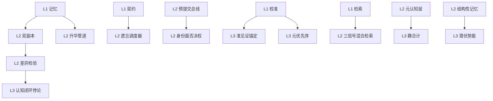

# Kairos 概念体系分级速查表

> **定位（建议六）**：全库 80+ 概念按暴露层级分三级,每级附带一句话通俗类比与代码模块映射。本文为**桥接文档**——术语的完整定义以 [glossary.md](glossary.md) 为权威（69 条中英文对照）,本文只做归类与类比,不重复定义。新增术语时仍按 documentation-governance 术语注册规则登记 glossary,并可在本文补归类。（0.0.42 注记：L3 表中耦合计/证伪信号路由/元优先序/宪法核/宪法锁/概念独立假设/认知闭环悖论/记忆-学习边界等条目为速查专用归类——glossary 已收录相近词条（耦合计监测器/证伪响应）或属认知基础章节概念，未逐条新增 glossary 词条，不重复计数。）
>
> **阅读建议**：集成开发者/终端用户读 L1;Kairos 贡献者读 L1+L2;架构师/认知层研究者读全部三级。

---

## L1：API 表面概念（外部直接交互）

> 必须稳定、向后兼容。目标读者：集成开发者、终端用户。

| # | 术语 | 一句话类比 | API 路径/字段 | 稳定性 |
|:--|:----|:---------|:------------|:------|
| 1 | **记忆 (Memory)** | 文件系统里的一个文件——有内容、有路径、有元数据 | `POST /v1/memories`、`GET /v1/memories/{id}` | 稳定 |
| 2 | **路径空间 (kairos://)** | 记忆的文件系统树——用路径组织记忆,像 `ls /project-a/meetings/` | `kairos://` URL 前缀 | 稳定 |
| 3 | **四类契约 (Contract)** | 记忆的生存策略——常驻(permanent)/按需(ondemand)/环境(environmental)/临时(temporary) | `POST /v1/memories` 的 `contract` 字段 | 稳定 |
| 4 | **遗忘 (Forgetting)** | 不是删除——是"不再主动检索"。被遗忘的记忆仍在存储层 | `DELETE /v1/memories/{id}`、遗忘调度器后台运行 | 稳定 |
| 5 | **校准 (Calibration)** | 用户给记忆打分："这条准确"或"这条不对"——系统据此调整信任度 | `POST /v1/calibrate` | 稳定 |
| 6 | **检索 (Retrieval)** | 按关键词、时间、意图查找记忆——支持精确匹配和模糊语义搜索 | `POST /v1/memories/search` | 稳定 |
| 7 | **Saga 叙事线 (Narrative Thread)** | 手动整理的故事线——"关于项目 A 架构演进的完整叙事" | `POST /v1/narrative/threads` | v0.1.0 子集 |
| 8 | **健康检查 (Health)** | 系统体检报告——各组件的健康状态与运行指标 | `GET /v1/health/detail` | 稳定 |
| 9 | **校准状态 (Calibration Status)** | 系统"自判模式"指示灯——告诉用户系统多久没收到校准反馈 | `GET /v1/health/calibration`、检索响应 `meta.calibration_status` | 稳定 |
| 10 | **审计 (Audit)** | 系统的黑匣子——所有关键操作的留痕记录,可验证完整性 | `kairos audit verify-chain` | 稳定 |

## L2：开发者必知概念（理解代码结构必需）

> 相对稳定,可随重构调整。目标读者：Kairos 贡献者。

| # | 术语 | 一句话类比 | 对应代码模块 | 关键约束 |
|:--|:----|:---------|:-----------|:--------|
| 1 | **双副本 (Dual Copy)** | 一个是"事实本"(见证锚定,不能随便改),一个是"使用热度表"(使用权重,随访问频率变),两者分开存、定期比对 | `storage/witness_anchor`、`storage/usage_weight` | 使用权重不能写入见证锚定(S-14) |
| 2 | **差异检验 (Differential Check)** | 两个副本的"对账"——热度表涨得异常时暂停合并,先查是不是"好用≠真实" | `storage/differential_check` | 使用权重陡升触发;差异检验不进入降级路径 |
| 3 | **预提交总线 (Pre-commit Bus)** | 内部消息队列——策略层做了决策后,先发到这里,等身份面和宪法面检查完才真正执行 | `bus/pre_commit_bus` | 所有排序产出必须经过预提交总线 |
| 4 | **身份面否决权 (Identity Veto)** | 身份守卫——排序结果如果威胁"我是谁"的叙事连续性,直接拦下 | `bus/identity_listener` | 否决是阻断写入,不是删除记忆 |
| 5 | **升华管道 (Sublimation Pipeline)** | 数据精炼流水线——原始对话 → 摘要条目 → 策略规则 → 行为模式 | `pipeline/sublimation` | 空闲时后台运行,不阻塞检索 |
| 6 | **遗忘调度器 (Forgetting Scheduler)** | 定期巡检所有记忆,根据新鲜度决定留哪些、忘哪些(不是删,是标记不检索) | `scheduler/forgetting` | 结构性记忆(structural_value≥1)跳过 |
| 7 | **元认知层 (Meta-cognition Layer)** | 系统的自我监测模块——不断检查"我的记忆健康吗?我的检索偏了吗?" | `meta/` | 只监测和报告,不做决策(监测+提案) |
| 8 | **注意力调度器 (Attention Scheduler)** | 全局资源分配器——编码、巩固、检索三环节竞争注意力预算,检索优先级最高 | `scheduler/attention` | 逻辑独立、不物理驻留任何功能层 |
| 9 | **三信号混合检索 (Hybrid Search)** | 三种"找法"加权融合——语义向量+BM25 关键词+实体加成 | `storage/hybrid_search.py` | 权重和恒为 1(0.50/0.35/0.15)；三信号为候选域内融合权重（架构 §7.3a），检索扩展链路权重为四链路 0.50/0.20/0.10/0.20（架构 §5.2）——两套权重作用于检索管线不同阶段 |
| 10 | **结构性记忆 (Structural Memory)** | 推理空间的"承重墙"——反例锚点、死胡同路径,拆了会塌 | `storage/structure_guard` | structural_value 0/1/2 三级保护 |
| 11 | **记忆压力 (Memory Pressure)** | 系统的"拥挤感"——WM 快满了、遗忘积压了,主动提醒该减压 | `meta/pressure_monitor` | 四级指标+三级减压动作 |
| 12 | **事件总线 (Event Bus)** | 系统内部的"邮局"——各层之间收发标准格式消息 | `bus/event_bus` | 10 类事件枚举,新增须经审计庭门禁 |

## L3：设计文档概念（架构/认知层精确术语）

> 可能随认知模型演进变更。目标读者：架构师、认知层研究者。

| # | 术语 | 一句话解释 | 出处 | 工程落点 |
|:--|:----|:---------|:----|:--------|
| 1 | **认知关节 (Cognitive Joint)** | 基于不确定认知做的设计决策——明确标记为"将来可能需要拆掉重做的部分" | 认知基础 引论 | `debt-collection.md` 认知关节登记表(CJ-xxx) |
| 2 | **耦合计 (Coupling Gauge)** | 一个数学检验——判断"使用价值"和"见证价值"两个轴是否真的独立 | 认知基础 C.4 | 运行时周期性计算皮尔逊系数 |
| 3 | **潜伏势能 (Latent Potential)** | 一条记忆虽然很久没用,但它在"系统还不了解的领域",所以暂不遗忘——等盲区被探测到时再重估 | 认知基础 §1.1 | `latent_potential_reeval_port` |
| 4 | **证伪信号路由 (Falsification Routing)** | 监督平面发现系统假设被挑战时,把信号发给宪法面,由宪法面决定是否冻结 | 架构 §1.7 | `falsification_router` |
| 5 | **元优先序 (Meta-Priority)** | 外部监管告诉系统"当前阶段什么最重要"的顶层指令——如"安全优先"或"探索优先" | 认知基础 E.5 | 宪法主权面注入的可配置优先级 |
| 6 | **宪法核/宪法锁 (Constitution Core/Lock)** | 系统设计决策的保护级别——宪法核移除后系统不再是同一个系统;宪法锁移除后承诺大幅降级 | 认知基础 E.2 | 架构组件表保护层级标注 |
| 7 | **双时态 (Bitemporality)** | 一条记忆有两个时间戳——"这事什么时候发生的"(事件时间)和"系统什么时候知道的"(事务时间) | 认知基础 §1.1 | `memories.occurred_at`/`created_at` |
| 8 | **并行审查 (Parallel Review)** | 探索→宪法的执行时序——探索候选先产生,宪法窗口并行审查(默认 100ms),超时 fail-close | 认知基础 §2.1 | 架构 §0.3 |
| 9 | **准见证锚定 (Quasi-Anchoring)** | 外部校准中断时,系统用内部多源交叉验证"暂时相信"某条记忆 | 认知基础 §三 | 架构 §10.9 降级状态机 |
| 10 | **概念独立假设 (Conceptual Independence)** | 五轴的度量输入集互不包含——设计便利假设,非经验断言,有可证伪条件 | 认知基础 §1.1 | E.6a 耦合判据 |
| 11 | **认知闭环悖论 (Epistemic Ceiling)** | 系统用自己的历史状态评判自己——无外部校准时无封闭解,这是固有上限 | 认知基础 引论 | 外部校准端口 + 保守倾向兜底 |
| 12 | **记忆-学习边界 (Memory-Learning Boundary)** | 记忆系统承载"学习的结果"而非"学习的过程"——边界是架构性便利假设,标记为认知关节 | 认知基础 引论/D.10 | 策略层学习协调,存储层不学习 |

---

## 概念依赖图

## "如果只读三页"速览路径

1. **第一页**：[README](../README.md) 索引——了解文档体系与当前状态。
2. **第二页**：本文 L1 概念表——建立 API 面心智模型。
3. **第三页**：[architecture-v0.1.0.md](../foundation/architecture-v0.1.0.md) §0 开发者速查表 + §0.8 特征标志——理解系统的最小形态与启停开关。
4. 之后按需深入：L2 概念对照 [implementation-map.md](../specification/implementation-map.md) 组件路径;L3 概念对照 [cognitive-foundation.md](../foundation/cognitive-foundation.md) 对应章节。

---

## 版本记录

> 草稿阶段从 0.0.1 起；发生实质性内容变更时按 0.0.2 → 0.0.3 … 递增，并在本表登记变更原因；待定稿后升级版本号。

| 版本 | 日期 | 说明 |
|:----|:----|:-----|
| 0.0.1 | 2026-08-05 | 概念分级速查表（0.0.16 批次,建议六落地）：L1 10 项 / L2 12 项 / L3 12 项,概念依赖图 Mermaid + "如果只读三页"速览路径。术语权威为 glossary。 |
| 0.0.37 | 2026-08-06 | round15 深度审计修复批次：L1 四类契约英文名对齐 glossary 权威枚举（permanent/ondemand/environmental/temporary）；三信号混合检索权重补注两套权重口径（§7.3a 候选域内 / §5.2 检索扩展链路）；glossary 权威条数 57→68。 |
| 0.0.38 | 2026-08-06 | round16 全面深度审计修复批次（changelog 0.0.38）：零版本标记收敛（稳定性列枚举化）；版本记录补标准引导块。 |
| 0.0.42 | 2026-08-07 | 0.0.42 文档审计修复批次（changelog 0.0.42）：glossary 计数 68→69 同步；L3 速查专用术语注记。 |
